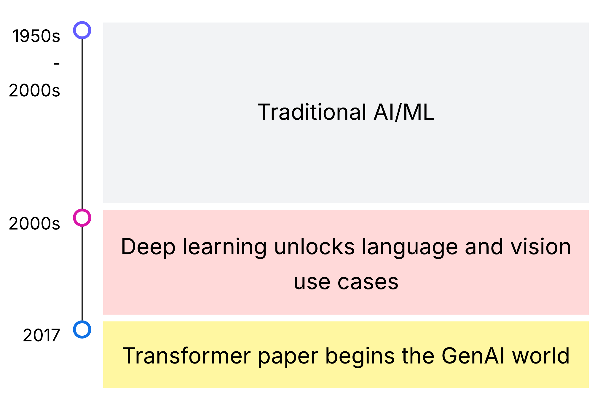
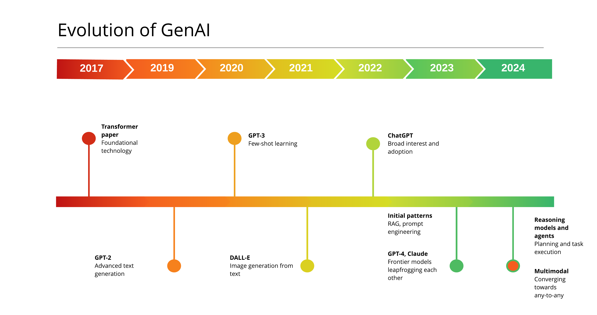

<!-- 
 Copyright Amazon.com, Inc. or its affiliates. All Rights Reserved.
 SPDX-License-Identifier: CC-BY-SA-4.0
 -->

# Evolution and current state of generative AI (as of April 2025)

**Content Level: 200**

## Suggested Pre-Reading

* [History of GenAI](https://caylent.com/blog/history-of-gen-ai){:target="_blank" rel="noopener noreferrer"}
* [What is Generative AI](https://www.mckinsey.com/featured-insights/mckinsey-explainers/what-is-generative-ai){:target="_blank" rel="noopener noreferrer"}
* [16 Changes to the Way Enterprises Are Building and Buying Generative AI](https://a16z.com/generative-ai-enterprise-2024/){:target="_blank" rel="noopener noreferrer"}

## TL;DR

GenAI is another step change in the history of AI/ML. Since the foundational technical paper in 2017, GenAI has quickly moved through the initial generation of text and image generation models, the frenzy surrounding the launch of ChatGPT, patterns for model tuning and RAG, rapidly advancing frontier models, multimodal capabilities, reasoning models, and agents. This article puts GenAI advances in perspective in the overall world of AI/ML, and then gives you a view of how GenAI itself has evolved, and what the current trends are.

## GenAI in the world of AI/ML

At a very high level, AI/ML has existed as a field of study since the 1950s. AI/ML progressed steadily, and researchers built robust algorithms for tasks like time-series forecasting, classification, and regression. Deep learning or neural networks became practical in the late 2000s, due to advances in GPU hardware, software toolkits, and high-quality data sets. While deep learning had existed as an academic field before that, it was not useful for practical applications. Deep learning is used in many use cases, but notably it unlocked use cases for language and vision that were not approachable before. Object recognition and machine translation are examples of use cases that are well-solved with deep learning, but were very difficult earlier.

In 2017, researchers from Google and the University of Toronto published the foundational paper [Attention is all you need](https://arxiv.org/abs/1706.03762){:target="_blank" rel="noopener noreferrer"}. This paper described the transformer architecture, which underpins most of the GenAI foundation models used today. 

## GenAI milestones

The timeline below shows a few of the major milestones over the past few years.

### Advances in LLMs

After the transformers paper in 2017, researchers started to develop more sophisticated LLMs. GPT-2 launched in 2019, followed by GPT-3 in 2020. These models showed promise for text generation and being adaptable using techniques like few-shot learning (i.e., learning from a couple examples in the prompt). The launch of ChatGPT in 2022 started the wave of huge interest, as now there was a simple web interface that let everyone see how advanced and conversational LLMs had become.

Over the course of 2023 and 2024, both open-source and commercial frontier models appeared at an increasing pace. These include the leading open-source models like Meta's Llama and DeepSeek's v3, as well as Claude 3, 3.5, and 3.7; OpenAI's 4o, 4o-mini, and 4.5; and Google Gemini 1.5, 2.0, and now 2.5. It also became common to see different sizes of the same model, like Claude Haiku and Sonnet, or Llama in 70B and 405B variants. These different sizes let users choose the right balance of speed, price, and performance.

### Multimodal models

Over the past years, the field has moved from models that take only one type of input and produce one type of output (e.g., text-to-text or text-to-image), to models that take multiple types of input (e.g., text, documents, audio, and video) and produce multiple types of output. This flexibility avoids having to choose different models to handle different types of input and output. However, multimodal models can be more expensive than models purpose-built to deal with different types of input and output. Builders can choose to use multimodal models or more specific models.

### Application patterns

Patterns have emerged to make LLMs adapt to new tasks, use more data, and interact with systems around them. **Prompt engineering** and **RAG** emerged quickly as ways to better instruct the model how to perform a task, and let it access more relevant data as context. These techniques are still widely used today. 

**Tool-calling** is a way to enable LLMs to interact with systems like APIs, databases, and even web browsers. Tools let a model perform actions or get more data. While most LLMs support tool-calling, you can adapt a model to work more effectively with other systems by providing examples of correct tool invocation in the prompt, or by performing fine-tuning of the LLM.

**Agents** are systems that pair an LLM with tools, data, and other resources, and ask them to solve tasks by working autonomously. Agents are perhaps the most important trend in early 2025, as they make GenAI useful for a much larger set of use cases. Agents can now automate business workflows and work with people in a flexible, adaptable way. They move GenAI out of the world of conversation and question answering, into a world where can truly act like an assistant. Over the course of 2025, organizations are looking at how to build agents that can discover each other and work together to solve more complex problems. 

Anthropic's model context protocol (**MCP**) is an important emerging standard. MCP defines a standard way to expose tools, prompts, files, and other resources to LLMs. Applications like Cursor, a popular software assistant, can tap into MCP servers to gain additional capabilities. AWS is working in the MCP community to add better authentication, and possibly to make MCP a standard for making agents discoverable and consumable.

**Model customization** is a way of creating a new copy of an LLM by training it with new data. It can help an LLM learn how to solve a new task or pick up a new domain of knowledge. These techniques are not yet widely adopted, other than simple supervised fine-tuning, but the advent of reasoning models has sparked new interest in using the more advanced techniques. For example, open-source labs have shown how to reproduce DeepSeek's r1 reasoning model by applying reinforcement learning on base models.

### Reasoning models

In 2024, reasoning models started to appear. These models are trained to think about how to solve a task, rather than answering right away. That lets them handle more complex problems from fields like math and science. These models can be slower and more expensive. The latest models, like Claude Sonnet 3.7, let the user choose whether they behave like a traditional LLM, a reasoning model, or somewhere in between. Reasoning models are particularly useful in agents, as they are good at planning on how to solve a task. That plan directs how the agent proceeds.

## Making it practical 

GenAI is seeing a high rate of change. As the initial set of LLMs and architecture patterns mature, and hardware and software continue to evolve, there are notable new model releases several times a year. More powerful models unlock more patterns and use cases. Companies are eager for perspective and advice. In order to stay on top of the changes, you should dedicate time to keeping current. There are useful podcasts, blogs, Substacks, and other resources you can tap into, some of which are listed in the `Further Reading` section below.

## Get Hands-On

There are no hands-on resources for this section.

## Further reading

* [Interconnects](https://www.interconnects.ai/){:target="_blank" rel="noopener noreferrer"} is a Substack that covers open LLM building and tuning, with a particular emphasis on post-training alignment.
* [Latent Space](https://www.latent.space/){:target="_blank" rel="noopener noreferrer"} is a podcast that covers recent trends in the field.
* [The Information](https://www.theinformation.com/){:target="_blank" rel="noopener noreferrer"} covers industry news, including trends in data center build and overall strategy.
* [a16z](https://a16z.com/news-content/){:target="_blank" rel="noopener noreferrer"} is a prominent VC firm that writes about GenAI technical directions.

## Contributors

**Author**: Randy DeFauw - Sr. Principal SA 

**Primary Reviewer**: Andrew Baird - Sr. Principal SA 