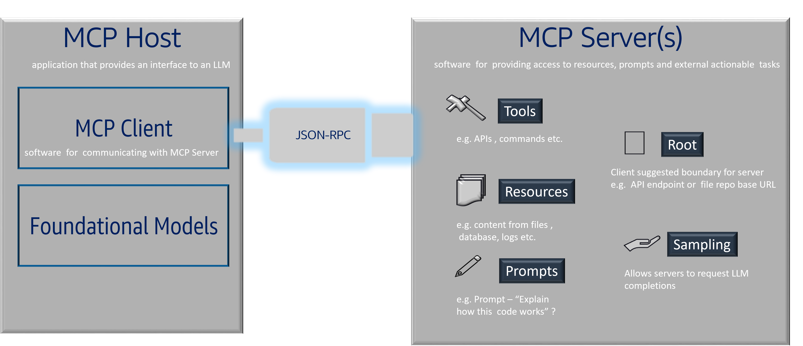

<!-- 
 Copyright Amazon.com, Inc. or its affiliates. All Rights Reserved.
 SPDX-License-Identifier: CC-BY-SA-4.0
 -->

# Model Context Protocol (MCP): Dynamic External Context Access

**Content Level: 200**

## Suggested Pre-Reading

 - [Key Primitives](../index.md)
 - [Retrieval Augmented Generation (RAG)](../2_1_7_rag/2_1_7_rag.md)
 - [Vector Databases](../2_1_6_vector_databases/2_1_6_vector_databases.md)
 - [Agents](../2_1_9_agents/2_1_9_agents.md)

## TL;DR

Model Context Protocol (MCP) is a standardized protocol that enables LLMs to securely access external data sources and tools in real-time during conversations, providing dynamic context beyond static knowledge bases. Unlike RAG, which retrieves pre-indexed information, MCP allows models to interact with live systems like databases, APIs, file systems, and web services through standardized interfaces. This protocol bridges the gap between AI models and external systems while maintaining security through proper authentication and authorization mechanisms. MCP is particularly valuable for applications requiring real-time data access, dynamic tool usage, or integration with existing enterprise systems where information changes frequently and cannot be effectively pre-indexed.

## Model Context Protocol (MCP): Dynamic External Context Access

Model Context Protocol (MCP) is a standardized communication protocol that enables language models to securely access external data sources and tools during inference, providing dynamic contextual information that extends beyond the model's training data or static knowledge bases.

## Core Concept

MCP establishes a secure, standardized interface between AI models and external resources, allowing models to:

- Query live databases and data sources
- Access real-time information from web services and APIs
- Interact with file systems and document repositories
- Execute functions and tools with proper authorization
- Retrieve contextual information dynamically based on conversation needs

This differs from approaches like RAG, which work with pre-processed and indexed information, by enabling models to access fresh, live data and perform actions in external systems.

## MCP Architecture Components
MCP follows a unique client-server architecture that differs from traditional patterns by inverting the typical relationship between clients and servers in the context of AI applications.

  

The **MCP Host** is the application that provides an interface to an LLM and orchestrates the overall interaction. This is typically the GenAI application, IDE, or chat interface that users directly interact with.
The host contains both the foundational models and the MCP Client, serving as the central coordination point for all MCP interactions.

The **MCP Client** is software embedded within the MCP Host that handles communication with MCP Servers. Unlike traditional client-server architectures where clients make requests for end-user purposes, the MCP Client makes requests on behalf of the LLM to gather context, access tools, or retrieve resources needed for generating responses.
The client manages the JSON-RPC communication protocol and handles the integration of external context into the model's workflow.

**MCP Servers** are specialized software components that provide access to external resources, tools, and capabilities. Each server can offer multiple types of functionality:
 - Tools: Executable functions like API calls, system commands, or computational operations that the LLM can invoke
 - Resources: Access to content from files, databases, logs, documentation, or other data sources
 - Prompts: Pre-defined prompt templates or suggestions that can enhance the LLM's capabilities
 - Root: Client-suggested boundaries that define the scope of server access (e.g., API endpoint base URLs or file repository boundaries)
 - Sampling: A unique capability that allows servers to request LLM completions, enabling servers to leverage the host's model capabilities

A typical MCP implementation includes:

- **Protocol Layer**: Standardized communication interface defining how models request and receive external context
- **Security Framework**: Authentication, authorization, and access control mechanisms to ensure secure interactions
- **Resource Connectors**: Adapters that translate MCP requests into system-specific API calls or database queries
- **Context Managers**: Components that determine what external context is relevant for a given request
- **Response Formatting**: Standardized ways to present external data to models in consumable formats

## Key Capabilities

MCP enables several important capabilities:

- **Real-time Data Access**: Models can query current information rather than relying on potentially outdated indexed data
- **Dynamic Tool Usage**: Access to external tools and services that can be invoked based on conversation context
- **Secure Integration**: Proper authentication and authorization ensure models only access permitted resources
- **Standardized Interface**: Consistent protocol across different data sources and tools simplifies integration
- **Context-Aware Retrieval**: External data access can be tailored to the specific conversation context and user permissions

## Comparison with Other Approaches

MCP differs from other context enhancement methods:

- **vs. RAG**: RAG works with pre-indexed, static data; MCP accesses live, dynamic information
- **vs. Function Calling**: Function calling typically involves discrete actions; MCP provides broader context integration
- **vs. Fine-tuning**: Fine-tuning embeds knowledge in model weights; MCP provides external, updateable context
- **vs. Agent Frameworks**: While agents may use MCP, the protocol itself focuses on secure context access rather than autonomous planning

## Making it practical

When implementing MCP in production environments, consider these practical aspects to maximize effectiveness while maintaining security and performance:

### When to use MCP vs. alternatives

MCP is most appropriate when:

- Your application requires access to frequently changing data that cannot be effectively pre-indexed (real-time inventory, live pricing, current weather)
- You need to integrate with existing enterprise systems without duplicating data into vector databases
- Users require personalized information that varies based on their permissions and context
- Your use case involves dynamic tool usage where the specific tools needed depend on the conversation flow
- Compliance requirements mandate that certain data cannot be stored or cached outside of source systems

Consider alternatives when:

- Your data is relatively static and can be effectively handled by RAG
- You need simple, one-time data retrieval without ongoing integration requirements
- Security requirements make external system access too complex to implement safely

### Implementation considerations

**Security and access control:**

- Implement robust authentication mechanisms for external system access
- Design fine-grained authorization to ensure models only access data appropriate for the current user and context
- Establish audit trails for all external data access and actions performed through MCP
- Consider implementing request validation and sanitization to prevent unauthorized access attempts

**Performance optimization:**

- Design caching strategies for frequently accessed but relatively stable data to reduce external system load
- Implement timeout mechanisms for external requests to prevent conversations from hanging
- Consider connection pooling and request batching where appropriate to optimize resource usage
- Plan for graceful degradation when external systems are unavailable

**Data freshness vs. performance:**

- Balance the need for real-time data against the latency costs of external requests
- Implement intelligent caching with appropriate TTL (time-to-live) values based on data volatility
- Consider hybrid approaches where some context comes from MCP and other context from faster sources like RAG

### Integration patterns

**Database integration:**

- Design database queries that are efficient and don't impact production system performance
- Implement proper connection management and query optimization
- Consider read replicas or dedicated reporting databases for MCP access to avoid impacting operational systems

**API integration:**

- Handle rate limiting and API quotas appropriately to avoid service disruptions
- Implement retry logic with exponential backoff for resilient external service communication
- Design request structures that minimize the number of API calls needed while getting complete context

**File system and document access:**

- Implement proper file access controls and prevent unauthorized file system traversal
- Consider document parsing and formatting to present information effectively to models
- Design efficient indexing for file-based resources when real-time scanning isn't feasible

### Monitoring and observability

Implement comprehensive monitoring for MCP implementations:

- Track external request latency and success rates
- Monitor data freshness and cache hit rates
- Log all external data access for security and compliance purposes
- Set up alerts for external system failures or performance degradation
- Measure the impact of external context on response quality and user satisfaction

### AWS implementation approaches

When implementing MCP on AWS:

- Implement authentication using AWS IAM roles and policies for fine-grained access control
- Consider Amazon API Gateway for standardizing and securing external API access
- Use Amazon ElastiCache for implementing intelligent caching strategies
- Leverage AWS Secrets Manager for securely storing external system credentials
- Implement logging and monitoring using Amazon CloudWatch and AWS CloudTrail

MCP represents a powerful approach to providing dynamic, real-time context to language models while maintaining security and performance. By understanding when and how to implement MCP effectively, you can build GenAI applications that seamlessly integrate with existing systems and provide users with access to current, relevant information.

## Further Reading

 - [Model Context Protocol Documentation](https://modelcontextprotocol.io/){:target="_blank" rel="noopener noreferrer"}
 - [Anthropic's MCP Announcement](https://www.anthropic.com/news/model-context-protocol){:target="_blank" rel="noopener noreferrer"}
 - [MCP SDK and Tools](https://github.com/modelcontextprotocol){:target="_blank" rel="noopener noreferrer"}
 - [AWS MCP Server Repository](https://github.com/awslabs/mcp){:target="_blank" rel="noopener noreferrer"}

## Contributors

Author/s:

 - Markus Bestehorn - Tech Lead Generative AI EMEA 
 - Andrew Baird - Sr. Principal SA 
