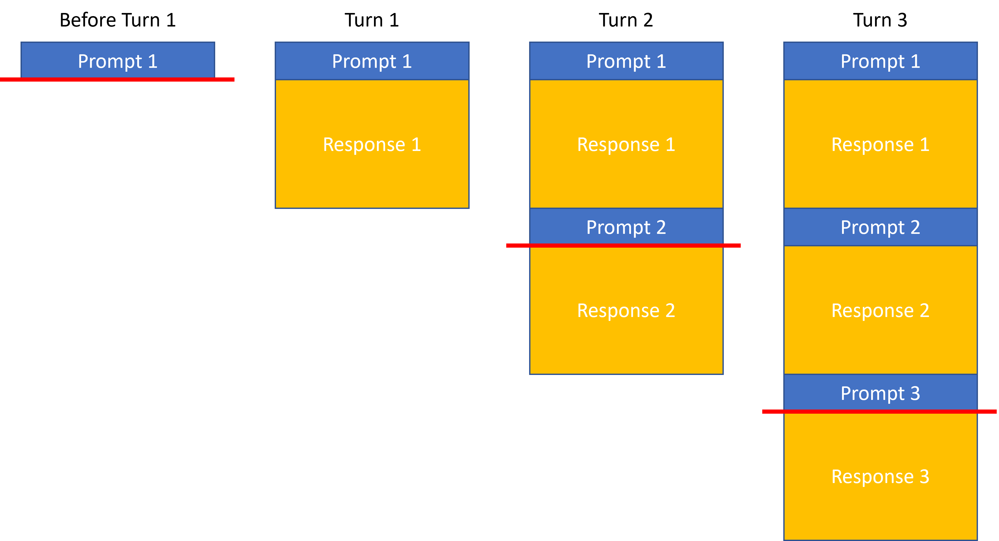

<!-- 
 Copyright Amazon.com, Inc. or its affiliates. All Rights Reserved.
 SPDX-License-Identifier: CC-BY-SA-4.0
 -->

# Context Windows: Managing Conversation History

**Content Level: 100**

## Suggested Pre-Reading

- [Key Primitives](../index.md)
- [Prompts](../2_1_1_prompt/2_1_1_prompt.md)

## TL;DR

The context window represents an LLM's effective "memory" during an interaction—the maximum amount of text (including prompts and previous responses) that the model can process when generating a response.
As LLMs are stateless, all information has to be included in the prompt and fit within this context window, which varies significantly across models (from 2K tokens in early models to millions in advanced ones).
Even models with large context windows can suffer from the "lost in the middle effect," where they struggle to utilize information positioned centrally in long contexts.
Effective context window management strategies—including summarization, pruning, chunking, and external memory systems—are important for balancing functionality, cost control, and user experience in LLM-powered applications.
Understanding context windows is particularly important for applications requiring long conversations, document processing or RAG implementations where all relevant information has to fit into the context window.

## Context Windows: Managing Conversation History

The context window represents the "memory" of the model during an interaction—the maximum amount of text (both prompt and previous responses) that the model can consider when generating a new response.
As LLMs are stateless, all information that the LLM has to consider when generating the response has to be included in the prompt and this prompt has to fit into the context window.
In a multi-turn conversation with a LLM, all previous answers along with the user prompts are included, i.e., the prompt consists of the current prompt as well as previous prompt-response pairs as illustrated below:

  

This allows users to reference previous answers from the LLM and then base their next request on this conversation history.
In the figure above, all information above the red line is forwarded to the LLM for the corresponding turn and the entire response is built using this input/prompt that includes prior prompts and responses.

### Context Windows
Context window sizes vary significantly across models and the prompt sent to the model cannot be larger than the context window of the LLM:

* Early LLMs: 2K-4K tokens
* Mid-range models: between 4K and 64K tokens
* Advanced models: more than 64K tokens up to millions of tokens

These limitations present architectural challenges for applications requiring long conversations or processing large documents and choosing a model is often influenced by the size of the prompts.
It is noteworthy that requesting LLMs to process long contexts of 10s of thousands of words can cause the “lost in the middle effect”:
The accuracy and truthfulness LLM responses is highest when relevant information occurs at the beginning or end of the input, and significantly degrades when relevant information is in the middle of long prompts, even models with particularly large context windows.
This challenge is particularly important for [Retrieval Augmented Generation (RAG)](../2_1_7_rag/2_1_7_rag.md) use cases as they potentially add large amounts of information to the input prompt.

### Context Window Management

Aside from effects like the “lost in the middle effect” mentioned above, minimizing the usage of large contexts for LLM interactions is also desirable due to cost & latency. Effective strategies for managing context windows include:

* Summarization: Condensing previous conversation turns to preserve important information
* Pruning: Selectively removing less relevant parts of the conversation history
* Chunking: Breaking large documents into smaller segments for sequential processing
* Memory systems: External storage of conversation history with retrieval mechanisms

The design of context window management directly impacts application cost (as longer contexts consume more tokens) and performance (as models may handle the beginning and end of contexts more effectively than the middle).

## Making it practical
When implementing LLM-powered conversational applications, effective context window management becomes important for functionality, cost control, and user experience.
Here's how to make context windows work in real-world applications:

### Measuring and Managing Token Usage

Before deploying any LLM application, you need to understand your token consumption patterns:

1. Calculate typical token usage for your specific use cases by converting sample prompts and expected responses into tokens
2. Implement real-time token counting to track context window utilization during conversations
3. Set up thresholds with alerts or automatic interventions when approaching context limits to prevent failures

Below are a few ideas on how to handle situations where context limits are approached.

#### Summarization
When conversations grow long, use the LLM itself to generate a summary of previous exchanges:

    # Example summarization prompt
    summary_prompt = """
    Summarize our conversation so far in a concise way that preserves all important 
    information and context needed for continuing our discussion about [topic].
    """

This condensed summary can replace detailed history, preserving important context while reducing token usage.

#### Selective Context Pruning
Not all conversation history carries equal importance. Implement logic to prioritize and retain only the most relevant context:

    Time-based pruning: Remove older conversation turns first, keeping only recent exchanges
    Relevance-based pruning: Use semantic similarity to determine which parts of history are most relevant to the current topic
    Hybrid approaches: Combine multiple strategies based on conversation dynamics

#### Chunking for Document Processing
When processing large documents:

    Split documents into semantically meaningful segments (paragraphs, sections)
    Process each chunk individually, maintaining a summary of previous chunks' insights
    For question-answering over documents, first determine which chunks are most relevant before sending to the LLM

#### External Memory Systems
Extend beyond the model's inherent context limitations:

    Store conversation history in vector databases for semantic retrieval
    Implement session management with databases to persist user context between sessions
    Create tiered memory architectures with short-term (in-context) and long-term (externally stored) components

#### Context Position Optimization
Address the "lost in the middle" effect with strategic context positioning:

    Place the most critical information at the beginning or end of prompts
    When adding retrieved information, put the most relevant documents first
    Use explicit markers or formatting to highlight key information within the context

#### Cost-Performance Tradeoffs
Context management directly impacts your application's economics and user experience:

    Each token in your context window costs money in both directions (input and output)
    Larger contexts increase latency, affecting real-time applications
    Different models have different pricing tiers for context windows - select appropriately for your use case

When building with AWS services, consider integrating context management strategies with services like Amazon DynamoDB for state persistence, Amazon OpenSearch for semantic retrieval of past conversations, or Lambda functions to handle context summarization between turns.
For RAG implementations, Amazon Kendra can help identify the most relevant document chunks to include in context, reducing unnecessary token usage.
Remember that effective context window management is not just about staying within technical limitations—it's about creating fluid, coherent conversations that feel natural to users while optimizing for cost and performance.

## Further Reading
- [Lost in the Middle: How Language Models Use Long Contexts](https://arxiv.org/abs/2307.03172){:target="_blank" rel="noopener noreferrer"}
- [Attention is all you need](https://research.google/pubs/attention-is-all-you-need/){:target="_blank" rel="noopener noreferrer"}

## Contributors

Author/s:

 - Markus Bestehorn - Tech Lead Generative AI EMEA 

Primary Reviewers:

 - Yibo Liang - Generative AI Specialist SA 
 - Emily Ransley - Generative AI Specialist SA 

Additional Reviewer/s: 

 - Ana-Maria Olaru - Sr. Program Manager 
 - Andrew Hood - Head of Program Development 
 - Dominic Murphy - Sr Mgr, Applied AI Architecture 
 - Gareth Faires - Sr Generative AI Specialist SA 
