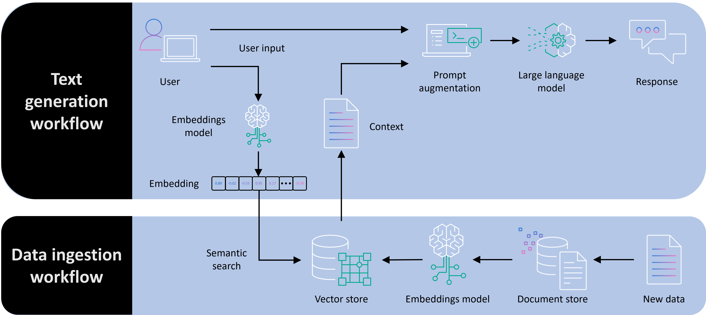

<!-- 
 Copyright Amazon.com, Inc. or its affiliates. All Rights Reserved.
 SPDX-License-Identifier: CC-BY-SA-4.0
 -->

# Retrieval Augmented Generation (RAG)

**Content Level: 200**

## Suggested Pre-Reading

- [Key Primitives](../index.md)
- [Embeddings](../2_1_5_embeddings/2_1_5_embeddings.md)
- [Vector Databases](../2_1_6_vector_databases/2_1_6_vector_databases.md)

## TL;DR

Retrieval Augmented Generation (RAG) enhances LLM responses by incorporating external knowledge sources without modifying the model itself.
By augmenting user prompts with relevant information retrieved from vector databases, RAG improves factual accuracy and reduces hallucinations.
This approach is ideal for accessing proprietary information not in the model's training data and generating verifiable responses with citations.
Implementation requires balancing embedding model selection, chunking strategies, and vector database choices to optimize performance, cost, and response quality.

## Retrieval Augmented Generation (RAG)

RAG combines the knowledge in external data sources with the reasoning capabilities of LLMs, addressing the limitations of models' built-in knowledge, improving factual accuracy and reduce hallucinations.
Contrary to fine-tuning and other approaches that allow the use of custom/external data, RAG does not require any changes to the LLM itself. This is achieved by augmenting the user prompt with data retrieved from a vector database.

  

### Core Components of RAG Architecture

A typical RAG implementation consists of three components

1. Document processing pipeline / Ingestion Workflow:

    * Ingestion of source documents from a data source such as a file system or a database
    * Chunking text into manageable segments
    * Generating embeddings for each chunk
    * Indexing chunks in a vector database and storing them for access of the LLM

1. Retrieval system:

    * Converts user queries to embedding vectors
    * Performing similarity search to find relevant chunks in the vector store
    * Applying re-ranking or filtering to improve relevance of the retrieved chunks

1. Augmented generation / Text Generation Workflow:

    * Constructs prompts that include retrieved information and combines it with the user prompt
    * Instructs the model to use the data provided in the prompt to generate the response
    * Forward the augmented prompt to the LLM

### Chunking Strategies

The accuracy of the responses and the cost of the overall RAG solution depend on the chunking strategy which has to balance several considerations:

* Size: Chunks should be small enough to be manageable but large enough to preserve context
* Overlap: Including some overlap between chunks helps preserve contextual continuity
* Semantic coherence: Respecting document structure (paragraphs, sections) when creating chunks
* Metadata enrichment: Attaching source information, timestamps, and other metadata to chunks

## Making it practical
When implementing RAG in production environments, several practical considerations can significantly impact performance, cost, and user experience.
When to use RAG (vs. other approaches)

RAG is particularly well-suited for use cases where:

 - Your application requires access to proprietary or frequently updated information not present in the LLM's training data
 - You need verifiable responses with clear citations to source documents
 - You need to reduce hallucinations when addressing domain-specific questions
 - Fine-tuning is cost-prohibitive or data constraints make it impractical

However, RAG isn't always the optimal approach.
For applications requiring deep domain expertise with consistent response patterns, fine-tuning might be more appropriate.
For simpler scenarios where the LLM's built-in knowledge is sufficient, prompt engineering alone might be adequate.

### Embedding model selection

The embedding model you choose has a significant impact on retrieval quality and overall system performance:

 - Domain-specific embeddings often outperform general-purpose embeddings for specialized content
 - Consider the dimensionality trade-off: higher dimensions typically capture more nuanced relationships but require more storage and compute
 - Evaluate embedding models based on both semantic retrieval performance and operational characteristics (latency, cost)

In AWS, models like Amazon Titan Embeddings offer a good balance of performance and cost for many applications, while specialized models may be appropriate for specific domains.

### Vector database considerations

Your vector database selection affects both performance and operational complexity:

 - Consider scaling requirements, particularly query performance under concurrent loads
 - Evaluate filtering capabilities, which are important for implementing security boundaries and metadata-based narrowing
 - For applications with changing data, assess update/deletion mechanisms and reindexing requirements
 - Understand pricing models, especially for solutions with large data volumes or high query rates

Amazon OpenSearch Serverless offers vector search capabilities with minimal operational overhead, while purpose-built vector databases like provide specialized features for certain use cases.

### Optimizing chunking strategy

Chunking significantly impacts retrieval quality and system costs:

 - Document-aware chunking respects natural boundaries (paragraphs, sections) and typically outperforms fixed-size chunking
 - Hierarchical chunking strategies (storing both small chunks and their parent sections) can balance specificity and context
 - Evaluate chunk size experimentally based on your specific content and queries
 - Consider chunk overlap to preserve context across boundaries, typically 10-20% overlap works well

For hierarchical documents like technical manuals or legal texts, recursive chunking strategies that preserve document hierarchy often yield better results than flat approaches.

### Production reliability considerations

When deploying RAG in production:

 - Implement fallback mechanisms when retrieval returns low-confidence or no results
 - Set up monitoring for key metrics: retrieval latency, chunk relevance, and response quality
 - Consider retrieval diversity to prevent information silos
 - Implement caching strategies for frequent queries to reduce costs and latency

### Performance evaluation

Evaluating RAG systems requires looking beyond standard LLM metrics:

 - Measure retrieval precision and recall using test queries with known relevant documents
 - Implement human feedback loops for continuous improvement
 - Consider end-to-end evaluation that measures final response quality, not just retrieval performance
 - Track hallucination rates compared to non-RAG baselines using the same model

Human review remains important, particularly during initial deployment and after significant data updates.

### Augmentation cost management

The cost of RAG implementations can grow quickly:

 - Optimize context window usage by selecting only the most relevant chunks
 - Implement re-ranking to improve the quality of retrieved chunks before including them in prompts
 - Consider query reformulation to improve retrieval quality for complex or ambiguous queries
 - Balance chunk size with the number of chunks to optimize for both retrieval quality and token usage

For cost-sensitive applications, implementing a hybrid approach where simpler queries bypass retrieval can reduce overall costs while maintaining performance where it matters most.

## Further Reading
[What is Retrieval Augmented Generation?](https://aws.amazon.com/what-is/retrieval-augmented-generation/){:target="_blank" rel="noopener noreferrer"}
[Understanding Retrieval Augmented Generation Options](https://docs.aws.amazon.com/prescriptive-guidance/latest/retrieval-augmented-generation-options/what-is-rag.html){:target="_blank" rel="noopener noreferrer"}

## Contributors

Author/s:

 - Markus Bestehorn - Tech lead Generative AI EMEA 

Primary Reviewers:

 - Yibo Liang - Generative AI Specialist SA 
 - Emily Ransley - Generative AI Specialist SA 

Additional Reviewer/s: 

 - Ana-Maria Olaru - Sr. Program Manager 
 - Andrew Hood - Head of Program Development 
 - Dominic Murphy - Sr Mgr, Applied AI Architecture 
 - Gareth Faires - Sr Generative AI Specialist SA 
