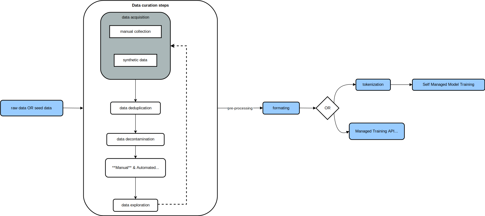
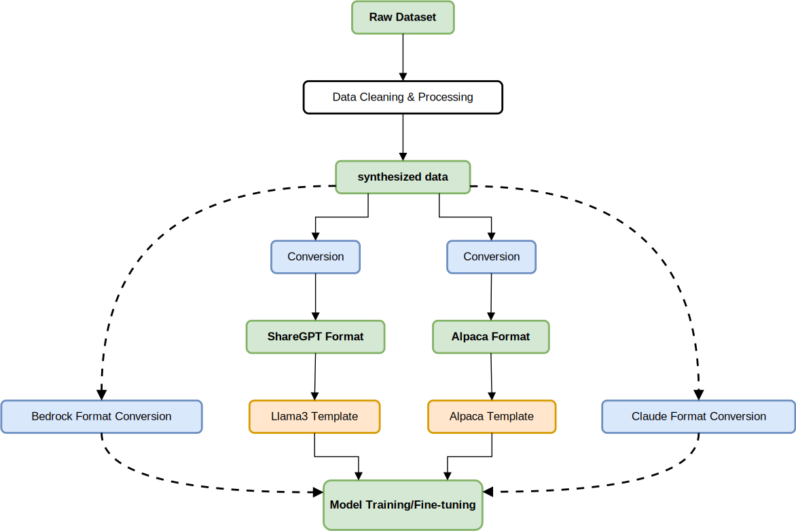

<!-- 
 Copyright Amazon.com, Inc. or its affiliates. All Rights Reserved.
 SPDX-License-Identifier: CC-BY-SA-4.0
 -->

# Introduction to Data Engineering Foundations

**Content Level: 200**


## Suggested Pre-Reading

 - [Core Concepts and Terminology](../../../../1_0_generative_ai_fundamentals/1_1_core_concepts_and_terminology/core_concepts_and_terminology.md)
 - [Key Primitives](../../../2_1_key_primitives/index.md)

## TL;DR

#### Post-training pipeline overview

<div style="margin:auto;text-align:center;width:100%;">
  
</div>
Pretraining a large language model (LLM) is a systematic process that enables the model to generate text one word at a time, ultimately allowing it to complete sentences and write paragraphs based on input fragments, also known as **tokens**. However, pretrained LLMs often encounter difficulties following specific instructions, such as *summarizing customer service call transcripts*. The model's performance hinges on the quality and size of its pretraining and instruction-tuning datasets; preparing these datasets is a critical and challenging aspect of fine-tuning. This module focuses on creating instruction-tuning datasets because, in our experience working with customers, pre-training a foundation model from scratch is expensive, and there are plenty of SOTA pre-trained models from which to select. Therefore, this section of Atlas is designed to provide you with a practical framework to curate quality datasets and implement specialized processing for fine-tuning, enhancing the overall effectiveness of language models in various applications.
## General Data Engineering Framework
Data is the most valuable asset in LLM development, and the increasing focus on data during AI development has given rise to concepts such as Data-Centric AI, which shifts the focus to enhancing the data to improve performance. When curating datasets, the samples that you need depend on the task you want to teach the model, and in most cases, the source of data is usually your own applications, public sources, or third parties. 
This data then needs to be transformed into natural pairs of **instructions** and **answers**. Moreover, we target the following three key characteristics. 

- <h4>Accuracy:</h4> Refers to the factual correctness and relevance of the corresponding instructions for each sample. High accuracy is important for training models that can provide reliable and trustworthy responses.
- <h4>Diversity:</h4> A high-quality dataset should cover as many use cases as possible. Real-world use cases often have a wide range of problems with different permutations of how these problems can be expressed. Therefore, this diversity should span topics, contexts, and text length to make sure you are never out of distribution. 
- <h4>Complexity:</h4> Overly simplistic samples do little to improve an LLM's capabilities. Instead, datasets should include complex, multi-step reasoning problems and challenging tasks. Complexity helps develop the model's ability to tackle real-world problems.

The dataset samples also known as instructions are the inputs to the model, used as context during fine-tuning, and the answers are, in most cases, the expected outputs of the model. 
In practice, the instruction and answer pair usually follow a certain data format and template specific to the model API provider such as Bedrock or Model Architectures like LLama3. There is no agreed-upon industry standard, but there are many available options, such as [Alpaca](https://crfm.stanford.edu/2023/03/13/alpaca.html){:target="_blank" rel="noopener noreferrer"}. The key is to check with the foundation model provider for a reference template.

## Making it practical
Instruction finetuning is also often called "Supervised Finetuning (SFT)" because it involves training a model on a dataset where the input-output pairs we mentioned are explicit. This is different from pre-training, where the model is trained on unlabeled datasets. Customers can format the template differently depending on the base foundation model, the model provider API, or finetuning libraries and their tool chains.

<div style="margin:auto;text-align:center;width:100%;">
  
</div>

Figure 1: LLM Data Processing Workflow from Raw Data to Model Training

!!! note 

    **When using LLM providers API such as Bedrock for fine-tuning instruction-answer pairs are not structured into a template**

### Instruction tuning dataset format
There are many high-quality instruction datasets with different formats and lengths, and generally, the datasets are usually stored in a particular format to organize instructions and answers. For example, when using Bedrock fine-tuning, the data is stored as [**JSONL**](https://jsonlines.org/examples/){:target="_blank" rel="noopener noreferrer"} with a ``prompt`` field containing the input and a ``completion`` key containing the output. Other common standards are 
[Alpaca](https://github.com/tatsu-lab/stanford_alpaca?tab=readme-ov-file#data-release){:target="_blank" rel="noopener noreferrer"}, which was created by a team of Stanford researchers, [ShareGPT](https://axolotl-ai-cloud.github.io/axolotl/docs/dataset-formats/conversation.html#sharegpt){:target="_blank" rel="noopener noreferrer"}, [Anthropic](){:target="_blank" rel="noopener noreferrer"}, and OpenAI.

#### Examples
**Bedrock (single-turn conversations)**
```json
{
  "prompt": "Identify the medical conditions mentioned in the patient notes, list any medications referenced, and provide a brief care recommendation based on the information.\n\nPatient is a 67-year-old female with a history of type 2 diabetes mellitus (diagnosed 12 years ago), hypertension, and hyperlipidemia. Current medications include metformin 1000mg BID, lisinopril 20mg QD, atorvastatin 40mg QD. Recent lab results show HbA1c of 7.8% (up from 7.2% three months ago), BP reading today was 142/88. Patient reports increased fatigue and occasional dizziness when standing quickly. No changes to medication regimen in the past 4 months. Patient admits to poor diet adherence during recent family events.", 
  "completion": "Medical Conditions:\n- Type 2 diabetes mellitus (T2DM)\n- Hypertension\n- Hyperlipidemia\n\nMedications:\n- Metformin 1000mg twice daily (for diabetes)\n- Lisinopril 20mg once daily (for hypertension)\n- Atorvastatin 40mg once daily (for hyperlipidemia)\n\nCare Recommendations:\n1. Diabetes management: HbA1c has increased to 7.8%, indicating worsening glycemic control. Consider medication adjustment or addition of a second agent (such as an SGLT2 inhibitor or GLP-1 agonist). Schedule diabetes education refresher.\n2. Hypertension management: Current BP (142/88) exceeds target range. Consider increasing lisinopril dose or adding a second antihypertensive agent.\n3. Assess for orthostatic hypotension due to reported dizziness when standing.\n4. Emphasize importance of dietary adherence and create a sustainable meal plan that accommodates occasional social events.\n5. Schedule follow-up visit in 4 weeks to reassess after interventions."
}
```
**Alpaca (single-turn conversations)**
```json
{
  "instruction": "Identify the medical conditions mentioned in the patient notes, list any medications referenced, and provide a brief care recommendation based on the information.",
  "input": "Patient is a 67-year-old female with a history of type 2 diabetes mellitus (diagnosed 12 years ago), hypertension, and hyperlipidemia. Current medications include metformin 1000mg BID, lisinopril 20mg QD, atorvastatin 40mg QD. Recent lab results show HbA1c of 7.8% (up from 7.2% three months ago), BP reading today was 142/88. Patient reports increased fatigue and occasional dizziness when standing quickly. No changes to medication regimen in the past 4 months. Patient admits to poor diet adherence during recent family events.",
  "output": "Medical Conditions:\n- Type 2 diabetes mellitus (T2DM)\n- Hypertension\n- Hyperlipidemia\n\nMedications:\n- Metformin 1000mg twice daily (for diabetes)\n- Lisinopril 20mg once daily (for hypertension)\n- Atorvastatin 40mg once daily (for hyperlipidemia)\n\nCare Recommendations:\n1. Diabetes management: HbA1c has increased to 7.8%, indicating worsening glycemic control. Consider medication adjustment or addition of a second agent (such as an SGLT2 inhibitor or GLP-1 agonist). Schedule diabetes education refresher.\n2. Hypertension management: Current BP (142/88) exceeds target range. Consider increasing lisinopril dose or adding a second antihypertensive agent.\n3. Assess for orthostatic hypotension due to reported dizziness when standing.\n4. Emphasize importance of dietary adherence and create a sustainable meal plan that accommodates occasional social events.\n5. Schedule follow-up visit in 4 weeks to reassess after interventions."
}
```
**Anthropic Claude 3 Haiku on Bedrock (multi-turn conversations)**
```json
{
  "system": "You are a helpful medical assistant AI designed to analyze patient information and provide care recommendations. You identify medical conditions, list medications, and suggest care plans based on the information provided.",
  "messages": [
    {
      "role": "user",
      "content": "Identify the medical conditions mentioned in the patient notes, list any medications referenced, and provide a brief care recommendation based on the information.\n\nPatient is a 67-year-old female with a history of type 2 diabetes mellitus (diagnosed 12 years ago), hypertension, and hyperlipidemia. Current medications include metformin 1000mg BID, lisinopril 20mg QD, atorvastatin 40mg QD. Recent lab results show HbA1c of 7.8% (up from 7.2% three months ago), BP reading today was 142/88. Patient reports increased fatigue and occasional dizziness when standing quickly. No changes to medication regimen in the past 4 months. Patient admits to poor diet adherence during recent family events."
    },
    {
      "role": "assistant",
      "content": "Medical Conditions:\n- Type 2 diabetes mellitus (T2DM)\n- Hypertension\n- Hyperlipidemia\n\nMedications:\n- Metformin 1000mg twice daily (for diabetes)\n- Lisinopril 20mg once daily (for hypertension)\n- Atorvastatin 40mg once daily (for hyperlipidemia)\n\nCare Recommendations:\n1. Diabetes management: HbA1c has increased to 7.8%, indicating worsening glycemic control. Consider medication adjustment or addition of a second agent (such as an SGLT2 inhibitor or GLP-1 agonist). Schedule diabetes education refresher.\n2. Hypertension management: Current BP (142/88) exceeds target range. Consider increasing lisinopril dose or adding a second antihypertensive agent.\n3. Assess for orthostatic hypotension due to reported dizziness when standing.\n4. Emphasize importance of dietary adherence and create a sustainable meal plan that accommodates occasional social events.\n5. Schedule follow-up visit in 4 weeks to reassess after interventions."
    }
  ]
} 
```
Depending on the use case, the formats can be explicitly for single-turn conversations, also known as Non-conversational tasks or multi-turn conversations, as shown in the examples above. Multi-turn conversation is a structure designed to handle dialogues requiring multiple exchanges between the user and the LLM.

### Templates
From a technical point of view, chat templates are usually part of the **tokenizer**, which specifies how to convert conversations into a single tokenizable string in the expected model format. This then offers a unified way to present the instruction-answer pairs. 
Some tokenizers add special tokens to identify the beginning and end of messages. In practice, when fine-tuning from a base model, you have the flexibility to choose any template, such as Alpaca or ShareGPT. When fine-tuning an instruct model, you should use the same template the model was instruction tuned with, or it might degrade the performance.

To give you an example of how we can apply the previous ^^instruction format^^ examples to standard templates

#### Examples
**Llama3 Template** 
```
<|begin_of_text|>
<|user|>
Identify the medical conditions mentioned in the patient notes, list any medications referenced, and provide a brief care recommendation based on the information.

Patient is a 67-year-old female with a history of type 2 diabetes mellitus (diagnosed 12 years ago), hypertension, and hyperlipidemia. Current medications include metformin 1000mg BID, lisinopril 20mg QD, atorvastatin 40mg QD. Recent lab results show HbA1c of 7.8% (up from 7.2% three months ago), BP reading today was 142/88. Patient reports increased fatigue and occasional dizziness when standing quickly. No changes to medication regimen in the past 4 months. Patient admits to poor diet adherence during recent family events.
<|assistant|>
Medical Conditions:
- Type 2 diabetes mellitus (T2DM)
- Hypertension
- Hyperlipidemia

Medications:
- Metformin 1000mg twice daily (for diabetes)
- Lisinopril 20mg once daily (for hypertension)
- Atorvastatin 40mg once daily (for hyperlipidemia)

Care Recommendations:
1. Diabetes management: HbA1c has increased to 7.8%, indicating worsening glycemic control. Consider medication adjustment or addition of a second agent (such as an SGLT2 inhibitor or GLP-1 agonist). Schedule diabetes education refresher.
2. Hypertension management: Current BP (142/88) exceeds target range. Consider increasing lisinopril dose or adding a second antihypertensive agent.
3. Assess for orthostatic hypotension due to reported dizziness when standing.
4. Emphasize importance of dietary adherence and create a sustainable meal plan that accommodates occasional social events.
5. Schedule follow-up visit in 4 weeks to reassess after interventions.
<|end_of_text|>
```
**Alpaca Template**
```
Below is an instruction that describes a task, paired with an input that provides further context. Write a response that appropriately completes the request.

### Instruction:
Identify the medical conditions mentioned in the patient notes, list any medications referenced, and provide a brief care recommendation based on the information.

### Input:
Patient is a 67-year-old female with a history of type 2 diabetes mellitus (diagnosed 12 years ago), hypertension, and hyperlipidemia. Current medications include metformin 1000mg BID, lisinopril 20mg QD, atorvastatin 40mg QD. Recent lab results show HbA1c of 7.8% (up from 7.2% three months ago), BP reading today was 142/88. Patient reports increased fatigue and occasional dizziness when standing quickly. No changes to medication regimen in the past 4 months. Patient admits to poor diet adherence during recent family events.

### Response:
Medical Conditions:
- Type 2 diabetes mellitus (T2DM)
- Hypertension
- Hyperlipidemia

Medications:
- Metformin 1000mg twice daily (for diabetes)
- Lisinopril 20mg once daily (for hypertension)
- Atorvastatin 40mg once daily (for hyperlipidemia)

Care Recommendations:
1. Diabetes management: HbA1c has increased to 7.8%, indicating worsening glycemic control. Consider medication adjustment or addition of a second agent (such as an SGLT2 inhibitor or GLP-1 agonist). Schedule diabetes education refresher.
2. Hypertension management: Current BP (142/88) exceeds target range. Consider increasing lisinopril dose or adding a second antihypertensive agent.
3. Assess for orthostatic hypotension due to reported dizziness when standing.
4. Emphasize importance of dietary adherence and create a sustainable meal plan that accommodates occasional social events.
5. Schedule follow-up visit in 4 weeks to reassess after interventions.
```

!!! Tip
    **If you’re training a model from scratch or finetuning it is recommended you select a template from the options above. Without chat templates, you have to manually write formatting code for each model and even minor errors can lead to performance degradation.**

### Tokenization
Before starting model training, it's important to convert the dataset into tokens.
Tokenization is not covered in this section of Atlas, so please refer to the pre-reading sections for more information.
In the context of data preparation, tokenization is a necessary preprocessing step for creating embeddings.

If you're using fine-tuning libraries and tools like Torchtune, these processes are already integrated into the data processing pipeline. In some rare cases, you may need to provide custom pre-tokenized datasets to enhance computational performance and model accuracy.

However, this tokenization step is not required when using LLM Provider APIs, such as Bedrock, for your data processing.

## Conclusion
In this module, we covered the high-level workflow for the post-training data pipeline and important data foundational concepts such as templates.
Furthermore, we provided practical pre-processing steps and explored the different formats for storing instruction datasets and common instruct model templates.
In the next few sections, we'll cover the key concepts in data quality and the characteristics of high-quality data.

## Further Reading
- [AI Engineering - Chip Huyen](https://www.oreilly.com/library/view/ai-engineering/9781098166298/){:target="_blank" rel="noopener noreferrer"}
- [Alpaca Dataset](https://crfm.stanford.edu/2023/03/13/alpaca.html){:target="_blank" rel="noopener noreferrer"}
- [Phi-3 Paper](https://arxiv.org/abs/2404.14219){:target="_blank" rel="noopener noreferrer"}
- [Huggingface Templates](https://huggingface.co/docs/transformers/main/en/chat_templating){:target="_blank" rel="noopener noreferrer"}
- [Chat Datasets](https://pytorch.org/torchtune/0.3/basics/chat_datasets.html){:target="_blank" rel="noopener noreferrer"}


## Contributors

Author/s:

 - Tonny Ouma - Sr Applied AI Architect 
 - Markus Bestehorn - Tech Lead Generative AI EMEA 

Primary Reviewers:

 - Randy DeFauw - Senior Principal SA 
 - Felix Huthmacher - Senior Applied AI Architect 