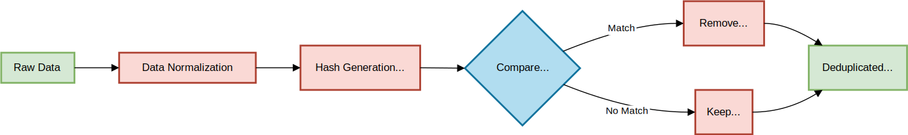
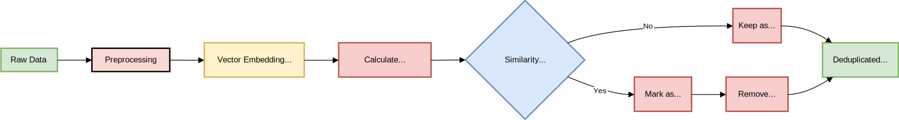

<!-- 
 Copyright Amazon.com, Inc. or its affiliates. All Rights Reserved.
 SPDX-License-Identifier: CC-BY-SA-4.0
 -->

# Core Data Quality Concepts

**Content Level: 200**


## Suggested Pre-Reading

 - [Data Engineering Foundations](../2_3_1-1_data_engineering_foundation/data_engineering_concepts.md)
 - [Key Primitives: LLM Tokens, contexts, vectors, embeddings](../../../2_1_key_primitives/index.md)

## TL;DR

What constitutes good data for instruction tuning?
As discussed in the previous section, instruction tuning is a standard technique used to align large language models (LLMs) with end tasks and user preferences following the initial pre-training phase.
Research shows that a small amount of high-quality data can lead to better performance than a large quantity of low-quality or noisy data.
As a customer, you will likely curate these datasets either manually or through heuristic automation, such as [distillation](){:target="_blank" rel="noopener noreferrer"}. However, what exactly defines good data examples for instruction tuning is not always clear and can vary depending on individual use cases and models. This section will focus on the core concepts that you can use to define the characteristics of "good data" for instruction tuning.

## Quality
Data quality is important when preparing to fine-tune a large language model.
However, a common question arises for many engineers inspecting their data for the first time: how can data quality be quantified based on complexity, quality, and diversity?
Additionally, what are the general characteristics of high-quality data?
Depending on the use case, which may have specific requirements, the most common "vibe check" characteristics are listed below.

- [X] Relevancy—How relevant is the dataset to the task you're training the model to do?
- [X] Task Alignment—Is the dataset aligned with the task requirements? For example, if the task requires factual consistency, the answers should be factually correct. 
- [X] Consistency—Inconsistent annotations are likely to confuse the model. For example, a model task might generate structured data in JSON, but some key values might be represented as integers and others as strings. This is likely to degrade the model's performance.
- [X] Correctly formatted - Are all the examples in the dataset conforming to model input expectations, e.g., removing HTML tags 
- [X] Uniqueness—How unique are the samples? The best practice is to remove duplicates, as they are more likely to cause overfitting.
- [X] Compliance—The data should comply with both internal and external policies, e.g., the removal of all PII(Personally Identifiable Information). #edit

## Data Diversity
A high-quality dataset should cover as many use cases as possible and the different permutations of how the tasks or problems can be expressed or represented. However, real world data in most cases often contain some redundancy due to repetitive and homogeneous data which can lead to several issues such as

- Overfitting - Models may memorize specific examples rather than learning general patterns.
- Biased performance - Overrepresented data points may skew the model performance towards certain types of inputs.
- Training inefficiency - Redundant data increase training time with no performance improvement.
- Inflated evaluation metrics.Duplicate data in test may lead to overly optimistic performance estimates.
 

For general purpose use cases like question-and-answer chatbots the instruction tuning data should be diverse enough to capture a wide range of topics that is aligned with your business domain.

## Complexity
A simple task such as classifying whether a product review is positive or negative will require much less data than complex multi-turn conversations.
Instead, you should focus on curating datasets that capture complex real-world problems requiring multi-step reasoning.

In practice, this is mostly achieved using LLMs instead of humans to automatically improve the instructions by making them more complex.


## Data Quantity
**How much data do I need?**
Determining the size or the number of samples necessary for fine-tuning is a difficult task with no straight answer because IT DEPENDS.
While it's true that more data generally improves the performance of models, the optimal size of the dataset is dependent on other factors such as:

- Data characteristics such as quality, complexity and diversity. 
- Size of the LLM foundation model. Large parameter models require low number of high-quality samples.
- Base model performance. For large models the number of samples required can be as low as 100 samples compared to smaller model (less than 7 billion parameters) which might require higher number of samples. Example `Amazon Nova micro` has a maximum sample size of 20K while ``Nova Pro`` maximum is 10K
- Use case complexity. Complex use cases that require multi-step reasoning such as coding require more data.
- Finetuning techniques. PEFT methods like LoRA or QLoRA require a few hundred to thousands of sample compared to full finetuning which might require millions of instruction-answers pairs.
- Model Purpose - General purpose models cover more topics thus requiring more samples compared to task specific models. This makes task-specific fine-tuning an attractive option for many applications where resources may be limited.

As a general rule of thumb based on our experience is to start experimenting with a small dataset.
For large models 70 Billion parameters or more 500-2000 high quality samples is a good start and plot how the performance scales with dataset size.
Example ``Amazon Nova Pro`` requires a minimum of 100 samples and a maximum of 10K.
Further details on data quantity requirements are in the [Output Customization Taxonomy](../../../2_7_output_customization_taxonomy/customization_taxonomy.md). 

## Data Acquisition
**where do I find data?**
A common challenge we faced every time we began a new project was the lack of data or a sufficiently large dataset with the quality and diversity needed to evaluate or fine-tune models effectively for improved system performance. 

Ideally, the best source of data is real user data from enterprise applications in production.
However, many organizations either do not capture user data or lack the quality attributes necessary for model training.

Fortunately, there are solutions to address this gap:

1. **Publicly Available Datasets**: Explore datasets from providers like Huggingface and Kaggle. However, curating domain-specific data can be more challenging, often requiring collaboration with subject-matter experts in fields like healthcare.

2. **Manual Data Annotation**: Although it can be costly, you may need to annotate your own datasets. In the following section, we will discuss data augmentation techniques, and customers commonly use these annotated datasets as a "seed" for generating synthetic data.

3. **Data Augmentation and Synthesis**: Data augmentation involves creating new data from existing real data. For instance, given patient notes, you can generate additional datasets that resemble real patient encounters. In contrast, data synthesis creates entirely new datasets that mimic the properties of real data. A pertinent example is generating patient observations, especially considering the sensitivity of training models that use personally identifiable information (PII).

Before embarking on a fine-tuning project check for data availability but don't let that be a blocker as there are plenty of good options to acquire data such as synthetic data generation.

## Synthetic Data Generation
The phrase "data is the new gold" emphasizes the growing shortage of sufficient instruction and preference-tuning datasets, particularly for edge cases or domain-specific applications.
While human-annotated datasets are very time-consuming and labor-intensive, we have observed that many teams adopt a hybrid approach that combines human-annotated data with AI-generated content.
For instance, the Deepseek V3 Non-Reasoning data, which includes creative writing and role play, was generated by DeepSeek V2.5 and subsequently verified for accuracy and correctness by human annotators. Since manually generated data does not scale effectively, utilizing large language models (LLMs) provides a scalable alternative.

**What is the right balance?**
Synthetic data is an appealing option when you evaluate your data and identify the need to enhance "good data" attributes such as quality, complexity, quantity, and diversity or when privacy is a concern. In practice, customers often use synthetic data to improve these desirable attributes or to address biases that may be present in their current datasets.

### Augmentation 
**How do we create new data from existing data?** Data augmentation refers to the process of increasing quantity and quality of data samples using pre-existing samples as inputs also called "seed". 
A good example of this technique is [Evol-Instruct](https://arxiv.org/pdf/2304.12244){:target="_blank" rel="noopener noreferrer"} method see "Make it Practical" section which is a scalable method to build a high-quality instruction following model using LLMs to evolve simple instruction into complex ones that capture complex real-world problems requiring multi-step reasoning. 
### Data Synthesis
Data synthesis involves generating data that mimics the characteristics of real data. For example, in a healthcare context, [Synthea](https://synthetichealth.github.io/synthea/){:target="_blank" rel="noopener noreferrer"} is an open-source patient population simulator that generates synthetic patient data and corresponding health records.
## Data Exploration
**coming soon**
## Make it practical

### How do we create data diversity?

#### fuzzy deduplication

<div style="margin:auto;text-align:center;width:100%;">
  
</div>
Figure 2.2: Hash-Based Fuzzy Deduplication Workflow

The most straightforward approach involves deduplication techniques such as exact deduplication or fuzzy duplication. In exact dedups removes identical samples using processes such as normalization which standardizes the format such as converting all text to lowercase. Hash generation then creates unique hashes such as SHA-256 and these hashes are the  compared to find matches. The drawback to this technique is it doesn't detect semantically similar content.

#### semantic similarity
Semantic similarity takes a different approach by focusing on the meaning of text to identity near-duplicates.

<div style="margin:auto;text-align:center;width:100%;">
  
</div>

Figure 2.3: Semantic Similarity Deduplication Workflow

### Generate complex data.
####[Evol-Instruct Method](https://arxiv.org/pdf/2304.12244){:target="_blank" rel="noopener noreferrer"}

An example implementation of enhancing instruction complexity using **Evol-Instruct** method.
```json
{
    "instruction": "Identify the medical conditions mentioned in the patient notes, list any medications referenced, and provide a brief care recommendation based on the information."
}
```
To make the prompt above complex you can use the prompt below to deepen the instruction.
```
You are a Prompt Rewriter. Your task is to take a given prompt and rewrite it into a more complex version while adhering to specific guidelines. Here is the prompt you will be working with:

<given_prompt>
{{GIVEN_PROMPT}}
</given_prompt>

Your objective is to rewrite this prompt to make it more challenging for advanced AI systems like Claude and Sonnet 3.7 to handle, while ensuring it remains reasonable and understandable for humans. Follow these guidelines:

1. Do not omit any non-text parts such as tables, code, or input sections from the original prompt.
2. Add one additional constraint or requirement to the prompt.
3. Limit your additions to 10-20 words.
4. Avoid making the rewritten prompt unnecessarily verbose.
5. Do not use the phrases "Given Prompt", "Rewritten Prompt", "given prompt", or "rewritten prompt" in your rewrite.

To complete this task:
1. Carefully read and understand the given prompt.
2. Identify an area where you can add a meaningful constraint or requirement.
3. Integrate this new element seamlessly into the existing prompt.
4. Ensure your addition increases the complexity without significantly altering the original task.

Present your rewritten prompt within <rewritten_prompt> tags. Do not include any explanation or commentary outside of these tags.
"""
```
Providing this prompt to an LLM you automatically get a more complex instruction that is aligned with a real-world complex use case.

**Response**

!!! info "Notice the additional constraints"
    "flagging any potential drug interactions or contraindications that should be considered"
```xml
<rewritten_prompt>
Identify the medical conditions mentioned in the patient notes, list any medications referenced, and provide a brief care recommendation based on the information, while also flagging any potential drug interactions or contraindications that should be considered.
</rewritten_prompt>
```

Evaluations show that Evol-Instruct are far more superior to human-created datasets.

### Data Evaluation: 
Evaluating the data used to train models and the output generated by large language models (LLMs) is important.
While LLM-generated data is not as reliable as data obtained from real users, it can still serve as a useful starting point.
Regardless of how the data is collected, a thorough process should be in place to assess key characteristics of the dataset, including accuracy, diversity, and complexity.

This assessment typically relies on human annotation and involves a rigorous quality evaluation process. While this approach often yields high accuracy, it can be costly, time-consuming, and prone to errors.

We have published a dedicated evaluations section in Atlas that explores the practical implementation of evaluations in building AI applications. In this section, we will introduce high-level techniques such as using LLMs as judges


#### LLM-as-a-judge
Coming soon

#### Reward Models
Coming soon

#### Encoder-only classifier models
Coming soon

## Conclusion
The effectiveness of instruction tuning for any large language model hinges on carefully curating high-quality datasets characterized by relevancy, task alignment, consistency, correct formatting, uniqueness, and compliance.
We also discussed some techniques to create data diversity using deduplication methods. In the next section, we will combine the techniques from the previous section to provide practical guidance on building an end-to-end data pipeline.

## Further Reading
- [AI Engineering - Chip Huyen](https://www.oreilly.com/library/view/ai-engineering/9781098166298/){:target="_blank" rel="noopener noreferrer"}
- [Evaluating LLM's at detecting errors](https://arxiv.org/html/2404.03602v1){:target="_blank" rel="noopener noreferrer"}
- [DeepSeek-V3 Technical Report](https://arxiv.org/pdf/2412.19437){:target="_blank" rel="noopener noreferrer"} 


## Contributors

Author/s:

 - Tonny Ouma - Sr Applied AI Architect 
 - Markus Bestehorn - Tech Lead Generative AI EMEA 


Primary Reviewers:

 - Randy DeFauw - Senior Principal SA 
 - Felix Huthmacher - Senior Applied AI Architect 