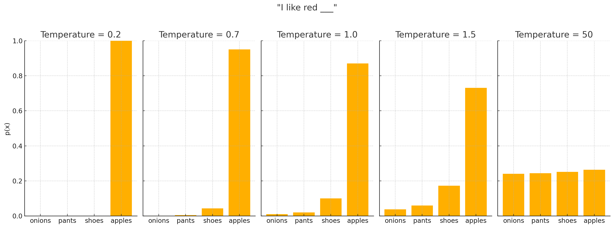

<!--
 Copyright Amazon.com, Inc. or its affiliates. All Rights Reserved.
 SPDX-License-Identifier: CC-BY-SA-4.0
 -->

# Temperature and Sampling

**Content Level: 200**

## TL;DR

Temperature and sampling govern how "creative" or "deterministic" your AI's outputs will be. By adjusting parameters like temperature, top-p, and top-k, you can control the randomness in token selection, leading to varying styles of responses from highly consistent to more imaginative or diverse. Randomness parameters (temperature, top_p, top_k, and CFG scale for images) determine how creative or predictable AI outputs will be. Lower temperature (0.1-0.3) produces consistent, factual responses while higher values (0.7-1.0) increase creativity and variation. The key is finding the right balance for your specific use case.

## Parameter Controls

Large language models compute a probability for each potential next token. This probability distribution reflects the model's internal understanding of linguistic and factual patterns. Parameter controls decide which tokens from that distribution actually get selected.

**Temperature**: A numeric value that modulates randomness. Temperature regulates the weight given to the probable next token in the logits (initial scores that a model gives to different possible outcomes before making its final decision). A temperature of 0% picks the single most likely token every time, producing very consistent but sometimes repetitive outputs. As you increase temperature (e.g., 70-100%), the model is allowed to sample tokens from a broader range, leading to more varied and creative text.

<div style="margin:auto;text-align:center;width:100%;">
  
</div>

Figure 1.1: How Temperature Affects Word Choice in Language Model

**Top-p**: Top-P is called nucleus or probabilistic sampling which means it controls the randomness of output by establishing a probability threshold. It's a sampling technique that filters out tokens whose cumulative probability is less than the threshold, and only considers the remaining tokens for responses. A lower value of p means selecting the most confident responses and higher values means more creative responses.

**Top-k**: Selecting from the k most probable tokens can be used alongside temperature and top-p to further shape how many tokens the model might consider at each step.

## Controlling Randomness in Amazon Bedrock

When working with foundation models in Amazon Bedrock, several parameters influence the randomness and diversity of generated outputs. Understanding these parameters helps you achieve the perfect balance between creativity and predictability in your applications.

### Key Randomness Parameters for Text Generation

```python
import boto3
import json

bedrock_runtime = boto3.client('bedrock-runtime')

# Text generation with randomness control
response = bedrock_runtime.invoke_model(
    modelId="anthropic.claude-3-sonnet-20240229-v1:0",
    body=json.dumps({
        "prompt": "Write a tagline for a coffee shop named 'Morning Brew'",
        "max_tokens_to_sample": 100,
        "temperature": 0.2,  # Lower value = more deterministic
        "top_p": 0.9,        # Nucleus sampling threshold
        "top_k": 50          # Limits token consideration set
    }),
    contentType="application/json"
)
```

### Image Generation Parameters

For image generation models like Amazon Nova:

```python
response = bedrock_runtime.invoke_model(
    modelId="amazon.nova-canvas-1:0",
    body=json.dumps({
        "taskType": "TEXT_IMAGE",
        "textToImageParams": {
            "text": "A steaming cup of coffee on a rustic wooden table",
            "negativeText": "blurry, distorted, text, watermarks"
        },
        "imageGenerationConfig": {
            "cfgScale": 7.5,  # Higher = stronger prompt adherence
            "seed": 42,       # Fixed seed for reproducible results
            "width": 1024,
            "height": 1024,
            "quality": "premium"
        }
    }),
    contentType="application/json"
)
```

### Temperature Settings Best Practices

| Use Case | Temperature | Description |
|----------|-------------|-------------|
| Factual responses | 0.0-0.3 | Produces consistent, deterministic outputs for cases requiring accuracy and reliability |
| Balanced creativity | 0.4-0.7 | Good middle ground for most applications, offering some variation while staying on topic |
| Creative writing | 0.7-1.0 | Generates more diverse and unexpected outputs for creative applications |
| QA applications | 0.0-0.2 | Minimizes hallucinations and promotes factual consistency |

### Parameter Effects on Text Generation

Temperature modulates the probability distribution for next token selection:

- **Temperature = 0.1**:
  ```
  "Morning Brew: Start your day with quality in every cup."
  ```

- **Temperature = 0.7**:
  ```
  "Morning Brew: Where sunrise meets your perfect roast."
  ```

- **Temperature = 1.0**:
  ```
  "Awaken possibilities. Sip dreams. Morning Brew."
  ```

### CFG Scale Effects in Image Generation

CFG Scale (Classifier-Free Guidance) controls how closely the image adheres to your prompt. Here are examples of the same prompt with different CFG values:

<div style="margin:auto;text-align:center;width:100%;">
  
</div>
*CFG Scale: 1.5 - Minimal prompt adherence, highly creative but may not follow prompt closely*

<div style="margin:auto;text-align:center;width:100%;">
  
</div>
*CFG Scale: 6.5 - Default balanced setting with good prompt following*

<div style="margin:auto;text-align:center;width:100%;">
  
</div>
*CFG Scale: 10.0 - Strong prompt adherence, potentially at the expense of visual quality*

Images were generated with Nova Canvas model on Amazon Bedrock.

## Randomness Management

Randomness management involves balancing consistency with creative variation in model outputs. When handling tasks that require high accuracy—such as basic arithmetic calculations or adherence to specific guidelines—you might set temperature to a lower value, possibly zero, to reduce variability. This approach tends to produce more consistent and conventional responses, though it's important to note that even at zero temperature, LLMs don't guarantee completely deterministic or factually perfect outputs.

For mathematical applications, context matters significantly. LLMs should not be relied upon for financial calculations, engineering measurements, medical dosing, or any arithmetic where errors could have serious consequences. However, they might be acceptable for educational examples, ballpark estimates, or non-critical calculations when verified by other means.

Creative or generative tasks—like fiction writing, brainstorming, or marketing copy—benefit from higher temperature settings that allow the model to explore less likely tokens. This exploration enables more original phrases, unexpected word choices, and novel compositions. However, excessive randomness can lead to irrelevant or incoherent text, so finding the right balance is important.

Randomness settings also impact safety considerations. Higher temperatures might produce more varied but potentially riskier or tangential outputs. Understanding your application's domain and purpose is important when deciding how much variation you can tolerate. Applications like legal contract summarization demand consistency, while creative writing benefits from controlled variability.

Regardless of temperature settings, always verify and test LLM outputs. These models can hallucinate information or make reasoning errors even when configured for maximum consistency. The optimal balance between consistency and variation ultimately depends on your specific use case requirements and risk tolerance.

Remember that all language models produce probabilistic results—there is no true determinism in their operation, only varying degrees of predictability in their responses.

## Output Variation

Output variation is the direct outcome of how these sampling parameters are set. By fine-tuning temperature or top-p, you control whether each generation is nearly the same (low variation) or unique every time (high variation). In practice, you might:

• Lower temperature for tasks demanding consistency—like summarizing legal documents or answering technical questions.

• Moderate temperature (50-70% range) for balanced outputs that preserve some creativity without sacrificing coherence.

• High temperature (70-100%) for open-ended storytelling, poetry, or brainstorming—understanding that the results may be looser in factual accuracy.

Even with a fixed temperature, top-p and top-k thresholds can further refine how many tokens the model considers. If the model consistently produces bland or repetitive text, slightly raising temperature or top-p can add a welcome touch of unpredictability. Monitor results by re-running prompts multiple times to see the range of responses.

### Response Formats

Models can generate responses in various formats:

* Plain text narratives
* Structured JSON or XML
* Programming code
* Markdown-formatted content
* Lists, tables, and other structured formats

Function calling or JSON mode capabilities allow for more reliable structured outputs that can be directly parsed and used in downstream applications. Aside from text responses, LLMs can also generate images or even videos.

## Making it Practical

When designing GenAI solutions, consider temperature, top-p, and top-k as core parameters that shape your application's user experience, output reliability, and even system performance—just as much as network architecture or auto-scaling strategies do. Many builders treat temperature like a "mysterious knob," but it's actually a powerful tool you can control.

Lower temperature values (e.g., 0-30%) generally yield deterministic and safer outputs, ideal for use cases in finance, healthcare, or legal applications, where accuracy and repeatability are critical. On the other hand, moderate or higher temperature values (70-100%) encourage creativity, making them more suitable for tasks like marketing copy, brainstorming, or open-ended Q&A.

Often, a single use case might benefit from multiple prompt profiles—for instance, you could define one endpoint with temperature near zero for factual queries, and another with higher sampling parameters to support more exploratory, creative outputs.

### Guidelines for Parameter Selection

1. **Define your objective**: Are you optimizing for creativity or consistency?
2. **Start with defaults**: For many models, if unsure, a good starting point is temperature = 0.7, top-p = 0.9.
3. **Tune gradually**: Adjust one parameter at a time and observe how the model behavior changes.
4. **Increase temperature** to introduce variability and surprise. Lower top-p or top-k to narrow the model's focus for more precise answers.
5. **Test with multiple samples** to understand the variation in generated outputs across settings.

### Tuning for Applications

| Application | Suggested Parameters |
|---|---|
| Legal Drafting | Temperature: 0.2-0.4, Top-p: 0.8 |
| Creative Writing | Temperature: 0.8-1.0, Top-p: 0.95 |
| Code Generation | Temperature: 0.1-0.3, Top-k: 40 |
| Chat Assistants | Temperature: 0.6-0.8, Top-p: 0.9 |

### Quick Tips for Parameter Selection

1. **Temperature**: The primary randomness control; lower values (0.1-0.3) for factual responses, higher values (0.7-1.0) for creative content.

2. **CFG Scale** (for image models): Values 6-8 typically produce images that closely follow the prompt. Lower values (1-5) allow for more artistic variation, while higher values (8-10) enforce stricter prompt adherence.

3. **Seed Values**: Set a fixed seed when you need reproducible results or when fine-tuning an output through iterative prompt adjustments.

4. **Production Deployments**: Use lower temperature settings (0.1-0.3) in production for more consistent and predictable outputs.

5. **Testing**: When experimenting, vary only one parameter at a time to understand its specific impact on your outputs.

6. **Model Calibration**: Different models may respond differently to the same parameter values.

!!! tip "Potential Pitfalls"
    **Too High Temperature**: Can lead to incoherent or nonsensical text.

    **Too Low Top-p or Top-k**: May result in repetitive or dull outputs.

    **Overlapping Effects**: Combining extreme values of Temperature, Top-k, and Top-p can lead to unpredictable results

Also, remember that these sampling strategies can impact latency and cost. More diverse generations usually may produce longer outputs, requiring additional compute time, which may increase Time to First Token (if streaming is not used) and overall response latency. If your application supports real-time interactions, such as chat interfaces, you may want to keep temperature and sampling conservative. For offline or batch workloads, however, more exploratory configurations are often acceptable.

Beyond individual prompt tuning, it's important to consider how your sampling settings fit into the broader architecture of your application. For instance, if you're implementing advanced techniques like self-consistency—where you generate multiple outputs and aggregate the results—each variation adds to compute cost and latency. Similarly, if your prompt logic includes calling external tools or APIs, introducing high variability through sampling can delay those calls and impact the overall responsiveness of your system.

To strike the right balance, consider adopting a hybrid approach. Use higher-temperature settings selectively for moments in the user journey where creativity and breadth are priorities - such as generating campaign ideas or exploring user questions in open-ended ways. For tasks that require speed, precision, or deterministic behavior—like answering FAQs, summarizing policy documents, or delivering code completions—favor lower-temperature, focused configurations. By treating sampling parameters as a strategic part of your system design, you can align your model behavior with both technical requirements and business goals.

## Get Hands-On

* [Hugging Face Transformers Documentation](https://huggingface.co/docs/transformers/main_classes/text_generation){:target="_blank" rel="noopener noreferrer"}

## Further Reading

* [Two Minutes NLP: Most Used Decoding Methods](https://medium.com/nlplanet/two-minutes-nlp-most-used-decoding-methods-for-language-models-9d44b2375612){:target="_blank" rel="noopener noreferrer"}
* [LangChain Structured Output Guide](https://python.langchain.com/docs/how_to/structured_output/){:target="_blank" rel="noopener noreferrer"}
* [Amazon Bedrock Inference Parameters](https://docs.aws.amazon.com/bedrock/latest/userguide/inference-parameters.html){:target="_blank" rel="noopener noreferrer"}
* [Request and response structure for image generation](https://docs.aws.amazon.com/nova/latest/userguide/image-gen-req-resp-structure.html){:target="_blank" rel="noopener noreferrer"}

## Contributors

**Author/s:**

* Afia Khan - Associate SA - GenAI 

* Alicja Kwasniewska - Sr. Solutions Architect 

**Primary Reviewer:**

* Deepika Kumar - Solution Architect 

**Additional Reviewer:**

* Kihyeon Myung - Sr Applied AI Architect 

**Credits:**

* [Prompt Academy](https://www.promptingguide.ai/){:target="_blank" rel="noopener noreferrer"}
