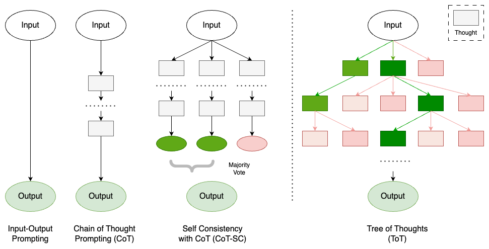

<!--
 Copyright Amazon.com, Inc. or its affiliates. All Rights Reserved.
 SPDX-License-Identifier: CC-BY-SA-4.0
 -->

# Prompt Composition

**Content Level: 200**


## TL;DR

Prompt composition is the practice of organizing instructions, examples, and external data to steer a large language model toward coherent, accurate, and context-relevant outputs. It encompasses structuring the text, ensuring each component (such as system messages or user prompts) interacts effectively, and employing design patterns like chain-of-thought or retrieval augmentation. Chain-of-thought reasoning enhances foundation model performance on complex problems by breaking them into explicit steps. For best results, structure reasoning with clear markers, match reasoning depth to problem complexity, and include verification steps especially for mathematical tasks.

## Structure and Format

A prompt's layout is often the most overlooked aspect of working with LLMs. Think of it like designing a user interface, well-organized text helps the model parse each piece of information easily. A typical prompt might include:

**System or Role Definition**: Constrains the style, policy, or persona of the AI (e.g., "You are a helpful travel assistant…").

**Contextual Sections**: Provides relevant data or examples before the user's request, so that the model sees important information up front.

**User Query**: The final or most recent instruction, typically describing what we want (e.g., "Find the cheapest flight from NYC to Tokyo").

Consistency in where and how you place these sections helps the model "understand" your instructions more reliably. For instance, designating clear boundaries (sometimes with blank lines or tokens like "Begin Context") signals to the LLM how it should interpret each piece of text.

## Component Interaction

In prompt engineering, component interaction is about how instructions, context, examples, output format, and an assigned role or persona come together to shape the AI model's behavior. By aligning these elements carefully, you can create prompts that consistently yield relevant, coherent, and stylistically appropriate responses.

### Components and Their Roles:

* **Instructions:** Clearly define the task or goal you want the AI model to accomplish.
* **Context:** Provide background information or relevant details to help the model understand the prompt.
* **Examples:** Offer specific examples of input-output pairs to guide the model's behavior.
* **Output Format:** Specify the desired format or structure of the model's response.
* **Role (Persona):** Assign a specific role or persona to the AI model to influence its tone and style.

**How Components Work Together**

Instructions and context work in tandem: if your instruction is "Write a whimsical story," the context might include character descriptions or relevant setting details. This pairing prevents ambiguity, so the model knows what kind of story you want and where it's happening.

Examples often reinforce these instructions, providing a mini blueprint for the model to follow. For instance, if you demonstrate a correct input-output format, the model is more likely to replicate that structure.

Meanwhile, specifying an output format should result in a prompt which not only produces the right content but also packages it suitably like returning a table for tabular data or code blocks for programming output.

The assigned role or persona weaves through all of these elements, subtly guiding the model's style. For example, a persona labeled "humorous narrator" changes the language or tone of the final text.

## Design Patterns

Over time, certain patterns have emerged to handle recurring prompt composition challenges. This is particularly useful when you have many team members building or updating prompts, as it enforces consistency.

### Template-Based Prompting

You lay out a text template containing placeholders for system messages, examples, context, and user queries. This fosters consistency, especially when multiple developers or services need the same approach to prompting.

### Multi-Turn Collation

Rather than re-sending the entire conversation each time, you maintain a dynamic summary of previous interactions and provide that summary as part of the context for the model. This technique keeps token usage manageable while still preserving continuity.

### Step-by-Step or Chain-of-Thought

Chain-of-Thought instructs the model to reason through intermediate steps before giving a final answer. It's effective for logic-heavy tasks like math, multi-hop QA, or legal analysis. Chain-of-thought is a foundational building block for more advanced patterns:

- **Self-Consistency** builds on CoT by generating multiple reasoning paths using stochastic sampling, then returning the most frequent answer. It improves reliability when there's a single correct output.
- **Tree-of-Thought (ToT)** generalizes CoT by generating multiple reasoning branches at each decision point. The model explores, scores, and follows the most promising paths, ideal for planning and open-ended generation.
- **Skeleton-of-Thought (SoT)** separates planning from execution. The model first outlines a high-level structure (e.g., blog sections or function stubs), then expands on each part. SoT improves coherence for long-form content generation or modular code synthesis.
- **Least-to-Most Prompting** breaks down complex tasks into sequential subtasks, solved in increasing difficulty. It blends decomposition with controlled progression, enhancing CoT's performance in problem-solving pipelines.

<div style="margin:auto;text-align:center;width:100%;">
  
</div>

Figure 1.1: An Overview of Structured LLM Reasoning

### Automatic Prompt Engineering (APE)

APE automates the creation and refinement of prompts using an LLM itself. By feeding example input-output pairs, the model can propose a range of candidate prompts and score them based on performance or user-defined criteria. It dramatically accelerates prompt iteration in enterprise and research settings.

## Chain-of-Thought Prompting in Amazon Bedrock

Chain-of-thought (CoT) prompting improves reasoning abilities by breaking down complex questions into smaller, more manageable steps. While traditional prompting asks models for direct answers, CoT prompting guides the model to explicitly show its step-by-step thought process before delivering the final answer.

### CoT with Zero-Shot Prompting

Zero-shot CoT instructs the model to think step-by-step without providing examples.

**Example Input:**
```
Convert this recipe for 4 servings into one for 6 servings:
- 2 cups rice
- 1/2 pound chicken
- 3 tablespoons olive oil

Show your reasoning.
```

**Example Output:**
```
<thinking>
To convert from 4 to 6 servings, I'll multiply each ingredient by 6/4 = 1.5:
- Rice: 2 cups × 1.5 = 3 cups
- Chicken: 0.5 pounds × 1.5 = 0.75 pounds
- Olive oil: 3 tablespoons × 1.5 = 4.5 tablespoons
</thinking>

Recipe for 6 servings:
- 3 cups rice
- 3/4 pound chicken (0.75 pounds)
- 4.5 tablespoons olive oil
```

### CoT with Few-Shot Prompting

Few-shot prompting includes example(s) in the initial prompt to guide the model's response format.

**Example Input:**
```
Question: A cake recipe uses 1.5 cups sugar for 12 slices. How much sugar for 8 slices?

Answer: For 12 slices, we need 1.5 cups sugar. For 8 slices, we need (1.5 × 8) ÷ 12 = 1 cup sugar.

Question: A soup recipe calls for 3 carrots and 2 onions for 6 people. How many carrots and onions for 9 people?
```

**Example Output:**
```
Answer: For 6 people, we need 3 carrots and 2 onions. For 9 people, we need:
Carrots: (3 × 9) ÷ 6 = 4.5 carrots
Onions: (2 × 9) ÷ 6 = 3 onions
```

### Enhancing Responses with Model Reasoning

Some foundation models in Amazon Bedrock are specifically designed to perform model reasoning, breaking down complex tasks into smaller steps to improve accuracy. Model reasoning is particularly effective for multi-step analysis, mathematical calculations, and complex decision-making scenarios.

**Example of foundation model with Configurable Reasoning:**

*Input:*
```
How should I adjust a recipe that serves 4 people to serve 10 people instead?
The recipe calls for 2 cups flour, 3 eggs, and 1/2 cup sugar.
```

*Output:*
```
[Reasoning: To adjust a recipe from 4 to 10 people, I need to multiply ingredients by 10/4 = 2.5

Flour: 2 cups × 2.5 = 5 cups
Eggs: 3 eggs × 2.5 = 7.5 eggs, which rounds to 8 eggs
Sugar: 1/2 cup × 2.5 = 1.25 cups]

For a 10-person serving, you should use:
- 5 cups flour
- 8 eggs (7.5 rounded up)
- 1.25 cups sugar

This maintains the same proportions as your original recipe.
```

## Prompt Augmentation

### RAG (Retrieval-Augmented Generation)

When the model receives a user query, you pull relevant text from a knowledge base (often chunked or embedding-based) and insert it alongside the prompt. This keeps your model grounded in facts without retraining, ideal for up-to-date references or domain-specific knowledge.

### Adaptive Prompting

Here, the prompt itself changes based on the user request or intermediate results. For example, a meta-layer might watch the model's partial response and decide whether to re-ask the question with additional context or examples. The result of this approach is that you only feed as much data as the model currently needs. It's especially powerful in agent-like scenarios where the LLM tries a step, checks a result, and then modifies the prompt for the next iteration.

### Directional Stimulus Prompting

A lightweight yet effective method where the prompt includes specific cues about tone, structure, or stylistic intent e.g., "Answer in bullet points," "Use a cheerful tone," or "Avoid technical jargon." This method refines model output without altering model weights or requiring fine-tuning.

### Program-Aided Prompting (PAP)

PAP introduces external logic into the prompting loop. The model reasons about what it needs, calls a function or tool to retrieve or compute data, and continues reasoning with that result. It's particularly useful in use cases requiring deterministic logic like pricing calculations, unit conversions, or structured data extraction.

### One-Shot and Few-Shot Learning

One-shot learning involves providing a single example of how you want the LLM to respond, typically placed right before the user's actual query. Few-shot means offering multiple examples. The examples might illustrate a desired style, format, or type of analysis:

**One-Shot**: Provide exactly one Q&A pair or single example of the text transformation.

**Few-Shot**: Supply multiple pairs that demonstrate different but related variations or complexities.

Each example helps the model generalize and replicate that behavior in subsequent queries. These techniques can be more cost-effective than full model fine-tuning and are widely used to quickly adapt general-purpose LLMs to niche tasks.

## ReAct: Reasoning and Acting

ReAct combines the reasoning power of CoT with the ability to act i.e., call tools, run code, fetch documents, or update state. The model alternates between internal reasoning steps ("Thought") and function executions ("Action") in a loop:

- **Thought**: "I need to look up today's weather."
- **Action**: Call weather API.
- **Observation**: "It's sunny and 78°F."
- **Thought**: "I'll recommend outdoor activities."

ReAct enables LLMs to operate as intelligent agents, chaining reasoning and actions to achieve goals. It forms the core of multi-step workflows in customer support bots, research assistants, and enterprise decision systems.

## Multi-Agent Prompting

Instead of using one general-purpose prompt, multi-agent prompting distributes tasks across specialized "agents", each with its own role, system message, and capabilities. Agents may critique, refine, or even oversee other agents, creating collaborative chains. The essence is to emulate group dynamics. You get the creativity, debate, and cross-checking that a team of humans might have.

Example architecture:
- **Agent A**: Writer – generates an initial draft.
- **Agent B**: Editor – improves clarity and grammar.
- **Agent C**: Critic – evaluates alignment with brand tone.
- **Agent D**: Validator – fact-checks against external documents.

This distributed architecture improves performance in complex tasks like legal summarization, proposal generation, and creative ideation, where different forms of reasoning and expertise should be combined.

## Prompt Chaining

Prompt chaining breaks down complex tasks into a series of simpler subtasks, with output from one prompt becoming input to the next.

### Practical Prompt Chaining Example

A simplified recipe modification chain:

**Prompt 1: Ingredient Analysis**
```
Analyze the main components of this pasta dish:
- 8oz spaghetti
- 2 eggs
- 1/2 cup parmesan cheese
- 4oz bacon
- 2 cloves garlic
```

**Prompt 2: Healthier Version** (using output from Prompt 1)
```
Make this dish healthier based on the analysis:
[Previous analysis results]
```

**Prompt 3: Final Recipe** (using modifications from Prompt 2)
```
Create a recipe with these modifications:
[Healthier substitutions]
```

## Making it Practical

In practice, **prompt composition** becomes a balancing act between simplicity and flexibility. You want enough structure to keep the model on track, but not so much text or complexity that you inflate costs, introduce latency, or confuse the output.

### Practical Guidelines

#### 1. Start Small with a Simple Template

Most teams begin with a basic prompt template that includes: System/Role Definition, Context, User Query.

!!! example "Support chatbot for consumer electronics:"
    System: You are a polite and knowledgeable AI assistant who follows company guidelines strictly.

    Context: - Summaries of the latest troubleshooting guides
    - Any relevant user-specific details (e.g., device type, serial number)

    User Message: "My router is losing connection every 10 minutes. I've tried restarting it, but nothing helps. What do I do?"

#### 2. Example-Focused (One-Shot or Few-Shot) Prompts

If the model struggles with format or tone, add one or more examples to steer it.

#### 3. Using Chain-of-Thought for Complex Reasoning

When the task is analytical or multi-step, chain-of-thought prompting improves the model's ability to reason clearly.

#### 4. Retrieval-Augmented Prompts (RAG)

When the model lacks domain knowledge or needs up-to-date facts, pull content dynamically from a vector store or knowledge base.

#### 5. Adaptive Prompting for Iterative Refinement

When workflows are dynamic or conditional, adapt the prompt between turns based on the model's earlier output.

### Best Practices for Reasoning Approaches

1. **Match technique to task complexity**: Use CoT for complex problems and simple prompts for straightforward questions
2. **Structure the reasoning process**: Use explicit markers like numbered steps or XML tags
3. **Include verification steps**: Ask the model to double-check calculations and logical deductions
4. **Choose appropriate examples**: For few-shot approaches, ensure examples demonstrate the reasoning pattern
5. **Configure reasoning tokens wisely**: For models with configurable reasoning, test different token allocations
6. **Break down complex problems**: Use prompt chaining with each prompt focused on a specific sub-task
7. **Align reasoning with domain**: Tailor reasoning approach to match domain-specific conventions
8. **Decide on reasoning visibility**: Determine whether reasoning should appear in final output

### Tips:

**Log and Iterate**: Capture each version of your prompt, measure how it performs, and refine. This is especially helpful in multi-turn conversations or high-traffic systems.

**Modularity**: Keep your prompts modular. Store them as templates or small segments in code or a configuration file. This encourages reusability across different use cases.

**Token Budget**: Watch out for creeping token usage, as it can spike costs. Summaries, chunking, and selective retrieval can offset this problem.

## Additional Guide for Image/Video Models

| Element | Best Practice |
|---------|---------------|
| **Subject & Scene** | Describe the main subject and setting as a caption, not a command (e.g., "A majestic eagle soaring over snow-capped mountains" rather than "Create an eagle flying"). |
| **Composition** | Specify framing (close-up, wide shot, aerial view), perspective (eye-level, bird's-eye), and focal point to guide image composition. |
| **Style & Medium** | Indicate artistic style (impressionism, cyberpunk, art deco) and medium (oil painting, watercolor, digital art, photography, pencil sketch). |
| **Lighting & Atmosphere** | Describe light source, quality, and conditions (golden hour, moonlight, dramatic shadows, soft diffused light, neon glow). |
| **Colors & Mood** | Specify color palette (vibrant, muted, monochromatic) and emotional tone (serene, tense, melancholic, joyful). |
| **Detail Level** | Indicate desired level of detail (highly detailed, minimalist) and realism (photorealistic, stylized, abstract, cartoon). |
| **Technical Aspects** | Optional: Include specific camera settings, render quality terms, or aspect ratio if relevant (8K, shallow depth of field, ultrawide, portrait orientation). |
| **Negative Prompts** | Place unwanted elements in the negative prompt section rather than using negatives in the main prompt. |

## Further Reading

* [Prompting Guide](https://www.promptingguide.ai/techniques){:target="_blank" rel="noopener noreferrer"}
* [Amazon Bedrock User Guide](https://docs.aws.amazon.com/bedrock/latest/userguide/design-a-prompt.html){:target="_blank" rel="noopener noreferrer"}
* [LangChain Documentation](https://python.langchain.com/docs/how_to/prompts_composition/){:target="_blank" rel="noopener noreferrer"}
* [Tree of Thoughts Prompting](https://cameronrwolfe.substack.com/p/tree-of-thoughts-prompting){:target="_blank" rel="noopener noreferrer"}
* [Amazon Bedrock Inference Reasoning](https://docs.aws.amazon.com/bedrock/latest/userguide/inference-reasoning.html){:target="_blank" rel="noopener noreferrer"}

## Contributors

**Author/s:**

* Afia Khan - Associate SA - GenAI 

* Alicja Kwasniewska - Sr. Solutions Architect 

**Primary Reviewer:**

* Deepika Kumar - Solution Architect 

**Additional Reviewer:**

* Kihyeon Myung - Sr Applied AI Architect 

**Credits:**

* [Prompt Academy](https://www.promptingguide.ai/){:target="_blank" rel="noopener noreferrer"}
