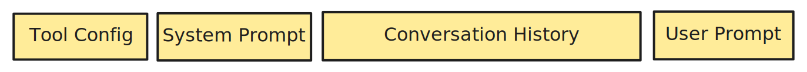
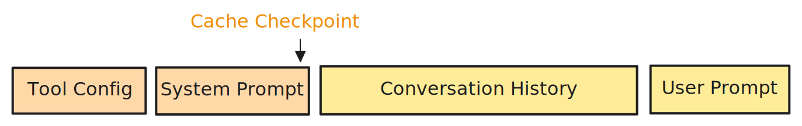
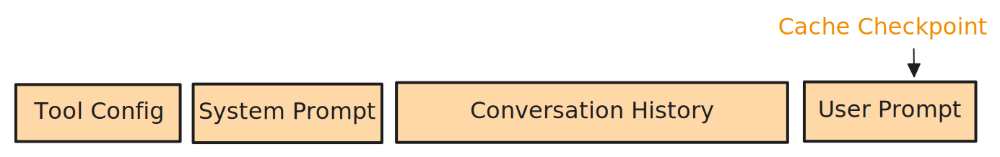
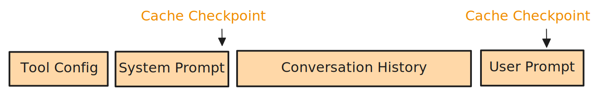
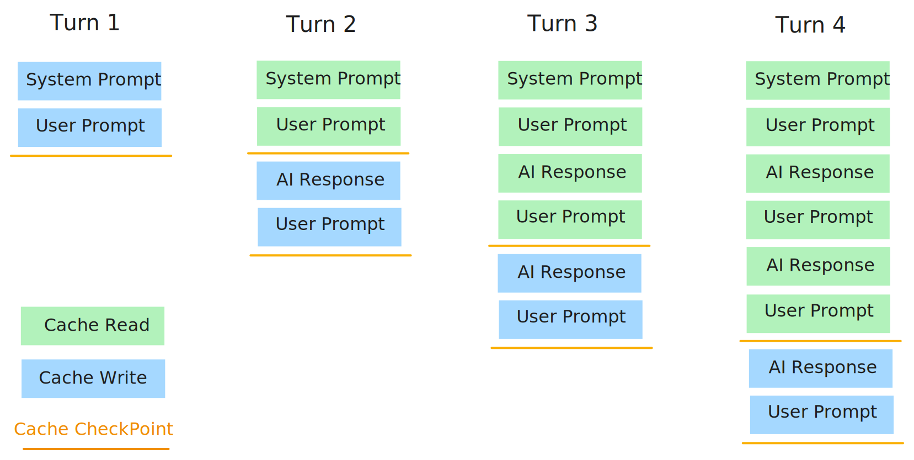

<!--
 Copyright Amazon.com, Inc. or its affiliates. All Rights Reserved.
 SPDX-License-Identifier: CC-BY-SA-4.0
 -->

# Technical Limitations

**Content Level: 200**


## TL;DR

Technical limitations in prompt engineering include limited language understanding, response rigidity, and inherent biases, which potentially can be minimized/addressed through alignment techniques like task decomposition or alternative approaches like fine-tuning for domain-specific applications. Prompt caching is an optimization technique that stores and reuses computation results from previously processed prompt segments, reducing both inference latency and costs. When implemented correctly, prompt caching can dramatically improve the economics of LLM applications, especially for those with repetitive contexts or multi-turn conversations.

## Understanding the Limits of Prompt Engineering

While prompt engineering opens doors to various possibilities, it's important to recognize its limitations for a more realistic expectation of AI capabilities.

- **Limited Understanding:** AI models don't truly understand language in the way humans do. Instead, they generate responses based on learned patterns during training, which may result in incomplete or inaccurate information.

- **Rigidity in Responses:** AI systems may struggle with flexibility, particularly when prompts are ambiguous or lack clarity, leading to misaligned outputs.

- **Vulnerability to Biases:** Prompt engineering cannot fully mitigate biases present in training data, potentially perpetuating and magnifying these biases in outputs.

- **Lack of Common Sense:** Tasks requiring contextual understanding or judgments based on implicit knowledge remain challenging for AI systems.

- **Overfitting to Training Data:** Overly specific prompts might lead to outputs that are too closely aligned with training patterns, affecting generalization capabilities.

- **Responsible AI Considerations:** Responsible use of AI requires avoiding prompting techniques intended to exploit or deceive the model for potentially harmful purposes.

## The Paradox of Prompt Engineering

Prompt engineering presents a fundamental paradox: while improving model outputs in the short term, it may hinder progress toward truly intuitive AI systems in the long run.

### Current Challenges

- **Language Inconsistency:** Identical questions phrased differently often receive inconsistent responses.
- **Pattern Recognition vs. Comprehension:** Models respond to statistical patterns rather than truly understanding meaning.
- **Provider Dependency:** Skills in prompt engineering are sometimes provider-specific and difficult to transfer.
- **Scaling Limitations:** Effective prompting strategies are challenging to replicate across different use cases or languages.

### Rethinking the Value Proposition

Rather than normalizing prompt engineering as a necessary skill, the AI community might better serve users by:
- Developing models that handle natural language without special formatting
- Creating systems that automatically select appropriate response strategies
- Evaluating AI on natural communication rather than engineered prompts
- Addressing fundamental limitations in contextual understanding

## Prompt Engineering vs Fine-Tuning

### Comparing Approaches

| Feature | Prompt Engineering | Fine-Tuning |
|---------|-------------------|-------------|
| **Definition** | Crafting instructions to guide LLM responses | Training an LLM on domain-specific data |
| **Goal** | Maximizing output quality without changing the model | Adapting the LLM to specific domains or tasks |
| **Method** | Creating well-structured, contextual prompts | Training on relevant examples to adjust parameters |
| **Resources** | Requires NLP expertise | Needs datasets and computational resources |
| **Deployment** | Rapid implementation | Time-consuming and expensive process |
| **Flexibility** | Highly adaptable | More specialized with reduced flexibility |
| **Use Cases** | General content generation, Q&A | Domain-specific expertise and high accuracy needs |

### When to Choose Which Approach

**Choose Prompt Engineering When:**

- Quick implementation is needed
- Use cases span multiple domains
- Flexibility is required

**Choose Fine-Tuning When:**

- Domain expertise is critical
- Consistency is paramount
- High-quality training data is available

Many organizations benefit from a hybrid approach combining both techniques.

## Model Constraints

- **Context Window Limitations:** Fixed token limits restrict how much text models can process at once.
- **Token Processing:** Maximum token counts limit the complexity of interactions.
- **Knowledge Cutoffs:** Models possess information only up to their training cutoff dates.
- **Limited Multimodal Capabilities:** Many models struggle with non-text content processing.
- **Reasoning Depth:** Complex reasoning in specialized domains often exceeds model capabilities.

## Performance and Resource Considerations

- **Latency Tradeoffs:** Complex prompts increase processing time.
- **Scaling Challenges:** Processing numerous prompts simultaneously requires significant infrastructure.
- **Consistency Issues:** Slight phrasing differences can yield substantially different responses.
- **Computational Costs:** Token usage directly translates to financial costs.
- **API Rate Limits:** Usage caps constrain development and deployment.

## Understanding Prompt Caching

Prompt caching represents one of the most impactful optimizations for large language model inference, yet it requires understanding the underlying computational processes that power these models.

### The Computational Challenge of LLM Processing

LLMs process text through an autoregressive calculation process that generates "attention" - a computation-intensive operation that allows tokens to influence each other. A fundamental property of this architecture is that tokens positioned earlier in the prompt influence all subsequently generated results, creating a computational dependency chain.

When the LLM processes a sequence, it performs intensive calculations to determine how each token relates to others. This computation grows quadratically with sequence length, making long context processing extremely resource-intensive. This sequential dependency creates an optimization opportunity: when the same prompt prefix appears repeatedly across requests, the model is performing identical calculations.

### How Prompt Caching Works

Prompt caching stores precalculated attention results from previous computations and reuses them in subsequent operations:

```
Step 1: Initial Prompt: [x₀, x₁, x₂, ..., xₙ₋₁]
       → Calculations performed and cached (TTL: 5 minutes)

Step 2: Follow-up Prompt: [x₀, x₁, x₂, ..., xₙ₋₁, xₙ, xₙ₊₁]
       → Reuses cached calculations for [x₀...xₙ₋₁]
       → Only calculates new values for [xₙ, xₙ₊₁]
```

To understand when prompt caching delivers benefits, let's examine common scenarios:

1. **Cache Write**: When a prompt meeting minimum token requirements is processed with caching enabled, its computation results are stored.
2. **Cache Hit**: When a subsequent prompt begins with exactly the same token sequence, the model retrieves the cached computations.
3. **Cache Miss**: When a prompt differs from cached prompts (even by a single token at the beginning), the model must recalculate from scratch.

### Prompt Caching with Amazon Bedrock

Understanding the structural components of prompts is crucial for effective cache implementation. Amazon Bedrock models process prompts in a specific sequence:

<div style="margin:auto;text-align:center;width:100%;">
  
  <p style="font-style: italic; margin-top: 5px;">Figure 1: The fundamental structure and sequence of prompts from Tool Config to User Prompt</p>
</div>

- **Tool Config**: Tool definitions, function declarations, and structured tool input
- **System Prompt**: Instructions, guidelines, and context that define model behavior
- **Conversation History**: Previous turns in multi-turn conversations
- **User Prompt**: The current query or instruction

### Cache Checkpoints Placement

Cache checkpoints are markers you place within this structure to control exactly where caching occurs. When you add a checkpoint, you're creating a demarcation line - everything before this line becomes part of a cached prefix that can be reused in future requests.

The strategic placement of these checkpoints creates different caching behaviors:

<div style="margin:auto;text-align:center;width:100%;">
  
  <p style="font-style: italic; margin-top: 5px;">Figure 2-1: Checkpoint after system prompt</p>
</div>

In Figure 2-1, a checkpoint placed after the system prompt caches tool configurations and system instructions, allowing conversation history and user prompts to vary freely.

<div style="margin:auto;text-align:center;width:100%;">
  
  <p style="font-style: italic; margin-top: 5px;">Figure 2-2: Checkpoint after user prompt</p>
</div>

In Figure 2-2, a checkpoint positioned after the user prompt creates a comprehensive cache of the entire prompt structure, requiring exact matching for cache hits.

<div style="margin:auto;text-align:center;width:100%;">
  
  <p style="font-style: italic; margin-top: 5px;">Figure 2-3: Multiple checkpoints for granular caching</p>
</div>

Figure 2-3 demonstrates multiple checkpoints enabling more flexible matches with granular caching.

### Multi-turn Conversation Caching

Prompt caching is particularly valuable in conversational applications where context accumulates across multiple turns.

<div style="margin:auto;text-align:center;width:100%;">
  
  <p style="font-style: italic; margin-top: 5px;">Figure 3: Progressive caching across multiple conversation turns</p>
</div>

The most efficient approach involves two distinct cache checkpoints in each LLM call:

1. **Turn 1**: Entire content is processed and written to cache
2. **Turn 2+**: Previously processed conversation history is retrieved from cache, only new content requires computation

This creates a sliding window effect where the proportion of cached content increases relative to new content, leading to greater cost savings as conversations progress.

### Monitoring Cache Performance

When implementing prompt caching, verify your strategy by monitoring cache metrics in API responses:

```python
response = bedrock_runtime.converse(
    modelId='anthropic.claude-3-7-sonnet-20250219-v1:0',
    messages=[...],
)

# Extract cache metrics
metrics = response.get('metrics', {})
input_tokens = metrics.get('inputTokens', 0)
cache_read_tokens = metrics.get('cacheReadInputTokens', 0)
cache_write_tokens = metrics.get('cacheWriteInputTokens', 0)

print(f"Total input tokens: {input_tokens}")
print(f"Cache read tokens: {cache_read_tokens}")
print(f"Cache write tokens: {cache_write_tokens}")
```

Key constraints to remember:

- Cache checkpoints only function with prompt segments of **at least 1000 tokens**

- Some models charge more for cache writes than standard input processing

- Cache hits can reduce input token costs by 75-90% depending on the model provider

## The Role of LLM Alignment

Alignment techniques represent an important frontier in enabling LLMs to behave appropriately and safely, making AI systems act in accordance with human values and intentions.

### Key Alignment Concepts

- **Value Alignment:** Ensuring AI systems adopt and act according to responsible AI dimensions.
- **Goal Alignment:** Making sure AI objectives match what humans actually want.
- **Interpretability:** Creating systems whose decision-making processes can be understood by humans.
- **Robustness:** Building models that maintain appropriate behavior even in edge cases.

### Practical Alignment Techniques

- **Task Decomposition:** Breaking complex tasks into smaller sub-tasks for better control and understanding of the model's reasoning.
- **Constitutional AI:** Providing principles or rules to guide response generation, creating behavioral guardrails.
- **Process Supervision:** Training models to follow explicit reasoning processes rather than just focusing on final answers.
- **Self-Reflection:** Prompting models to evaluate their outputs for accuracy, bias, or other concerns.
- **Rejection Sampling:** Generating multiple responses and selecting those best aligned with specified criteria.

## Further Reading

- [What are the limitations of Prompt engineering?](https://fatcatcoders.com/it-glossary/prompt-engineering/limitations-of-prompt-engineering){:target="_blank" rel="noopener noreferrer"}
- [Prompt Engineering Isn't the Future](https://hbr.org/2023/06/ai-prompt-engineering-isnt-the-future_){:target="_blank" rel="noopener noreferrer"}
- [Exploring the Limits of Prompt Engineering](https://medium.com/@johnmorrisonn2024/exploring-the-limits-of-prompt-engineering-d89362575b7c){:target="_blank" rel="noopener noreferrer"}
- [Prompt engineering vs fine tuning](https://www.k2view.com/blog/prompt-engineering-vs-fine-tuning/#Prompt-engineering-vs-fine-tuning-with-GenAI-Data){:target="_blank" rel="noopener noreferrer"}
- [Large Language Model Alignment: A Survey](https://arxiv.org/pdf/2309.15025){:target="_blank" rel="noopener noreferrer"}
- [Amazon Bedrock Prompt Caching Tutorial](https://github.com/aws-samples/amazon-bedrock-samples/blob/main/introduction-to-bedrock/prompt-caching/getting_started_with_prompt_caching.ipynb){:target="_blank" rel="noopener noreferrer"}

## Contributors

**Author/s:**

* Alicja Kwasniewska - Sr Solution Architect 

* Kihyeon Myung - Senior Applied AI Architect 

**Primary Reviewer:**

* Deepika Kumar - Solution Architect 

**Additional Reviewer:**

* Afia Khan - Associate SA - GenAI 