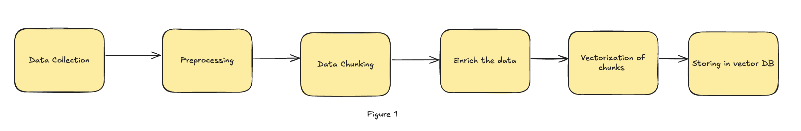

<!-- 
 Copyright Amazon.com, Inc. or its affiliates. All Rights Reserved.
 SPDX-License-Identifier: CC-BY-SA-4.0
 -->

# Ingestion, chunking and embedding

**Content Level: 300**

## Suggested Pre-Reading

- [Retrieval Augmented Generation (RAG)](../../../2_1_key_primitives/2_1_7_rag/2_1_7_rag.md)

## TL;DR

A production-ready data ingestion pipeline for RAG involves four key steps: Load, Split, Embed, and Store. First, documents from various sources are cleaned and enriched with metadata. Then, content is split into well-sized chunks to balance context and retrievability. Each chunk is converted into an embedding using a language model, enabling semantic search. Finally, embeddings are stored in a vector database for fast, accurate retrieval. Success in production requires handling diverse formats, automating preprocessing, selecting the right models and vector stores, and continuously monitoring quality.

### Data Ingestion for RAG

The data ingestion process is important for building an effective Retrieval-Augmented Generation (RAG) system. It involves sourcing, preparing, and organizing external knowledge that the system uses to provide accurate and relevant answers. The ingestion pipeline includes four key steps: **Load**, **Split**, **Embed**, and **Store**, each designed to make the right data is available for retrieval.

### 1. Load: Import External Documents

The foundational step in building a Retrieval-Augmented Generation (RAG) system is loading external data into the pipeline. This involves ingesting raw content from a wide variety of source formats and ensuring it is accessible for downstream processing tasks like chunking, embedding, and indexing.
External data can come in many forms — PDFs, Word documents (DOC/DOCX), plain text files (TXT), HTML pages, spreadsheets, and more. These documents might reside in disparate storage systems such as shared drives, cloud storage (e.g., Amazon S3, Google Drive), or content management systems. Often, they are collected from multiple origins, including:

* **Internal knowledge repositories** such as wiki pages or confluence documents
* **Customer support systems** containing logs, resolved tickets, or FAQs
* **CRM and ERP systems** holding procedural guides or customer histories
* **Web scraping pipelines** that extract information from websites, forums, or documentation portals
* **Email archives** and chat transcripts containing subject matter expert (SME) insights

Before documents can be effectively utilized in a RAG workflow, they are required to be processed and prepared through a series of steps that make their content accessible and useful for retrieval and generation tasks.
This typically includes:

* **Parsing**: Extracting raw text from the document format (e.g., using libraries like `pdfplumber`, `python-docx`, or `BeautifulSoup` for HTML). This step should handle common challenges such as:
    * Skipping footers, headers, and repeated patterns
    * Extracting tables or preserving lists where needed
* **Normalization**: Preparing the text to ensure consistency by removing irrelevant or unwanted characters, correcting formatting or encoding issues, standardizing spacing, and sometimes translating content into specific language.
* **Metadata Attachment**: Associating metadata such as source filename, document title, authorship, date of creation, and category tags. Metadata plays a important role in later filtering or boosting relevance during retrieval.

### 2. Split: Break Data into Manageable Chunks

Once the data is loaded, it needs to be **split** into smaller, manageable chunks. This step makes it easier to retrieve specific pieces of information. The chunk size is important—too small and it could overwhelm the system, too large and it may not retrieve relevant context. Optimizing the chunk size is key for efficient data retrieval.

## Why Chunking matters

Chunking is important because language models are limited by context window size—they can only process a certain amount of text at a time. Rather than retrieving entire documents, which may contain a lot of irrelevant information, chunking allows the system to retrieve only the most relevant segments for a given query.
Well-defined chunks improve both **retrieval precision** and **generation relevance**. For instance, when a user asks a question, it’s more efficient for the system to surface a paragraph or section that directly addresses the topic than to return an entire multi-page document. This enables the model to focus its attention on high-quality, targeted content.
The size of each chunk plays a pivotal role:

* If chunks are **too small**, they may lack sufficient context, resulting in incomplete or ambiguous answers. Additionally, retrieving many small chunks can flood the model with fragmented information, reducing performance and coherence.
* If chunks are **too large**, relevant details may be buried within unrelated content, making it harder for the retrieval system to identify the best match. It may also lead to context window overflows, forcing the model to ignore potentially useful parts of the input.

Therefore, **optimizing chunk size is a balancing act**—large enough to preserve meaning and context, but small enough to enable precise retrieval

## Overview of Chunking strategy:

| Type | Description | Pros | Cons | Remarks |
| --- | --- | --- | --- | --- |
| Fixed chunking | - Fixed character count division - Recursive character text splitting | Quick and efficient | Lacks context awareness | Data is relatively uniform in length and structure. |
| Structural (doc based) chunking | - For structured documents (HTML, Markdown, code) | Better tracking and organization of information | Define document schema | Suitable for well-defined structure |
| Hierarchical chunking | - Organize chunks in a structured manner - Nodes with summaries, parent-child relationships | Improve retrieval efficiency and reliability | Require domain-specific or problem-specific expertise | When required context is split across multiple different documents |
| Semantic chunking | - Organize chunks based on semantic relationship | Keeps together similar ideas | Slow ingestion, doesn't capture long context | Direction things are headed! |

### 3. Embed: Create Document Embeddings

After the data has been chunked into meaningful sections, each chunk is transformed into a vector — a numerical representation — known as an **embedding**.
This is an important step in enabling the RAG system to perform semantic search rather than relying on simple keyword matching.
Embeddings are generated using pre-trained or fine-tuned language models (like those from OpenAI, Cohere, or Amazon Titan). These models encode the semantic content of the text into a vector such that **text chunks with similar meanings end up close together in vector space**, even if they use different words or phrasing.
For example:

* The phrases “resetting your password” and “how to recover account access” may not share many common keywords, but their embeddings will be close in vector space because they convey similar intent.
* This allows a RAG system to find relevant answers even when a user query is phrased in an unexpected or unconventional way.

#### Why Embeddings Matter

1. **Enable Semantic Search**:
     Traditional keyword search matches exact terms, often missing documents that use synonyms or paraphrased language. Embeddings allow the system to retrieve results based on meaning, not just wording — a major leap in retrieval capability.
2. **Bridge Language Gaps**:
     Users often ask questions differently than how content was originally written. Embeddings abstract away the exact language used, making the system robust to linguistic variations and typos.
3. **Improve Recall Without Sacrificing Precision**:
     Embeddings help identify useful content that traditional search methods might miss, increasing the chances of retrieving all relevant information (also known as improving recall). When combined with smart content splitting (chunking) and filtering based on metadata, this method still keeps the results accurate and focused, so what you get is both relevant and varied.
4. **Efficient Vector-Based Retrieval**:
     Once embeddings are generated, they can be indexed in a vector store (e.g., Amazon OpenSearch, etc) to support fast nearest-neighbor search. This allows the RAG system to instantly locate the top-N most relevant chunks to pass into the language model during generation.

### 4. Store: Store Embeddings in a Vector Database

Finally, the embeddings are **stored** in a vector database. Unlike traditional databases, a vector database allows for fuzzy searching, meaning the system can find relevant information even if the search terms aren’t exact matches.
By using embeddings to represent words and concepts in a multidimensional space, the system can understand the relationships between words and perform more accurate and relevant retrieval.

### Additional Considerations for Effective Ingestion

* **External Knowledge & Data Cleaning:** Raw data often contains irrelevant elements (headers, footers, metadata). By removing these elements to clean the data only useful information should remain for retrieval, improving the accuracy of responses.
* **Chunking and Tagging:** After splitting data, you can further enhance each chunk by adding metadata or keywords. This extra information helps the system find relevant content quickly

**Figure 1** illustrates the steps involved in data ingestion, which include the following: First, **Data Collection** involves gathering raw data from various sources like databases, documents, websites, or APIs, with common data types including text, images, audio, and structured data. The data may be unstructured (e.g., text documents or social media posts) or structured. Next, **Preprocessing** includes text cleaning, where unnecessary symbols, HTML tags, special characters, and irrelevant content like headers, footers, page numbers, and watermarks are removed. **Data Chunking** follows, where the text is segmented into smaller, meaningful pieces. The effectiveness of chunking depends on the quality and structure of the chunks, with the optimal chunk size balancing context and speed. Larger chunks offer more context but may introduce noise, while smaller chunks reduce noise but may lack full context. Overlapping chunks help balance these constraints, assuming all relevant information is within a single document. Factors influencing chunking include content type (e.g., sentences, paragraphs, tables), the embedding model (context size, output vector quality), LLM limitations, and query type or use case (factual vs. complex queries). **Data Enrichment** involves adding metadata to each chunk to provide context for retrieval, such as document ID, chunk start and end positions, source information, and any other relevant details. Finally, **Vectorization** converts each chunk into a vector representation using embedding models, and the vectors are stored in a searchable index to enable efficient retrieval.

  

## Making it Practical

While the conceptual flow of data ingestion in a Retrieval-Augmented Generation (RAG) system may appear straightforward, operationalizing it in a real-world setting introduces a variety of technical challenges and design decisions. This section provides practical guidance to help you move from prototype to production with confidence and precision.

### Common Production Challenges

* **Inconsistent and Noisy Source Formats**
     In production environments, content comes in a wide range of formats—scanned PDFs, multi-column documents, HTML with embedded scripts, etc. These inconsistencies demand more than basic parsing logic. Layout-aware tools (e.g., OCR for images or specialized PDF parsers) and fallback mechanisms should be built into the pipeline.
* **High Data Volume and Ingestion Frequency**
     Static ingestion pipelines do not scale for dynamic content. Real-world systems often require incremental ingestion workflows that can handle updates, new documents, and deletions without full reprocessing. Event-driven architectures or scheduled syncs become important.
* **Content Redundancy and Duplication**
     Repetitive boilerplate content (e.g., headers, footers, disclaimers) across documents can degrade retrieval quality. Implement deduplication techniques—such as hash-based fingerprinting or cosine similarity comparisons—to remove redundant or low-value chunks before vectorization.
* **Multilingual and Domain-Specific Data**
     If your RAG system serves a global or specialized audience, consider the implications of language diversity and domain-specific terminology. Preprocessing, chunking, and embedding strategies should accommodate multilingual content and technical vocabulary.

### Key Considerations for Production Deployment

1. **Resilient Preprocessing Pipelines**
     Robust preprocessing is critical for downstream accuracy. Your pipeline should handle common edge cases—invalid encodings, broken markup, and nested structures. Strip away non-informative content (e.g., watermarks, page numbers) while preserving meaningful context.
2. **Optimized Chunking Strategy**
     Chunking is not one-size-fits-all. While fixed-size splits are easy to implement, they often sacrifice coherence. Consider semantic or structural chunking strategies to preserve natural boundaries in the content. Use overlapping windows to mitigate context loss at chunk boundaries.
3. **Embedding Model Selection**
     Embeddings underpin the retrieval quality in a RAG system. Selection should be based on:
    1. **Text domain** (e.g., legal, financial, customer support)
    2. **Language coverage** (monolingual vs. multilingual)
    3. **Latency and throughput requirements**
    4. **Hosting constraints** (cloud-hosted vs. self-managed)

Evaluate embedding models not only by semantic accuracy but also by operational factors like cost, availability, and inference speed.

1. **Rich Metadata Management**
2.  Attaching metadata—such as source type, creation date, category, and confidence score—enhances both filtering and ranking during retrieval. Well-structured metadata also supports explainability, audit trails, and personalized user experiences.
3. **Choosing the Right Vector Store**
     A suitable vector database should support your use case in terms of scale, latency, and search sophistication. Consider:
    1. **Hybrid retrieval** support (vector + keyword)
    2. **Scalability** with millions of vectors
    3. **Real-time indexing** for dynamic content
    4. **Fine-grained filtering** using metadata
4. **Monitoring, Quality Assurance, and Retraining**

Ingestion is an ongoing process. Monitor for ingestion errors, invalid or empty chunks, and data drift. Establish quality assurance mechanisms such as periodic content audits, relevance evaluations, and re-embedding schedules to keep the vector store fresh and performant.

## Get Hands-On
Try Amazon Bedrock Knowledge Base to experience RAG implementation:
- [Basic RAG Workshop with Knowledge Base](https://catalog.us-east-1.prod.workshops.aws/workshops/b401fcaf-8bce-4041-9c17-a7aff46f3bac/en-US/30-retrieval-aug-generation/30-basic-rag-with-kb){:target="_blank" rel="noopener noreferrer"}
- [Knowledge Bases in Amazon Bedrock](https://aws.amazon.com/blogs/aws/knowledge-bases-now-delivers-fully-managed-rag-experience-in-amazon-bedrock/){:target="_blank" rel="noopener noreferrer"}

## Further Reading
- [Understanding ML Embeddings](https://aws.amazon.com/what-is/embeddings-in-machine-learning/){:target="_blank" rel="noopener noreferrer"}
- [Bedrock Chunking Guide](https://docs.aws.amazon.com/bedrock/latest/userguide/kb-chunking.html){:target="_blank" rel="noopener noreferrer"}

## Contributors

**Author:**

 - Ramprasath S - Sr Applied AI Architect 

**Primary Reviewer:**

 - Tonny Ouma - Sr Applied AI Architect 

