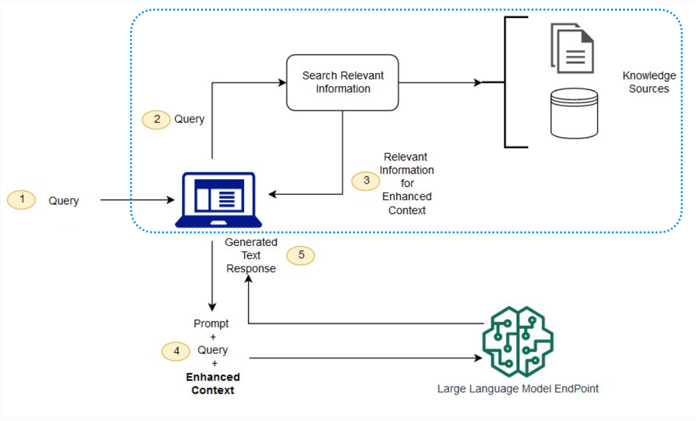
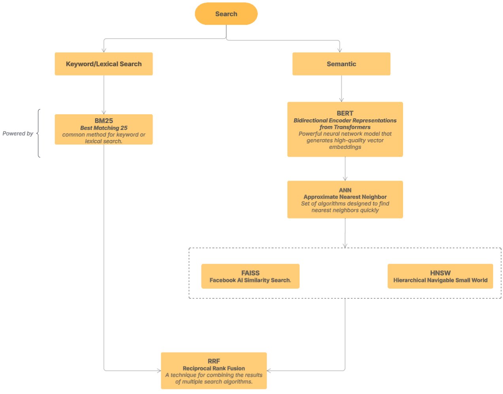

<!-- 
 Copyright Amazon.com, Inc. or its affiliates. All Rights Reserved.
 SPDX-License-Identifier: CC-BY-SA-4.0
 -->

# Retrieval Pipelines

**Content Level: 300**

## Suggested Pre-Reading

- [Generative AI Fundamentals](../../../../1_0_generative_ai_fundamentals/1_1_core_concepts_and_terminology/core_concepts_and_terminology.md)

## TL;DR

RAG systems improve LLM outputs by retrieving relevant information from knowledge bases. Effective retrieval combines vector embeddings BERT (Bidirectional Encoder Representations from Transformers) with keyword methods like BM25 (Best Matching 25) to deliver both semantic understanding and terminology precision.
Key implementation strategies include hybrid search approaches, query optimization techniques, and metadata filtering. Well-designed systems balance search quality with computational efficiency through appropriate sharding and caching.
For most implementations, managed services like Bedrock Knowledge Bases provide sophisticated capabilities while eliminating the significant engineering effort required to build custom retrieval systems from scratch.

## Understanding the Retrieval Challenge

<div style="margin:auto;text-align:center;width:100%;"></div>

_fig: A flowchart showing how retrieval (highlighted) fits between user queries and LLM generation_

Retrieval-Augmented Generation (RAG) systems enhance Large Language Model outputs by incorporating relevant data from external knowledge sources. The effectiveness of these systems hinges on their retrieval component, which should efficiently identify and extract pertinent information from extensive knowledge bases to support generation tasks.
Traditional search implementations using lexical matching—where results depend on exact word correspondences—offer computational efficiency when processing large datasets. However, this approach lacks semantic understanding, failing to capture meaning and context in natural language queries. In contrast, semantic matching excels in natural language scenarios by effectively handling synonyms and paraphrases. This capability allows systems to understand the intended meaning behind queries rather than simply matching keywords.

## Demystify core concepts in modern search

Before we dive deep, let's unpack the relevant concepts related to modern search systems as a whole.

<div style="margin:auto;text-align:center;width:100%;"></div>

_fig: Unpacking core concepts in modern search_

**Keyword Search & Lexical Search:**

- **Keyword Search:** The most basic form of search. It looks for documents that contain the exact words entered by the user.
- **Lexical Search:** A slightly broader term that encompasses keyword search. It focuses on matching the literal words in a query with the words in documents. It may include some basic variations like stemming (reducing words to their root).
  - **BM25 (Best Matching 25):** A classic and highly effective lexical ranking function. It calculates a relevance score based on term frequency (TF) and inverse document frequency (IDF), with adjustments for document length. It is a very common method for keyword or lexical search.

**Semantic Search:**

- Goes beyond literal word matching to understand the _meaning_ and _intent_ behind a query. It aims to find documents that are conceptually related to the search, even if they don't contain the exact keywords.
- **Vector Embeddings:**
  - A core technology enabling semantic search. Words, phrases, or entire documents are represented as vectors (lists of numbers) in a high-dimensional space.
  - The idea is that semantically similar items will have vectors that are close to each other in this space.

<div style="margin:auto;text-align:center;width:100%;"></div>

_fig: A visual representation of word embeddings in a 3D space_

- **BERT (Bidirectional Encoder Representations from Transformers):**
  - A powerful neural network model that generates high-quality vector embeddings. It captures the context of words in a sentence, allowing for a deep understanding of meaning.
  - BERT is a key driver of modern semantic search.

**Efficient Vector Search:**

- Finding the nearest neighbor vectors (i.e., the most semantically similar items) in a large database of embeddings can be computationally expensive. This is where these technologies come in:
- **ANN (Approximate Nearest Neighbor):**
  - A set of algorithms designed to find nearest neighbors quickly, even if they don't guarantee 100% accuracy.
  - Speed is prioritized over absolute precision.
- **FAISS (Facebook AI Similarity Search):**
  - A library developed by Facebook AI that provides efficient implementations of ANN algorithms.
  - It's widely used for large-scale vector search.
- **HNSW (Hierarchical Navigable Small World):**
  - A specific ANN algorithm known for its speed and efficiency. It builds a hierarchical graph structure that allows for fast approximate nearest neighbor searches.

**Result Refinement:**

- **RRF (Reciprocal Rank Fusion):**
  - A technique for combining the results of multiple search algorithms.
  - It assigns higher scores to documents that appear at the top of multiple result lists, improving overall relevance.
  - This is very useful for combining the results of a BM25 search with a BERT based Vector search.

**In summary:**

- **Keyword/Lexical Search (BM25):** Focuses on literal word matching. Fast and reliable for simple queries.
- **Semantic Search (BERT, Vector Embeddings):** Understands meaning and intent. More accurate for complex queries.
- **ANN (FAISS, HNSW):** Enables efficient semantic search by speeding up nearest neighbor calculations.
- **RRF:** Combines results from different search techniques for improved relevance.

## Combining Search Methods for Enhanced Retrieval

While semantic search excels at understanding meaning, traditional keyword-based approaches like BM25 remain valuable for specific use cases. Modern retrieval systems often combine both approaches—using BERT for semantic understanding and BM25 for keyword precision—with specialized tools like FAISS and HNSW to make high-dimensional vector searches computationally feasible.

Advanced retrieval systems leverage multiple search methodologies to maximize effectiveness:

- **Complementary Approaches**: Pairing keyword-based methods (BM25) with semantic search (embeddings) combines precision with understanding
- **Reciprocal Rank Fusion (RRF)**: This algorithm effectively merges ranked results from different retrieval systems without requiring extensive parameter tuning
- **Ensemble Methods**: Dynamic weighting of different retrieval approaches based on query characteristics and document collections
- **Metadata Filtering**: Narrowing the search scope using structured attributes before applying computationally intensive similarity search

## Query Processing Optimization

Beyond the search engines themselves, sophisticated query handling dramatically improves retrieval quality. Consider implementing these powerful techniques:

- **Query Expansion**: Enriching queries with related terms captures more relevant documents. For instance, expand the query "_side effects of drug X_" to include related terms like "_adverse reactions,_" "_complications,_" and specific symptoms.
- **Query Decomposition**: Breaking complex queries into simpler sub-queries improves retrieval accuracy
- **Query Rewriting**: Using Large Language Models to clarify ambiguous requests and generate alternative phrasings. For instance, a user query, "_What's the best treatment for diabetes?_" could be rewritten as "_What are the most effective therapies for diabetes mellitus?_"
- **Structured Queries**: Leveraging metadata and document organization through field-specific search parameters

These techniques create a comprehensive retrieval pipeline that balances computational efficiency with semantic understanding, delivering more relevant results across diverse information needs.

## Post-Retrieval Optimization

Post-retrieval optimization in the context of Retrieval-Augmented Generation (RAG) retrieval essentially boils down to intelligently re-ranking the initial set of retrieved documents before feeding them into the language model.
Think of it as a second pass to refine the results and enable the most relevant and useful information to proceed to the generation stage.
Here's a breakdown of why it's important and some common approaches:

### **Why is Post-Retrieval Optimization (Ranking) Important?**

- **Improved Context Relevance:** Basic retrieval methods (like keyword search or dense vector search) might pull documents that contain the keywords but aren't truly the _most_ relevant or directly answering the user's nuanced query. Ranking helps prioritize documents that are more semantically aligned and contain the core information needed.
- **Noise Reduction:** The initial retrieval might include some irrelevant or redundant documents. Ranking helps filter out this noise, providing the language model with cleaner and more focused context.
- **Enhanced Generation Quality:** By providing the language model with better context, the generated answers are likely to be more accurate, coherent, and directly address the user's question. This leads to a better overall user experience.
- **Handling Ambiguity and Nuance:** User queries can be ambiguous or require understanding subtle relationships between concepts. Ranking models can be trained to better understand this nuance and prioritize documents accordingly.
- **Addressing Limitations of Initial Retrieval:** The initial retrieval method might have limitations (e.g., keyword matching struggles with synonyms). Ranking can leverage more sophisticated techniques to overcome these limitations.

### **Common Approaches to Post-Retrieval Ranking:**

#### **Semantic Similarity Models:**

These models (often transformer-based, like Sentence-BERT or similar architectures) are trained to understand the semantic meaning of text. They encode both the user query and the retrieved documents into dense vector embeddings.

The documents are then re-ranked based on the cosine similarity (or other distance metrics) between their embeddings and the query embedding.

**Benefit:** Captures semantic relationships beyond simple keyword overlap.

**Example:** A query about "Amazon river" might initially retrieve documents mentioning Amazon the company. A semantic ranking model would likely prioritize documents the Amazon river.

#### **Cross-Encoders:**

Unlike bi-encoders (used in semantic similarity), cross-encoders process the query and each document _together_. They typically use transformer architectures that take the concatenated query and document as input and output a relevance score.

**Benefit:** Can model the interaction between the query and the document more effectively, leading to more accurate relevance scoring.

**Drawback:** More computationally expensive than bi-encoders, as each query-document pair needs to be processed.

#### **Hybrid Approaches:**

Combine multiple ranking techniques. For example, you might first use a fast semantic similarity model to narrow down the initial set of documents and then apply a more computationally expensive cross-encoder for the final ranking.

Amazon Bedrock provides [access to re-ranker models](https://docs.aws.amazon.com/bedrock/latest/userguide/rerank.html){:target="_blank" rel="noopener noreferrer"} that you can use when querying to improve the relevance of the retrieved results.

## Making it Practical

Transitioning retrieval-augmented generation implementations from proof-of-concept to enterprise-grade solutions requires careful orchestration of multiple components.
Follow these guidelines for successful production deployment:

### System Design Considerations

Practical implementation requires attention to:

- Index sharding for handling large document collections
- Caching frequently accessed documents and query results
- Balancing retrieval quality against response time
- Implementing fallback strategies when primary retrieval methods fail

### Retrieval Architecture Considerations

Effective RAG systems require thoughtful integration of vector and keyword search capabilities. For production environments, consider implementing hybrid retrieval that combines the strengths of both approaches

### Leveraging Bedrock Knowledge Bases

While custom RAG implementations are possible, Bedrock Knowledge Bases provide significant advantages:

- Built-in metadata filtering capabilities save substantial development time
- Pre-configured query decomposition handles complex information needs
- Flexible chunking strategies can be adjusted without re-indexing content
- Seamless switching between semantic and hybrid search modes

Consider the engineering effort required for custom implementations against the rapid deployment possible with managed services.

### Optimizing Retrieval Performance

To maximize retrieval effectiveness:

- Create comprehensive evaluation datasets that represent your actual use cases
- Establish performance baselines before making system modifications
- Implement detailed instrumentation to track key metrics (precision, recall, latency)
- Test different retrieval configurations against your evaluation set to identify optimal settings

### API Choices within Bedrock Knowledge Bases

Consider these implementation patterns for different scenarios:

- Use [`Retrieve`](https://docs.aws.amazon.com/bedrock/latest/APIReference/API_agent-runtime_Retrieve.html#:~:text=Common%20Errors-,Retrieve,-PDF){:target="_blank" rel="noopener noreferrer"} operations instead of [`RetrieveAndGenerate`](https://docs.aws.amazon.com/bedrock/latest/APIReference/API_agent-runtime_RetrieveAndGenerate.html#:~:text=Common%20Errors-,RetrieveAndGenerate,-PDF){:target="_blank" rel="noopener noreferrer"} when you need to enhance raw results with additional context or formatting
- For complex applications with multi-stage workflows, adopt a staged approach where retrieval results are processed and cached before subsequent operations, optimizing performance and enabling sophisticated content transformations

### Query Enhancement Techniques

Review the techniques provided alongside their sample implementation below

#### Query decomposition example

A good example of query decomposition is breaking down a complex question like:

**Original query:**

```
"What were the economic and social impacts of the Industrial Revolution in England and how did they compare to those in France?"
```

**Decomposed into:**

```
1. "What were the economic impacts of the Industrial Revolution in England?"
2. "What were the social impacts of the Industrial Revolution in England?"
3. "What were the economic impacts of the Industrial Revolution in France?"
4. "What were the social impacts of the Industrial Revolution in France?"
5. "How did the economic impacts of the Industrial Revolution compare between England and France?"
6. "How did the social impacts of the Industrial Revolution compare between England and France?"
```

**Benefits of this decomposition:**

- Each sub-query focuses on a specific aspect, improving retrieval precision
- Allows for targeted information gathering on distinct components
- Enables more comprehensive answers by ensuring no part of the query is overlooked
- Facilitates comparing and contrasting specific elements between countries
- Helps manage the complexity of multi-faceted historical questions

This approach is particularly effective for complex, multi-dimensional queries that span different categories, time periods, or geographical regions.

#### Query expansion example

**Purpose:** To bridge the lexical gap between user queries and relevant content by expanding search terms to include semantically related words.

**Example Use Case:** When a user asks "Who are ABC Corporation's competitors?", traditional exact-match retrieval might miss documents containing synonymous terms like "rivals," "challengers," "competition," or "opponents." This prompt helps identify and incorporate these semantically equivalent terms to improve retrieval comprehensiveness.

```

Human: imagine you are a financial analyst looking to answer the question {query}
in 10k/10q documents.

What are some of the keywords you would use for searching the documents based on
the question?
<instruction>
1. Do not include company names, document names and timelines
2. Generate 5-6 important list of comma separated keywords within a single
<keywords></keywords> tag.
3. Focus more on what sections of the document you would look at and add that
to the keyword
4. Do not add keywords that are not part of the question
</instruction>


Assistant:
```

**Input:**

```
Who are ABC Corporation’s competitors?
```

**Output:**

```
Let me help you find relevant keywords to identify competitors in financial documents.
<keywords>
competitors, competition, competitive landscape, risk factors, business segment competition, industry competition, competitive position, competitive environment, business overview competitors, business description rivals
</keywords>
The keywords focus on sections and terminologies commonly used in 10K/10Q documents to discuss competition. The "Risk Factors" and "Business" sections typically contain detailed information about competitors and competitive landscape. I've avoided using specific company names as instructed and focused on generic terms that would help locate information about competitors in financial documents.
```

#### Query rewriting to better match document terminology

This prompt generates list of companies, technical keywords (added as a redundant step to make LLM reasoning better) and a rephrased question with expanded the user question further based on the keywords.
This prompt also expands any abbreviations mentioned in the user’s question.

```
\n\nHuman:
You a financial editor that looks at a user questions and rephrases it accurately
for better search and retrieval tasks.

Financial question related to yearly and Quarterly financial Reports: {query} \n
<task>
Given a user question, identify the following metadata
   - 'technical_keywords': a list of relevant keywords from question
   - 'company_keywords': a list of company names
   - 'rephrased_question': the full rephrased question string
</task>

<time_keywords>
{time_kwds}
</time_keywords>

<technical_keywords>
1. Generate a comprehensive list of all possible keywordsthat are relevant
based on sections you would typically find in a financial document.
2. Include different alternatives to the keywords, be imaginative.
3. Remove the company name and document name from keyword list.
</technical_keywords>

<company_keywords>
Generate a list of company names that are mentioned in the question.
</company_keywords>

<rephrased_question>
1. Generate the keywords and rephrase the question to make it very clear
2. Expand any acronyms and abbreviations in the original question by providing
the full term. Include both the original abbreviated version and the expanded
version in the rephrased question.
</rephrased_question>

Return a JSON object with the following fields:
   - 'technical_keywords': a list of relevant keywords from question
   - 'company_keywords': a list of company names
   - 'rephrased_question': the full rephrased question string


\n\nAssistant:The metadata for the user question {query}:
```

**Input:**

```
Who are ABC Corporation’s competitors?
```

**Output:**

```
{
    "technical_keywords": [
        "competitors",
        "industry rivals",
        "peer companies",
        "industry players",
        "competition analysis",
        "competitive landscape",
        "competitive position",
        "industry analysis",
        "competitive intelligence",
        "competition",
        "competing firms",
        "business rivals",
        "competitive environment"
    ],
    "company_keywords": [
        "ABC Corporation"
    ],
    "rephrased_question": "What companies are the main competitors and industry rivals of ABC Corporation Corporation in their core business segments including cloud computing, software, hardware, and gaming?"
}
```

#### Metadata filtering to narrow the search space

This prompt aims to enhance user queries by incorporating explicit time period information, thereby narrowing the search parameters and improving result relevance.

```
\n\nHuman:
You are a financial editor that looks at a user questions and rephrases it accurately
for better search and retrieval tasks.

Financial question related to yearly and Quarterly financial Reports: {query} \n
Current year is {most_recent_year}
Current quarter is {most_recent_quarter}
<task>
Given a user question, identify the following metadata a list of time-related
keywords based on instruction below
1. time_keyword_type: identifies what type of time range user is requesting
for - range of years, range of quarters, specific years or specific quarters, none
2. time_keywords: these keywords expand the year or quarter period if
time_keyword_type is "range of periods" else it will be formatted version of
year in YYYY format or quarter in Q'YY format.
</task>

<instruction>
1. Identify whether the user is asking for a date range or specific set of years
or quarters. If there is no year or quarter mention leave time_keyword blank
2. If the user is requesting for specific year or years return year in YYYY format.
3. If the user is requesting for specific quarter or quarters return quarter in
Q'YY format. Example Q2'24, Q1'23
4. If the user is requesting for documents in a specific range of time between
two period, fill the year or quarter information between the time ranges.
5. If the user is requesting for last N years, count backward from current year
2024
6. If the user is requesting for last N quarters, count backward from current
quarter and year Q1 2024
<instruction>

<examples>
what was ABC Ltd's net profit?
time_keyword_type: none
time_keywords: none
explanation: no quarter or year mentioned

What was Amazon's total sales in 2022?
time_keyword_type: specific_year
time_keywords: 2022

What was XYZ Corporation's revenue in 2019 compared to 2018?
time_keyword_type: specific_year
time_keywords: 2018, 2019
explanation: the user is requesting to compare 2 different years

Which of Large Company's business segments had the highest growth in sales in Q4 F2023?
time_keyword_type: specific_quarter
time_keywords: Q4 2023

How did Science Corporation's quarterly spending on research change as a percentage of
quarterly revenue change between Q2 2019 and Q4 2019?
time_keyword_type: range_quarter
time_keywords: Q2 2019, Q3 2019, Q4 2019
explanation: the quarters between Q2 2019 and Q4 2019 are Q2 2019, Q3 2019
and Q4 2019

What was XYZ Startup's growth in the last 5 quarters?
time_keyword_type: range_quarter
time_keywords: Q4 2023, Q3 2023, Q2 2023, Q1 2023, Q4 2024
explanation: Since current quarter is Q1 2024, the last 3 quarters are Q4 2023,
Q3 2023, Q2 2023

In their 10-K filings, has XYZ Corporation mentioned any negative environmental
or weather-related impacts to their business in the last four years?
time_keyword_type: range_year
time_keywords: 2020, 2021, 2022, 2023
explanation: Since the current year is 2024, the last four years are 2020, 2021,
2022 and 2023.
</examples>


Return a JSON object with the following fields:
   - 'time_keyword_type': a list of time-related keywords
   - 'time_keywords': a list of technical keywords
   - 'explanation': explanation of you chose a certain time_keyword type and
   time keyword

\n\nAssistant:The metadata for the user question {query}:
```

Example Usage

```
Example 1: No Time Reference
Query: "What was ABC Ltd's net profit?"
Output: {
  "time_keyword_type": "none",
  "time_keywords": "none",
  "explanation": "No quarter or year mentioned in the query."
}

Example 2: Specific Year
Query: "What was Amazon's total sales in 2022?"
Output: {
  "time_keyword_type": "specific_year",
  "time_keywords": "2022",
  "explanation": "Query specifically mentions the year 2022."
}

Example 3: Range of Quarters
Query: "How did Science Corporation's quarterly spending on research change between Q2 2019 and Q4 2019?"
Output: {
  "time_keyword_type": "range_quarter",
  "time_keywords": "Q2 2019, Q3 2019, Q4 2019",
  "explanation": "Query requests information across multiple consecutive quarters."
}
```

#### Hybrid Search Configurations: Balancing Semantic Understanding with Keyword Precision

Amazon Bedrock Knowledge Bases offers intuitive one-click setup options to transition between SEMANTIC and HYBRID search modes, enabling rapid experimentation and performance optimization.

The HYBRID approach combines the contextual understanding of semantic search with the precision of traditional keyword matching, delivering more comprehensive results across diverse query types.
This dual methodology promotes both conceptual relevance and exact term matching.

When implementing search configurations:

- Consider your specific use case requirements
- Evaluate your content characteristics and structure
- Define clear performance metrics and objectives
- Test different configurations with representative queries

The optimal search configuration will vary based on your unique information retrieval needs, document corpus, and user expectations.

## Get Hands-On

- [RAG workshop using Amazon Bedrock Knowledge Bases](https://studio.us-east-1.prod.workshops.aws/workshops/public/c6b88897-84a7-4885-b9f0-855e2fc61378){:target="_blank" rel="noopener noreferrer"}
- [Build RAG with Amazon OpenSearch Services](https://studio.us-east-1.prod.workshops.aws/workshops/public/48f303fe-bc6d-4183-858d-e4938f32136f){:target="_blank" rel="noopener noreferrer"}

## Further Reading

- [Optimizing Vector Search with Metadata Filtering and Fuzzy Filtering](https://medium.com/kx-systems/optimizing-vector-search-with-metadata-filtering-41276e1a7370){:target="_blank" rel="noopener noreferrer"}
- [Video: Metadata Filtering for Vector Search](https://www.youtube.com/watch?v=H_kJDHvu-v8){:target="_blank" rel="noopener noreferrer"}
- [Bedrock: Customize queries and response generation](https://docs.aws.amazon.com/bedrock/latest/userguide/kb-test-config.html){:target="_blank" rel="noopener noreferrer"}

## Contributors

**Author:** 

- Manoj Ramani - Sr Applied AI Architect, GenAI 

**Reviewers:**

- Hari Prasanna Das, Applied Scientist 

- Meghana Ashok, Machine Learning Engineer 
