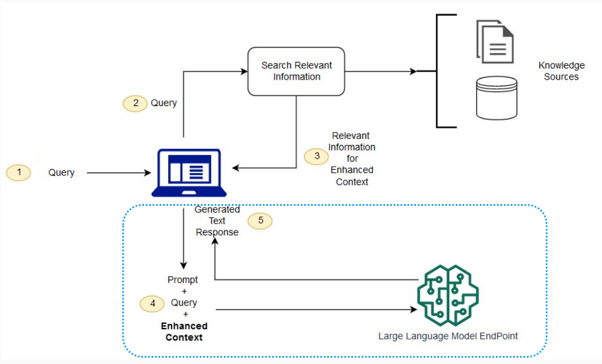

<!-- 
 Copyright Amazon.com, Inc. or its affiliates. All Rights Reserved.
 SPDX-License-Identifier: CC-BY-SA-4.0
 -->

# Generation Pipelines

**Content Level: 300**

## Suggested Pre-Reading

- [Generative AI Fundamentals](../../../../1_0_generative_ai_fundamentals/1_1_core_concepts_and_terminology/core_concepts_and_terminology.md)

## TL;DR

Generation transforms retrieved information into coherent responses. Key challenges include balancing context window usage, preventing hallucinations, and maintaining coherence across disparate sources. Effective implementation requires strategic context management, structured prompting with reasoning instructions, and robust fact-checking mechanisms. While retrieval receives significant attention, sophisticated generation techniques ultimately determine response quality and trustworthiness

## Generation: The Critical Final Step in RAG Systems

The Generation component of RAG architectures represents the culmination point where retrieved information transforms into coherent, accurate responses.
While retrieval quality is important, suboptimal generation will undermine even perfect retrieval results.

<div style="margin:auto;text-align:center;width:100%;"></div>

_fig: Generation elements highlighted on a RAG flow_

## Core Generation Challenges

**Context Window Optimization:** Modern LLMs have finite context windows that need to accommodate both the query and retrieved documents. This creates tension between:

- Including sufficient context for accurate responses
- Avoiding context dilution with irrelevant information
- Managing computational costs of processing large contexts

**Hallucination Mitigation:** Even with relevant retrieval, LLMs can generate content unsupported by the provided context. Effective generation should constrain the model to the retrieved information.

**Coherence Under Constraints:** The LLM should synthesize potentially disparate retrieved passages into a unified, logical response while maintaining factual accuracy.

## **Optimizing Generation for Contextual Accuracy and Relevance**

### **Context Window Management**

Modern LLMs have limitations on the length of the input context they can process.
However, RAG systems often need to provide LLMs with large amounts of retrieved information to answer complex queries.
Techniques for handling long contexts are important for effective RAG which include:

**Windowing:** Dividing the retrieved information into smaller chunks and processing them in a sliding window fashion.

**Summarization:** Using another LLM or a summarization algorithm to condense the retrieved information into a shorter, more manageable context.

**Hierarchical Retrieval:** Retrieving information in multiple stages, starting with broader documents and then narrowing down to more specific passages.

**Iterative Retrieval:** This approach tackles the limitations of LLMs, such as outdated knowledge and hallucinations, by using a model's response to retrieve more relevant knowledge. Additional details in the paper ([ITER-RETGEN](https://arxiv.org/abs/2305.15294){:target="_blank" rel="noopener noreferrer"}).

The size of the context window directly impacts generation quality.
A larger window allows the LLM to consider more information but increases computational cost and the risk of diluting relevant information with noise.
Finding the optimal balance is important.

### **Prompt Engineering for Generation Control**

The way retrieved information is presented to the LLM through the prompt significantly influences the quality of the generated output. Effective prompt engineering is key to maximizing the benefits of RAG. Advanced prompting strategies include

**Chain-of-thought prompting:** Guiding the LLM to reason step-by-step using the retrieved information, leading to more accurate and coherent answers.

**Structured prompting:** Organizing the retrieved information in a structured format (e.g., lists, tables) to improve the LLM's understanding.

**Explicit Reasoning Instructions**: Direct the model to analyze retrieved information systematically:

```
  1. Analyze each retrieved passage for relevance to the query
  2. Identify key facts that address the question
  3. Synthesize information across passages to resolve contradictions
  4. Generate a comprehensive response citing specific sources

```

Prompts should be tailored to the specific generation task, whether it's summarization, question answering, or text generation.

**Source Attribution Requirements**: Force explicit citation of retrieved sources to reduce hallucination risk

### **Post-Processing and Guardrails Evaluation**

Even with advanced retrieval and prompting techniques, the generated output from LLMs can sometimes contain inaccuracies or inconsistencies.
Post-processing and evaluation are important contributors to the quality and reliability of RAG systems.
Techniques include:

**Fact-checking:** Verifying the generated information against the retrieved documents or other trusted sources.

**Consistency checks:** Ensuring that the generated output is internally consistent and doesn't contradict itself.

**Response Rejection Mechanisms**: Establish thresholds for grounding scores below which responses are rejected or flagged

Evaluation metrics specifically designed for RAG systems are needed to assess their performance. These metrics go beyond standard LLM evaluation metrics and consider the relevance and faithfulness of the generated output to the retrieved context. See additional guidance on _Introduction to Generative AI Evaluations_

## Making it Practical

Key technical considerations when implementing the generation component of RAG systems

### Prompt Versioning: Implementing CI/CD for RAG Generation

Treat prompts as first-class software artifacts by implementing a robust continuous integration and continuous deployment (CI/CD) pipeline for prompt management:

#### Version Control Integration

- Store prompts in version-controlled repositories alongside application code
- Implement semantic versioning for prompt iterations
- Maintain comprehensive change logs documenting prompt modifications and their impact

#### Parameterized Prompt Architecture

- Decompose prompts into modular components:

```
  base_template = """
  You are an assistant tasked with {task_description}.
  Answer based on the following context: {context}

  {few_shot_examples}

  Question: {query}
  """
```

- Externalize dynamic elements as configuration parameters
- Implement environment-specific prompt variants (dev/staging/production)

### Dynamic Few-Shot Example Injection

- Store few-shot examples in structured databases or vector stores
- Select contextually relevant examples at runtime based on:

```
  def select_examples(query, example_store, n=3):

      relevant_examples = example_store.semantic_search(query)

      return format_examples(relevant_examples[:n])

```

- Implement A/B testing for different few-shot selection strategies
- Rotate examples to prevent overfitting to specific patterns

### **Multi-Model Pipelines**

Leverage specialized models for different generation subtasks:

  - Passage relevance ranking
  - Information synthesis
  - Response generation
  - Self-verification

### Cross-Session Context Persistence in Generation Systems

Implement a context management architecture that preserves conversational continuity across fragmented user interactions.
This enables users to seamlessly resume complex dialogues—such as product discovery workflows—across different devices and time periods without losing critical context or repeating information.

Employ strategic summarization techniques that distill important conversation elements into compact, retrievable representations.
When users return to continue their journey, the system reconstructs relevant context and seamlessly reintegrates it into the conversation flow, creating the experience of an uninterrupted dialogue despite technical session boundaries.

This capability is particularly valuable for extended user journeys like e-commerce interactions, where customers may research products across multiple sessions on different devices before making purchasing decisions.

### Production Deployment Best Practices

- **Guardrail Integration**: Use [contextual grounding check](https://docs.aws.amazon.com/bedrock/latest/userguide/guardrails-contextual-grounding-check.html#:~:text=Use%20contextual%20grounding%20check%20to%20filter%20hallucinations%20in%20responses){:target="_blank" rel="noopener noreferrer"} to filter hallucinations in responses
- **A/B Testing Framework**: Systematically compare generation approaches against established evaluation metrics
- **Observability**: Monitor grounding scores, hallucination rates, and response latency in production
- **Feedback Loops**: Capture user feedback on response quality to continuously refine generation parameters

The generation component represents the culmination of your RAG system's capabilities. While retrieval receives significant attention, sophisticated generation techniques often determine whether users receive accurate, coherent, and trustworthy responses.

## Get Hands-On

- [Workshop: Operationalize Generative AI Applications using LLMOps](https://catalog.us-east-1.prod.workshops.aws/workshops/90992473-01e8-42d6-834f-9baf866a9057/en-US){:target="_blank" rel="noopener noreferrer"}
- [Reducing hallucinations in large language models with custom intervention using Amazon Bedrock Agents](https://aws.amazon.com/blogs/machine-learning/reducing-hallucinations-in-large-language-models-with-custom-intervention-using-amazon-bedrock-agents/){:target="_blank" rel="noopener noreferrer"}

## Further Reading

- [Use contextual grounding check to filter hallucinations in responses](https://docs.aws.amazon.com/bedrock/latest/userguide/guardrails-contextual-grounding-check.html){:target="_blank" rel="noopener noreferrer"}
- [Continuous Evaluation of Generative AI Using CI/CD Pipelines](https://www.willowtreeapps.com/craft/continuous-evaluation-of-generative-ai-using-ci-cd-pipelines){:target="_blank" rel="noopener noreferrer"}
- [Operationalize generative AI applications on AWS: Part I – Overview of LLMOps solution](https://aws.amazon.com/blogs/gametech/operationalize-generative-ai-applications-on-aws-part-i-overview-of-llmops-solution/){:target="_blank" rel="noopener noreferrer"}

## Contributors

**Author:** 

- Manoj Ramani - Sr Applied AI Architect, GenAI 

**Reviewers:**

- Meghana Ashok, Machine Learning Engineer 

- Rahul Ghosh, Applied Scientist 
