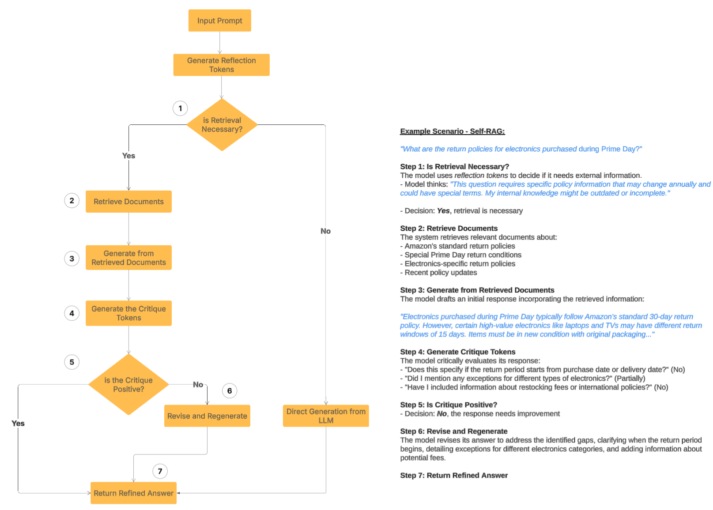
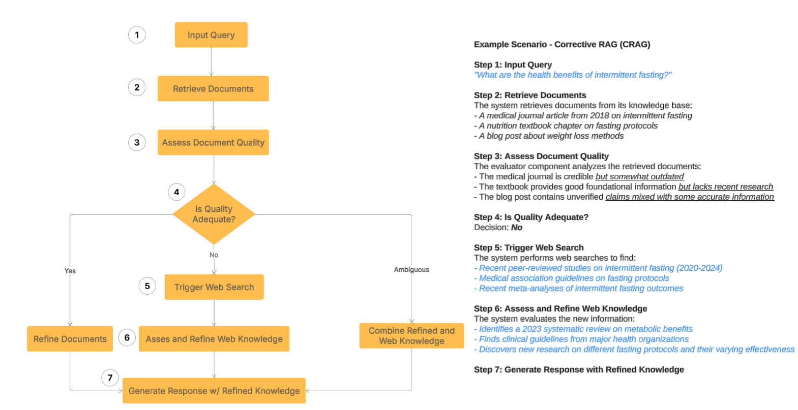
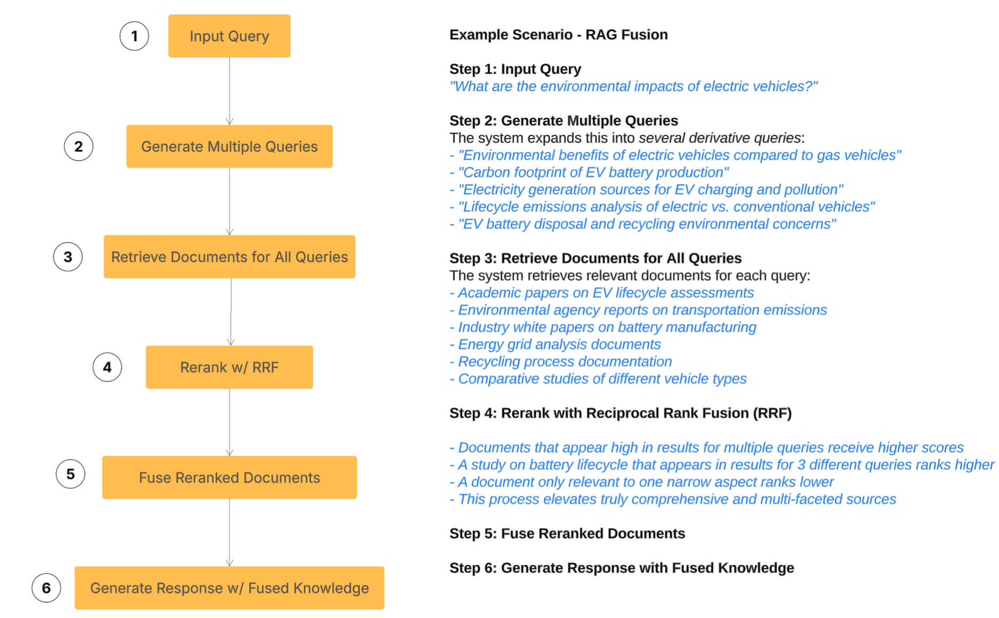
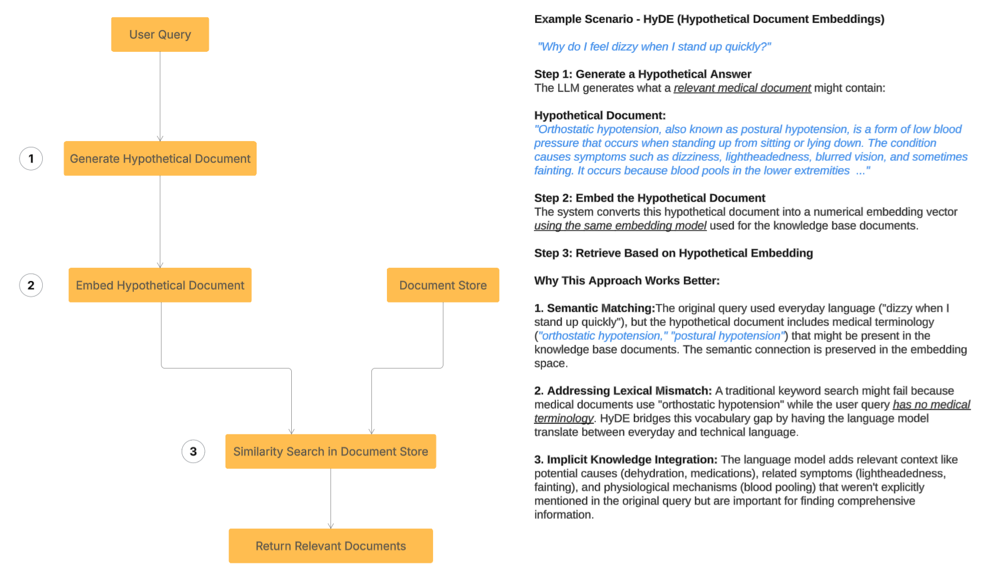

<!-- 
 Copyright Amazon.com, Inc. or its affiliates. All Rights Reserved.
 SPDX-License-Identifier: CC-BY-SA-4.0
 -->

# Advanced RAG Patterns

**Content Level: 300**

## Suggested Pre-Reading

- [Generative AI Fundamentals](../../../../1_0_generative_ai_fundamentals/1_1_core_concepts_and_terminology/core_concepts_and_terminology.md)

## TL;DR

Retrieval Augmented Generation (RAG) has evolved beyond simple document lookup to enhance AI performance. Advanced RAG techniques include:

- **Multimodal RAG**: Combines text, images, audio, and other data types in a shared space for more comprehensive retrieval
- **Agentic RAG**: Uses autonomous agents that actively search and refine queries across multiple sources
- **Graph RAG**: Represents relationships between information as connected nodes for context-aware searches
- **Multi-vector Retrieval**: Creates multiple representations of documents to capture different aspects of content
- **Domain-Specific RAG Optimization:** a combination of approaches that enable you to generate expert-level domain-specific content with high accuracy and relevance
- **Self-Reflective RAG**: Incorporates self-assessment capabilities to determine when more information is needed
- **Corrective RAG**: Improves accuracy through iterative query refinement and feedback loops
- **RAG Fusion**: Generates multiple related queries and combines results for more comprehensive answers

These advanced techniques significantly improve the accuracy, relevance, and comprehensiveness of AI responses across various applications.

## Advanced RAG Topics

Retrieval Augmented Generation (RAG) has rapidly evolved from a straightforward document lookup to a sophisticated framework for enhancing large language model (LLM) performance. While basic RAG pipelines offer a valuable starting point, achieving optimal results in complex applications necessitates exploring advanced retrieval strategies. This article delves into several such patterns seeking to push the boundaries of RAG.

### Multimodal RAG

#### Understanding Multimodal RAG

Traditional Retrieval-Augmented Generation (RAG) systems primarily operate on text data, retrieving relevant documents to enhance Large Language Model (LLM) outputs. However, real-world information exists in multiple formats. Multimodal RAG expands this capability by incorporating diverse data types—images, audio, video, and structured data—into a unified retrieval framework.

#### Core Technical Architecture

Multimodal RAG works by creating a shared semantic space where different data types can be compared:

**Unified Embedding Framework**

- Creates vector representations of different data modalities in a common mathematical space
- Enables cross-modal similarity comparisons (e.g., finding images that match text descriptions)
- Requires specialized encoders trained to align different modalities meaningfully

**Specialized Encoders for Different Modalities**

- **Image Processing**: Models like CLIP (Contrastive Language-Image Pre-training) convert images into vectors that capture semantic content
- **Audio Processing**: Speech-to-embedding models extract meaningful representations from voice recordings, podcasts, or music
- **Video Understanding**: Frame-by-frame analysis combined with temporal modeling to capture dynamic content
- **Structured Data**: Specialized encoders for tables, databases, and other structured information

**Cross-Modal Retrieval Mechanisms**

- Similarity search algorithms adapted for multimodal contexts
- Hybrid retrieval approaches that can weight different modalities based on query context
- Advanced ranking systems that consider relevance across different data types

#### Implementation Approaches

Several technical strategies enable effective multimodal RAG:

**Joint Embedding Spaces**

- Training models to map different modalities into the same vector space
- Enabling direct comparison between, for example, a text query and image content

**Graph-Based Knowledge Representation**

- Using graph databases to represent relationships between entities across modalities
- Creating connections between related content (e.g., linking medical terms to relevant images)
- Enabling traversal-based retrieval that can follow conceptual paths across modalities

**Multimodal Fusion Techniques**

- Early fusion: Combining different modalities before encoding
- Late fusion: Retrieving from each modality separately and then combining results
- Hybrid approaches that balance modality-specific and cross-modal information

#### Real-World Applications

Multimodal RAG enables sophisticated applications across industries:

**Healthcare**

- Retrieving patient records alongside medical imaging (X-rays, MRIs)
- Incorporating time-series data like ECGs and vital signs
- Enabling comprehensive case analysis that considers all available patient data

**E-commerce**

- Processing visual product searches alongside text descriptions
- Retrieving relevant product images based on customer queries
- Incorporating product demonstration videos into search results

**Educational Systems**

- Retrieving relevant diagrams, videos, and text explanations for student queries
- Providing multi-format learning materials based on conceptual understanding
- Supporting different learning styles through diverse content formats

#### Technical Challenges and Solutions

**Alignment Issues**

- Challenge: Ensuring different modalities map to semantically equivalent positions
- Solution: Contrastive learning approaches that explicitly train for cross-modal alignment

**Computational Efficiency**

- Challenge: Processing multiple modalities increases computational demands
- Solution: Efficient indexing strategies and model distillation techniques

**Evaluation Complexity**

- Challenge: Assessing relevance across different modalities
- Solution: Developing multimodal evaluation metrics and human-in-the-loop feedback systems

By expanding RAG beyond text-only retrieval, multimodal approaches create AI systems that can access and reason with the full spectrum of information formats that exist in the real world, leading to more comprehensive and contextually appropriate responses.

### Agentic RAG

Agentic RAG introduces autonomous agents to the retrieval process, enabling dynamic and iterative information gathering.

**Concept:** Agents leverage tools and APIs to explore external knowledge sources, refine queries based on intermediate results, and adapt the retrieval strategy based on the context.

**Techniques:**

- Integrate tools for web search, database querying, and API access.
- Implement planning and reasoning modules to guide the agent's actions.
- Utilize memory mechanisms to track the agent's interaction history.

**Benefits:** Improved retrieval accuracy and coverage, especially for complex and evolving information needs.

**Example:**

- A financial RAG agent could dynamically search news articles, company reports, and industry data to provide real-time investment insights.

### Graph-based Retrieval

Graph databases offer a powerful way to represent relationships between entities and concepts, enabling more nuanced and context-aware retrieval.

**Concept:** Representing data as nodes and edges, allowing for traversal and analysis of complex relationships.

**Techniques:**

- Utilize graph embedding techniques to encode nodes and edges into a vector space.
- Perform graph traversals and pattern matching to identify relevant information.
- Use knowledge graphs to understand the semantic relationships between text.

**Benefits:** Enhanced retrieval of interconnected information, leading to more comprehensive and insightful LLM responses.

**Example:**

1. A scientific RAG system could utilize a knowledge graph of biological pathways to retrieve relevant research papers and experimental data.
2. Imagine a RAG system for a medical knowledge base. The knowledge base contains information about diseases, symptoms, treatments, and the relationships between them. A graph can represent "Disease A" is related to "Symptom B" and treated with "Drug C." When a user queries "What are the symptoms and treatments for Disease A?", graph traversal algorithms can efficiently navigate the graph to find the relevant information

Graph databases like Amazon Neptune or Neo4j are used to store and query knowledge graphs. Graph traversal algorithms like Dijkstra's algorithm, Breadth-First Search (BFS), or personalized PageRank can be employed to find relevant nodes and relationships based on the user's query.

### Multi-vector Retrieval

Traditional vector search represents an entire document with a single vector embedding. However, documents often contain information about multiple distinct aspects. Multi-vector retrieval addresses this by creating multiple vector representations for a single document, each capturing a different facet of its content.

**Techniques:**

- Use different embedding models for each vector representation.
- Implement hybrid retrieval strategies that combine multiple vector similarity scores.
- Chunking documents in a way that creates vectors that represent different aspects of the document.

**Benefits:** Improved retrieval robustness and accuracy, especially for documents with diverse content.

**Example:**

1. A legal RAG system could generate separate vectors for case summaries, legal arguments, and relevant precedents.
2. Consider a product description for a laptop. It might contain information about its technical specifications (CPU, RAM, storage), customer reviews, and marketing language. Instead of creating a single vector for the entire description, we can create separate vectors for each of these aspects. This allows for more precise retrieval when a user query focuses on a specific aspect.

### Domain-Specific RAG Optimization:

When building AI systems that use Retrieval-Augmented Generation (RAG), we need to recognize that different industries have unique language, concepts, and information structures. A one-size-fits-all approach simply doesn't work well. By customizing several key components, we can create AI systems that truly understand specialized fields like healthcare, law, or finance. Key customization areas include (but not limited to)

#### Domain-Specific Embeddings:

Creating numerical representations of text that capture the unique semantic relationships and terminology within a specific field. Instead of using general-purpose word or sentence embeddings trained on broad datasets, domain-specific embeddings are trained on a corpus of text relevant to your specific domain (e.g., medical literature, legal documents, financial reports, software code). This allows the embeddings to better understand the nuances and relationships between terms that are specific to that field. For example, the term "adverse event" will be more closely related to "side effect" in medical embeddings than it would be in general-purpose embeddings.

**Example (Biomedical):** Training an embedding model on a large corpus of PubMed abstracts and medical journal articles. This would result in embeddings where terms like "myocardial infarction" and "heart attack" are very close in vector space, and concepts related to drug interactions or disease pathways are also tightly clustered. When a user asks a question about a specific gene, the retrieval system using these embeddings will be more likely to find relevant research papers discussing that gene and related biological processes.

#### Domain-Specific Data Preprocessing & Chunking:

Tailoring how you clean and divide your domain data.

**Example (Legal):** Removing case citations during cleaning but preserving them as metadata. Chunking legal documents by sections (e.g., "Background," "Arguments," "Decision") instead of fixed-length paragraphs.

#### Domain-Aware Retrieval Mechanisms:

Smarter ways to find relevant information.

**Example (E-commerce):** Using hybrid search to find products both by semantic similarity (based on descriptions) and by specific keywords like "size 10 red dress." Filtering search results by "in stock" status (metadata) or boosting results with high customer ratings.

#### Prompt Engineering Tailored to the Domain:

Crafting instructions and examples specific to the field.

**Example (Medical):** Prompting the LLM with "Based on the following patient history, what are the possible diagnoses? Please provide a confidence score for each." Providing a few example patient history-diagnosis pairs to guide the model.

#### Domain-Specific Post-processing & Generation Control:

Refining the LLM's output for accuracy and format.

**Example (Software Development):** Ensuring generated code snippets adhere to specific coding style guidelines. Implementing a step to cross-reference generated explanations with the retrieved code documentation to verify accuracy.

#### Evaluation Metrics Relevant to the Domain:

Measuring performance in a domain-specific way.

**Example (Financial Analysis):** Instead of just checking for grammatical correctness, evaluating if the generated financial summary accurately reflects key performance indicators and complies with reporting standards. Having a financial analyst review the generated reports.

### Self Reflective RAG [Self-RAG]

Uses fine-tuned models with reflection and critique tokens for adaptive information retrieval and self-critique.

The [SELF-RAG paper](https://arxiv.org/abs/2310.11511){:target="_blank" rel="noopener noreferrer"} describes fine-tuned model that incorporates mechanisms for adaptive information retrieval and self critique. That is, the model can dynamically determine when external information is needed, and can critically evaluate its generated responses for relevance and factual accuracy.

_fig: Logical flow, Self-RAG with a fictitious example_

At the core of this process are new elements like reflection and critique tokens. Reflection tokens enable the model to make informed decisions about whether to retrieve additional information, ensuring that such actions are taken only when they add value to the response. Critique tokens, on the other hand, allow the model to assess the quality of its responses and the relevance of any retrieved information, promoting a higher standard of accuracy and relevance in generated content.

### Corrective RAG [CRAG]

This pattern focuses on improving retrieval accuracy by iteratively refining queries based on LLM feedback. It uses a self-correcting loop to improve the results of the retrieval step.

_fig: Logical flow, Corrective-RAG with a fictitious example_ 

The [Corrective RAG (CRAG) paper](https://arxiv.org/abs/2401.15884){:target="_blank" rel="noopener noreferrer"} introduces a method that improves the accuracy of language models by intelligently re-incorporating information from retrieved documents. It uses an evaluator to assess the quality of documents obtained for a query. Then, it decides whether to use, ignore, or request more data from these documents. CRAG goes one step further by using web searches to extend its information beyond static databases, ensuring access to a wider, up-to-date range of information.

### RAG Fusion

This pattern combines RAG and Reciprocal Rank Fusion (RRF) by generating multiple queries, reranking with reciprocal scores, and fusing documents and scores for more accurate and comprehensive answers.

It begins by generating multiple derivative queries using a large language model. This step broadens the understanding of the initial user input, ensuring a thorough exploration of the query subject from various perspectives. Next, a vector search identifies relevant documents for both the original and derivative queries, compiling a diverse range of related information.
After document retrieval, the Reciprocal Rank Fusion (RRF) algorithm re-ranks the documents based on their relevance. These documents are then combined to form a comprehensive and relevant information source.

_fig: Logical flow, RAG Fusion with a fictitious example_

In the final stage, this combined dataset and all queries are processed by a large language model. The model synthesizes this input to create a well-articulated and contextually relevant response. Through this systematic approach, RAG-Fusion enhances the accuracy and comprehensiveness of responses, significantly improving the quality of answers to user queries.

### **HyDE (Hypothetical Document Embeddings)**

#### **Query Expansion and Enrichment: The Goal**

The fundamental goal of query expansion and enrichment is to bridge the gap between the user's potentially short or ambiguous query and the more detailed and nuanced information contained within your knowledge base. By making the query more expressive, you aim to retrieve more relevant documents.

#### **HyDE (Hypothetical Document Embeddings): The Technique**

HyDE takes a different approach compared to traditional query expansion methods that rely on thesauruses or co-occurrence statistics. Instead of adding more terms to the original query, HyDE uses a language model to generate a hypothetical document that _could_ be relevant to the user's query.

Here's how it generally works:

1. **Generate a Hypothetical Answer:** The user's query is fed to a (usually smaller and faster) language model. This model is prompted to generate a short, plausible answer or a summary of what a relevant document might contain.
2. **Embed the Hypothetical Document:** The generated hypothetical document is then encoded into an embedding vector using the same embedding model used for your knowledge base documents.
3. **Retrieve Based on Hypothetical Embedding:** The embedding of the hypothetical document is used as the query vector to search your knowledge base for similar document embeddings.

_fig: Logical flow, Hypothetical Document Embeddings (HyDE) with a fictitious example_

#### **Why is HyDE Effective?**

- **Semantic Matching:** The hypothetical document, generated by a language model, often captures the underlying semantic intent of the query in a more comprehensive way than the original keywords alone. Its embedding can then find documents that are semantically related, even if they don't share many of the same keywords.
- **Addressing Lexical Mismatch:** HyDE can help overcome the problem where users and documents use different vocabulary to describe the same concept. The language model can bridge this gap by generating a description using terms present in the relevant documents.
- **Implicit Knowledge Integration:** The language model used for generating the hypothetical document might bring in some of its implicit knowledge, leading to a richer representation of the query's intent.

**Related Context:** [GitHub: HyDE in Document Retrieval](https://github.com/NirDiamant/RAG_Techniques/blob/main/all_rag_techniques/HyDe_Hypothetical_Document_Embedding.ipynb){:target="_blank" rel="noopener noreferrer"}

## Get Hands-On

- [GitHub: Build an advanced Rag router with Amazon bedrock](https://github.com/aws-samples/advanced-rag-router-with-amazon-bedrock){:target="_blank" rel="noopener noreferrer"}
- [Workshop: Amazon Bedrock Q&A multi-modal chatbot with advanced RAG](https://studio.us-east-1.prod.workshops.aws/workshops/public/a372f3ed-e99d-4c95-93b5-ee666375a387){:target="_blank" rel="noopener noreferrer"}
- [Workshop: RAG using Amazon Bedrock Agents and Knowledge base](https://catalog.us-east-1.prod.workshops.aws/workshops/5d75e20e-9e91-41fa-a637-c487e64f844b/en-US){:target="_blank" rel="noopener noreferrer"}
- [Workshop: Build a Multimodal RAG-based Image search with Amazon Bedrock, Nova and Claude](https://studio.us-east-1.prod.workshops.aws/workshops/public/2d9c9581-3a91-4db3-a946-056e52908b34){:target="_blank" rel="noopener noreferrer"}

## Further Reading

- [Blog 1: Advanced RAG techniques](https://www.pinecone.io/learn/advanced-rag-techniques/){:target="_blank" rel="noopener noreferrer"}
- [Blog 2: Advanced Rag Techniques](https://weaviate.io/blog/advanced-rag){:target="_blank" rel="noopener noreferrer"}
- [Self-reflective RAG with LangGraph: Self-RAG and CRAG](https://www.youtube.com/watch?v=pbAd8O1Lvm4){:target="_blank" rel="noopener noreferrer"}

## Contributors

**Author:** 

- Manoj Ramani - Sr Applied AI Architect, GenAI 

**Reviewer/s:**

- Francisco Calderon Rodriguez, Data Scientist 

- Long Chen, Sr. Applied Scientist 
