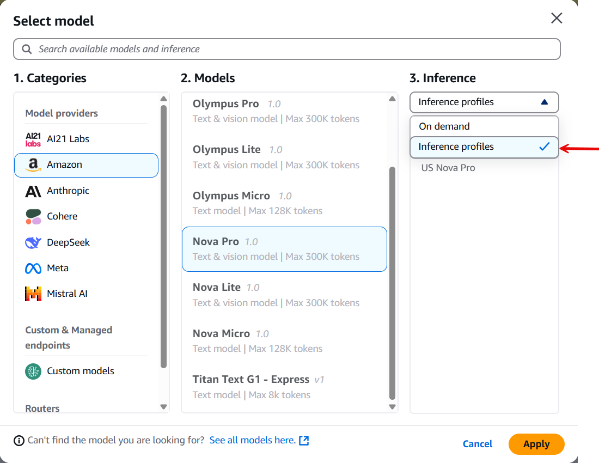

<!-- 
 Copyright Amazon.com, Inc. or its affiliates. All Rights Reserved.
 SPDX-License-Identifier: CC-BY-SA-4.0
 -->

# Performance Tuning of RAG Systems

**Content Level: 300**

## Suggested Pre-Reading

- [Generative AI Fundamentals](../../../../1_0_generative_ai_fundamentals/1_1_core_concepts_and_terminology/core_concepts_and_terminology.md)

## TL;DR

To improve RAG (Retrieval-Augmented Generation) performance:

1. **Measure First**: Use instrumentation to identify bottlenecks
2. **Infrastructure Choices**: Select cross-region inference endpoints and enable sufficient quotas
3. **Architectural Optimizations**: Implement caching, asynchronous processing, and use non-LLM alternatives where possible
4. **Retrieval Improvements**: Optimize vector databases, refine query processing, and experiment with chunking strategies
5. **Generation Efficiency**: Select appropriate model sizes, engineer efficient prompts, and implement streaming responses
6. **Continuous Evaluation**: Track performance metrics, conduct A/B testing, and iterate based on results

## Broad Guidelines to Improve RAG Workflow Performance

### Instrumentation

Implement comprehensive observability across your RAG pipeline to identify performance bottlenecks with precision. Leverage distributed tracing frameworks to measure latency across each component, from embedding generation to vector search and LLM inference. This data-driven approach enables targeted optimization efforts that yield maximum performance gains with minimal engineering investment.

### Cross-Region Inference Endpoint

Deploy cross-region inference endpoints as a standard practice rather than defaulting to "On demand" provisioning. This architectural decision provides consistent performance characteristics under variable load conditions and enables resilience against regional availability fluctuations, critical for production-grade RAG systems.

_Fig: selecting cross-region inference profile during model selection_

### Quota Threshold Management

Implement proactive quota monitoring with automated alerts when approaching 70% utilization of critical service limits. Pay particular attention to _"Cross-Region InvokeModel requests per minute"_ and _"Cross-Region InvokeModel tokens per minute"_ metrics, as these are common throttling points that can silently degrade performance without triggering obvious errors.

### Non-LLM Processing Offload

Strategically decompose your workflow to reserve LLM processing exclusively for cognitive tasks requiring reasoning or natural language generation. Offload deterministic operations to purpose-built services or Lambda functions with optimized Python code, significantly reducing both latency and operational costs.

### Asynchronous Processing Architecture

Design your RAG pipeline with event-driven architecture principles, implementing asynchronous processing patterns that decouple retrieval operations from generation tasks. This approach enables parallel execution paths, dramatically improving throughput under high concurrency scenarios while maintaining system responsiveness.

### Multi-Tiered Caching Strategy

Deploy a comprehensive caching architecture that integrates retrieval, generation, and data access strategies.
Implement intelligent, adaptive time-to-live (TTL) policies that dynamically adjust based on content volatility.
This approach aims to optimize cache performance by maximizing hit ratios while keeping data current and relevant.

## Optimize Retrieval

### Vector Database Optimization

#### Indexing Algorithm Selection & Tuning

Experiment with different indexing algorithms (e.g., HNSW, Annoy) to find the best balance between speed and accuracy. Optimize index parameters based on your data distribution and query patterns.

#### Strategic Data Partitioning

Deploy sharding strategies incorporating both feature-based and locality-sensitive hashing techniques. Implement multi-dimensional partitioning that aligns with your query distribution heat maps.

#### Precision-Optimized ANN Configuration

Develop custom distance metrics and calibrated approximation parameters based on your embedding space characteristics. Adjust ANN parameters (e.g., number of neighbors, search radius) to control the trade-off between search speed and accuracy.

### Multi-tier Caching Architecture

Implement caching mechanisms to store frequently accessed embeddings and retrieval results.

### Query Processing Enhancement

#### Advanced Query Rewriting

Improve retrieval accuracy by transforming user queries using domain knowledge and semantic patterns. This process:

1. Analyzes the original query to understand user intent
2. Enriches queries with relevant terminology from knowledge graphs
3. Incorporates statistical word relationships to expand search scope
4. Uses Large Language Models to rewrite queries for optimal retrieval

This approach helps bridge the gap between user language and document terminology, significantly improving retrieval precision. For implementation details, refer to the [query reformulation capabilities in Amazon Bedrock Knowledge Bases](https://aws.amazon.com/blogs/machine-learning/amazon-bedrock-knowledge-bases-now-supports-advanced-parsing-chunking-and-query-reformulation-giving-greater-control-of-accuracy-in-rag-based-applications/#:~:text=or%20the%20SDK.-,Query%20reformulation,-Often%2C%20input%20queries){:target="_blank" rel="noopener noreferrer"}.

### Chunking Methodologies

Create more effective document chunks by using intelligent segmentation that:

1. Adjusts chunk boundaries based on meaning rather than just character count
2. Analyzes information density to prevent splitting critical concepts
3. Combines fixed-size chunking with natural breaks (paragraphs, sections)
4. Uses overlapping segments to maintain context between chunks

Test various chunk sizes and overlap percentages to balance comprehensive context with minimal redundancy. Your optimal chunking approach should align with your specific document types and expected user questions.

For implementation details, explore the [advanced chunking capabilities](https://aws.amazon.com/blogs/machine-learning/amazon-bedrock-knowledge-bases-now-supports-advanced-parsing-chunking-and-query-reformulation-giving-greater-control-of-accuracy-in-rag-based-applications/#:~:text=chunks%20during%20retrieval.-,Advanced%20data%20chunking%20options,-The%20objective%20shouldn%E2%80%99t){:target="_blank" rel="noopener noreferrer"} in Amazon Bedrock Knowledge Bases.

## Optimize Generation

### Model Selection

Strategic deployment of model families based on computational requirements is important.
Smaller model architectures deliver significantly reduced latency profiles, making them optimal for time-sensitive applications.
Implement a tiered model selection framework that aligns computational resources with task complexity requirements.

### Prompt Engineering

#### Prompt Length and Complexity

Optimize prompt construction systematically to minimize inference time while maintaining response quality. Conduct latency profiling across prompt variations to identify performance bottlenecks. Multiple offerings exist, each approaching prompt engineering with different methods to optimize for speed, accuracy, and performance. The table provides a broad overview—select the right approach based on your specific use case and optimization focus.

| Tool | Core Method | Speed Focus | Accuracy Focus | Performance Focus |
|------|-------------|-------------|----------------|-------------------|
| **LangSmith** | Empirical A/B | Trace bottlenecks | Compare outputs | End-to-end workflow |
| **DSPy** | Algorithmic | Systematic search | Metric-driven | Automated loops |
| **PromptPerfect** | AI-assisted | Cross-model testing | Pattern learning | Universal optimization |
| **Helicone** | Production monitoring | Real-time metrics | User feedback | Cost-performance ratio |
| **Weights & Biases** | Scientific experiments | Statistical validation | Controlled variables | Rigorous measurement |
| **OpenAI Evals** | Custom evaluation | Domain-specific metrics | Task-focused | Bespoke optimization |
| **AWS** | Cloud-native integration | Pre-built Dashboards and API's for runtime metrics | Bedrock Model Evaluation + Ground Truth | CloudWatch + X-Ray + Cost tracking |

#### Context Window Management

Implement advanced context prioritization algorithms to maximize relevance density within fixed context windows. Deploy dynamic context summarization techniques that preserve semantic salience while reducing token consumption. Incorporate semantic re-ranking methodologies to optimize information hierarchy.

## Application Design Choices for Scalability

### Batching

Implement intelligent request coalescence to maximize computational throughput. Configure optimal batch sizes based on hardware utilization curves and latency requirements.

### Streaming

Deploy progressive response generation protocols to minimize time-to-first-token metrics. Implement chunked response handling to optimize perceived latency and enable concurrent client-side processing.

### Caching

Establish a sophisticated multi-level caching architecture with intelligent invalidation policies. Also explore [_*prompt caching tweaks*_](https://docs.aws.amazon.com/bedrock/latest/userguide/prompt-caching.html){:target="_blank" rel="noopener noreferrer"} to enhance response time

## CI/CD Viewpoint

### Comprehensive Metrics Instrumentation

Establish a multi-dimensional metrics framework capturing both technical and business KPIs across your RAG pipeline. Implement real-time monitoring for p50/p90/p99 latency distributions, token throughput rates, and retrieval precision/recall metrics. Correlate these technical indicators with business outcomes like user satisfaction scores and task completion rates to prioritize optimization efforts that deliver maximum impact.

### Hypothesis-Driven A/B Testing

Deploy a rigorous experimental methodology using statistical significance testing to evaluate performance optimizations. Implement canary deployments to compare alternative retrieval algorithms, chunking strategies, and prompt techniques against production traffic with minimal user impact.

### Continuous Evaluation Pipeline

Institute a closed-loop improvement system that:

1. Automatically identifies underperforming query patterns through anomaly detection
2. Captures edge cases where retrieval quality degrades
3. Incorporates these examples into evaluation datasets
4. Triggers automated actions on CI/CD pipeline blocking sub-par releases to make its way to users

Maintain a comprehensive evaluation framework with stratified test sets representing different query complexities and domain categories. Regularly validate that performance optimizations don't compromise retrieval quality, particularly for long-tail queries where degradation may not be immediately apparent in aggregate metrics. See additional guidance on the section about GenAI evaluations

## Get Hands-On

[GitHub: Observability Solution Implementation](https://github.com/aws-samples/amazon-bedrock-samples/tree/main/evaluation-observe/Custom-Observability-Solution){:target="_blank" rel="noopener noreferrer"}

## Further Reading

[Guidance for High-Speed RAG Chatbots on AWS](https://aws.amazon.com/solutions/guidance/high-speed-rag-chatbots-on-aws/?did=sl_card&trk=sl_card){:target="_blank" rel="noopener noreferrer"}

## Contributors

**Author:** 

- Manoj Ramani - Sr Applied AI Architect, GenAI 

**Reviewer/s:**

- Long Chen, Sr. Applied Scientist 
