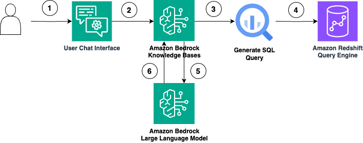

<!-- 
 Copyright Amazon.com, Inc. or its affiliates. All Rights Reserved.
 SPDX-License-Identifier: CC-BY-SA-4.0
 -->

# Structured Data Retrieval Augmented Generation (RAG)

**Content Level: 300**

## Suggested Pre-Reading
- [RAG](../../../../2_0_technical_foundations_and_patterns/2_1_key_primitives/2_1_7_rag/2_1_7_rag.md)

## TL;DR
Structured RAG refers to the integration of structured data, like relational databases, NoSQL databases or Data Warehouses, into RAG systems. 
Unlike traditional RAG, which primarily uses vectorized unstructured data (e.g., documents, web pages), structured RAG focuses on leveraging organized data residing in SQL 
databases. Structured RAG makes use of LLMs' abilities to translate natural language queries into SQL (NL2SQL) or other structured data 
query methods to retrieve data to be included as context for AI applications. Bedrock Knowledge Bases allows developers to quickly integrate their structured data within data storage systems (like Redshift
or Glue Data Catalogs) into their RAG applications by handling the NL2SQL and data retrieval process. To generate accurate SQL queries, Bedrock Knowledge Bases leverage database schema, previous query history, and 
other contextual information that is provided about the data sources. A key benefit of structured RAG is that it allows organizations to make use of existing structured data in their AI applications
without moving it or re-processing it.

## Bedrock Knowledge Bases with Redshift
Bedrock Knowledge Bases enables direct natural language interactions with structured data stores like Redshift, Glue Data Catalog, and Datalake. The system interprets database schemas and context, converting natural language questions into accurate SQL queries while maintaining data reliability standards. You can chat with your structured data by setting up structured data ingestion from data stores (like Redshift, and S3) in a few steps, using the power of Amazon Bedrock Knowledge Bases structured data retrieval. The basic workflow for structured RAG is laid out below.

<div style="margin:auto;text-align:center;width:100%;"></div>

1. In a RAG application, the user can ask a natural language data analytics question through the chat interface, such as “What is the sales revenue for the Month of February 2025?”
2. The natural language query is sent to Amazon Bedrock Knowledge Bases for data retrieval and processing.
3. Amazon Bedrock Knowledge Bases generates a SQL query based on the underlying data schema configured during the knowledge base creation.
4. The SQL query is executed against the query engine (Amazon Redshift) to retrieve data from a structured data store (AWS Glue tables). The query can include multiple joins and aggregation.
5. The generated SQL response is sent to an LLM along with additional context to generate a response in natural language.
6. The response is sent back to the user. The user can ask follow-up questions based on the retrieved response, such as “What is the product that generated highest revenue in this period?”

### Knowledge Base Setup
There are a few steps to set up a Structured Bedrock Knowledge Base.

1. Configure a Query Engine like Redshift to interact with the structured data source
2. Create an IAM Role that has access to the Data Source (like RedShift, S3, Glue Catalog)
2. Connect Knowledge Base with Data Source
3. Sync the Knowledge Base with the Data Source to give the Knowledgebase context of the schema

Customers can provide additional context to Knowledge base NL2SQL engine by adding table, column descriptions and set of curated queries aligned with their use case. 

**Create Redshift Query Engine** 

Structured Bedrock Knowledge Bases supports Redshift as a query engine to query data residing in Redshift Clusters or within Glue Data Catalogs. Either an Amazon Redshift Cluster 
or Amazon Redshift Serverless can be configured as the query engine. Complete instructions to set up these prerequisites can be found 
[here](https://docs.aws.amazon.com/bedrock/latest/userguide/knowledge-base-prereq-structured.html){:target="_blank" rel="noopener noreferrer"}.

**Create a Bedrock Knowledge Base**

In order to create a Structured Bedrock Knowledge Base, you will make use of the [Create Knowledge Base API](https://docs.aws.amazon.com/bedrock/latest/APIReference/API_agent_CreateKnowledgeBase.html){:target="_blank" rel="noopener noreferrer"}.

```
response = client.create_knowledge_base(
    description="My structured knowledge base",
    knowledgeBaseConfiguration={
        "sqlKnowledgeBaseConfiguration": {
            "type": "REDSHIFT",
            "redshiftConfiguration": {
                "queryEngineConfiguration": {
                    "type": "PROVISIONED",
                    "provisionedConfiguration": {
                        "authConfiguration": {},
                        "clusterIdentifier": cluster_identifier
                    }
                },
                "storageConfiguration": [{
                    "redshiftConfiguration": {
                        "databaseName": database_name
                    },
                    "type": "REDSHIFT"
                }]
            }
        },
        "type": "SQL"
    },
    name="my-structured-kb",
)
```

**Sync Knowledge Base**

After you have connected a knowledge base to a structured data store, you need to perform a sync to ingest metadata about the data store.
Whenever modifications are made to the database's schema, a sync needs to be run with the [Start Ingest Job API](https://docs.aws.amazon.com/bedrock/latest/APIReference/API_agent_StartIngestionJob.html){:target="_blank" rel="noopener noreferrer"}.
```
response = client.start_ingest_job(
    dataSourceId=data_source_id,
    knowledgeBaseId=knowledge_base_id
)
```

### Knowledge Base Usage
The Bedrock Agent Runtime Client provides 3 APIs to easily interact with your structured data knowledge bases. Those 3 API's are:
1. Generate Query - Lets you generate the SQL query for the natural language question.
2. Retrieve Data - This api generates SQL query and executes it against the configured SQL Engine to retrieve data from data source.
3. Retrieve and Generate - This api will generate SQL, extract data and convert that data into a natural language response with the help of Large language model.

**Generate Query**

To generate a SQL query given a natural language prompt, use the [Generate Query API](https://docs.aws.amazon.com/bedrock/latest/APIReference/API_agent-runtime_GenerateQuery.html){:target="_blank" rel="noopener noreferrer"}. The query can be used in subsequent calls to the retrieve or retrieve 
and generate API, or used within other workflows.
```
query_response = bedrock_agent_runtime_client.generate_query(
    queryGenerationInput={
        "text": query,
        "type": "TEXT"
    },
    transformationConfiguration={
        "mode": "TEXT_TO_SQL",
        "textToSqlConfiguration": {
            "type": "KNOWLEDGE_BASE",
            "knowledgeBaseConfiguration": {
                "knowledgeBaseArn": knowledge_base.knowledge_base["knowledgeBaseArn"]
            }
        }
    }
)
```

**Retrieve Data**

To query a knowledge base and retrieve info from it, use the [Retrieve API](https://boto3.amazonaws.com/v1/documentation/api/latest/reference/services/bedrock-agent-runtime/client/retrieve.html){:target="_blank" rel="noopener noreferrer"}.
```
query = "What was the most purchased product in July 2025?"

response_ret = bedrock_agent_runtime_client.retrieve(
    knowledgeBaseId=kb_id, 
    nextToken="string",
    retrievalConfiguration={
        "vectorSearchConfiguration": {
            "numberOfResults": 5,
        } 
    },
    retrievalQuery={
        "text": query
    }
)
```

**Retrieve and Generate**

To query a knowledge base, retrieve results, and generate and perform inference in a single API call, use the [Retrieve and Generate API](https://boto3.amazonaws.com/v1/documentation/api/latest/reference/services/bedrock-agent-runtime/client/retrieve_and_generate.html){:target="_blank" rel="noopener noreferrer"}.
```
query = "What was the most purchased product in July 2025?"

response = bedrock_agent_runtime_client.retrieve_and_generate(
    input={
        "text": query
    },
    retrieveAndGenerateConfiguration={
        "type": "KNOWLEDGE_BASE",
        "knowledgeBaseConfiguration": {
            "knowledgeBaseId": kb_id,
            "modelArn": f"arn:aws:bedrock:{region}::foundation-model/{foundation_model}",
            "retrievalConfiguration": {
                "vectorSearchConfiguration": {
                    "numberOfResults": 5
                } 
            }
        }
    }
)

```

## Further Reading
- [Build a knowledge base by connecting to a structured data store](https://docs.aws.amazon.com/bedrock/latest/userguide/knowledge-base-build-structured.html){:target="_blank" rel="noopener noreferrer"}
- [Building Conversational Interfaces for Structured Data using Amazon Bedrock Knowledge Bases](https://aws.amazon.com/blogs/machine-learning/build-conversational-interfaces-for-structured-data-using-amazon-bedrock-knowledge-bases/){:target="_blank" rel="noopener noreferrer"}
- [AWS Bedrock Code Samples - End-to-end Structured RAG using S3 Glue and Bedrock Knowledge Bases](https://aws.amazon.com/blogs/machine-learning/build-conversational-interfaces-for-structured-data-using-amazon-bedrock-knowledge-bases/){:target="_blank" rel="noopener noreferrer"}
- [AWS Bedrock Code Samples - Structured RAG using Knowledge Bases](https://github.com/aws-samples/amazon-bedrock-samples/blob/main/rag/knowledge-bases/features-examples/07-structured-rag/structured_rag_using_kb.ipynb){:target="_blank" rel="noopener noreferrer"}
- [Enterprise-grade natural language to SQL generation using LLMs: Balancing accuracy, latency, and scale](https://aws.amazon.com/blogs/machine-learning/enterprise-grade-natural-language-to-sql-generation-using-llms-balancing-accuracy-latency-and-scale/){:target="_blank" rel="noopener noreferrer"}
- [Choosing the right approach for generative AI-powered structured data retrieval](https://aws.amazon.com/blogs/machine-learning/choosing-the-right-approach-for-generative-ai-powered-structured-data-retrieval/){:target="_blank" rel="noopener noreferrer"}
- [Amazon Redshift Documentation](https://docs.aws.amazon.com/redshift/){:target="_blank" rel="noopener noreferrer"}
- [Amazon Bedrock Knowledge Bases Developer Guide](https://docs.aws.amazon.com/bedrock/latest/userguide/knowledge-base.html){:target="_blank" rel="noopener noreferrer"}

## Contributors

**Authors:**

- Greg Ericson - Sr. Delivery Consultant 

- George Belsian - Sr. Delivery Consultant 