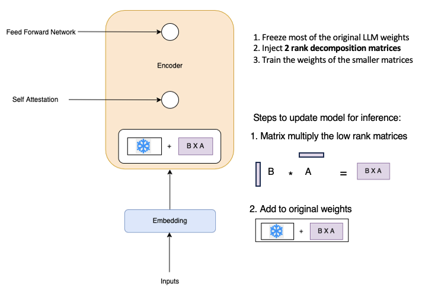

<!-- 
 Copyright Amazon.com, Inc. or its affiliates. All Rights Reserved.
 SPDX-License-Identifier: CC-BY-SA-4.0
 -->

# Low-Rank Adaptation (LoRA)

**Content Level: 300**

## Suggested Pre-Reading

* [Understanding Model Architecture and Weights](https://medium.com/@ericson_willians/unveiling-the-core-a-deep-dive-into-neural-networks-weights-and-the-future-of-ai-aa75705d038e){:target="_blank" rel="noopener noreferrer"}
* [Model Adaptation Strategies](../peft.md)
* [Basics of Full Fine-Tuning](../../2_3_4-1_full_fine-tuning/full_fine-tuning.md)
* [Matrix Operations in Neural Networks](https://www.youtube.com/watch?v=ZTt9gsGcdDo){:target="_blank" rel="noopener noreferrer"}

## TL;DR

LoRA is a parameter-efficient fine-tuning technique that updates a small number of trainable rank decomposition matrices instead of all model weights, dramatically reducing memory requirements and training costs while maintaining comparable performance to full fine-tuning for many applications.

## Introduction to LoRA

Low-Rank Adaptation (LoRA) is a parameter-efficient fine-tuning technique that addresses the computational challenges of traditional full fine-tuning. As a re-parameterization method, LoRA reduces the number of trainable parameters while maintaining model performance by freezing original weights and injecting trainable rank decomposition matrices.

In the [original LoRA paper](https://arxiv.org/pdf/2106.09685){:target="_blank" rel="noopener noreferrer"}, the authors show that LoRA can outperform full fine-tuning with only 2% of total trainable parameters. 

| Model&Method | # Trainable Parameters | WikiSQL Acc. (%) | MNLI-m Acc. (%) | SAMSum R1/R2/RL |
|---|---|---|---|---|
| GPT-3 (FT) | 175,255.8M | 73.8 | 89.5 | 52.0/28.0/44.5 |
| GPT-3 (BitFit) | 14.2M | 71.3 | 91.0 | 51.3/27.4/43.5 |
| GPT-3 (PreEmbed) | 3.2M | 63.1 | 88.6 | 48.3/24.2/40.5 |
| GPT-3 (PreLayer) | 20.2M | 70.1 | 89.5 | 50.8/27.3/43.5 |
| GPT-3 (Adapter^H^) | 7.1M | 71.9 | 89.8 | 53.0/28.9/44.8 |
| GPT-3 (Adapter^H^) | 40.1M | 73.2 | **91.5** | 53.2/29.0/45.1 |
| GPT-3 (LoRA) | 4.7M | 73.4 | **91.7** | **53.8/29.8/45.9** |
| GPT-3 (LoRA) | 37.7M | **74.0** | 91.6 | 53.4/29.2/45.1 |

LoRA differs fundamentally from other PEFT approaches. While prompt tuning modifies input embeddings and prefix tuning adds trainable tokens to the input sequence, LoRA directly modifies the model's weight matrices through low-rank decomposition. Adapter-based methods insert new trainable layers into the model architecture, potentially increasing inference latency. In contrast, LoRA maintains the original architecture and updates existing weight matrices through decomposition, resulting in minimal inference overhead.

The efficiency of LoRA becomes apparent when compared to alternative PEFT methods. Soft prompts require intensive memory during inference, and adapters need architectural modifications that can impact model performance. LoRA's approach of using small rank decomposition matrices achieves comparable results while requiring less memory and computation. 

When examining quantitative benefits, LoRA demonstrates measurable resource optimization. A weights matrix of 512 by 64 (32,768 parameters) reduces to two smaller matrices through LoRA: one 8x64 (512 parameters) and another 512x8 (4,096 parameters), resulting in an 86% reduction in trainable parameters. This reduction enables implementation on single GPUs rather than requiring distributed computing clusters.

LoRA optimizes multi-task scenarios. Unlike other PEFT methods that require separate model copies or complex architecture modifications for different tasks, LoRA enables efficient task switching through small, swappable matrices. These task-specific matrices require minimal storage compared to full model copies, making LoRA suitable for production environments serving multiple use cases.

### Challenges and Limitations

* **Rank Selection and Training:** The choice of rank value in LoRA presents a key challenge. While automated hyperparameter optimization can help, finding the right rank requires testing different values through trial and error. While lower ranks (4-8) reduce memory use, they might not capture complex patterns in the data. Higher ranks (16-32) can better capture these patterns but require more memory and computing power. 
* **Model Architecture Constraints:** When LoRA adapts multiple parts of a large model at once, the model's performance can decrease. This is especially true for models with billions of parameters. Some model designs work better with LoRA than others. For example, models with many attention layers tend to work well with LoRA, while models with different architectural choices might show reduced performance when using LoRA adaptation.
* **Multi-task Switching Issues:** Using multiple LoRA adapters for different tasks creates new challenges. Switching between adapters during operation can cause delays in model responses. For example, if a model needs to switch from a customer service task to a content generation task, there might be a brief pause while the system loads the new adapter. These limitations can be overcome through mitigation strategies for storing, loading, and managing multiple adapters efficiently.
* **Training Data Requirements:** LoRA still needs good quality training data to work well. When there isn't enough training data, the model might memorize the training examples instead of learning general patterns, even though LoRA uses fewer parameters. For instance, if training a model for medical terminology with only a few hundred examples, the model might struggle to handle new, unseen medical terms.

Despite these limitations, LoRA's practical benefits, including reduced computational requirements and efficient multi-task adaptation, make it a valuable tool for model customization. Its implementation typically requires only 15-20% of the computational resources needed for full fine-tuning, enabling faster iteration cycles and more accessible model adaptation for organizations with limited computing resources.

## **LoRA Implementation**

LoRA reduces the number of parameters to be trained during fine-tuning by freezing all of the original model parameters and then injecting a pair of rank decomposition matrices alongside the original weights. The dimensions of the smaller matrices are set so that their product is a matrix with the same dimensions as the weights being modified. This process is illustrated in the following diagram:

LoRA Process Illustration</a>

The original weights of the LLM remain frozen while the smaller matrices undergo training using the supervised learning process. For inference, the two low-rank matrices are multiplied together to create a matrix with the same dimensions as the frozen weights. This matrix is then added to the original weights and replaces them in the model with these updated values. The result is a LoRA fine-tuned model capable of carrying out the specific task. Because this model has the same number of parameters as the original, there is minimal impact on inference latency.

Research indicates that applying LoRA to just the self-attention layers of the model often is enough to achieve performance gains during fine-tuning. While LoRA implementation remains possible on other components like feed-forward layers, the self-attention layers contain most of the LLM parameters. Therefore, applying LoRA to these weight matrices yields the most significant reduction in trainable parameters. 

### LoRA Parameter Reduction: Concrete Example

Using the transformer architecture from ["Attention is All You Need" paper](https://arxiv.org/pdf/1706.03762){:target="_blank" rel="noopener noreferrer"}:

**Original Weights:**
- Dimensions: 512 × 64
- Total parameters: 32,768 trainable parameters

**Using LoRA with rank = 8:**

**Matrix A:**
- Dimensions: 8 × 64 
- Parameters: 512

**Matrix B:**
- Dimensions: 512 × 8
- Parameters: 4,096

**Parameter Comparison:**
- Original: 32,768 parameters
- LoRA: 4,608 parameters (512 + 4,096)
- **Parameter reduction: 86%**

This demonstrates how LoRA significantly reduces the number of trainable parameters while preserving model performance.

## **Performance Tradeoffs**

When compared to full fine-tuning, LoRA shows comparable performance across various tasks. Benchmark testing demonstrates that the performance difference between full fine-tuning and LoRA typically remains minimal, often within a few percentage points. This slight performance trade-off balances against substantial computational savings.

Full fine-tuning requires updating every weight in the model during supervised learning, making the process compute and memory intensive. LoRA fine-tuning involves training a much smaller number of parameters using significantly less compute, making the small performance trade-off beneficial.

## Making it Practical

LoRA implementation becomes relevant when organizations need to adapt foundation models for specific business tasks while managing computational resources efficiently. Common scenarios include customizing customer service responses, adapting models for domain-specific knowledge, and creating multiple task-specific versions of a base model. When implementing LoRA on AWS, customers can leverage services like Amazon SageMaker and Amazon Bedrock for streamlined deployment and management.

In enterprise environments, LoRA provides immediate practical benefits through Amazon SageMaker's training infrastructure. Development teams can validate multiple adaptation approaches using SageMaker training jobs on ml.g4dn instances, avoiding the need for large compute clusters. A typical implementation starts with applying LoRA to the self-attention layers using a rank of 8 or 16 on Amazon SageMaker, which serves as a reliable baseline for most business applications.

Resource planning becomes more straightforward with LoRA on AWS. When adapting a 7B parameter model, LoRA reduces memory requirements from 28GB to approximately 4GB, enabling training on ml.g4dn.xlarge instances rather than requiring ml.p4d instances with A100 GPUs. Using Amazon SageMaker's built-in support for quantization (e.g., 4-bit QLoRA), training can be performed on smaller instances, significantly reducing costs while maintaining model quality.

Production architectures benefit from LoRA's efficient handling of multiple tasks through Amazon Bedrock's model deployment capabilities. A common pattern involves maintaining one base model while swapping LoRA adapters for different business functions using Amazon S3 for adapter storage. For example, a financial services customer might maintain separate adapters for retail banking, investment advice, and compliance checking, all operating from the same foundation model deployed on Bedrock.

Cost optimization becomes tangible through Amazon SageMaker's managed training infrastructure. The training phase for a LoRA adaptation typically requires 15-20% of the computational resources needed for full fine-tuning, translating to lower SageMaker training costs. Organizations can leverage SageMaker's automatic model tuning to optimize hyperparameters within existing infrastructure budgets.

Implementation considerations should include establishing clear evaluation metrics using Amazon CloudWatch and SageMaker Model Monitor. The deployment pipeline should incorporate automated testing through SageMaker Pipelines, testing both task-specific performance and general model capabilities. Setting up CloudWatch alarms for adapter switching latency and memory utilization helps maintain reliable production operations.

Technical teams should plan for adapter versioning and storage management using Amazon S3 and SageMaker Model Registry. While individual LoRA adapters are small (typically measured in megabytes), maintaining multiple versions for A/B testing and progressive rollouts requires systematic organization. Creating a clear naming convention in the Model Registry and validation process through SageMaker Pipelines helps prevent confusion in production environments.

## Get Hands-On

[AWS Blog: Easily deploy and manage hundreds of LoRA adapters with SageMaker efficient multi-adapter inference:](https://aws.amazon.com/blogs/machine-learning/easily-deploy-and-manage-hundreds-of-lora-adapters-with-sagemaker-efficient-multi-adapter-inference/){:target="_blank" rel="noopener noreferrer"}

## Further Reading

* Hugging Face: [LoRA Methods](https://huggingface.co/docs/peft/conceptual_guides/adapter#low-rank-adaptation-lora){:target="_blank" rel="noopener noreferrer"}
* Research paper: [LORA: Low-Rank Adaptation of Large Language Models](https://arxiv.org/pdf/2106.09685){:target="_blank" rel="noopener noreferrer"} 
* Research paper: [Attention Is All You Need](https://arxiv.org/abs/1706.03762){:target="_blank" rel="noopener noreferrer"} 

## Contributors

**Primary Author:** Wangechi Doble- Principal Technologist 

**Primary Reviewer:** Baishali Chaudhury - Applied Scientist II 
