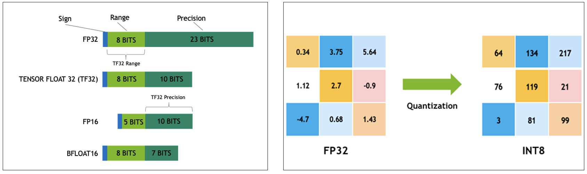

<!-- 
 Copyright Amazon.com, Inc. or its affiliates. All Rights Reserved.
 SPDX-License-Identifier: CC-BY-SA-4.0
 -->

# Quantized Low-Rank Adaptation (QLoRA)

**Content Level: 300**

## Suggested Pre-Reading

* [Understanding Model Quantization](../../../../../3_0_architecture_and_design_patterns/3_4_scalability_performance/3_4_2_model_inference_optimization/3_4_2_2_model_quantization.md)
* [Low-Rank Adaptation (LoRA) Fundamentals](../2_3_4_2_1LoRA/lora.md)
* [Memory Management in LLMs](../../../../2_3_core_archtectural_concepts/2_3_2_prompt_engineering/2_3_2-4_context_memory/context_memory.md)
* [GPU Memory Optimization Techniques](https://aws.amazon.com/blogs/compute/optimizing-gpu-utilization-for-ai-ml-workloads-on-amazon-ec2/){:target="_blank" rel="noopener noreferrer"}

## TL;DR

QLoRA extends LoRA's efficiency by introducing 4-bit quantization and unified memory management, enabling fine-tuning of large language models on consumer GPUs while maintaining model quality. Through quantization techniques and memory paging between GPU and CPU, the technique reduces memory requirements by up to 8x compared to traditional methods, allowing a 65B parameter model to be fine-tuned on a single 48GB GPU. This democratizes access to large model fine-tuning, making it feasible for customers with limited computational resources to adapt large language models for specific use cases. 

### **Understanding Quantization**

Quantization represents data with fewer bits to reduce memory usage and accelerate inference in LLMs. The process converts model weights from 32-bit floating point numbers to lower precision formats. A standard 32-bit float (FP32) uses 4 bytes of memory per parameter: 1 bit for sign, 8 bits for exponent, and 23 bits for fraction. Through quantization, these numbers convert to formats requiring less memory, reducing the model's memory footprint and improving memory bandwidth utilization.

This diagram illustrates the concept of quantization in model compression, specifically showing different numerical formats and corresponding bit allocations.

Quantization Illustration

The left side shows four different floating-point formats:
1. FP32 (32-bit floating point): 
   - Sign: 1 bit
   - Range: 8 bits (exponent)
   - Precision: 23 bits (mantissa/fraction)

2. TENSOR FLOAT 32 (TF32):
   - 8 bits for range
   - 10 bits for precision
   - This format is optimized for tensor operations introduced by NVIDIA

3. FP16 (16-bit floating point):
   - 5 bits for range
   - 10 bits for precision

4. BFLOAT16:
   - 8 bits for range
   - 7 bits for precision

The right side demonstrates a practical example of quantization, showing the conversion from FP32 (floating-point 32-bit) values to INT8 (8-bit integer) values. The example shows a 3x3 matrix with decimal numbers in FP32 format being converted to whole numbers in INT8 format: 

- Left matrix shows floating-point values (FP32) with decimal numbers like 0.34, 3.75, 5.64, etc.
- Right matrix shows the same values converted to INT8 (8-bit integer) format with values like 64, 134, 217, etc.

This illustrates how quantization transforms high-precision floating-point numbers into lower-precision integers, reducing model size while maintaining reasonable representation of the original values. 

Quantization affects model performance through precision trade-offs. When weights are stored in lower precision, some numerical accuracy is lost. However, different quantization methods can preserve model performance while achieving measurable memory savings. The degree of impact depends on the quantization method used and the model architecture.

Quantization affects both inference speed and accuracy. This relationship works in two key ways:

Memory and Speed:
* Converting from 32-bit floating point (FP32) to 4-bit precision reduces memory usage by 8x
* Lower precision formats accelerate memory access and computational operations
* A 4-bit quantized model typically runs 2-4x faster than its FP32 counterpart

Accuracy Trade-offs:
* Quantization can introduce rounding errors in weight representations
* Modern techniques such as Dynamic Range Quantization (DRQ), Activation-aware Weight Quantization (AWQ), and SmoothQuant  minimize accuracy loss through:
   - Calibration during the quantization process - Adjusting quantization parameters based on data distribution
   - Selective Quantization - Varying precision levels across model components
     - Critical layers (e.g., attention mechanisms) maintain higher precision
     - Less sensitive layers (e.g., feed-forward networks) use lower precision
   - Post-training optimization

Quantization enables fine-tuning of large models on limited hardware by reducing memory requirements. When combined with techniques like Low-Rank Adaptation (LoRA), quantized models can be effectively fine-tuned while maintaining most of their original capabilities. This makes large model adaptation possible on consumer GPUs, where memory constraints would otherwise prevent such operations.

This is illustrated in the diagram (below) from the [QLoRA Paper](https://arxiv.org/pdf/2305.14314){:target="_blank" rel="noopener noreferrer"}.

The actual performance impact varies based on the quantization level chosen. Moving from FP32 to 4-bit precision can reduce memory usage by up to 8x, while typically maintaining acceptable model performance for most tasks. This balance between memory efficiency and performance makes quantization a practical tool for deploying and fine-tuning large language models.

### **Types of Quantization and use cases**

* **FP16 (16-bit floating point)** uses 1 bit for sign, 5 bits for exponent, and 10 bits for fraction, reducing memory usage to 2 bytes per parameter. FP16 offers a balanced trade-off between precision and memory savings, making it suitable for general model deployment. The primary limitation is reduced numerical range compared to FP32, which can lead to training instability in deep networks. Common applications include cloud inference services and mobile device deployment where memory constraints exist but high accuracy is still required. Video game rendering and computer vision applications often use FP16 for real-time processing.
* **BFLOAT16** uses 1 bit for sign, 8 bits for exponent, and 7 bits for fraction, maintaining FP32's dynamic range while using half the memory. This format excels in training scenarios due to its preserved exponent range. The reduced fraction precision compared to FP16 is often acceptable for neural network operations. BFLOAT16 provides better training stability than FP16 but may show slightly lower precision in final model outputs. Google's TPUs and NVIDIA's A100 GPUs use BFLOAT16 for training large language models. Cloud providers implement BFLOAT16 in their machine learning infrastructure for efficient model training.
* **INT8 (8-bit integer)** uses 1 bit for sign and 7 bits for fraction, reducing memory to 1 byte per parameter. INT8 requires calibration through post-training quantization with representative data to determine scale and zero-point values per tensor or channel. This format offers significant memory savings but may impact model accuracy more noticeably than floating-point formats. INT8 works well for inference in production environments where memory and computational efficiency are priorities. Mobile applications, edge devices, and IoT deployments commonly use INT8 for inference. Computer vision models in surveillance systems often operate with INT8 precision.
* **4-bit quantization**, including NormalFloat (nf4) and 4-bit floating-point (fp4), provides the highest compression rates. These formats are typically applied only to weights while keeping activations at higher precision to maintain model quality. 4-bit quantization achieves up to 8x memory reduction compared to FP32 but requires careful implementation to prevent significant accuracy loss. This format enables large model fine-tuning on consumer hardware. Research labs and smaller organizations use 4-bit quantization to fine-tune large language models on limited hardware. Content generation systems implement 4-bit models for efficient text and code generation tasks.

Each quantization type represents a specific trade-off between memory usage, computational efficiency, and model accuracy. The choice depends on deployment constraints, performance requirements, and the specific characteristics of the model and task at hand.

After a model is quantized it isn’t typically further trained for downstream tasks because training can be unstable due to the lower precision of the weights and activations. However, since PEFT methods only add *extra* trainable parameters, this enables a quantized model to be trained with a PEFT adapter on top. This is known as “quantization-aware fine-tuning” and works well with LoRA-style reparameterization since the frozen base weights are never updated. Combining quantization with PEFT is a good strategy for training even the largest models on a single GPU. 

### **How QLoRA works**

QLoRA quantizes a model to 4 bits and then trains it with LoRA to reduce memory requirements for model fine-tuning. The method works by quantizing the precision of the weight parameters in the pretrained LLM to 4-bit precision. Typically, parameters of trained models are stored in a 32-bit format, but QLoRA compresses them to a 4-bit format. This reduces the memory footprint of the LLM, making it possible to fine-tune it on a single GPU.

### QLoRA Implementation 

QLoRA introduces a 4-bit NormalFloat (nf4) data type for quantization. The method implements double-quantization to reduce memory to 0.4 bits per parameter. This allows a 65B parameter model to compress to 3GB of memory while maintaining model performance. This enables up to 16× compression while retaining range and granularity for downstream fine-tuning tasks.

**Memory Management System**

The unified GPU-CPU memory system in QLoRA moves data between GPU and CPU based on processing needs. This management enables work with models that exceed GPU memory capacity. The system tracks memory usage to prevent out-of-memory errors during training. It uses paging strategies similar to virtual memory, where infrequently used model shards are offloaded to host RAM and loaded on-demand. Implementations rely on PagedAttention and Hugging Face’s bitsandbytes package to orchestrate these movements efficiently.

**Performance Impact**
QLoRA maintains model performance despite quantization through precise scaling factors calculated during training. The system preserves the dynamic range of values while reducing memory requirements. This balance enables effective model fine-tuning without loss of capability.

**Hardware Requirements**
Customers can run QLoRA on graphics cards with 8GB to 24GB memory. The quantization process reduces hardware requirements compared to full-precision training. This reduction enables model development on consumer hardware.

**Cost Considerations**
QLoRA's memory optimization reduces computing costs for model fine-tuning. Customers save on GPU instances through reduced memory requirements. The system creates opportunities for model development within budget constraints.

## Making it Practical

QLoRA implementation becomes relevant in three key scenarios: fine-tuning models on existing hardware infrastructure, working within budget constraints that prevent high-end GPU cluster investment, and rapid prototyping requiring quick iteration cycles.

In enterprise environments, development teams can validate use cases on standard workstation GPUs before larger infrastructure investments. A practical starting point involves using consumer GPUs with 24GB memory to fine-tune models up to 33B parameters. This enables proof-of-concept development without immediate need for specialized hardware.

AWS integration leverages several key services for QLoRA implementation. SageMaker supports QLoRA through custom training containers, while Bedrock enables quantized model deployment with managed scaling. AWS Deep Learning AMIs provide pre-configured environments for QLoRA implementation, and CloudWatch enables comprehensive monitoring of memory and performance metrics. Auto Scaling groups manage resource allocation efficiently across the deployment.

Memory management requires specific configuration considerations. The unified memory system needs swap space on the host machine, typically 2-3 times the model weights size. On AWS, this requires EBS volume sizing for swap space and instance type selection based on memory requirements. Memory monitoring through CloudWatch metrics with alert configuration at 85% threshold using Amazon SNS enables stable operation.

Cost considerations show measurable differences from traditional fine-tuning. A 65B parameter model fine-tuning project typically requiring multiple A100 GPUs can execute on a single GPU with QLoRA, reducing infrastructure costs by 60-80% during development. On AWS, this translates to reduced g5.xlarge instance hours versus multiple p4d instances, lower EBS storage costs for model artifacts, optimized data transfer costs through proper region selection, and balanced spot instance usage for development workloads.

Production deployment requires establishing performance baselines before quantization, implementing robust error handling for memory management, and maintaining separate development and production model versions. AWS CI/CD pipelines support model deployment while load balancing configuration enables optimal inference endpoint performance. Validation steps verify quantization impact on performance throughout the deployment process.

Common implementation challenges include insufficient CPU memory allocation, inadequate swap space configuration, and overaggressive quantization settings that affect model convergence. Poor mixed-precision choices across model layers, suboptimal AWS instance type selection, and inefficient model artifact storage strategies can also impact performance.

Best practices for implementation include applying mixed-precision quantization selectively and keeping embedding and output layers in 8-bit precision. Establishing metrics for model performance, monitoring memory utilization, and inference latency through AWS managed services promotes operational efficiency. Proper security controls through IAM roles and documented quantization decisions support long-term maintenance.

Customers should define metrics for model performance, memory usage, and inference latency before beginning quantization. These metrics serve as implementation guidelines and help identify potential issues early in development.

The practical benefits of QLoRA should be weighed against operational complexities. While reducing hardware costs, the approach requires detailed system configuration and monitoring. Success depends on balancing these trade-offs against specific use case requirements and resource constraints within the AWS portfolio.

## Get Hands-On

AWS Blog: [Fine-tune Llama 2 using QLoRA and Deploy it on Amazon SageMaker with AWS Inferentia2](https://aws.amazon.com/blogs/machine-learning/fine-tune-llama-2-using-qlora-and-deploy-it-on-amazon-sagemaker-with-aws-inferentia2/){:target="_blank" rel="noopener noreferrer"}

## Further Reading

* Medium Blog: [QLoRA: Fine-Tuning Large Language Models (LLM’s)](https://medium.com/@dillipprasad60/qlora-explained-a-deep-dive-into-parametric-efficient-fine-tuning-in-large-language-models-llms-c1a4794b1766){:target="_blank" rel="noopener noreferrer"}
* Huggingface Blog: [QLoRA: Efficient Finetuning of Quantized LLMs](https://huggingface.co/papers/2305.14314){:target="_blank" rel="noopener noreferrer"}
* QLoRA paper:[QLORA: Efficient Finetuning of Quantized LLMs](https://arxiv.org/pdf/2305.14314){:target="_blank" rel="noopener noreferrer"}

## Contributors

**Primary Author:** Wangechi Doble- Principal Technologist 

**Primary Reviewer:** Baishali Chaudhury - Applied Scientist II 
