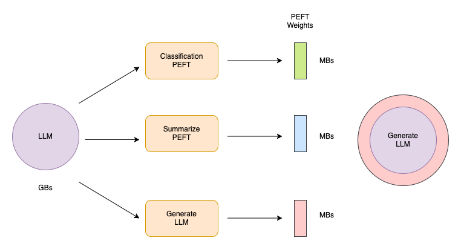
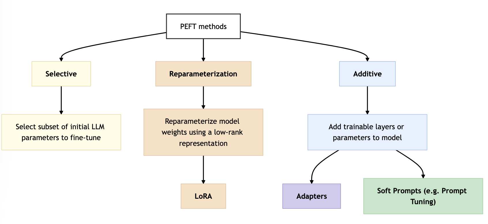

<!-- 
 Copyright Amazon.com, Inc. or its affiliates. All Rights Reserved.
 SPDX-License-Identifier: CC-BY-SA-4.0
 -->

# Parameter-efficient fine-tuning (PEFT)

**Content Level: 200**

## Suggested Pre-Reading

* [Model Architecture and Parameters](../../../2_1_key_primitives/2_1_1_prompt/2_1_1_prompt.md)
* [Introduction to Fine-tuning](../fine_tuning.md)
* [Full Fine-Tuning Fundamentals](../2_3_4-1_full_fine-tuning/full_fine-tuning.md)
* [Model Context and Memory](../../2_3_2_prompt_engineering/2_3_2-4_context_memory/context_memory.md)

## TL;DR

PEFT techniques enable model adaptation while training only a small subset of parameters, reducing computational costs and memory requirements compared to full fine-tuning, making LLM adaptation more accessible and efficient for production environments.

## Understanding PEFT

Full fine-tuning requires memory not just to store the model, but various parameters required during the training process. Even when systems can hold the model weights, typically in the order of hundreds of gigabytes for the largest models, additional memory allocation is necessary for optimizer states, gradients, forward activations, and temporary memory throughout the training process. These additional components can be many times larger (12x - 20x) than the model and can quickly exceed the capacity of consumer hardware.

In contrast to full fine-tuning where every model weight updates during supervised learning, PEFT methods only update a small subset of parameters. Some PEFT techniques freeze most of the model weights and focus on fine-tuning a subset of existing model parameters in specific layers or components. Other techniques leave the original model weights untouched, instead adding a small number of new parameters or layers and fine-tuning only the new components. This reduces memory pressure during training since gradients, optimizer states, and activations are only maintained for the small number of trainable parameters.

PEFT fine-tuning reduces memory requirements
 

With PEFT, most if not all of the LLM weights remain frozen. As a result, the number of trained parameters becomes much smaller than the number of parameters in the original LLM. In some cases, just 15-20% of the original LLM weights require training. Some PEFT techniques like LoRA (Low-Rank Adaptation) reduce trainable parameters to less than 1% of the original model size, depending on the rank and number of layers adapted. This makes the memory requirements for training much more manageable. In fact, PEFT implementation often succeeds on a single GPU. In addition, because the original LLM undergoes only slight modifications or remains unchanged, PEFT reduces susceptibility to the catastrophic forgetting problems of full fine-tuning. Using quantized models (e.g., QLoRA with 4-bit precision) further reduces memory needs, enabling 7B-scale models to be trained on 1–2 consumer GPUs with 24–32GB memory.

Full fine-tuning creates a new version of the model for each training task. Each fine-tuned model maintains the same size as the original version. This leads to expensive storage requirements when fine-tuning occurs across multiple tasks.

### Using PEFT to improve performance

PEFT training focuses on a small number of weights. The technique reduces the model's footprint to as little as a few megabytes, depending on the task. During inference, the new parameters combine with the original LLM weights. Task-specific PEFT weights undergo training separately and allow simple interchange during inference, enabling efficient adaptation of the original model to multiple tasks. Adapter switching can be done dynamically at runtime in frameworks like Hugging Face’s transformers and PEFT libraries, or merged statically for latency-sensitive deployments.

Parameter efficient fine-tuning offers several methods, each presenting trade-offs between parameter efficiency, memory efficiency, training speed, model quality, and inference costs. PEFT techniques are not one-size-fits-all—real-world performance often depends on the alignment between method choice and task characteristics (e.g., classification vs. generation).

### PEFT method categories 

<a href="https://arxiv.org/abs/2303.15647" target="_blank" rel="noopener noreferrer">PEFT Methods Diagram</a>

PEFT techniques fall under the following three categories:

1. **Selective methods:** These methods fine-tune only a subset of the original LLM parameters. Multiple approaches exist for parameter selection and updating. The training can target specific components of the model, particular layers, or individual parameter types. Research indicates mixed performance results with these methods, showing significant trade-offs between parameter efficiency and compute efficiency. This guide will not focus on selective methods.
2. **Reparameterization methods:** These methods work with the original LLM parameters while reducing the number of parameters requiring training through new low rank transformations of the original network weights. LoRA represents a commonly used technique in this category. For more information see the section on [LoRA](../2_3_4-2_PEFT(parameter%20efficient%20fine-tuning)/2_3_4_2_1LoRA/lora.md).
3. **Additive methods:** These methods maintain frozen original LLM weights while introducing new trainable components. Two main approaches exist for additive methods:
    1. **Adapter methods** add new trainable layers to the model architecture, typically inside the encoder or decoder components after the attention or feed-forward layers.
    2. **Soft prompt methods** maintain fixed and frozen model architecture while focusing on input manipulation for improved performance. Implementation occurs through adding trainable parameters to prompt embeddings or maintaining fixed input while retraining embedding weights. Prompt tuning represents a specific soft prompts technique. Soft prompts are especially useful when access to model internals is restricted (e.g., via API), or when training needs to be confined to the input space.

Each PEFT category comes with advantages and trade-offs in parameter efficiency, computational requirements, and implementation complexity. Reparameterization methods like LoRA currently lead industry adoption due to their balance of efficiency and performance. Additive methods provide flexibility when model access is limited or when specific architectural constraints exist. When selecting a PEFT approach, consider the use case requirements, available computational resources, and model access level. For most enterprise applications, starting with established techniques like LoRA offers a practical entry point into PEFT implementation while maintaining reasonable performance gains and resource efficiency.

## Making it Practical

Selecting the most appropriate parameter-efficient fine-tuning (PEFT) method involves balancing technical constraints with task requirements and deployment goals. The choice depends on a combination of factors including available compute resources—whether working on a single GPU (e.g., ml.g5.xlarge) or distributed infrastructure such as SageMaker HyperPod with Trn1—access level to model weights (e.g., open-source models via Hugging Face vs. hosted models on Amazon Bedrock), inference latency tolerance, and the nature of the downstream task, such as instruction-following, classification, or multi-modal reasoning like visual question answering (VQA).

Resource planning should account for both training and inference phases. Training a LoRA adaptation for a 7B parameter model typically requires 16GB GPU memory, making it feasible on Amazon EC2 g4dn instances. For inference, Amazon SageMaker endpoints support dynamic loading of PEFT adaptations, enabling efficient model serving.

Implementation monitoring differs from full fine-tuning. Amazon CloudWatch metrics can track both base model and adaptation performance separately. This separation helps identify whether performance issues stem from the base model or PEFT components. Amazon SageMaker Model Monitor provides comprehensive production deployment monitoring.

For production deployments, a systematic approach to manage multiple PEFT adaptations is important. Version control  adaptation weights. The lightweight nature of PEFT adaptations makes it practical to maintain multiple specialized versions while using shared base model infrastructure.

Before full implementation, validate the chosen PEFT approach through small-scale experiments. Amazon SageMaker Processing Jobs can evaluate adapted model performance against both base model and fully fine-tuned alternatives using domain-specific metrics. This validation helps justify the PEFT approach and identifies potential limitations early in the implementation process.

While PEFT reduces resource requirements, evaluate AWS infrastructure for optimal performance and cost efficiency. Amazon SageMaker Training Compiler optimizes training performance, while Amazon SageMaker Neo enhances inference optimization.

## Get Hands-On

AWS Blog: [PEFT fine tuning of Llama 3 on SageMaker HyperPod with AWS Trainium](https://aws.amazon.com/blogs/machine-learning/peft-fine-tuning-of-llama-3-on-sagemaker-hyperpod-with-aws-trainium/){:target="_blank" rel="noopener noreferrer"}

## Further Reading
* Hugging Face: [Using PEFT at Hugging Face](https://huggingface.co/docs/hub/en/peft){:target="_blank" rel="noopener noreferrer"}
* Hugging Face: [PEFT techniques:](https://huggingface.co/docs/peft/en/index){:target="_blank" rel="noopener noreferrer"}
* PEFT Paper: [Scaling Down to Scale Up: A Guide to Parameter-Efficient Fine-Tuning](https://arxiv.org/abs/2303.15647){:target="_blank" rel="noopener noreferrer"}

## Contributors

**Primary Author:** Wangechi Doble- Principal Technologist 

**Primary Reviewer:** Baishali Chaudhury - Applied Scientist II 
