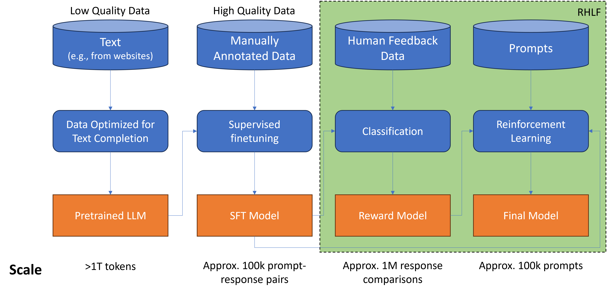

<!-- 
 Copyright Amazon.com, Inc. or its affiliates. All Rights Reserved.
 SPDX-License-Identifier: CC-BY-SA-4.0
 -->

# Fine Tuning with Reinforcement Learning **from Human Feedback (RLHF)**

**Content Level: 200**

## Suggested Pre-Reading

* [Introduction to Machine Learning](https://aws.amazon.com/training/learn-about/machine-learning/){:target="_blank" rel="noopener noreferrer"}
* [Introduction to LLMs](../../../../../1_0_generative_ai_fundamentals/1_1_core_concepts_and_terminology/core_concepts_and_terminology.md)
* [Introduction to Fine-Tuning](../../fine_tuning.md)
* [Basics of Reinforcement Learning](https://aws.amazon.com/what-is/reinforcement-learning/){:target="_blank" rel="noopener noreferrer"}
* [Understanding Model Alignment](../preference_alignment.md)

## TL;DR

RLHF is a fine-tuning technique that uses human feedback to guide model behavior toward desired outputs through reinforcement learning. It enables more precise control over model responses and is important for aligning AI systems with human values and preferences. The complete process demands significant computational capacity, human labeling effort, and engineering expertise. Customers should consider simpler alternatives such as Direct Preference Optimization.

## **Understanding RLHF**

RLHF is a technique for fine-tuning large language models to better align with human preferences. Models learn to acknowledge limitations and avoid problematic content. The approach enables applications like AI assistants that adapt to user preferences through feedback.

Reinforcement learning (RL) works through an agent making decisions in an environment to maximize rewards. The agent takes actions, observes changes, and receives feedback. Through repetition, the agent develops better decision-making strategies. The Tic-Tac-Toe game illustrates this process - an agent plays to win by choosing moves, observing the board state, and learning from outcomes.

In LLMs, RLHF applies these principles differently. The language model becomes the agent, generating text that aligns with human preferences. The context window functions as the environment, while the current context represents the state. The model generates words and sentences by selecting from its vocabulary based on patterns and context.

RLHF Process Diagram
 

The reward system measures how well the generated text matches human preferences. While human evaluators could score each output, this proves time-consuming and expensive. Instead, a reward model trained on human examples is used to evaluate the LLM's outputs and guide improvements. The reward model assesses completions and assigns values that help update the LLM's weights toward better alignment with human preferences.

The training process works through cycles of generation, evaluation, and improvement. This sequence of actions and states is referred to as a "rollout" in language modeling. The reward model guides these iterations by encoding human preferences. This approach helps develop language models that generate text meeting human expectations for usefulness and appropriateness.

### **RLHF implementation**

Let’s visualize the development process for a Large Language Model to see where RLHF fits in.

Fine-tuning an LLM with RLHF begins with selecting a model that can perform a desired task, such as text summarization or question answering. Starting with an instruction-tuned model that has already been fine-tuned across multiple tasks often provides better initial capabilities. This model processes a dataset of prompts to generate multiple completions for each prompt.

The next phase involves collecting feedback from human labelers on the generated completions. A specific criteria for assessment, such as helpfulness or toxicity reduction is first established. For example, given the prompt "my house is too hot," labelers rank three different completions based on helpfulness. A practical solution suggesting ways to cool the house would rank highest, while unhelpful or contradictory responses would rank lower. This ranking process repeats across many prompt-completion sets to build a comprehensive training dataset for the reward model.

Multiple labelers review the same prompt-completion sets to establish consensus and minimize individual bias. Clear instructions are important for obtaining quality feedback. Labelers receive detailed guidelines covering the primary task, evaluation criteria, fact-checking procedures, and protocols for handling ties between completions or flagging nonsensical answers. These instructions help ensure consistent, high-quality responses across diverse labelers from different backgrounds.

After collecting human assessments, the ranking data must be converted into pairwise comparisons before training the reward model. For N completions per prompt, there are N-choose-2 possible pairs. Each pair receives a binary score, with 1 for preferred responses and 0 for less preferred ones. The preferred completion must appear first, as the reward model expects this ordering.

While gathering simple thumbs-up/down feedback might be easier, ranked feedback provides more training data for the reward model. A single ranking of three completions yields three distinct prompt-completion pairs, enriching the training dataset. This structured approach enables the reward model to learn from comprehensive human preferences, ultimately replacing human evaluators in the reinforcement learning fine-tuning process.

### **Training the reward model**

While significant human effort has been required to reach this point, once the reward model is trained, further human involvement becomes unnecessary. The reward model replaces the human labeler, automatically selecting the preferred responses during the RLHF process.

The reward model is typically another language model, trained using supervised learning methods on the comparison data prepared from human labelers' assessments. For any given input, the reward model learns to favor the human-preferred response while optimizing the difference between preferred and non-preferred responses. As previously discussed, the human-preferred option is always clearly labeled in the training data.

Once trained on the human-ranked pairs of inputs and responses, the reward model functions as a binary classifier, providing scores for positive and negative outcomes. These scores represent the model's raw outputs before any final processing. For example, to detoxify the LLM, the reward model would need to identify whether a response contains hate speech. In this case, the two categories would be "non-hate" (the positive category to optimize for) and "hate" (the negative category to avoid). The highest score for the positive category serves as the reward value in the learning process.

It's important to understand that these raw scores can be converted into probabilities through additional processing. For instance,  a high reward score would be provided for a non-toxic response and a low reward score for a toxic response.

### **Applying the Reward Model to fine-tune the LLM**

Starting with a model that already demonstrates strong performance in a set of target tasks, typically an instruction-tuned LLM is recommended. The process starts by feeding a prompt from a dataset to the instruction-tuned LLM, which generates a completion. For example, given the prompt "a horse is," the model might generate "a fast animal." This prompt-completion pair is then evaluated by the reward model, which assigns a reward value based on its training from human feedback. Higher values indicate more aligned responses, while lower or negative values suggest less aligned responses.

The reward value for each prompt-completion pair is then fed into the reinforcement learning algorithm, which updates the LLM's weights to encourage more aligned, higher-reward responses. This updated version becomes an intermediate model, which is referred to as the RL-updated LLM. These steps constitute a single iteration of the RLHF process, which continues for a predetermined number of epochs, similar to other fine-tuning approaches.

As the process continues, the RL-updated LLM typically generates completions that receive higher reward scores, indicating that the weight updates are successfully producing more aligned responses. The iterative process continues until the model meets specific evaluation criteria, such as reaching a defined helpfulness threshold, or until it completes a maximum number of steps (for example, 20,000 iterations). The resulting model becomes the human-aligned LLM.

RL algorithms that convert reward model outputs into LLM weight updates include Proximal Policy Optimization, as a popular choice, among several existing algorithms for this purpose.

### Proximal Policy Optimization (PPO) Overview

PPO functions as a reinforcement learning algorithm that helps align language models with human preferences. The process works by making small, controlled updates to the model over multiple iterations. These updates stay within specific boundaries, keeping the updated model close to its previous version - hence the term "proximal" in the name. This controlled approach leads to stable learning while maximizing rewards.

The PPO process operates in two phases. In Phase I, the language model runs experiments by completing given prompts. A reward model evaluates these completions based on human preferences, considering factors like helpfulness and accuracy. The system uses a value function to estimate expected rewards for completions. For instance, a completion might receive a reward of 1.87, while another might get -1.24. The value function estimates future rewards based on the current sequence of tokens.

Phase II involves updating the model's weights based on the results from Phase I. These updates occur within a "trust region" - a bounded area that maintains proximity to the original model. This approach helps guide the model toward better performance while avoiding unstable changes. The PPO policy objective serves as the main tool for optimization during training.

The mathematical framework of PPO involves comparing token probabilities between the original and updated models. The system uses an "advantage term" to evaluate how each potential token choice compares to alternatives. A positive advantage indicates a better-than-average token choice, while a negative advantage suggests a poor choice. The goal is to maximize these expressions within reasonable bounds.

PPO includes additional components like entropy loss, which helps maintain model creativity. Without this, the model might generate repetitive responses. The system balances this through hyperparameters that help control the training process. After updating the weights through backpropagation, the cycle begins again with the improved model.

While PPO is the primary method for reinforcement learning from human feedback, other approaches exist. Recent developments, such as Stanford's [Direct Preference Optimization (DPO)](../2_3_4_3_2_direct_preference_optimization(DPO)/dpo.md), have continued to advance this field. The field remains active, with researchers exploring ways to improve how language models learn from human preferences.

### Common challenges 

A common challenge in RL is reward hacking, where the model learns to maximize rewards in ways that don't truly meet the intended goals. In language models, this might mean adding certain words or phrases that increase scores but reduce overall text quality. For example, when trying to reduce toxic language, a model might start using exaggerated positive phrases like "most awesome" or "most incredible" repeatedly, or even generate grammatically incorrect text that happens to score well.

To prevent reward hacking, a reference model - a frozen copy of the initial LLM is used as a baseline for comparison. During training, both the reference model and the updated model receive the same prompts. Their outputs are compared using Kullback-Leibler (KL) divergence, a statistical measure of the difference between probability distributions. Standard machine learning libraries include KL divergence calculations, making implementation straightforward. 

The system calculates KL divergence for each generated token across the model's vocabulary. While this involves many tokens, using a softmax function helps reduce the number of probabilities to consider. This process typically requires GPU computing power for efficiency. The KL divergence score becomes part of the reward calculation, penalizing the updated model if it moves too far from the reference LLM. This ensures the updated model doesn't stray too far from natural language patterns.

The lack of sufficient human-feedback data for specific alignment goals presents a major challenge in RLHF implementation. While reward hacking creates additional complications, these issues become particularly serious during real-world deployment. The theoretical concerns about reward hacking transform into concrete problems that require practical solutions when moving from concept to implementation.

Two viable approaches address this challenge. First, leveraging an open source reward model and training the model using PPO, then enhancing output quality through Best-of-N decoding which generates multiple response candidates and selects the highest-scoring option based on the reward model's evaluation. Alternatively, with access to a sufficiently robust preference dataset, DPO becomes possible. This second method provides a less resource intensive solution when comprehensive preference data exists.

[Parameter-Efficient Fine-Tuning (PEFT)](../../2_3_4-2_PEFT(parameter%20efficient%20fine-tuning)/peft.md) methods such as DPO optimize computational resources when combined with RLHF. Instead of updating all model weights, PEFT only modifies a small set of parameters while maintaining the base model's knowledge. This approach reduces memory requirements by approximately 50% during training.

After alignment, model performance is evaluated using standardized datasets. For toxicity reduction, this involves comparing the probability of toxic responses before and after alignment. A successful alignment process should show a decreased toxicity score in the final model while maintaining natural language capabilities.

### **Making it Practical**

RLHF becomes relevant when developing AI systems that require alignment with specific values or preferences. While implementing RLHF from scratch is complex and resource-intensive, understanding its principles helps customers make informed decisions about model selection and system architecture. For most organizations considering RLHF, the initial focus should be on AWS service integration and existing solutions rather than building custom implementations.

For most customers, the practical approach is to leverage pre-aligned models through services like Amazon Bedrock, rather than implementing RLHF independently. When selecting models, evaluate their alignment characteristics against a specific use case requirements. For example, customer service applications may prioritize models with strong safety alignment, while content moderation systems need models specifically aligned for toxicity detection. Amazon SageMaker provides tools and frameworks that can help streamline this evaluation process.

RLHF concepts should guide several key decisions in the ML pipeline. Consider how existing workflows can incorporate feedback mechanisms without requiring full RLHF implementation. While complete RLHF may be impractical, implementing simplified feedback systems helps monitor and improve model performance. Design the system to collect specific, actionable feedback that aligns with goals and integrates with AWS services like SageMaker Ground Truth for efficient feedback collection and management.

Establish evaluation metrics based on RLHF principles and AWS best practices. Rather than relying solely on accuracy metrics, include alignment-focused measurements like safety scores or human preference ratings. Regular assessment against these criteria helps detect potential drift in model behavior. AWS CloudWatch can be configured to monitor these metrics and trigger alerts when alignment scores fall below acceptable thresholds.

For customers pursuing custom model development, start with PEFT approaches before considering full RLHF. PEFT methods can achieve meaningful alignment improvements while requiring significantly fewer computational resources. If proceeding with RLHF, consider the data collection strategy - high-quality human feedback is important but expensive to obtain. Consider using Amazon Mechanical Turk or specialized annotation services for gathering human feedback at scale.

Production deployments should include monitoring systems that track both traditional performance metrics and alignment-specific indicators. Implement guardrails based on RLHF principles, such as content filtering and output verification, to maintain aligned behavior in production. AWS provides several services to create integrated monitoring solutions, including CloudWatch, SageMaker Model Monitor, and Amazon EventBridge for automated responses to alignment issues.

The decision to implement RLHF should be guided by a clear understanding of trade-offs between complexity, cost, and benefits. Create decision trees or flowcharts to help evaluate when RLHF is appropriate versus simpler alternatives. Consider factors such as available computational resources, data quality requirements, and integration with existing AWS infrastructure. Document these decision processes to maintain consistency across the organization.

Cost analysis and resource planning are key aspects of RLHF implementation. Evaluate the computational requirements, storage needs, and human labeling costs against budget and timeline constraints. AWS cost calculators and resource planning tools can help estimate the total cost of ownership for different implementation approaches. Consider starting with small-scale pilots to validate assumptions before committing to larger implementations.

When integrating RLHF concepts into existing systems, focus on incremental improvements rather than complete overhauls. Begin with basic feedback collection and monitoring systems, then gradually expand capabilities based on demonstrated value and lessons learned. Use AWS step functions or similar orchestration tools for managing complex RLHF workflows and scalability.

Security considerations and responsible AI dimensions should be fundamental to the RLHF implementation strategy. Feedback collection systems should protect user privacy and comply with relevant regulations. Implement appropriate access controls and audit mechanisms using AWS IAM and other security services. Regular reviews of alignment metrics should include checks for potential biases or unintended consequences in model behavior.

## Get Hands-On:

AWS Blog: [Improve LLM performance with human and AI feedback on Amazon SageMaker for Amazon Engineering:](https://aws.amazon.com/blogs/machine-learning/improve-llm-performance-with-human-and-ai-feedback-on-amazon-sagemaker-for-amazon-engineering/){:target="_blank" rel="noopener noreferrer"}

## Further Reading:

* LinkedIn Blog: [RLHF: Reinforcement Learning from Human Feedback](https://huyenchip.com/2023/05/02/rlhf.html#phase_3_rlhf){:target="_blank" rel="noopener noreferrer"}
* Medium Blog: [Frugal RLHF with multi-adapter PPO on Amazon SageMaker](https://medium.com/data-science/preference-alignment-for-everyone-2563cec4d10e){:target="_blank" rel="noopener noreferrer"}

## Contributors

**Primary Author:** Wangechi Doble- Principal Technologist 

**Primary Reviewer:** Jae Oh Woo - Sr Applied Scientist 
