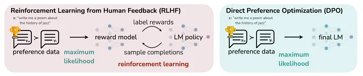

<!-- 
 Copyright Amazon.com, Inc. or its affiliates. All Rights Reserved.
 SPDX-License-Identifier: CC-BY-SA-4.0
 -->

# Direct Preference Optimization (DPO)

**Content Level: 200**

## Suggested Pre-Reading

* [Introduction to Model Fine-tuning](../../fine_tuning.md)
* [Basics of Reinforcement Learning](https://aws.amazon.com/what-is/reinforcement-learning/){:target="_blank" rel="noopener noreferrer"}
* [RLHF Fundamentals](../2_3_4_3_1_reinforcement_learning_from_human_feedback(RLHF)/rlhf.md)

## TL;DR

Direct Preference Optimization (DPO) is a more efficient alternative to RLHF for aligning language models with human preferences, eliminating the need for reward modeling and reinforcement learning while achieving similar or better results through direct optimization of preference data.

## Understanding DPO

DPO fine-tunes language models using human preferences without reward modeling. This simplified approach reduces training time compared to Proximal Policy Optimization (PPO) while improving model performance. The performance metrics of DPO demonstrate parity or improvements compared to established PPO methods. The removal of reward modeling and policy optimization steps accounts for a reduction in complexity. The computational requirements show measurable reductions compared to traditional RLHF  (Reinforcement Learning from Human Feedback)  implementations. The training process operates on a foundation of paired preferences, simplifying data requirements.

The following diagram compares DPO to RLHF.

Source: [DPO optimizes for human preferences while avoiding reinforcement learning](https://arxiv.org/pdf/2305.18290){:target="_blank" rel="noopener noreferrer"}_

DPO bridges the gap between supervised fine-tuning and RLHF by introducing a streamlined approach to preference learning. While supervised fine-tuning simply trains models to replicate input-output pairs, and RLHF requires separate reward models and policy optimization, DPO combines the advantages of both methods. It maintains the straightforward training process of supervised learning while incorporating human preferences like RLHF, but without the additional complexity of reward modeling.

### DPO Limitations

* **Data Quality and Coverage Limitations:** DPO requires high-quality paired examples that demonstrate specific preferences between model outputs. Unlike RLHF's reward modeling approach which can learn from scalar rewards, DPO's performance depends entirely on the binary preferences expressed in these training pairs. For instance, while RLHF can rate customer service responses on a scale from 1-10 (like rating "I can't help you" a 2 and "I'll help you process your refund right away" an 8), DPO only knows that the second response is preferred over the first. The model's ability to learn proper query optimization strategies directly depends on how well these paired examples represent good versus poor query patterns.
* **Binary Preference Constraints:** The binary nature of DPO's preference learning creates limitations in scenarios where multiple responses might be acceptable with varying degrees of preference. Consider a technical documentation assistant: while two responses might both be technically accurate, one could be more suitable for beginners and another for experts. DPO's binary approach might not effectively capture this nuance, as both responses are "correct" but preferable in different contexts. This becomes particularly evident when dealing with open-ended tasks or situations where the ideal response depends heavily on context. The method may not fully capture the richness of human preferences in these cases, potentially leading to oversimplified model behavior.
* **Limited Preference Representation:** The preference pairs used for training need to cover a sufficient range of scenarios and edge cases to achieve the desired model alignment. For instance, in a code documentation system, preference pairs might clearly show that detailed comments are preferred over brief ones, but may struggle to convey preferences about code structure or documentation style conventions. Certain preferences may be difficult to express through paired examples alone, especially when dealing with abstract concepts or complex behavioral constraints. This limitation can affect the model's ability to generalize preferences beyond the specific examples seen during training.
* **Reduced Control and Diagnostics:** The absence of an explicit reward model in DPO, while beneficial for computational efficiency, means there is less direct control over the preference learning process. For example, in a content moderation system, RLHF might use a reward model that explicitly scores responses based on multiple factors like accuracy, tone, and safety. In contrast, DPO would rely solely on paired examples showing preferred versus non-preferred responses, making it harder to fine-tune specific aspects of the model's behavior. Unlike RLHF where the reward model can be independently analyzed and adjusted, DPO's preference learning is more implicit. This can make it harder to diagnose and correct specific aspects of the model's learned preferences, particularly when the model exhibits unexpected behavior.

These challenges highlight the trade-offs inherent in DPO's simplified approach to preference learning. While the method reduces implementation complexity compared to RLHF, it requires careful consideration of how preferences are represented and expressed through paired examples. Understanding these limitations helps determine whether DPO is suitable for specific alignment tasks and what additional measures might be needed to achieve desired model behavior.

### Technical Implementation

DPO works by optimizing a model to match human preferences without the complexity of reward modeling or reinforcement learning. The method takes pairs of responses - one preferred and one less preferred - and trains the model to assign higher probability to the preferred responses. This approach eliminates the need for complex reward models and policy optimization steps that are typically required in conventional RLHF methods. 

A key differentiator for DPO is its ability to transform the preference learning problem into a straightforward binary classification task. Instead of dealing with reward functions and policy gradients, DPO uses a simple mathematical framework that connects model outputs to human preferences. This simplification not only makes the training process more efficient but also leads to more stable and consistent results.

In practical applications, DPO achieves improved performance compared to PPO while requiring less computational resources and engineering effort. The training pipeline removes multiple steps from traditional approaches, resulting in a streamlined process. Customers implementing DPO can achieve faster training times and reduced complexity in their LLM development pipelines. The method is effective in fine-tuning language models to better align with human preferences and responsible AI dimensions as the process maintains strict requirements for preference data quality standards. One limitation is that the framework may show reduced capability in capturing preference subtleties compared to explicit reward models. The current body of empirical evidence remains concentrated in specific application domains.

From an implementation standpoint, DPO requires only a base model and a dataset of preferred and non-preferred responses. This straightforward requirement makes it more accessible to customers looking to develop or improve their 
models. The method's simplicity also makes it easier to debug and maintain compared to traditional RLHF approaches. 

## **Making it Practical**

DPO provides a more accessible path for fine-tuning language models compared to traditional RLHF approaches. Customers should consider DPO as a starting point before investing in complex RLHF pipelines. The straightforward requirements of DPO - a base model and preference data - make it well-suited for customers new to model alignment.

Real-world applications for DPO include improving chatbot responses, aligning content generation with brand guidelines, and enforcing responsible AI dimensions in model outputs. When working to align models with specific requirements, DPO offers a practical first step that can deliver meaningful improvements without the engineering complexity of RLHF.

AWS customers can implement DPO using Amazon SageMaker for training and deployment. Amazon SageMaker Ground Truth helps create and manage preference datasets through its labeling workflows. The process begins with collecting paired examples using Ground Truth's built-in labeling templates or custom workflows. These labeled preferences can then be used with training scripts in SageMaker to fine-tune foundation models available through Amazon Bedrock or custom models.

Implementation planning should account for the collection and curation of high-quality preference data. Customers should establish processes for generating paired examples that clearly demonstrate preferred versus non-preferred model behaviors. While DPO reduces implementation complexity, the quality of preference data remains critical for successful model alignment. When the preference dataset is insufficient or lacks necessary diversity, consider alternative approaches such as those detailed in the [RLHF section](../2_3_4_3_1_reinforcement_learning_from_human_feedback%28RLHF%29/rlhf.md). The performance of DPO is directly tied to the completeness and quality of the preference data, making this an important consideration in approach selection.

Production deployments should account for DPO's limitations. The method may not capture nuanced preferences as effectively as explicit reward modeling. Customers should evaluate whether their use case requires the additional complexity of RLHF or if DPO's simplified approach will meet their needs. Performance monitoring should track not just standard metrics but also alignment with the specific preferences being optimized. Amazon CloudWatch can be used to monitor model performance and preference alignment in production, while Amazon SageMaker Model Monitor helps track data drift and quality metrics.

For customers with existing RLHF implementations, DPO can serve as a lightweight alternative for iterative improvements. The reduced computational requirements make it practical to experiment with different preference datasets and fine-tuning approaches. Using Amazon SageMaker's experiment tracking capabilities, customers can systematically compare DPO results with other alignment methods. DPO should be positioned as a complement to existing alignment methods rather than a complete replacement.

## Get Hands-On

AWS Blog: [Align Meta Llama 3 to human preferences with DPO, Amazon SageMaker Studio, and Amazon SageMaker Ground Truth](https://aws.amazon.com/blogs/machine-learning/align-meta-llama-3-to-human-preferences-with-dpo-amazon-sagemaker-studio-and-amazon-sagemaker-ground-truth/){:target="_blank" rel="noopener noreferrer"}

## Further Reading
* Original DPO paper:  [Direct Preference Optimization: Your Language Model is Secretly a Reward Model](https://arxiv.org/abs/2305.18290){:target="_blank" rel="noopener noreferrer"}
* Medium Blog: [Direct Preference Optimization (DPO) in Language Model Alignment](https://medium.com/@simeon.emanuilov/direct-preference-optimization-dpo-in-language-model-alignment-c870fe380f9e){:target="_blank" rel="noopener noreferrer"}

## Contributors

**Primary Author:** Wangechi Doble- Principal Technologist 

**Primary Reviewers:**
 - Jae Oh Woo - Sr Applied Scientist  
 - Markus Bestehorn - Tech Lead Generative AI EMEA 
