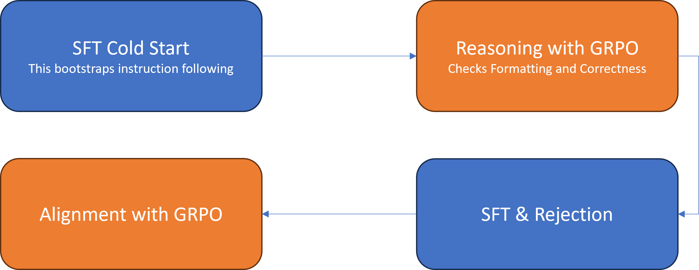
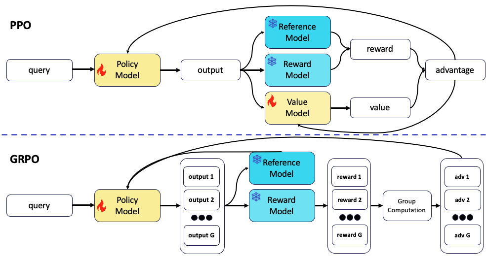

<!-- 
 Copyright Amazon.com, Inc. or its affiliates. All Rights Reserved.
 SPDX-License-Identifier: CC-BY-SA-4.0
 -->

# Group Relative Policy Optimization (GRPO)

**Content Level: 200**

## Suggested Pre-Reading

* [Introduction to Foundation Models](../../../../../1_0_generative_ai_fundamentals/1_1_core_concepts_and_terminology/core_concepts_and_terminology.md)
* [Reinforcement Learning Fundamentals](../../2_3_4-3_Preference%20Alignment/2_3_4_3_1_reinforcement_learning_from_human_feedback(RLHF)/rlhf.md)
* [Fine-Tuning Foundations](../../fine_tuning.md)
* [Proximal Policy Optimization (PPO)](../../2_3_4-3_Preference%20Alignment/2_3_4_3_2_direct_preference_optimization(DPO)/dpo.md)

## TL;DR

Group Relative Policy Optimization (GRPO) is a reinforcement learning (RL) algorithm that enhances reasoning capabilities in Large Language Models (LLMs). First introduced in the DeepSeekMath paper, GRPO serves as an efficient variant of Proximal Policy Optimization (PPO) while requiring fewer computational resources. Unlike traditional RL methods that use external critics to guide learning, GRPO optimizes models by comparing groups of responses to each other. This relative evaluation approach enables efficient training, making GRPO effective for complex reasoning tasks that require extended chains of thought.

## Understanding GRPO

Understanding GRPO requires familiarity with the foundational process that created DeepSeek-R1, a reasoning-focused variant of DeepSeek's base language model. Li et al. (2024) documented this transformation in their paper "DeepSeek-R1: Incentivizing Reasoning Capability in LLMs via Reinforcement Learning," which demonstrates how GRPO and other reinforcement learning techniques enhance a model's reasoning capabilities during post-training.

GRPO offers two advantages that advance machine learning training:

* **Computational Efficiency:** GRPO represents a major breakthrough in training methodology. Compared to traditional Reinforcement Learning from Human Feedback (RLHF) methods, such as those used in ChatGPT's PPO, GRPO reduces computational requirements. This reduction simplifies the reinforcement learning process and makes training possible on consumer-grade hardware.
* **Accessibility:** GRPO democratizes model training by minimizing resource requirements. A 1B parameter model can be trained with just 16GB of VRAM, making it feasible to use fewer compute resources. This accessibility extends to local training capabilities, allowing researchers and developers to work with smaller models on consumer hardware, opening new possibilities for AI development and experimentation.

### **DeepSeek-R1's Implementation of GRPO**

The transformation from DeepSeek's base model to R1 follows a four-stage improvement pipeline, alternating between Supervised Fine-Tuning (SFT) and GRPO techniques as shown in the following diagram:

DeepSeek-Ri Training Pipeline

The four stages are:

1. **Initial Supervised Fine-Tuning (SFT):** The process begins with SFT, where the model trains on several thousand expert-validated examples of high-quality data. This foundation ensures the model starts with human-verified learning content.
2. **Reinforcement Learning with GRPO:** Trains the model to generate structured reasoning traces within specific tags (<reasoning></reasoning>). This phase implements a deterministic reward system that evaluates proper formatting, logical consistency, and solution correctness.
3. **Advanced Supervised Fine-Tuning**: The system generates and processes 800,000 synthetic training examples. An automated filtering system, combined with an LLM Judge, validates responses and eliminates incorrect ones, ensuring data quality.
4. **Final GRPO Alignment:** Focuses on optimizing the model's helpfulness while implementing important safety constraints to prevent harmful outputs. This final stage allows the model to maintain both utility and responsibility in its responses.

### The Evolution from PPO to GRPO

PPO, the foundational reinforcement learning technique behind ChatGPT's development, was first detailed in the InstructGPT paper. This method revolutionized language models by enabling them to follow complex instructions rather than simply predicting the next word in a sequence.

The PPO process consists of three key phases. 

1. **Data collection:** The system generates multiple responses to user queries. These responses are then ranked by human evaluators or AI systems, creating a comprehensive dataset of ranked responses. 
2. **Reward Model Training:** The system develops a specialized model using the ranked dataset. This reward model learns to evaluate response quality for new prompts, essentially becoming an automated quality assessment tool.
3. **Model fine-tuning using RL:** The system uses the reward model to guide the language model's training. This reinforcement learning process optimizes the model to consistently generate high-quality responses that align with human preferences and instructions.

These steps are illustrated in the following diagram:

PPO Process diagram

After collecting ranked and labeled data, the next step is to train the LLM using PPO. However, PPO comes with increased computational costs. While GRPO maintains the core concept of using a reward model to guide training, the methodology introduces group-based optimization techniques that enhance efficiency and scalability.

The simplified diagram from the [GRPO paper]( https://arxiv.org/abs/2402.03300){:target="_blank" rel="noopener noreferrer"} shows the four different LLMs that are in the training process during PPO and GRPO represented in blue and yellow boxes below.

GRPO/PPO Comparison Diagram

## PPO vs. GRPO: Comparison Table

| Aspect                    | PPO                                                        | GRPO                                                   |
|---------------------------|------------------------------------------------------------|--------------------------------------------------------|
| **Training Signal**       | Reward model + Value model                                 | Reward model + Relative group-based comparison         |
| **Policy Update**         | Individual (per response)                                  | Group-wise (within batch)                              |
| **Value Model**           | Required                                                   | Not required                                           |
| **Reference Model**       | Yes (for KL control)                                       | Yes (for KL control)                                   |
| **Compute Requirement**   | High (multiple large models, higher memory and compute)    | Lower (fewer models, batch/group computation)          |
| **Typical Use**           | Large-scale RLHF (e.g., ChatGPT, InstructGPT)              | Efficient alignment & reasoning (e.g., DeepSeek-R1)    |
| **Key Innovation**        | Clipped updates, value estimation as baseline              | Group-based advantage, no value model                  |
| **Architecture**          | Policy, Value, Reward, Reference models                    | Policy, Reward, Reference models                       |
| **Comparison Basis**      | Absolute scoring for each response                         | Relative ranking within group/batch                    |
| **Resource Efficiency**   | Lower (requires more hardware, more GPU memory)            | Higher (can train on modest consumer GPUs)             |

## Key Conceptual Differences

1. **Value Estimation**
    - *PPO*: Requires a separate value model for expected return estimation per prompt.
    - *GRPO*: No value model; advantage is computed by comparing all responses within a group.

2. **Resource Efficiency**
    - *PPO*: Requires more memory and compute due to multiple models.
    - *GRPO*: Streamlined—reduced memory/computation, more accessible for small labs and individual researchers.

3. **Training Signal**
    - *PPO*: Uses absolute rewards from the reward model.
    - *GRPO*: Uses *relative* rewards—each response is evaluated compared to others in the batch.

4. **Scalability**
    - *PPO*: Enables large-scale RLHF but at a high computational cost.
    - *GRPO*: Designed for easier, scalable alignment and experimentation on modest hardware.

## Conceptual Training Pipeline

**PPO Process:**
1. Model generates multiple responses per prompt.
2. Reward model and value model score each response.
3. Policy is updated using both reward and value signals, with clipped updates for stability.

**GRPO Process:**
1. Model generates a batch of responses per prompt.
2. Reward model scores each response.
3. Advantages are calculated *relative to the batch* (no value model).
4. Policy is updated using group-based signals—simpler and more efficient.

## Making it Practical

Understanding GRPO's practical applications requires examining how it can be implemented in real-world scenarios. Customers looking to enhance their language models' reasoning capabilities can leverage GRPO's efficient training approach without requiring extensive computational resources. This makes it valuable for teams working with limited GPU availability or budget constraints.

For development teams beginning to explore GRPO implementation, start with smaller models and gradually scale up. A practical approach is to begin with a 1-2 billion parameter model, which can be trained using consumer-grade GPUs with 16-24GB of VRAM when used with LoRA ([oxen.ai blog](https://ghost.oxen.ai/grpo-vram-requirements-for-the-gpu-poor/){:target="_blank" rel="noopener noreferrer"}). This allows teams to experiment with and validate the GRPO methodology before committing to larger-scale implementations.

When implementing GRPO in production environments, focus on defining evaluation metrics that align with the specific use case. For instance, when developing a system for mathematical problem-solving, create reward functions that assess not just answer correctness, but also the clarity and efficiency of the reasoning process. This might include evaluating step-by-step explanations, checking for logical consistency, and verifying intermediate calculations.

Resource management becomes more straightforward with GRPO compared to traditional PPO implementations. Since GRPO eliminates the need for a separate Value Model, allocate those computational resources elsewhere in the training pipeline. This efficiency gain is valuable in production environments where resource optimization directly impacts operational costs.

Consider implementing GRPO in stages, similar to DeepSeek's approach. Begin with supervised fine-tuning on a small, high-quality dataset to establish baseline performance. Then gradually introduce GRPO training, starting with simple reward functions and progressively adding complexity after validating each stage's performance. This incremental approach helps identify and address any issues early in the implementation process.

Amazon SageMaker is ideal for implementing GRPO training pipelines. SageMaker’s distributed training capabilities and built-in experiment tracking features help manage the training process effectively. Amazon Bedrock can be utilized for evaluating model outputs and implementing reward functions, especially when using other foundation models as judges for response quality.

Monitor the GRPO implementation closely for signs of training instability or reward hacking. While GRPO's design helps mitigate these issues through its reference model mechanism, establishing good monitoring practices is important. Set up alerts for sudden changes in reward distributions or unexpected deviations in model behavior, and maintain detailed logs of training progress and model evaluations.

GRPO's efficiency gains come with the responsibility to maintain training quality. Regular validation of model outputs against the use case requirements should prevent the simplified training process from compromising performance. This is valuable when deploying models in production environments where reliability and consistency are important.

## Get Hands-On
Hugging Face: [Advanced Understanding of Group Relative Policy Optimization (GRPO) in DeepSeekMath](https://huggingface.co/learn/llm-course/en/chapter12/3a){:target="_blank" rel="noopener noreferrer"} 

## Further Reading

### Academic Papers and Research

* [DeepSeek-R1: Incentivizing Reasoning Capability in LLMs via Reinforcement Learning](https://arxiv.org/abs/2402.03300){:target="_blank" rel="noopener noreferrer"} - Original paper introducing GRPO and its implementation in DeepSeek-R1.
* [Proximal Policy Optimization Algorithms](https://arxiv.org/abs/1707.06347){:target="_blank" rel="noopener noreferrer"} - Foundational paper on PPO, which GRPO builds upon.
* [Constitutional AI: A Framework for Machine Learning Systems That Comply with Legal and Responsible AI](https://arxiv.org/abs/2310.07058){:target="_blank" rel="noopener noreferrer"} - Explores the broader context of responsible AI development.

### Technical Documentation

* [Amazon SageMaker Reinforcement Learning](https://docs.aws.amazon.com/sagemaker/latest/dg/reinforcement-learning.html){:target="_blank" rel="noopener noreferrer"} - Comprehensive guide to implementing RL in SageMaker.
* [AWS AI/ML Blog - Reinforcement Learning Category](https://aws.amazon.com/blogs/machine-learning/category/artificial-intelligence/reinforcement-learning/){:target="_blank" rel="noopener noreferrer"} - Collection of practical implementations and case studies.

### Industry Insights

* [The Rise of Foundation Models](https://hai.stanford.edu/news/rise-foundation-models){:target="_blank" rel="noopener noreferrer"} - Stanford HAI's perspective on the evolution of large language models.
* [Advancing Mathematical Reasoning in Large Language Models](https://www.deepmind.com/blog/advancing-mathematical-reasoning-in-large-language-models){:target="_blank" rel="noopener noreferrer"} - DeepMind's research on improving mathematical capabilities in LLMs.
* [Advanced Understanding of Group Relative Policy Optimization (GRPO) in DeepSeekMath](https://huggingface.co/learn/llm-course/en/chapter12/3a#advanced-understanding-of-group-relative-policy-optimization-grpo-in-deepseekmath){:target="_blank" rel="noopener noreferrer"} - Hugging Face LLM Course

## Contributors

**Primary Author:** Wangechi Doble- Principal Technologist 

**Primary Reviewer:** Jae Oh Woo - Sr. Applied Scientist 
