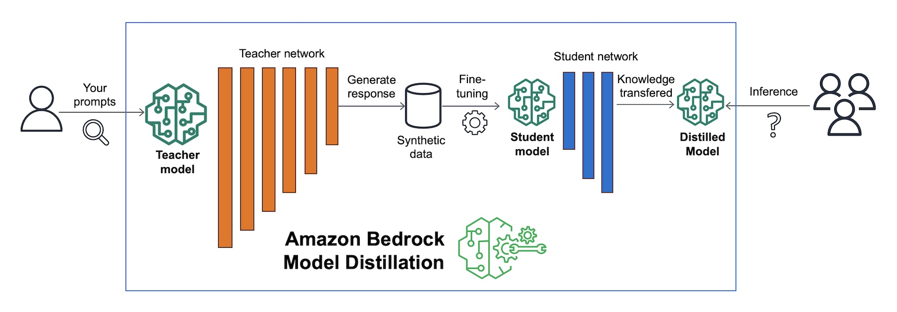

<!-- 
 Copyright Amazon.com, Inc. or its affiliates. All Rights Reserved.
 SPDX-License-Identifier: CC-BY-SA-4.0
 -->

# Distillation

**Content Level: 200**

## Suggested Pre-Reading

* [Introduction to GenAI Primitives](../../../2_1_key_primitives/index.md)
* [Responses: Understanding Model Outputs](../../../2_1_key_primitives/2_1_2_model_outputs/2_1_2_model_outputs.md)
* [Large Language Models Fundamentals](../../../../1_0_generative_ai_fundamentals/1_1_core_concepts_and_terminology/core_concepts_and_terminology.md)
* [Model Optimization Basics](../../../../3_0_architecture_and_design_patterns/3_4_scalability_performance/3_4_2_model_inference_optimization/index.md)

## TL;DR

Distillation is a model optimization technique that transfers knowledge from a larger, more capable "teacher" model to a smaller, more efficient "student" model. The student learns to replicate the teacher's behavior through a specialized training process that combines mimicking the teacher's probability distributions and learning from ground truth data. This approach enables customers to deploy smaller models that maintain most of the original performance while reducing computational costs and latency. For example, a 175B parameter teacher model can be distilled to a 6B parameter student while preserving 90% of the original capabilities. While distillation proves effective for encoder-only models like BERT, achieving up to 90% size reduction with minimal performance loss, it shows limited benefits for generative decoder models like GPT. This technique is valuable for edge deployments, mobile applications, and scenarios with strict latency or resource constraints where the original model size would be prohibitive.

## Understanding model distillation

Model distillation is a technique that transfers knowledge from a larger teacher model to a smaller student model. The student model learns to replicate the behavior of the teacher while requiring fewer computational resources. Common teacher-student size ratios range from 2:1 to 10:1, depending on the use case. For example, a BERT-large model with 340 million parameters can be distilled into a student model with 66 million parameters for a 5:1 reduction while maintaining 95% of the original performance.

Popular frameworks for implementing distillation include Hugging Face's Transformers library, Microsoft's FastFormers, and Intel's Neural Compressor. These tools provide standardized approaches for knowledge transfer between models. The process works particularly well for classification and embedding tasks. For instance, customer service applications often use distilled BERT models that achieve response times under 50ms while maintaining 97% accuracy compared to the original model.

The knowledge transfer focuses on the final prediction layer, where the student model learns to match the teacher's probability distributions across output classes. Real-world applications include mobile device deployment, where original models exceeding 1GB can be compressed to 100MB through distillation while preserving core functionality. Financial services companies frequently use distilled models for real-time fraud detection, reducing inference time from 200ms to 50ms.

The technique shows varying effectiveness across model architectures. Encoder-only models like BERT demonstrate high compression ratios due to their natural redundancy in representational learning. However, generative decoder models like GPT show more limited benefits, typically achieving only 2-3x compression while maintaining acceptable performance. This difference stems from the autoregressive nature of decoder models, which requires preserving more complex dependencies between tokens.

### Distillation Process

The following diagram illustrates model distillation. 

Source: [Amazon Bedrock Model Distillation](https://aws.amazon.com/blogs/aws/build-faster-more-cost-efficient-highly-accurate-models-with-amazon-bedrock-model-distillation-preview/){:target="_blank" rel="noopener noreferrer"}

The distillation process begins with a fine-tuned LLM as the teacher model and creates a smaller LLM as the student model. The teacher model's weights are first frozen and then the same teacher model is used to generate completions for the training data. At the same time, the student model generates completions for the same training data. The knowledge distillation between teacher and student model is achieved by minimizing a loss function called the distillation loss. To calculate this loss, distillation uses the probability distribution over tokens produced by the teacher model's softmax layer.

Since the teacher model is already fine-tuned on the training data, the probability distribution likely closely matches the ground truth data and won't have much variation in tokens. For this reason, the distillation applies a temperature parameter to the softmax function. A higher temperature increases the creativity of the language the model generates. With a temperature parameter greater than one, the probability distribution becomes broader and less strongly peaked. This softer distribution provides you with a set of tokens that are similar to the ground truth tokens.

In the context of distillation, the outputs from the teacher model are often referred to as "soft labels," while the corresponding outputs from the student model attempting to match these are called "soft predictions." This process involves the student model mimicking the probability distribution (adjusted by a temperature parameter) provided by the teacher model.

Separately, the student model is also trained on the ground truth from the original training data. In this case, the actual correct answers from the training data are called "hard labels," and the student model's outputs for these are termed "hard predictions." The difference between the hard predictions and hard labels is known as the "student loss."

In the complete distillation process, the student model is trained to minimize a combined loss function that weighs both the soft loss (the difference between soft labels and soft predictions) and the student loss, creating a balance between mimicking the teacher and learning from ground truth.

The combined distillation and student losses are used to update the weights of the student model via backpropagation. The key benefit of distillation methods is that the smaller student model can be used for inference in deployment instead of the teacher model. In practice, distillation is not as effective for generative decoder models. It's typically more effective for encoder only models, such as Burt that have a lot of representation redundancy. Note that with Distillation, you're training a second, smaller model to use during inference. You aren't reducing the model size of the initial LLM in any way.

## Making it Practical

Model distillation becomes relevant when deployment constraints require smaller, more efficient models while maintaining acceptable performance. Amazon SageMaker Neo optimizes distilled models for specific hardware targets, enabling deployment on Amazon EC2 instances or edge devices through AWS IoT Greengrass. Customers can implement distillation workflows using SageMaker Training jobs, where the teacher model runs on larger instances like p4d.24xlarge while the student trains on more cost-effective compute options.

Implementation planning starts with identifying target use case requirements and constraints. Edge deployments prioritize model size and inference speed, while API services focus on throughput optimization. AWS Inferentia and Trainium accelerators support both training and serving of distilled models, offering cost advantages for high-throughput scenarios.

Architecture decisions impact distillation effectiveness. Leading AWS partners like Hugging Face provide pre-distilled models through Amazon SageMaker JumpStart, reducing implementation complexity. The student model should balance capability and constraints. Unity Technologies demonstrated this balance by distilling their game physics models to run on Amazon Elastic Inference, reducing hosting costs by 65% while maintaining real-time performance requirements.

Production deployments benefit from comprehensive evaluation across multiple metrics. AWS CloudWatch provides monitoring for inference latency, memory usage, and throughput. Customers can use Amazon A/B Test to compare original and distilled model performance in production. Snap Inc. successfully deployed distilled computer vision models through Amazon Elastic Container Service, achieving sub-100ms latency while serving millions of daily requests.

Cost analysis should consider both training and deployment aspects. AWS Cost Explorer helps track expenses across the distillation pipeline. While initial training requires significant resources, Amazon EC2 Spot instances can reduce training costs by up to 90%. Several AWS financial services customers report 40-60% reduction in inference costs post-distillation, with payback periods typically under three months for high-volume applications.

Integration with existing model deployment pipelines requires updates to preprocessing steps. Amazon SageMaker Pipelines supports automated distillation workflows, while AWS Lambda can handle preprocessing adjustments. Waze, using AWS infrastructure, automated their traffic prediction model distillation process, reducing model update time from days to hours while maintaining prediction accuracy within 2% of the original model.

## Get Hands-On

AWS Blog: [Amazon Nova Premier: Our most capable model for complex tasks and teacher for model distillation](https://aws.amazon.com/blogs/aws/amazon-nova-premier-our-most-capable-model-for-complex-tasks-and-teacher-for-model-distillation/){:target="_blank" rel="noopener noreferrer"}

## Further Reading
* Atlas Model Inference Optimization section: [Model Distillation](../../../../3_0_architecture_and_design_patterns/3_4_scalability_performance/3_4_2_model_inference_optimization/3_4_2_4_model_distillation.md)

* [Blog: Model Distillation: How to Shrink LLMs Without Sacrificing Performance:](https://medium.com/@prajeeshprathap/model-distillation-how-to-shrink-llms-without-sacrificing-performance-8496facbcddc){:target="_blank" rel="noopener noreferrer"}

## Contributors

**Primary Author:** Wangechi Doble- Principal Technologist 

**Primary Reviewer:** Jae Oh Woo - Sr Applied Scientist 
