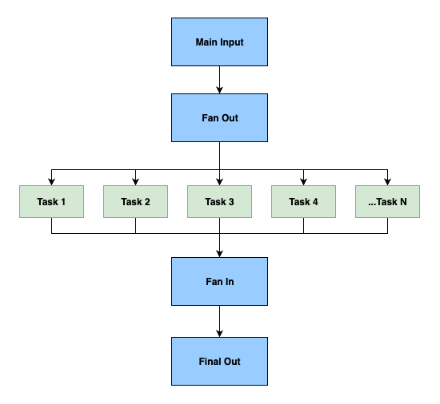

<!-- 
 Copyright Amazon.com, Inc. or its affiliates. All Rights Reserved.
 SPDX-License-Identifier: CC-BY-SA-4.0
 -->

# Fan-out/Fan-in

**Content Level: 200**

## Suggested Pre-Reading
* [Introduction to GenAI Primitives](../../../../2_0_technical_foundations_and_patterns/2_1_key_primitives/index.md)
* [Online Inference](../../../2_3_core_archtectural_concepts/2_3_5_inference/2_3_5-1_online_inference/online_inference.md)
* [Async Inference](../../../2_3_core_archtectural_concepts/2_3_5_inference/2_3_5-2_async_inference/async_inference.md)

## TL;DR
The fan-out/fan-in orchestration pattern enables scalable and efficient processing by distributing independent tasks across parallel workers (fan-out) and consolidating their outputs (fan-in). In GenAI systems, this pattern is foundational for workloads like distributed prompt evaluation, document chunking, batch processing, and multi-model comparisons. It improves throughput, reduces latency, and increases system resilience when applied correctly. The pattern supports two modes - pure fan-out for independent task execution with no need for reconciliation, and full fan-out/fan-in when task outputs must be merged or processed collectively at the end.

## **Understanding Fan-out/Fan-in**

In Generative AI applications requiring high throughput and low latency, it's often necessary to process multiple inference tasks in parallel. The fan-out/fan-in pattern supports this by: 
### Fan-out
Breaking a task into multiple independent subtasks. For example, splitting a large document into sections and processing each section concurrently through an LLM. Fan-out delegates execution to parallel units—functions, containers, or agents—running on distributed infrastructure such as AWS Step Functions, Kubernetes (K8s), Ray, or similar orchestration frameworks. 
### Fan-in
Aggregating the outputs of these parallel tasks into a cohesive result. Using the above example, the outputs from processed document sections are reassembled into a final, coherent document. Fan-in processes may de-duplicate, validate, summarize, or re-rank the outputs. 

This pattern is particularly useful in naturally parallel workloads such as: 
* ****Document Segmentation**** 
* **Multi-query Embedding Generation** (often following query decomposition, where a complex query is split into sub-queries for independent embedding and retrieval)
* ****Batch Content Creation**** 
* **Model Evaluation/Comparison** (e.g., LLM-as-a-Judge) 

## Making it Practical
Fan-out/fan-in is a foundational GenAI orchestration pattern for parallelizing and aggregating tasks. It is effective in high-scale scenarios but requires architectural discipline for reliability and performance. Below are five key areas of focus: : 

### Task Decomposition
Effective fan-out begins with how you decompose your tasks. The rule of thumb: tasks must be independent, and their granularity should align with latency and cost objectives. For instance, when summarizing lengthy legal contracts, it's better to split the document into coherent sections (e.g., clauses) rather than arbitrary chunks. Each section is then processed in parallel, and the results are later synthesized into a final output—this is precisely how multi-section summarization is executed in GenAI-powered legal tech. A common pitfall here is oversharing context across subtasks—when every task carries the full document or user state, you negate the benefits of parallelism and bloat token usage. Optimize performance by leveraging dynamic batching—grouping tasks based on similarity in expected latency or computational weight. This avoids idle compute and ensures balanced throughput.
 
### Orchestration Layer
Managing the workflow state is key in fan-out systems. Use managed orchestration tools such as AWS Step Functions, Apache Airflow or Ray. These platforms offer resilient state tracking, retries, and error propagation mechanisms out of the box—key capabilities when scaling to thousands of subtasks. You should avoid building your own orchestrators for GenAI inference pipelines, and unless you have a dedicated team to maintain them, custom orchestrators often become the weakest link, especially under production pressure. In use cases like RAG document processing, orchestration layers ensure parallel document chunking, embedding, and vector store ingestion happens with fault tolerance. You can even integrate speculative execution here—running multiple branches (e.g., different model prompts or parameters) in parallel and converging on the best outcome. 
 
### Concurrency Limits
When dealing with foundation models, parallelization doesn’t come for free. You’re often bound by service quotas (like token throughput or endpoint concurrency) that, if ignored, can silently drop or delay jobs. Set autoscaling policies and enforce concurrency caps based on model type, token limits, and service tier. In practice, large-scale embedding pipelines frequently hit these ceilings—especially when generating vector representations for millions of records. The recommended fix: use workload schedulers that respect quota-aware backoff strategies and monitor tail latencies closely. Techniques like KV caching and batching similar queries can reduce model load and improve throughput. Without this discipline, you may unintentionally spike costs or delay fan-in aggregation due to straggler tasks. 
 
### Result Collation 
After the fan-out stage, results must be reassembled into a coherent, actionable output. Naïve approaches—like string concatenation—fail in tasks like summarization or structured extraction, where format and alignment matter. Instead, you should implement structure-aware merging: use JSON stitching for embeddings, apply majority voting or ranking for model evaluations, and consider a final summarization prompt for multi-part outputs. This is how multi-model evaluation systems decide the best LLM-generated answer from variants by aggregating with consistency scores or ensemble logic.  Optimizing collation isn’t just about accuracy—it’s about latency and reliability. Be aware of tail latency spikes where a few slow workers delay final aggregation. Mitigate this by setting partial aggregation thresholds or enabling progressive fan-in where applicable. For example, implementing a partial aggregation threshold—such as proceeding with aggregation after receiving 80% of the results within a specified timeout—can help mitigate delays caused by straggling workers. This approach, is similar to techniques used in systems like MapReduce, allowing the system to proceed with available data, enhancing responsiveness. Progressive fan-in strategies further aid in reducing latency by incrementally aggregating results as they arrive, rather than waiting for all responses. 
 
### Error Isolation 
A fan-out architecture is only as resilient as its error handling. The golden rule: fail small, not big. Isolate and retry individual sub-tasks rather than restarting the entire orchestration. This is especially important in RAG pipelines, where failure to embed a few documents shouldn’t block ingestion of an entire corpus. Swallowing or aggregating errors is tempting but dangerous—it hides systemic issues like rate limiting or corrupted inputs. Instead, log each failure with traceable metadata and expose it to downstream monitoring dashboards. You can further optimize by running redundant tasks with speculative execution, selecting the most consistent or fastest result, which improves resilience in latency-sensitive workflows. An example is a customer-facing chatbot recovering gracefully from model degradation events, switching to a backup provider mid-stream with no noticeable downtime. 

## Get Hands-On

* [GenAI Workflow with Step Functions](https://github.com/aws-samples/genai-workflow-with-stepfunctions){:target="_blank" rel="noopener noreferrer"}
    * Explore an end-to-end fan-out/fan-in orchestration pattern using Amazon Bedrock and AWS Step Functions
    * Demonstrates parallel prompt workflow processing and output aggregation
    * Includes examples for summarization, evaluation, and ranking

* [Step Functions Fan-out Sample: Batch Job Example](https://docs.aws.amazon.com/step-functions/latest/dg/sample-map-state.html){:target="_blank" rel="noopener noreferrer"}
    * Learn to implement Map state in AWS Step Functions
    * Execute parallel jobs and collect results
    * Official AWS sample for native fan-out orchestration

* [Serverless Batch Job Workflow](https://github.com/aws-samples/serverless-batch-job-workflow){:target="_blank" rel="noopener noreferrer"}
    * Foundation pattern using AWS Lambda, S3, DynamoDB, and Step Functions
    * Demonstrates scalable batch job orchestration
    * Adaptable pattern for LLM workloads

## Further Reading
* [Model Serving](../../2_3_5_inference/2_3_5-3_model_serving/model_serving.md)

## Contributors

**Author:**

* Marie Yap - Principal Solutions Architect 

**Primary Reviewer:**

* Giuseppe Zappia - Principal Specialist 

