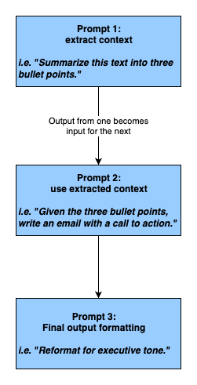

<!-- 
 Copyright Amazon.com, Inc. or its affiliates. All Rights Reserved.
 SPDX-License-Identifier: CC-BY-SA-4.0
 -->

# Prompt Chaining

**Content Level: 300**

## Suggested Pre-Reading

* [Key Primitives](../../../../2_0_technical_foundations_and_patterns/2_1_key_primitives/index.md)
    * Understanding core building blocks: prompts, responses, tokens, context windows, embeddings
    * How token limits and context windows affect chain depth

* [Prompt Engineering](../../2_3_2_prompt_engineering/2_3_2-3_core_components/core_components.md)
    * Constructing and optimizing prompts for consistent outputs
    * Understanding model behavior across varying inputs

* [Inference](../../2_3_5_inference/2_3_5-1_online_inference/online_inference.md)
    * Trade-offs between online and asynchronous inference
    * Impact on latency, cost, and sequencing in prompt chains

## TL;DR

Prompt chaining sequences multiple prompts where each output feeds into the next prompt as input. This pattern breaks complex GenAI tasks into manageable, purpose-built steps while enabling transparency, modularity, and control. Effective implementation requires careful prompt design, robust error handling, and performance-aware orchestration.    

## Understanding Prompt Chaining

Prompt chaining involves structuring a sequence of prompts such that each prompt's output feeds into the next. This method mirrors human problem-solving by breaking down intricate tasks into sequential steps.

### Key Benefits

* **Enhanced Reliability**. By focusing on one aspect of a task at a time, the likelihood of errors decreases.

* **Improved Transparency**. Intermediate outputs provide insights into the model's reasoning process, facilitating debugging and refinement.

* **Greater Control**. Developers can monitor and adjust each step, to help ensure the final output aligns with expectations. Prompt chaining allows us to decompose large, complex goals (e.g., generate an investment summary, extract structured fields from unstructured contracts, synthesize multi-turn customer chats into actionable insight) into modular, traceable sub-tasks.

* **Simpler Prompt Design**. Because each prompt handles only a single task, you avoid bloated prompts that try to do too much. This reduces the need for excessive few-shot example or intricate instructions, improving maintainability and performance. 

The typical structure includes:

Each of these may be executed in sequence, optionally validated, logged, or tuned independently. This modular approach is critical for production-grade reliability.

### Common Use Cases

1. **Content Generation Pipelines**
Generating an outline, then expanding it into a full article.

2. **Data Extraction and Transformation**
Extracting entities from text, then categorizing them.

3. **Multi-step Reasoning Tasks**
Solving complex problems that require sequential logic. 

## Making it Practical
Prompt chaining may seem straightforward on paper—but in practice, executing it well requires thoughtful design, engineering discipline, and a deep understanding of GenAI behavior. Here’s what matters most. 

**Start with Smart Task Decomposition** 
Breaking down a complex task into smaller, manageable steps is foundational—but it’s also easy to get wrong. 

* **Over-chaining,** or breaking down a task into too many steps, adds latency and fragility. 
* **Under-chaining**, **** or not being granular enough, could lead to vague or inaccurate results by trying to perform too many actions in a single step. 

**Tip:** Simulate the process manually first. The steps a human takes to solve a task often align with how your model should be prompted. 

**Design Prompts for I/O Consistency** 
Each prompt should produce output that is predictable and machine-readable for the next step in the chain. 
❌ **Avoid:**
"The product feedback was mixed and mentioned the UI."
This result is sub-optimal due to unstructured formatting.
✅ Use:
{
    "sentiment": "mixed",
    "highlight": "UI"
}
Inconsistent formatting is the #1 cause of silent chain failures. 
 
**Insert Lightweight Validation Between Steps** 
Validation gates catch issues early, saving downstream failures. Each step should be checked for expected structure or values. 
**Examples:** 
* Use regex or JSON schema for structure checks. 
* Use classifiers to verify tone, intent, or completeness. 
* Add fallback prompts or human escalation for critical steps. 
 
**Manage Performance and Latency Thoughtfully** 
Every chained step adds latency. 
* For real-time UX (e.g., chat assistants), keep chains shallow and cache known responses. 
* For offline use cases (e.g., summarizing call center logs), deeper chains are fine. 
Match chain depth to the performance profile of the use case. 
 
**Treat Prompt Chains Like Software Pipelines** 
Prompt chains aren’t static—they evolve. 
* Version your chains. 
* A/B test changes. 
* Roll back if needed. 
Use source control, documentation, and observability tools to maintain traceability. 
 
### Common Implementation Patterns
| Use Case | Chain Structure | Notes |
|----------|----------------|--------|
| Customer Support Summary | Transcript → Entity Extraction → Summary → QA Filter | Validate entities and sentiment before generating summaries. |
| Contract Analysis | Document → Clause Finder → Risk Evaluator → Legal Summary | Each step can be audited independently. |
| E-commerce Feedback Loop | Review → Sentiment → Feature Tagging → Response Generation | Improves personalization and customer support workflows. |
 
## Get Hands-On

* [Building Generative AI Prompt Chaining Workflows with Human in the Loop](https://aws.amazon.com/blogs/machine-learning/building-generative-ai-prompt-chaining-workflows-with-human-in-the-loop/){:target="_blank" rel="noopener noreferrer"}
    * Learn to break complex tasks into manageable subtasks
    * Incorporate human judgment in prompt chains
    * Implement enhanced decision-making workflows

* [Amazon Bedrock Serverless Prompt Chaining](https://github.com/aws-samples/amazon-bedrock-serverless-prompt-chaining){:target="_blank" rel="noopener noreferrer"}
    * Build complex, serverless GenAI applications
    * Implement scalable prompt chaining patterns
    * Leverage Amazon Bedrock capabilities

* [Prompt Engineering Quest Workshop](https://github.com/aws-samples/prompt-engineering-quest-workshop){:target="_blank" rel="noopener noreferrer"}
    * Explore fundamental prompting concepts
    * Practice prompt chaining techniques
    * Learn task decomposition strategies

## Further Reading

### Implementation Patterns
* [Human-in-the-Loop Orchestration](../3_human-in-the-loop/human-in-the-loop.md)
    > Learn how to effectively integrate human oversight into prompt chains, with specific focus on validation steps and compliance workflows.

### Performance Optimization
* [Online Inference](../../2_3_5_inference/2_3_5-1_online_inference/online_inference.md)
    > Explore the performance characteristics and architectural considerations for implementing real-time inference in prompt chains.

### Architecture Design
* [Application Engine](../../../../3_0_architecture_and_design_patterns/3_1_system_and_application_design_patterns_for_genai/3_1_1_foundation_architecture_components/3_1_1_2_application_engine/index.md)
    > Discover best practices for designing modular and maintainable GenAI workflows, with emphasis on traceability and system architecture.

<!-- 
### Additional Resources
* [GenAI Patterns Catalog](../../../patterns/index.md)
* [Performance Optimization Guide](../../../optimization/index.md)
* [Implementation Best Practices](../../../best-practices/index.md)
-->

## Contributors

**Author:**

* Marie Yap - Principal Solutions Architect 

**Primary Reviewer:**

* Giuseppe Zappia - Principal Specialist 

