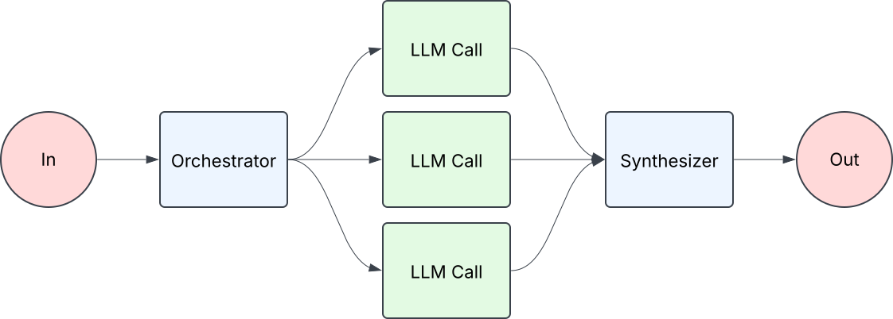
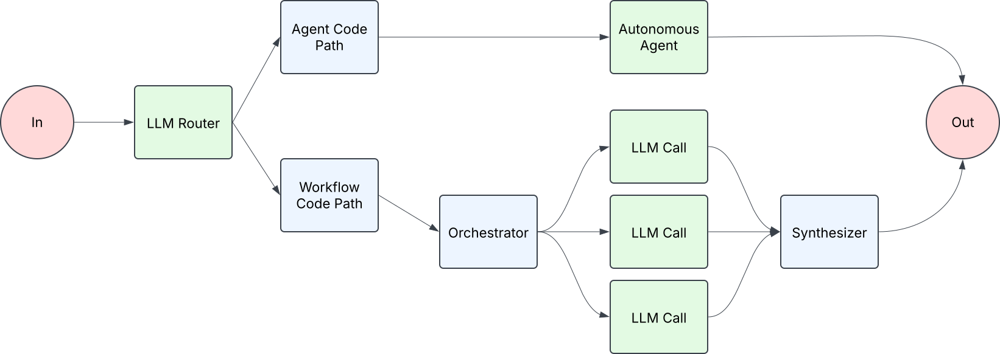
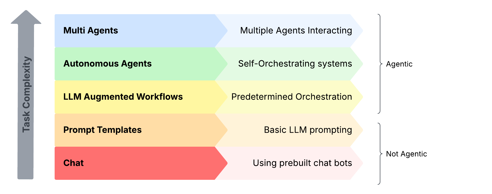

<!-- 
 Copyright Amazon.com, Inc. or its affiliates. All Rights Reserved.
 SPDX-License-Identifier: CC-BY-SA-4.0
 -->

# What Is An Agentic System?

**Content Level: 200**

## TL;DR
In generative AI, the core of an agentic system is usually a large language model (LLM), augmented with capabilities like retrieval (access to information), tools (interacting with its environment), and memory. They can either follow predefined paths (workflows) or operate autonomously to accomplish tasks.

## What Are Agentic Systems
The term "agentic" lacks a universally agreed upon definition in the industry. Some define it as fully autonomous systems that operate independently to accomplish tasks, while others use it more broadly as an umbrella term encompassing both autonomous systems and systems that follow more predetermined paths with limited autonomy.

We've opted for the later definition for practical clarity and bucket the types of agentic systems into three categories.

> **LLM-Augmented Workflows**: Systems where code paths are largely deterministic, with certain steps augmented with LLMs to make decisions. 
> 
> **Autonomous Agents**: LLMs orchestrate themselves maintaining more agency over how a task is accomplished.
>
> **Hybrids**: Systems that combine both workflow and autonomous agent patterns in specific areas of the implementation.

The core of an agentic system is usually a large language model (LLM), augmented with capabilities like retrieval (access to information), tools (interacting with its environment), and memory.

  

*Figure 1: Example of a simple workflow-based agentic system. Input comes in, an orchestrator (llm call) routes the request to the correct prompt(s), and a synthesizer takes the results and combines them before passing it to the sender.*

  

*Figure 2: Shows a basic autonomous agent setup. Input flows into a Large Language Model (LLM) which can access supporting components (Retrieval, Tools, and Memory) to help process the request. The LLM is called continuously to reason through each step. When the model determines it has enough information to the user, it returns.*

  

*Figure 3: Depicts a routing system that directs incoming requests to either an agent-based path or a workflow path. The agent path is direct, while the workflow path coordinates multiple LLM calls before combining their results into a final output.*

## What is Not Agentic?
Not all AI systems qualify as agentic. Simple chatbots in basic chat-only mode aren't agentic. They can't access information or perform actions beyond the conversation itself. Other non-agentic examples include question-answering systems without external capabilities, rule-based automation software, and traditional applications that don't use language models. The key distinction is whether the system combines a language model with abilities to interact with the world outside itself, whether those interactions follow predefined paths or are directed by the model itself.

## Making It Practical
It's better to start simple. Only increase your system's complexity when the task's complexity warrants it. Below is a helpful diagram showing different techniques for working with LLMs and where they sit in relation to task complexity.

  

Not everything needs to be agentic and common issues we see with customers stem from trying to use complex patterns like autonomous agents for problems that could be solved with a simpler approach. It's important to understand what patterns are available to you and use them appropriately.

### When To Use Each Pattern?
Workflow based agentic systems excel at predictable, well-defined tasks by following consistent execution paths, offering faster performance but less flexibility. Autonomous agents are better suited for complex scenarios requiring dynamic decision-making, trading some performance for the ability to adapt and handle unexpected situations. Through Amazon Bedrock, AWS supports both approaches, allowing customers to choose their preferred models and development patterns based on their specific needs without being too prescriptive.

## Further Reading
-  [Building Effective Agents](https://www.anthropic.com/engineering/building-effective-agents){:target="_blank" rel="noopener noreferrer"} - Anthropic

## Contributors

**Author:** Tanner McRae - Sr Applied AI Architect 

**Primary Reviewer:** Randy DeFauw - Sr. Principal SA 
