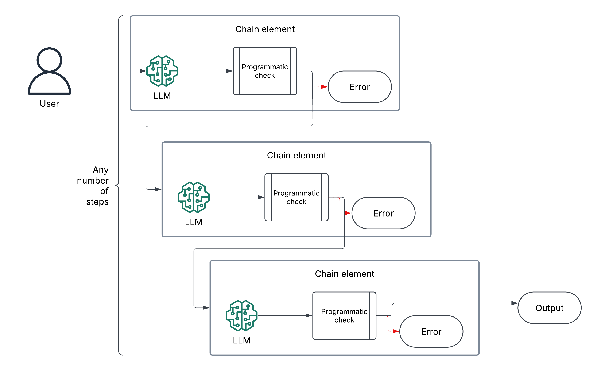
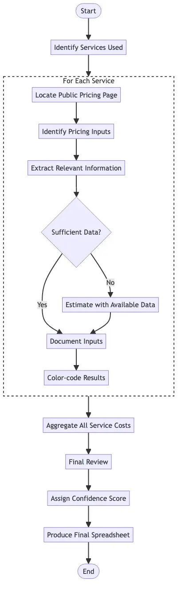
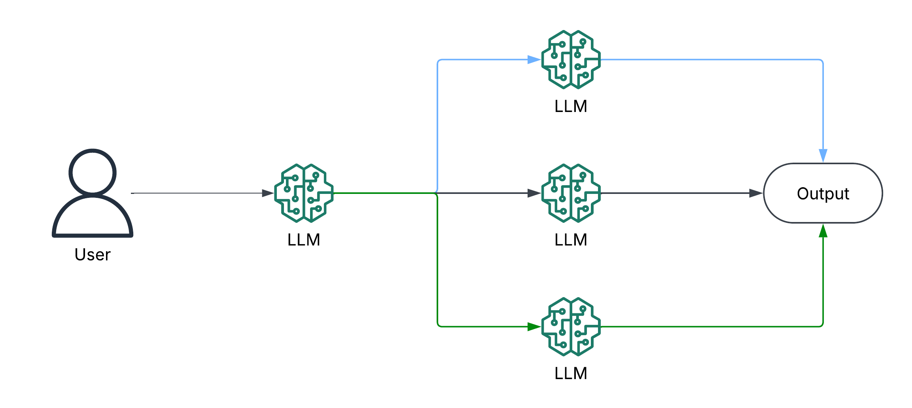
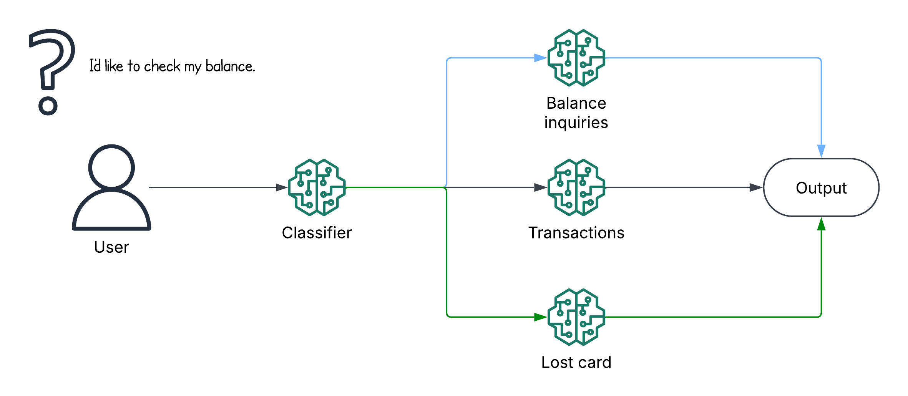
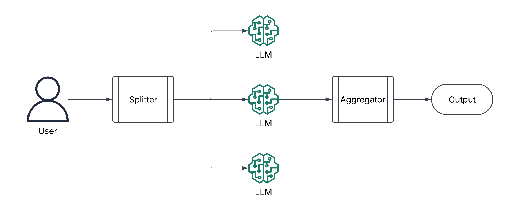
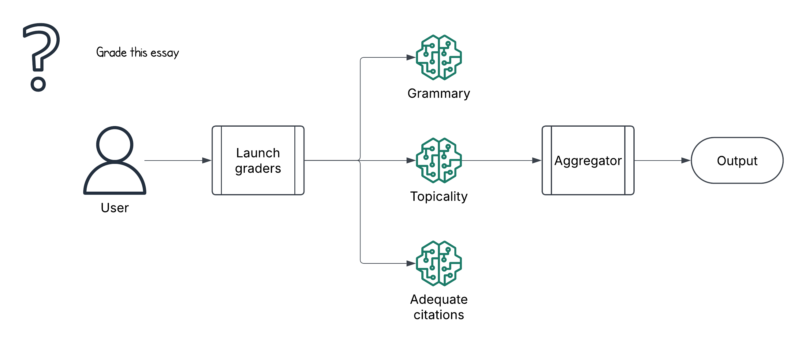
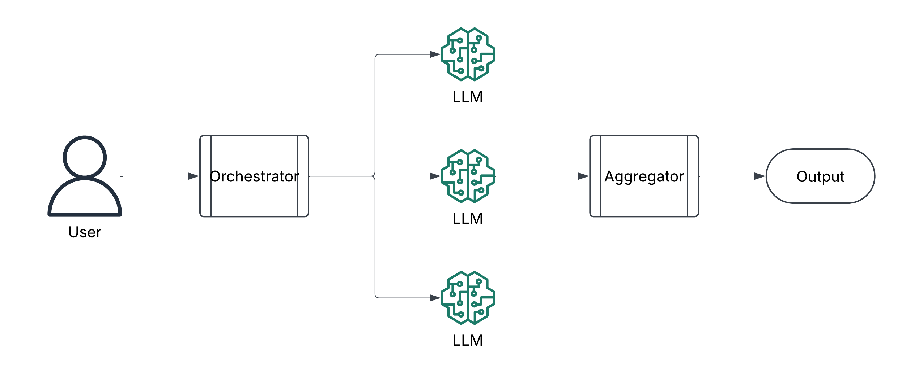
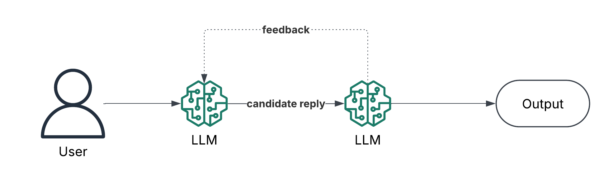
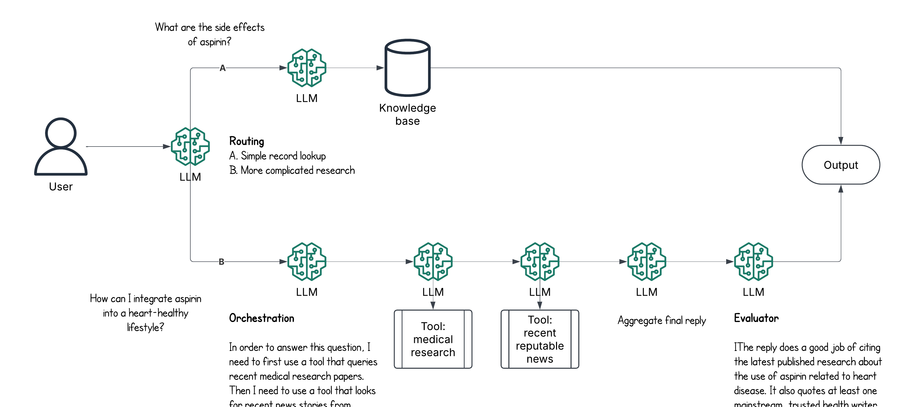

<!-- 
 Copyright Amazon.com, Inc. or its affiliates. All Rights Reserved.
 SPDX-License-Identifier: CC-BY-SA-4.0
 -->

# Design Patterns for Workflow Agentic Systems

**Content Level: 200**

## Suggested Pre-Reading

* [Building effective agents (Anthropic blog)](https://www.anthropic.com/engineering/building-effective-agents){:target="_blank" rel="noopener noreferrer"}

## TL;DR

Workflows are systems where large language models (LLMs) and tools are orchestrated through predefined code paths. They are one of the three high-level types of agentic systems, along with autonomous agents and hybrids. Workflows are useful when a task is predictable, with well-known execution paths. 

There are five common types of patterns for workflows: prompt chaining, routing, parallelization, orchestrator, and evaluator. This list is not exhaustive, but gives a good set of patterns for many use cases. These patterns can be customized and combined for specific use cases.

## Prompt chaining

Prompt chaining involves breaking a task down into a series of steps. Each step calls an LLM and passes the output on to the next step. As part of each step, you can add error checking steps, or make calls to tools, knowledge bases, or other systems.

The diagram below shows the prompt chaining workflow pattern. Note that there can be any number of steps involved.

  

This workflow is useful when you have a task that can be broken down into a series of smaller, simpler steps. Each of the smaller steps often gets better accuracy, as the LLM has a simpler problem to solve. The impact on cost and latency depends on the use case. You may be able to use a smaller LLM, which is less expensive and faster, for some or all of the steps. One example from this [article](https://medium.com/@flux07/prompt-decomposition-da646f0257f1){:target="_blank" rel="noopener noreferrer"} shows a 40% improvement in accuracy and 46% reduction in cost using prompt chaining, at the cost of an 18% increase in overall latency. 

### Prompt chaining example

Estimating the cost of running an AWS workload is a good example of prompt chaining. As you can see in the flowchart below, given a basic description of a workload, the task involves several discrete steps. The first step is to identify each AWS service used, and then find the public pricing information for that service, and so on.

  

An implementation for this example is given in the `Further Reading` section.

## Routing
This pattern has an LLM (or some other classifier) decide which path of execution to follow. Based on this decision, it sends the input to one of the available paths. These paths can be calls to an LLM, a tool call, or some other action. The diagram below shows a simple example.

  

This pattern is useful when you need to classify an input to decide how to handle it properly. Rather than trying to process all possible cases in one LLM call, you can route to specific execution paths. That separation of concerns improves quality.

### Routing example

Routing is often used in customer service scenarios. The diagram below shows an example of a financial institution that uses an LLM to direct a customer's inquiry to a downstream handler for balance inquires, making transactions, or reporting lost debit cards. Each of the downstream handler may be an LLM working with tools to handle the request.

  

## Parallelization

This pattern is used when a task can be split into a number of child tasks that can be worked independently. Each child task is processed, and then the output of all the child tasks is assembled into the final output. The diagram below shows this pattern.

  

This pattern is useful when you have a number of discrete child tasks in a workflow, like summarizing each chapter in a book. You can also use this pattern if you want to rerun the same task a number of times to get different output using different parameters. Processing each child task in parallel lets you execute the overall task more quickly, and likely with higher quality.

### Parallelization example

Grading an essay is a good candidate for parallelization. We may want to check the essay against a rubric that includes grammar, topicality (did the essay address the question asked), and adequate citations (did the essay cite relevant sources). Each part of the rubric is handled by a separate grading sub-task.

  

## Orchestrator

This pattern is similar to parallelization, but it implies a higher need for planning up front. The orchestrator is responsible for breaking down a task into smaller steps, and then the aggregator combines the sub-task results into a final output.

  

The difference between parallelization and orchestration is that in orchestration, the number of sub-tasks is not known in advance. 

### Orchestrator example

The workload cost estimation you saw for the Routing pattern also shows an example of orchestration. Once all AWS services used in the workload are identified, the workflow will perform a child task (e.g., finding public pricing information) for each service. Then it combines all of the cost information for each service into a final complete cost estimate.

  

## Evaluator

This pattern tries to improve the response from one LLM call by providing feedback from another LLM call.

  

This pattern is useful when you want to check a candidate output against some clear evaluation criteria. The evaluation LLM call will judge whether the output is acceptable. If not, it provides feedback to the first LLM, helping it improve the response. This process can happen in a cycle until acceptable output is provided, or until some other condition is met.

### Evaluator example

The diagram below shows a good candidate for the evaluator pattern. The task is to take an old proposal and rewrite it using a new template. The evaluator will make sure that all the required sections are complete.

  

## Making It Practical

If a use case can be solved with a workflow, start there. In these cases, using an LLM to orchestrate a task (the autonomous agent) adds complexity without adding value. Use a workflow unless there's a compelling reason to use a hybrid or autonomous agent.

A useful rule of thumb is: If you can draw a flowchart of the task and cover all execution paths, start with a workflow.

Consider leveraging the automatic routing based on tool name and function details using [Bedrock Agents Event Handler from Powertools for AWS Lambda](https://docs.powertools.aws.dev/lambda/python/latest/core/event_handler/bedrock_agents){:target="_blank" rel="noopener noreferrer"}

Finally, note that real use cases will often combine two or more of these patterns.  The diagram below shows three patterns used as part of a personal health assistant. The _router_ decides if the question can be answered by a simple lookup in a knowledge base, or whether it needs more advanced handling. In the latter case, an _orchestrator_ decides to perform two steps to gather data from medical research papers and reputable mainstream news sites. Each of these steps uses an LLM and a tool. An _evaluator_ applies a rubric to see if the _orchestrator_ has answered the question according to some quality criteria.

  

## Further Reading
1. [Common agentic patterns (LangGraph)](https://langchain-ai.github.io/langgraph/concepts/agentic_concepts/){:target="_blank" rel="noopener noreferrer"}
2. [Sequential workflows (CrewAI)](https://docs.crewai.com/how-to/sequential-process){:target="_blank" rel="noopener noreferrer"}
3. [Workload cost estimation](https://community.aws/content/2ohzfWA6Xan2CPPKHlep2sJKDce/estimating-aws-workload-cost-with-genai){:target="_blank" rel="noopener noreferrer"}
4. [Prompt chaining](https://medium.com/@flux07/prompt-decomposition-da646f0257f1){:target="_blank" rel="noopener noreferrer"}

## Contributors

**Author**: Randy DeFauw - Sr. Principal SA 
