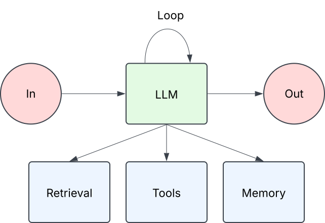
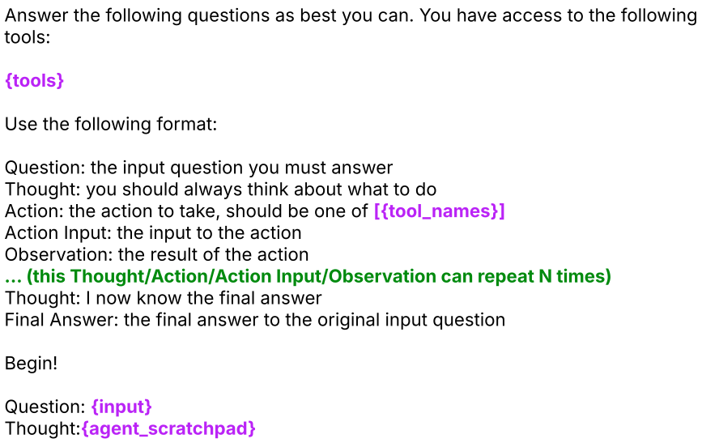
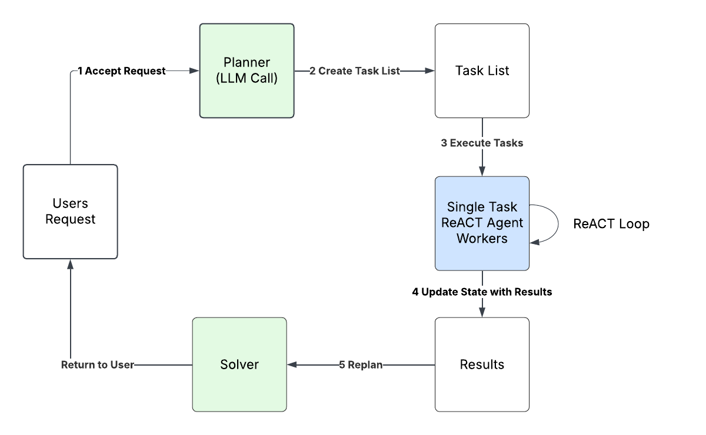
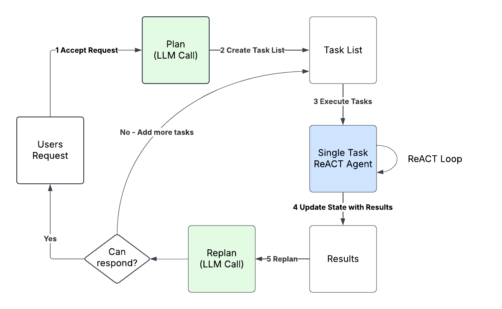
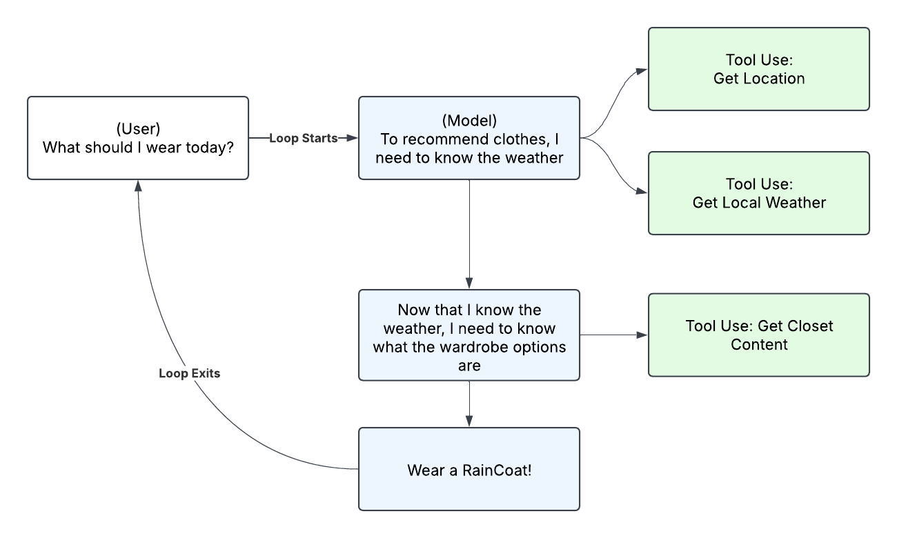

<!-- 
 Copyright Amazon.com, Inc. or its affiliates. All Rights Reserved.
 SPDX-License-Identifier: CC-BY-SA-4.0
 -->

# Agents

**Content Level: 200**

## Suggested Pre-Reading
- [What Is An Agentic System](../2_3_7-1_getting_started/what_is_an_agentic_system.md)
- [Design Patterns for Workflow Agentic Systems](../2_3_7-3_workflow_agents/design_patterns.md)
- [Building Effective Agents](https://www.anthropic.com/engineering/building-effective-agents){:target="_blank" rel="noopener noreferrer"} - Anthropic

## TL;DR

Agents are LLMs augmented with tools, memory, and retrieval that orchestrate themselves. They can solve complex tasks, but there are tradeoffs to consider when choosing them over workflow based agentic systems like error rate, latency, and cost.

## Understanding Agents
Agents are systems that can understand their environment, make decisions, and take actions to accomplish a task. The typical building blocks of an agent are similar to agentic systems as a whole. They start with an LLM, enhanced with information retrieval, tools for taking actions, and/or memory. Unlike workflows where paths are predefined, agents plan and execute tasks independently – requiring many more large language model (LLM) calls and careful coordination.

Imagine asking an AI agent to "Plan a 3-day trip to Monterey CA." The agent would book your hotel, arrange transportation, schedule activities, and make restaurant reservations. At each step, the agent would be planning how to accomplish the task without predefined code paths and is free to decide how it wants to complete the task.

The architecture of an agent is often simple. The complexity is in the orchestration (the loop shown in the diagram below).

In the following sections we'll break down each component of an agent starting with orchestration

### Orchestration
There are many ways to orchestrate an agent. We'll go over three common techniques to compare and discuss the tradeoffs.

#### ReAct (Reason + Act)
With ReAct (Reason + Act), an LLM is given a prompt describing tools it has access to and a scratch pad for dumping intermediate step results. ReAct is inspired by human abilities to “reason” and “act” to complete tasks.

Let’s use an example from the ReAct paper: Synergizing Reasoning and Acting in Language Models.

**Source: Yao et al., 2022**

When a tool is used, the response is dumped into the {agent_scratchpad}. The LLM will be called continuously to create observations and thoughts. If the model determines it has enough information to respond to the user, it returns. Typically, there's a stop reason produced by the model that forces the loop to exit like <end_turn>. When the programmatic loop encounters a stop reason, it exits. Underpinning this approach is a sequential approach where an agent attempts to understand its environment and take an action in that environment. It observes the result of that action and then decides what to do next sequentially. This provides a dynamic way to observe and react to changes, with the tradeoff of having more latency.

#### ReWOO (Reasoning Without Observation)
ReWOO (reasoning without observation) is another common orchestration technique. Contrasted to ReAct, it seeks to plan all steps up front and execute actions in parallel. This improves latency compared to orchestration techniques like ReAct, but trades the ability to react to actions for latency improvement. It does this in three steps. (1) A planner creates an overall plan for how to accomplish a task leveraging the tools it has available to it. (2) Workers execute that plan in parallel using tool use and/or retrieval available. (3) A Solver compiles all the outputs from workers to solve the task. Lets use an example from the ReWOO research paper

**Source: Binfeng et al., 2023**

ReWOO excels at executing plans that don't need sequential feedback from their environment. 

#### Plan and Solve
Plan and Solve is another technique that offers latency improvements over ReAct. Similar to ReWoo, it works by generating a plan with a prompt to an LLM and delegating that plan execution to a traditional ReAct agent that's responsible for solving a sub-step in the entire plan. Those results are aggregated and then the re-planner decides whether to add more tasks to the queue or return to the user.

Plan and Solve is more of a hybrid pattern we sometimes see with customers. The overall orchestration of each step is solved in a workflow that calls agents based on the plan that traditional prompt generates. The overall agent is orchestrated in a way that looks like a workflow with agents mixed in.

#### Orchestration Takeaways
Most orchestration techniques are different variations and optimizations on these core patterns. In practice, developers tweak the orchestration to suit their needs. It's not uncommon to see additional instructions like "execute tool calls in parallel if possible" inside a ReAct prompt for example. The lines become blurry on which pattern you're using as you iterate on agent orchestration prompts.

Another important note is that tool calling has drastically changed the ReAct and ReWOO pattern implementation. In 2022 & 2023 (respectively) when the papers was released, tool calling through an API didn't exist. Developers had to coax the model to output plans or actions in text that can be extracted and used in code. With modern LLM APIs, you can get structured JSON output from your tool definitions making the implementations much simpler and orchestration prompts in practice look different than the papers which originally introduced them. A modern ReAct implementation (in 2025) looks a lot more like calling an LLM API like the Bedrock converse() API using tool definitions and a simple while loop.

### Tools
Tool use is a capability that allows a large language model to tell the calling application to invoke code with inputs supplied by the model. The available functions and supported inputs are passed to the model along with a prompt. It's important to note that the large language model does not call a function itself - it just returns the inputs needed for the code and lets the calling application do the rest.

In a ReAct agent, the actual invocation of the tool is handled by code running in a loop. This is one of the things that frameworks like LangChain or PydanticAI handle for you. It determines which tool to call by a description the tool implementor creates describing what the tool is. A sample description might be: "Useful for retrieving the current weather forecast". This description would indicate to the agent that it should use the tool when it needs access to the weather. An agent's ability to use tools effectively is heavily based on how well you've defined the tool. 

Below is an example of ReAct loop of an agent using multiple tools to recommend what clothes to wear to a user

### Memory
Large Language Models (LLMs) are stateless by default, meaning they don't inherently have context about what you previously asked them. To solve this, you need to pass in the previous messages or session information for every subsequent call to the model so it knows what has been said/done in the past. These messages make up your agents short term memory and need to be stored in an external datastore. They are then retrieved before every call the LLM and passed in to the request for every invocation. 

Additionally, previous sessions can be summarized and stored in an external datastore and retrieved at a later date. This makes up your long term memory. Similar to short term memory, these long term memories can be stored and retrieved when contextually relevant and passed in as context into a prompt.

### Retrieval
Retrieval in agents refers to retrieving knowledge from an external source. This generally follows a retrieval augmented generation pattern (RAG) where you retrieve the context and pass it into the prompt before calling an LLM. Where this differs in agents, is that the agent is initializing the retrieval request. This is sometimes referred to as "agentic RAG". In traditional RAG, you'd programmatically query a knowledge base and programmatically pass that context into a prompt before invoking an LLM. With agents, the Agent is initiating that entire process. Retrieval is often implemented as another tool that the agent has access to. 

For more detailed information on RAG, we recommend you visit the RAG section in Atlas.

## Making It Practical
Agents should be thought of as a tool in your toolbelt. Not everything should be an agent. In many cases a workflow agent would be preferable. A helpful framework is to ask yourself three questions:
* Is the cost of error low?
* Does the execution need to be fast?
* At scale, will this be too expensive to drive ROI? 

### Expanding On The Cost Of Error
 Agents often make mistakes. A great agent might have a success rate in the low 90%. In other terms, it fails 10% of the time. For use cases like coding assistants or deep research agents, 10% failure isn't a major blocker. There's a human in the loop correcting the code or verifying the information. For other use cases like making insurance claims decisions, 10% is not acceptable. You would want a human in the loop to check the answers.

### When To Use An Agent
Agents are best suited for tasks that (1) require complex orchestration where the steps to execute are not known ahead of time, (2) have a low cost of error, and (3) latency is not a major concern. If those 3 things hold true, an agent could be a good fit.

### When Not To Use An Agent
If the cost of error is high, latency is a concern, or the task orchestration is known, it's better to use a workflow agent.

In addition to those questions are cost considerations. Agents using ReAct can sometimes make a large number of calls to answer a single question, accumulating tokens for each one. Not only is this costly, it introduces latency. Most (but not all) of the latency in LLM based applications come from generating output tokens. By calling an LLM repeatedly and asking it to provide thoughts / observations, it generates a lot of output tokens (cost) which results in high latency (degraded user experience). 

### Takeaways
Agents are effective tools in a toolbelt for complex task solving, but it's important to understand how they work and when to use them. To build effective agents, it's important to understand that there are other ways to accomplish tasks with LLMs and that agents are not the only solution. If all you have is a hammer (agent), everything looks like a nail (problem).  

## Further Reading
1. [REWOO Research Paper (Orchestration)](https://arxiv.org/abs/2305.18323){:target="_blank" rel="noopener noreferrer"}
2. [Plan-And_Solve Research Paper](https://arxiv.org/abs/2305.04091){:target="_blank" rel="noopener noreferrer"}
3. [Plan and Execute on LangChain](https://blog.langchain.dev/planning-agents/){:target="_blank" rel="noopener noreferrer"}

## Contributors

* **Author:** Tanner McRae - Sr Applied AI Architect 
* **Author:** Don Simpson - Principal Technologist 

