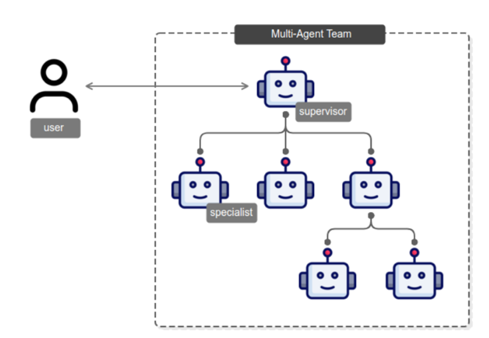

<!-- 
 Copyright Amazon.com, Inc. or its affiliates. All Rights Reserved.
 SPDX-License-Identifier: CC-BY-SA-4.0
 -->

# Multi-Agent Architectures

**Content Level: 200**

## Suggested Pre-Reading
* [Understanding Autonomous Agents](../2_3_7-4_autonomous_agents/understanding_autonomous_agents.md)

## TL;DR
Multi-agent systems use specialized AI agents working together to perform complex tasks more effectively than single general-purpose agents. Implementation of orchestrating these agents is the challenging part with implementation options ranging from simple tool calls to sophisticated graph-based orchestration. There's no one right way to orchestrate agents and is use case dependent.

## Multi-Agent Architectures
Multi-agent refers to systems that coordinate multiple agents together to accomplish tasks. Through extensive experience working with customers and AWS' own research, we see that specialized agents focused on specific domains consistently outperform general-purpose agents. Consider an insurance claims processing system: When a customer submits a claim, specialized agents work in concert. Claims Intake validates documentation, Policy Coverage analyzes terms, Fraud Detection assesses risks, and an Adjuster calculates payouts.
If Fraud Detection flags a concern, other agents should adapt their tasks while maintaining a coherent customer interaction. 

Building multi-agent systems is challenging. It requires orchestration to handle inter-agent communication, session management, memory handling, and task delegation. The most common way to orchestrate is to have a supervisor agent that intelligently breaks down requests, delegates to specialized agents, and consolidates their outputs. 

Research shows that multiple, specialized agents perform better at tasks than generic agents. A paper released by Amazon's research team found that coordinating multiple agents together increased task success rate by 70% and increased task completion rate to 90% [source](https://arxiv.org/abs/2412.05449){:target="_blank" rel="noopener noreferrer"}

## Making It Practical
There are multiple ways to coordinate agents. An agent can delegate to other agents via tool calls, application code can programmatically call another agent, or you can orchestrate the flow through a graph implementation. The right approach is use case specific. As a rule of thumb, start simple. Orchestrate multi-agent systems through tool use. If you require a more complex control flow, you can start to look at graph-based solutions. 

At a certain point, the handoff and coordination get complicated. This is where graph-based solutions excel. Let's use a deep research example where you have a writer agent, multiple research agent, and a supervisor agent. The supervisor delegates research to the researchers. When the research is done, that context needs to go to the writer agent. The writer agent then needs to write the research report and return it to the supervisor and subsequently the user. Using a tool call approach would result in a lot of extra tokens flowing through the supervisor. The supervisor would have to take the research output in as context and then re-write it as a tool call into the writer and so on. This increases cost and latency. Using a graph-based approach, you can have the graph pass references to the content stored outside of the execution run and let the agent decide if it needs to reference the context or not. Lastly, the writer agent could return directly to the user and exit the graph.

## Further Reading

1. [LangChain's Agent Communication](https://langchain-ai.github.io/langgraph/concepts/multi_agent/#communication-between-agents){:target="_blank" rel="noopener noreferrer"}
2. [Pydantic AI's Multi-Agent Docs](https://ai.pydantic.dev/multi-agent-applications/){:target="_blank" rel="noopener noreferrer"}

## Contributors

**Author:** Tanner McRae - Sr Applied AI Architect 
