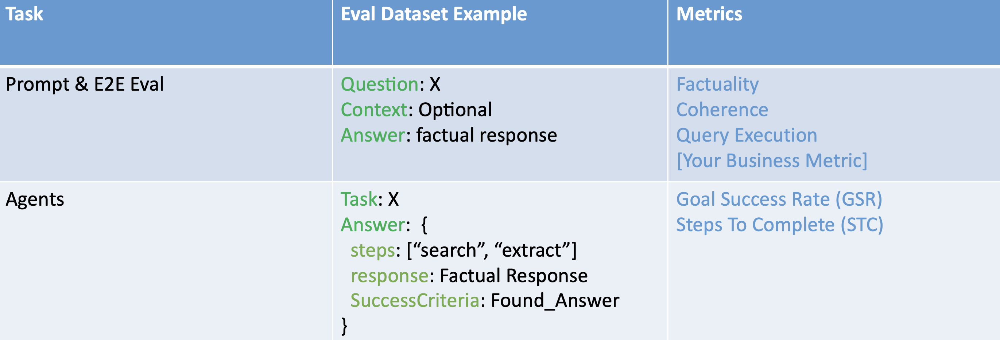
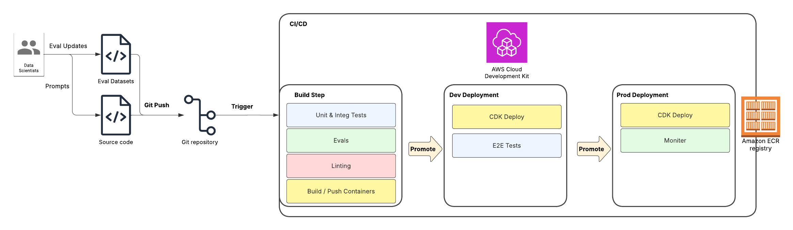
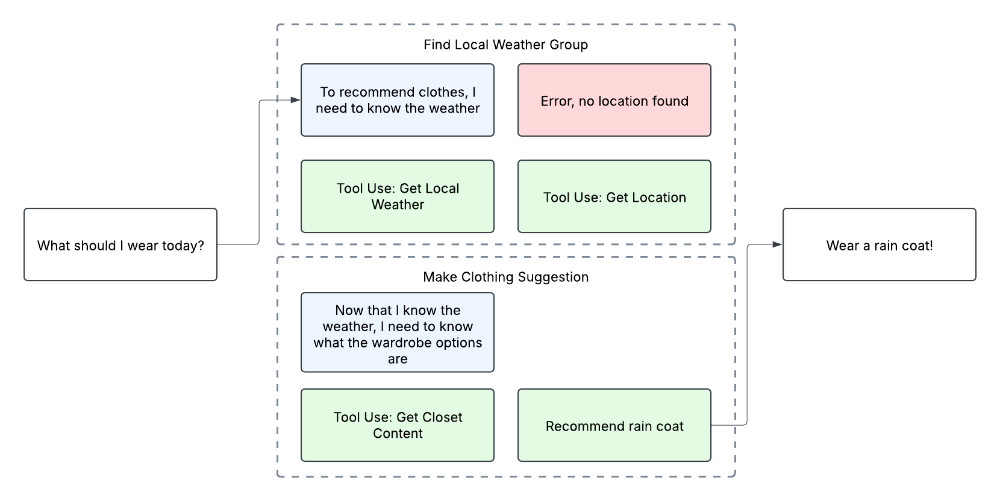

<!-- 
 Copyright Amazon.com, Inc. or its affiliates. All Rights Reserved.
 SPDX-License-Identifier: CC-BY-SA-4.0
 -->

# Testing and Evaluation

**Content Level: 200**

## Suggested Pre-Reading

* [Evaluating Amazon Bedrock Agents with Ragas and LLM-As-A-Judge](https://aws.amazon.com/blogs/machine-learning/evaluate-amazon-bedrock-agents-with-ragas-and-llm-as-a-judge/){:target="_blank" rel="noopener noreferrer"}

## TL;DR


## Testing and Evaluating Agents
Evaluating generative AI is more similar to evaluating a traditional machine learning models than unit tests in code. Plainly, they require evaluation datasets consisting of expected outputs to compare against the actual agent outputs. Traditional natural language processing (NLP) metrics like ROUGE and BLEU are less suited for the non-deterministic output of these models. From this gap, emerged the concept using another LLM to judge the output (referred to as LLM-As-A-Judge). This approach provides a rubric to another model to evaluate outputs against a gold standard dataset containing the correct answers / outputs. Using this approach enables more complex metrics to be calculated in an automated way such as conciseness, factuality, or any metric you can articulate to an LLM in a prompt. Find an example LLM-As-A-Judge prompt below: 

```python
RUBRIC_SYSTEM_PROMPT = """
You are an expert judge evaluating Retrieval Augmented Generation (RAG) applications.
Your task is to evaluate given answers based on context and questions using the criteria provided.
Evaluation Criteria (Score either 0 or 1 for each, total score is the sum):

1. Context Utilization: Does the answer use only information provided in the context, without introducing external or fabricated details?
2. Completeness: Does the answer thoroughly address all key elements of the question based on the available context, without significant omissions?
3. Conciseness: Does the answer efficiently use words to address the question and avoid unnecessary redundancy?
4. Accuracy: Is the answer factually correct based on the given context?
5. Clarity: Is the answer easy to understand and follow?

Your role is to provide a fair and thorough evaluation for each criterion, explaining your reasoning clearly.

Please evaluate the following RAG response:

Question:
<query_text>
{query_text}
</query_text>

Generated answer:
<llm_response>
{llm_response}
</llm_response>

Context:
<context>
{context}
</context>

Evaluation Steps:
1. Carefully read the provided context, question, and answer.
2. For each evaluation criterion, assign a score of either 0 or 1:
   - Context Utilization
   - Completeness
   - Conciseness
   - Accuracy
   - Clarity
3. Provide a clear explanation for each score, referencing specific aspects of the response.
4. Calculate the total score by adding up the points awarded (minimum 0, maximum 5).
5. Present your evaluation inside <thinking></thinking> tags.
6. Include individual criterion scores (0 or 1) in the thinking tags and the total score inside <score></score> tags.
7. Ensure your response is valid XML and provides a comprehensive evaluation.

Example Output Format:
<thinking>
Context Utilization: 1 - The answer strictly uses information from the context without introducing external details.
Completeness: 1 - The response covers all key elements of the question based on the available context.
Conciseness: 1 - The answer is helpful and doesn't repeat the same information more than once.
Accuracy: 1 - All stated facts align perfectly with the provided context.
Clarity: 1 - The response is clear and easy to follow.
</thinking>
<score>4</score>

Please provide your detailed evaluation."""
```

Agent evaluation is a superset of this concept. You're evaluating things like task success rate (TSR) and steps to complete (STC) on top of metrics like coherence and factuality. To illustrate the difference, refer to the table below showing an example of what a datapoint might look like for these types of evaluations compared to regular prompt evaluation
<div style="margin:auto;text-align:center;width:100%;">
  
</div>

In addition to TSR and GSR, it's common to use an "assertion" based approach for each metric. An evaluator LLM will be given a list of assertions about an agent run and the separate LLM evaluates whether it meets the assertions criteria or not. For example, if an agent is recommending a gluten free cooking recipe, an assertion would "recipe does not contain gluten or wheat items".

## Making It Practical
The first thing you need is an evaluation dataset. 100 examples is preferable, but the important part is that the dataset accurately reflects how the system will be used. This is commonly stored in JSONL files, CSVs, or in an experiment tracking tool like MLFLow, LangFuse, etc.. From there, the evaluation dataset is iterated through, calling the agentic system and capturing the outputs. Those outputs are then run through an evaluation harness that validates the output against the set of assertions / gold standard dataset of correct answers. These evals can be run ad-hoc or in a CI/CD like depicted below:
<div style="margin:auto;text-align:center;width:100%;">
  
</div>

### Considerations Running Evals in CI/CD
While it is customary to expect 100 percent pass rate in unit tests, it’s rare to get 100 percent passing on an entire evaluation set. Each organization. depending on the use case, must decide on a threshold for passing the evaluations. It is, however, common to see a significant degradation in evaluation scores when bad changes are introduced. Additionally, some organizations choose to run a subset of the eval suite in their CI/CD to keep costs and deployment times down. Ultimately, organizations need to choose which makes the most sense for their specific use case.

### Calculating TSR & STC
Task success rate or assertions are intuitive to calculate. The (separate) LLM-Judge itself is taking in the gold standard datapoint and evaluating the agent against that gold standard. Steps to complete is a bit more challenging. Autonomous agents can accomplish tasks in different orders or take an entirely different path to complete a task. To measure steps to complete, it's useful to build logical units of their steps. Let's take the example of asking an agent what to wear for the day. 

<div style="margin:auto;text-align:center;width:100%;">
  
</div>

In the example above, we created logical groupings of the steps the agent took to complete a task. This makes it easier to evaluate the agents execution against our gold standard examples. To see it in, we've provided code samples from a lab in the further reading section. 

## Further Reading

- [Towards Effective Multi-Agent-Collaboration](https://arxiv.org/pdf/2412.05449){:target="_blank" rel="noopener noreferrer"}
- [Example Agent Evaluation Code](https://github.com/aws-samples/sample-agentic-platform/blob/main/labs/module5/notebooks/4_agent_evaluation.ipynb){:target="_blank" rel="noopener noreferrer"}

## Contributors

**Author:** Tanner McRae - Sr Applied AI Architect 
