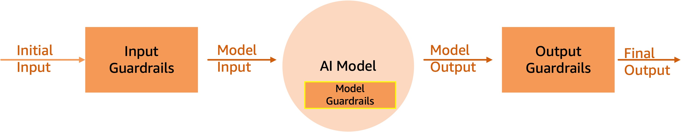

<!-- 
 Copyright Amazon.com, Inc. or its affiliates. All Rights Reserved.
 SPDX-License-Identifier: CC-BY-SA-4.0
 -->

# Managing Hallucinations and Guardrails

**Content Level: 200**

## Suggested Pre-Reading

- [Types of generative AI models and capabilities](../2_2_types_of_generative_ai_models_and_capabilities/2_2_types_of_generative_ai_models_and_capabilities.md)
- [Responsible AI principles and considerations](../../1_0_generative_ai_fundamentals/1_4_responsible_ai_principles_and_considerations/1_4_responsible_ai_principles_and_considerations_placeholder.md)
- [Prompt Engineering](../2_3_core_archtectural_concepts/2_3_2_prompt_engineering/2_3_2-3_core_components/core_components.md)
- [RAG (Retrieval Augmented Generation)](../2_3_core_archtectural_concepts/2_3_3_RAG%28retrieval%20Augmented%20Generation%29/2_3_3-4-Advanced_RAG_patterns/2.3.3.4%20Advanced%20RAG%20Patterns.md)

## TL;DR

Hallucinations in generative AI represent a significant challenge where models produce inaccurate or fabricated information and present it as fact in response to a user request.  This guide provides practical approaches to detect, mitigate, and manage hallucinations through prompt engineering, evaluation frameworks, guardrails implementation, and retrieval-augmented generation, enabling customers organizations to build more reliable and trustworthy generative AI applications.

## Understanding Hallucinations in Generative AI
In generative AI, hallucinations represent a significant challenge for developers and users alike. When we talk about hallucinations in this context, we're referring to instances where the underlying AI models, particularly large language models (LLMs), produce content that appears plausible or even authoritative, but is actually inaccurate, inconsistent, or entirely fabricated.

These hallucinations can manifest in various ways. Sometimes, a model might generate factually incorrect statements, misattribute dates, figures, or historical events. In other cases, the model might create responses that are inconsistent with the given context or prompt, leading to confusing or misleading outputs. More complex hallucinations can involve the creation of entirely fictional concepts, entities, or relationships, presented as if they were real and well-established.

Hallucinations stem from several factors inherent to how the LLMs function. At their core, language models are trained on vast amounts of text data and learn to predict the next probable sequences of words. This training process, while powerful, has limitations. The model can only reference information present in its training data, which has a specific cutoff date. This means the model lacks real-time knowledge and may present outdated information as current fact. Moreover, the probabilistic nature of language models means they generate text based on probability distributions rather than true understanding. This can lead to situations where the model confidently presents speculative or incorrect information and lacks the ability to distinguish between well-established facts and mere possibilities.

The probabilistic nature that causes hallucinations can actually be beneficial in creative contexts – for instance, in advertising campaigns or creative writing, where novel combinations and unexpected associations can lead to innovative ideas.  However, the impact of hallucinations can be far-reaching in applications where accuracy is important, such as in healthcare, finance, or legal contexts, where hallucinated content can lead to misinformation and potentially harmful decision-making.  Even in less critical situations hallucinations can erode user trust in AI systems and limit the practical utility of generative AI tools.  The key lies in understanding where to leverage an LLM’s creative potential versus where to prioritize factual accuracy and reliable information.

For organizations building generative AI applications, understanding and managing hallucinations becomes a key part of establishing the reliability and trustworthiness of their systems. This involves implementing strategies for detection, mitigation, and user communication about the potential for hallucinated content.

### Types of Hallucinations

As we work with generative AI models, it's important to understand that hallucinations can manifest in various forms. Recognizing these different types helps us develop more effective strategies for detection and mitigation. Let's explore the main categories of hallucinations you're likely to encounter when building AI applications.

***Factual Hallucinations:*** Factual hallucinations occur when the AI model generates incorrect information about verifiable facts. This might include wrong dates, inaccurate statistics, or misrepresented historical events. For example, the model might state that a certain technology was invented in 2010 when it was actually introduced in 2015. These hallucinations can be particularly problematic in applications requiring high accuracy, such as educational tools or research assistants.
***Contextual Hallucinations:*** Contextual hallucinations happen when the model's response is inconsistent with the given context or prompt. In these cases, the generated content might be factually correct in isolation but irrelevant or contradictory to the specific situation at hand. For instance, if asked about cloud computing services, the model might start discussing oceanic cloud formations. This type of hallucination can lead to confusing user experiences and reduce the overall effectiveness of conversational AI systems.
***Conceptual Hallucinations:***  Conceptual hallucinations involve the creation of non-existent concepts, entities, or relationships. Here, the model might invent fictional technologies, imaginary historical figures, or false connections between real entities. These hallucinations can be particularly deceptive because they often sound plausible and may combine elements of real information in novel, but incorrect, ways. For example, the model might describe a non-existent AWS service that combines features from several actual services.
***Attribution Hallucinations:***  Attribution hallucinations occur when the model incorrectly cites sources or attributes information. This could involve misquoting a person, incorrectly referencing a study, or attributing an idea to the wrong individual or organization. These hallucinations can be especially problematic in applications dealing with academic or journalistic content, where proper attribution is important.
***Temporal Hallucinations:***  Temporal hallucinations relate to the model's handling of time-sensitive information. Given that most models have a knowledge cutoff date, they may present outdated information as current or make incorrect predictions about future events. For instance, a model might describe a technology as "upcoming" when it has already been released, or it might discuss the current state of a rapidly evolving field using outdated information.
***Bias-Induced Hallucinations:***  While not always categorized separately, bias-induced hallucinations are worth mentioning. These occur when the model's output reflects biases present in its training data, leading to skewed or unfair representations of certain groups or ideas. These can be subtle and may require careful analysis of the training data to detect.

Understanding these different types of hallucinations is the first step in developing robust strategies to manage them in your AI applications. As we move forward, we'll explore how various AWS services and best practices can help address each of these categories, and help organizations produce more reliable and trustworthy AI-generated content.

### Causes of Hallucinations
To understand why language models hallucinate, we need to examine a few critical constraints inherent to how the models are trained and operate.  Understanding these limitations helps us develop better strategies for managing hallucinations in AI applications and setting appropriate expectations for users.

***Training Data Issues:***  The foundation of a language model's knowledge comes from its training data, which can be flawed in multiple ways. Data might be outdated, biased, incomplete, or contain errors. When training data lacks comprehensive coverage of certain topics or contains contradictory information, the model may fill these gaps with hallucinations rather than admitting ignorance. Like a student learning from incomplete or incorrect textbooks, the model can only be as accurate as its source material.
***Model Limitations:*** At its core, a language model operates through pattern recognition rather than genuine understanding. It predicts likely word sequences based on statistical patterns in its training data without truly comprehending meaning or having the ability to reason. This fundamental limitation means the model can't differentiate between correlation and causation, can't verify facts, and presents both accurate and hallucinated information with equal confidence.
***Token Size Constraints:*** Language models process information within a fixed context window, limiting how much information they can consider at once. This constraint forces the model to compress or truncate information, potentially losing important details. When generating longer content, the model might forget earlier details or struggle to maintain consistency across the entire response, leading to contradictions or fabrications.
***Nuanced Language Understanding Difficulties:*** Despite their sophisticated pattern matching abilities, language models struggle with subtle aspects of language such as metaphors, sarcasm, and complex contextual meanings. They often fail to grasp abstract concepts, causal relationships, and logical reasoning in the way humans do. This limitation in processing nuanced language can lead to misinterpretations and subsequent hallucinations as the model attempts to make sense of ambiguous or complex information.

### Mitigating Hallucinations

While there is no single solution to completely prevent hallucinations, we can significantly reduce them through a multi-layered approach. Think of it as building a safety net with different layers of protection: fine-tuning model settings, crafting effective prompts, using real-time fact checking with RAG, implementing thorough evaluation processes, and setting up protective guardrails. While we've covered several of these topics in other sections of this guide, in this section we will focus on the critical role of guardrails – the safety mechanisms that help keeping AI responses reliable and trustworthy. Let's explore how these guardrails work and why they're important for building dependable AI applications.

#### What are Guardrails
Guardrails serve as important protective mechanisms that help keep model outputs reliable and trustworthy. These are a set of filters and rules that sit between inputs, the model, and outputs to reduce the likelihood of hallucinations.  They represent a structured approach to controlling AI behavior, so that models operate within well-defined boundaries while maintaining their utility. 

The figure below shows where guardrails fit in a simple application built around an LLM. 

  

#### Model Level Guardrails (System Guardrails)
Some foundation model providers put guardrails into the model itself, so that protective measures are baked in and they govern the overall behavior of the AI applications.   Anthropic, for example, emphasizes the role of Claude as a trusted and helpful assistant.

Guardrails baked in at this level, can further be used to clearly define knowledge boundaries by explicitly setting limits on what the model should and shouldn't attempt to answer.  These built-in guardrails guide the model on when to say "I'm not sure" or "I can't help with that" rather than making something up, there by addressing hallucinations

#### Input Guardrails (System Guardrails)
Input Guardrails act as the first filter, screening all incoming content before it reaches the AI model. They implement  content filters for harmful material, denied topics, specific word blocks, and sensitive information detection. For instance, a banking application can automatically block queries about unauthorized investment advice, while a customer service system can mask incoming PII data like social security numbers or birth dates.

#### Output Guardrails (System Guardrails)
Output Guardrails operate between the output from the model and response to the user to evaluate response quality and safety. The system can either block non-compliant responses entirely or return custom error messages, depending on the configuration. For example, when a model generates a response containing sensitive information, the guardrails can automatically redact it before final delivery.  

An important safeguard that can be applied at this layer is a “Contextual grounding” check.  Contextual grounding check enables  hallucination detection in model responses that are not grounded in enterprise data or are irrelevant to the users’ query. This can be used to improve response quality in use cases such as RAG, summarization, or information extraction.

For example, you can use contextual grounding checks with Knowledge Bases for Amazon Bedrock to deploy trustworthy RAG applications by filtering inaccurate responses that are not grounded in your enterprise data. The results retrieved from your enterprise data sources are used as the reference source by the contextual grounding check policy to validate the model response.

## Making it practical

When implementing generative AI solutions, hallucination management should be integrated throughout the development lifecycle rather than treated as an afterthought.   Amazon Bedrock provides a comprehensive list of guardrails that you can implement based on your use cases and responsible AI policies.  Here’s a high-level list of the safeguards offered:

***Content filters:*** Configure thresholds to help block input prompts or model responses in natural language for text and separately for images containing harmful content such as: hate, insults, sexual, violence, misconduct (including criminal activity), and prompt attacks (prompt injection and jailbreaks). For example, an e-commerce site can design its online assistant to avoid using inappropriate language and/or images such as hate or violence.
***Denied topics:*** Define a set of topics that are undesirable in the context of your application. The filter will help block them if detected in user queries or model responses.
***Word filters:*** Configure filters to help block undesirable words, phrases, and profanity (exact match). Such words can include offensive terms, competitor names, etc.
***Sensitive information filters:*** Configure filters to help block or mask sensitive information, such as personally identifiable information (PII), or custom regex in user inputs and model responses. Blocking or masking is done based on probabilistic detection of sensitive information in standard formats in entities such as SSN number, Date of Birth, address, etc. This also allows configuring regular-expression-based detection of patterns for identifiers.
***Contextual grounding check:*** Help detect and filter hallucinations in model responses based on grounding in a source and relevance to the user query.
***Image content filter:*** Help detect and filter inappropriate or toxic image content. Users can set filters for specific categories and set filter strength.

Now lets see how these guardrails should be applied for different types of generative AI applications.

When developing ***Internal AI tools***  such as document summarizers or code assistants for your organization, you have the advantage of working with a defined knowledge domain. Here, the key is leveraging services like Amazon Kendra or OpenSearch to ground your AI responses in your company's actual documentation. Think of it as giving your AI system a company-specific knowledge base to work from. While all of the safeguards discussed above are applicable, Sensitive Information filters and Contextual grounding check, play a critical role for gaining adoption within the internal teams.  Additionally, user feedback becomes important here – employees using these tools can flag potential hallucinations, creating a continuous improvement loop.

If you are developing a ***customer-facing applications***, the stakes are particularly high. Imagine building a chatbot that helps customers with their banking queries or a content generator that creates product descriptions. In these scenarios, hallucinations aren't just inconvenient – they can damage customer trust. A practical approach here involves creating multi-layered protection using AWS services. You might start with Amazon Bedrock's foundation models and their built-in guardrails, add a validation layer that checks generated content against trusted sources, and implement CloudWatch monitoring to alert you when potential hallucinations are detected via the contextual grounding checks.

The stakes rise even higher in ***regulated industries*** like healthcare, finance, and legal services. In these environments, accuracy isn't just desirable – it's mandatory. A practical implementation might involve using Amazon SageMaker to build custom evaluation models trained specifically for your domain. These models work alongside stricter confidence thresholds and mandatory human review processes. Every interaction gets logged through AWS CloudTrail, creating a comprehensive audit trail that satisfies regulatory requirements.

### Integration with AWS Services ####

Throughout all these implementations, AWS services work together as building blocks.  Amazon Bedrock provides the foundation models with built-in safeguards and guardrails that can be applied based on your use cases and responsible AI policies.  Amazon SageMaker powers custom model creation and evaluation models, while AWS Lambda functions handle real-time validation checks. CloudWatch keeps an eye on everything, monitoring metrics and triggering alerts when needed.

Remember, implementing hallucination management is an ongoing journey, not a destination. As AI technologies evolve and your use cases mature, your approach to managing hallucinations should adapt accordingly. Regular monitoring, evaluation, and refinement allows your systems to remain reliable and trustworthy over time.

## Getting Hands-On
- [Creating Responsible AI With Amazon Bedrock Guardrails](https://catalog.workshops.aws/bedrockguard/en-US){:target="_blank" rel="noopener noreferrer"}
- [Guardrails for Amazon Bedrock Workshop](https://catalog.us-east-1.prod.workshops.aws/workshops/0720c7c4-fb23-4e43-aa9f-036fc07f46b2/en-US){:target="_blank" rel="noopener noreferrer"}

## Further Reading
- [Reducing hallucinations in LLM agents](https://aws.amazon.com/blogs/machine-learning/reducing-hallucinations-in-llm-agents-with-a-verified-semantic-cache-using-amazon-bedrock-knowledge-bases/){:target="_blank" rel="noopener noreferrer"}
-[Best practices for evaluating generative AI](https://aws.amazon.com/blogs/machine-learning/ground-truth-generation-and-review-best-practices-for-evaluating-generative-ai-question-answering-with-fmeval/){:target="_blank" rel="noopener noreferrer"}

## Contributors

**Authors:** 

- Rob Sable - Sr.Solutions Architect 

- Nishant Arora - Solutions Architect 

**Primary Reviewer:**

- Sireesha Muppala - Sr Mgr, Solutions Architecture 
