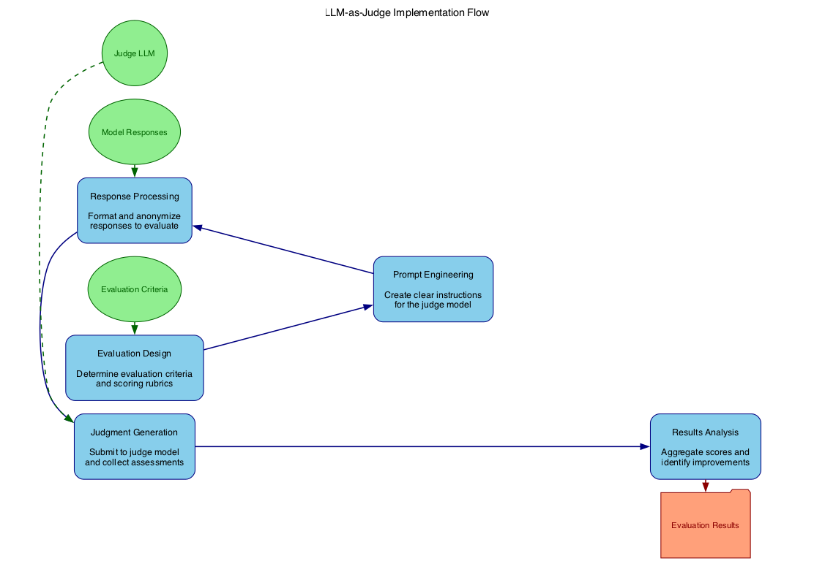

<!-- 
 Copyright Amazon.com, Inc. or its affiliates. All Rights Reserved.
 SPDX-License-Identifier: CC-BY-SA-4.0
 -->

# LLM-as-a-Judge

**Content Level: 200**

## Suggested Pre-Reading

* [Model Evaluation Fundamentals](../../2_6_1_model_evaluation/2_6_1_model_evaluation.md)

## TL;DR

LLM-as-Judge leverages large language models to evaluate other AI systems' outputs, offering a scalable and cost-effective alternative to human evaluation while providing consistent and detailed feedback. However, this approach has several known limitations. For instance, studies have shown that LLM judges tend to exhibit bias toward data generated by models from the same family and often favor longer responses. To mitigate these limitations, we recommend to consider ensemble of judges and balanced evaluation metrics for optimal model assessment and selection.

## Understanding LLM-as-Judge

LLM-as-Judge is an approach that employs large language models to evaluate the outputs of other AI systems, including other language models. This technique has gained significant traction as organizations seek scalable alternatives to human evaluation. High-performing models like Amazon Nova Premier have demonstrated the ability to provide assessments that correlate strongly with human judgments across various tasks.

The fundamental premise is straightforward: an LLM is provided with a question or task, one or more model-generated responses to evaluate, and clear instructions on evaluation criteria. The LLM then acts as a judge, providing scores and explanations for its assessment.

|Aspect	|Traditional Human Evaluation	|LLM-as-Judge	|
|---	|---	|---	|
|**Scalability**	|Limited by human resources	|Highly scalable	|
|**Cost**	|High ($10-50+ per hour)	|Lower (pennies per evaluation)	|
|**Speed**	|Days/weeks for large datasets	|Minutes/hours for large datasets	|
|**Consistency**	|Variable between evaluators	|Consistent given same prompt	|
|**Bias**	|Subject to human biases	|Subject to training data biases	|
|**Transparency**	|Can explain reasoning	|Can provide detailed rationales	|
|**Adaptability**	|Can evaluate novel criteria	|Limited by training distribution	|

The approach has revolutionized model evaluation by making comprehensive assessment feasible at scale. Organizations previously constrained by the cost and time requirements of human evaluation can now implement continuous, detailed feedback loops for model development.

## Technical Implementation

The LLM-as-Judge process involves several key components that work together to produce reliable evaluations:

<div style="margin:auto;text-align:center;width:100%;"></div>

1. **Evaluation Design**: Determining evaluation criteria, scoring rubrics, and formatting of inputs.
2. **Prompt Engineering**: Creating clear, comprehensive instructions that guide the judge model to evaluate based on specific criteria.
3. **Response Processing**: Collecting, formatting, and potentially anonymizing the responses to be evaluated.
4. **Judgment Generation**: Submitting the evaluation prompt, responses, and criteria to the judge model.
5. **Results Analysis**: Aggregating scores, analyzing patterns, and identifying areas for improvement.

For effective implementation, careful attention should be paid to prompt design. The evaluation prompt typically includes:

|Component	|Purpose	|Example	|
|---	|---	|---	|
|**Task Context**	|Establishes the evaluation scenario	|"You are evaluating responses to customer service inquiries."	|
|**Evaluation Criteria**	|Defines dimensions for assessment	|"Rate responses on accuracy, helpfulness, and tone."	|
|**Scoring System**	|Provides clear rating guidelines	|"Use a 1-5 scale where 1=Poor and 5=Excellent."	|
|**Output Format**	|Specifies how results should be structured	|"Provide a JSON object with scores and rationale."	|
|**Bias Mitigation**	|Reduces potential evaluation biases	|"Evaluate each response independently without comparison."	|

Research has shown that more capable models (like Amazon Nova Premier) tend to serve as better judges than smaller models, often providing evaluations that closely align with human assessment. However, even powerful models can exhibit biases toward outputs that mirror their own generation style.

## Making it Practical

### Case Study: Content Moderation System Evaluation

A content publishing platform needed to evaluate improvements to their content moderation system but faced challenges with the scale and consistency of human evaluation.

**Approach:**

1. They developed a test dataset of 2,000 user-submitted content pieces with varying degrees of policy violations
2. Created two versions of their moderation system with different approaches
3. Implemented LLM-as-Judge using Amazon Nova Premier to evaluate outputs

**Evaluation Setup:**

```
PROMPT:
You are an expert content policy evaluator. You will be shown a piece of user-submitted content and two moderation decisions.
Your task is to evaluate which moderation decision is better according to these criteria:
1. Accuracy: Does the decision correctly identify policy violations?
2. Clarity: Is the explanation clear and helpful to the user?
3. Fairness: Is the decision consistent with platform policies without bias?

Rate each decision on a scale of 1-5 for each criterion, then provide an overall winner.
```

**Results:**

|Metric	|System A	|System B	|Key Finding	|
|---	|---	|---	|---	|
|Accuracy	|3.7/5	|4.2/5	|System B better identified subtle policy violations	|
|Clarity	|4.1/5	|3.8/5	|System A provided more user-friendly explanations	|
|Fairness	|3.9/5	|4.3/5	|System B showed more consistent application of policies	|
|Processing Time	|6 hours	|6 hours	|90% faster than previous human evaluation	|

This evaluation identified that while System B was generally superior, incorporating System A's approach to explanation clarity would create an optimal solution. The company implemented a hybrid system and continued using LLM-as-Judge for ongoing quality monitoring.

### Implementation Guidelines

When implementing LLM-as-Judge in your workflow, consider these practical steps:

1. **Validate with Human Correlation**: First test your LLM-as-Judge setup for alignment against a sample of human evaluations.
2. **Maintain Reference Sets**: Create gold-standard examples with known scores to periodically calibrate your judge model.
3. **Use Structured Output Formats**: Request responses in JSON or other structured formats to simplify analysis.
4. **Implement Multiple Judges**: Consider using different LLMs as judges and aggregating their scores for more robust evaluation.
5. **Provide Clear Evaluation Criteria**: Explicitly define what constitutes different quality levels for each dimension.

### Common Challenges and Solutions

|Challenge	|Solution	|
|---	|---	|
|**Judge model bias**	|Use multiple judge models and test for biases on controlled examples	|
|---	|---	|
|**Inconsistent evaluations**	|Standardize prompts and provide rubrics with clear examples	|
|**Over-reliance on verbose answers**	|Include explicit instructions to focus on substance over style	|
|**Evaluation criteria drift**	|Periodically validate against human judgments	|
|**Gaming the system**	|Regularly update evaluation criteria and keep them partially private	|

## LLM-as-a-Judge Best Practices 

As large language models (LLMs) become increasingly prevalent in real-world applications, robust evaluation frameworks play an important role in their reliability, safety, and effectiveness. Using LLMs themselves as judges to evaluate other models or AI systems has emerged as a promising approach, but requires careful consideration. This section outlines key best practices for implementing LLM-as-a-judge evaluation effectively.

**1. Use Multiple Judge Models**
Relying on a single LLM as a judge introduces the risk of biased or inconsistent evaluations. Best practice is to employ multiple judge models with different architectures and training approaches. For example, using a combination of models like Claude, Mistral, Amazon Nova Premier, and Llama provides a more balanced assessment.

**2. Carefully Design Evaluation Prompts**
The prompts given to judge LLMs significantly impact evaluation quality. Prompts should be clear, specific, and tailored to the exact criteria being assessed. Include examples of high and low quality responses to calibrate the judge. Iterate on prompts to improve consistency and reduce ambiguity.

**3. Implement Bias Detection and Mitigation**
LLM judges may exhibit biases in their evaluations. Techniques like comparing judgments across demographic attributes, analyzing judge-question correlations, and studying judge-model interactions can help detect potential biases. Mitigate biases by aggregating judgments from diverse models and calibrating scores.

**4. Combine LLM Judges with Quantitative Metrics**
While LLM judges excel at holistic assessment, they should be complemented with quantitative metrics where possible. For example, use both LLM judgments and metrics like BLEU or ROUGE for summarization tasks. This provides a more comprehensive evaluation.

**5. Validate Judge Reliability**
Regularly assess the reliability and consistency of LLM judges. Techniques include:

* Evaluating judge performance on benchmark datasets with known ground truth
* Measuring inter-judge agreement
* Comparing LLM judgments to human evaluations on a subset of data


**6. Consider Task-Specific Judges**
For specialized domains or tasks, fine-tuning judge models on relevant data can improve evaluation quality. Models like JudgeLM have shown promising results as task-specific judges.

**7. Account for Uncertainty**
LLM judgments inherently involve uncertainty. Report confidence intervals or distributions for evaluation scores rather than just point estimates. Consider using techniques like bootstrapping to estimate score variability.

**8. Enable Reproducibility**
LLM outputs can vary between runs. Use consistent random seeds, model versions, and hyperparameters to enable reproducible evaluations. Document all evaluation settings in detail.

**9. Combine with Human Evaluation**
While LLM judges offer scalability, human evaluation remains invaluable. Use LLM judges for initial large-scale filtering, then incorporate targeted human evaluation on key subsets. Services like Amazon SageMaker offer tools to integrate human-in-the-loop feedback.


## Further Reading

* Paper: [Judging LLM-as-a-Judge with MT-Bench and Chatbot Arena](https://arxiv.org/abs/2306.05685){:target="_blank" rel="noopener noreferrer"}
* Research: [AlpacaEval: An Automatic Evaluator of Instruction-following Models](https://github.com/tatsu-lab/alpaca_eval){:target="_blank" rel="noopener noreferrer"}
* Framework: [HELM: Holistic Evaluation of Language Models](https://crfm.stanford.edu/helm/latest/){:target="_blank" rel="noopener noreferrer"}

## Contributors

**Authors**

* Flora Wang - Data Scientist 

* Hari Prasanna Das - Applied Scientist 

* Jae Oh Woo - Sr. Applied Scientist 
