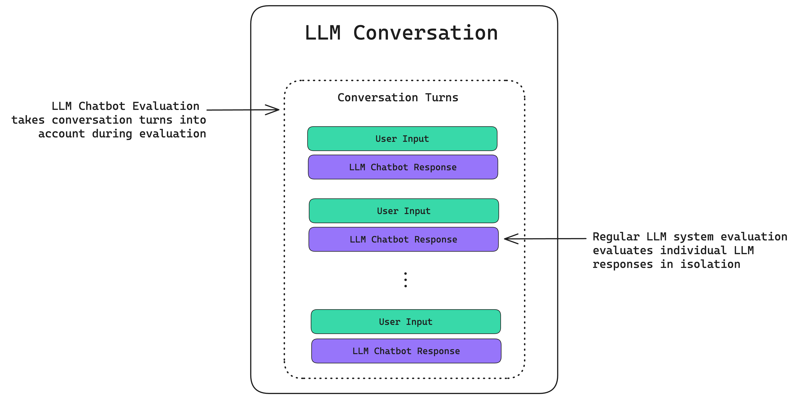

<!-- 
 Copyright Amazon.com, Inc. or its affiliates. All Rights Reserved.
 SPDX-License-Identifier: CC-BY-SA-4.0
 -->

# Chat Evaluation

**Content Level: 200**

## Suggested Pre-Reading

* [Introduction to Generative AI Evaluations](../../introduction_to_generative_AI_evaluations.md)

## TL;DR

This chapter provides a comprehensive guide for software developers to effectively evaluate Chat systems. It covers important evaluation metrics, practical frameworks, implementation strategies, and best practices to allow your Chat systems deliver accurate, relevant, and reliable results.

## 1. Introduction to Chat Evaluation

Chat evaluation assesses the effectiveness and quality of conversational AI agents, like chatbots, by examining their responses and overall conversational flow. This involves evaluating metrics like accuracy, relevance, coherence, and user satisfaction to determine how well the chatbot performs in understanding user queries and providing helpful, appropriate responses. The purposes of conducting chat evaluation are:

* **Assessing conversational AI:** Chat evaluation helps understand how well a chatbot, or any conversational AI agent, can engage in meaningful conversations with users.
* **Measuring performance**: it provides a way to quantify the chatbot's ability to understand user inputs, generate relevant and coherent responses, and achieve desired outcomes (e.g., task completion, customer satisfaction).
* **Identifying areas for improvement**: By analyzing performance, developers can pinpoint weaknesses and areas where the chatbot can be refined for better performance.

Chat evaluation is different from regular LLM (system) evaluation because while regular LLM evaluation evaluates LLM applications on individual input-output interactions, LLM chatbot evaluation involves evaluating LLM input-output interactions using prior conversation history as additional context.

This chapter outlines a structured approach to evaluating Chat systems, providing developers with practical tools and methodologies to build more reliable AI applications.

## 2. Key Evaluation Metrics

Chat, as typically a multi-turn conversation, can be evaluated in both turn-level and conversation-level. 

### 2.1. Turn-level metrics

Turn-level metrics could be highly overlapped with the metrics introduced in [RAG system evaluation](../2_6_4_1_evaluating_rag_systems/2_6_4_1_evaluating_rag_systems.md), enhancing the correctness and factuality of the response in each turn. Some common metrics are:

* **Faithfulness (Groundedness)**: Measures whether the generated response contains only information supported by the retrieved documents. This metric is critical for preventing hallucinations.
* **Answer Relevance**: Evaluates how directly the generated response addresses the user's query without including extraneous information.
* **Exact Match (EM)**: Calculates the percentage of generated answers that exactly match reference answers. While useful for factoid questions, this metric may be too strict for complex queries requiring nuanced responses.
* **Answer Similarity**: The concept of Answer Semantic Similarity pertains to the assessment of the semantic resemblance between the generated answer and the ground truth. This evaluation is based on the ground truth and the answer, with values falling within the range of 0 to 1. A higher score signifies a better alignment between the generated answer and the ground truth.
* **Answer Correctness:** The assessment of Answer Correctness involves gauging the accuracy of the generated answer when compared to the ground truth. This evaluation relies on the `ground truth` and the `answer`, with scores ranging from 0 to 1. A higher score indicates a closer alignment between the generated answer and the ground truth, signifying better correctness. Answer correctness encompasses two critical aspects: semantic similarity between the generated answer and the ground truth, as well as factual similarity. These aspects are combined using a weighted scheme to formulate the answer correctness score. Users also have the option to employ a ‘threshold’ value to round the resulting score to binary, if desired.

### 2.2. Conversation-level metrics

The conversation-level metrics focus on evaluate the human-chatbot conversation as a whole, measuring the capability of a chatbot to conduct the multi-turn conversation with the user. Some common metrics are:

* **Resolution**: Whether the customer raised issue was resolved or not.
* **Containment**: whether the chatbot handled the case without escalating to human.
* **Sentiment**: The sentiment or satisfaction levels of a customer when encountering a chatbot. To gauge the emotional tone of the conversation.
* **Agent Tone**: Tone of the agent/chatbot when conversing with customer.
* **Naturalness and Fluency**: How naturally and smoothly the chatbot's responses sound.
* **Instruction following**: Measures how good the bot is following the instructions defined in the prompt
* **User Satisfaction**: Users perception of interaction through post chat ratings or surveys. How happy users are with the chatbot's performance.
* **Conversation Completeness**: The conversation completeness metric is a conversational metric that determines whether the LLM chatbot is able to complete an end-to-end conversation by satisfying user needs throughout a conversation.
* **Knowledge Retention**: The knowledge retention metric is a conversational metric that determines whether the LLM chatbot is able to retain factual information presented throughout a conversation.
* **Role Adherence**: The role adherence metric is a conversational metric that determines whether the LLM chatbot is able to adhere to its given role throughout a conversation.
* **Conversation Relevancy**: The conversation relevancy metric is a conversational metric that determines whether the LLM chatbot is able to consistently generate relevant responses throughout a conversation.
* **Coherence**: How well the chatbot maintains a logical flow and consistency throughout the conversation. 
* **Fluency**: How naturally and smoothly the chatbot's responses sound. 
* **Task Completion Rate**: The percentage of user goals successfully achieved by the chatbot.  
* **Fallback Rate**: The percentage of conversations where the chatbot fails to understand the user's query. 
* **Customer Effort**: How much effort users need to expend to get their questions answered or tasks completed. 
* **Conversation Length**: The average length of conversations with the chatbot.

## 3. Tools and Frameworks 

* **DeepEval:** An open-source evaluation framework that provides automated, LLM-based metrics to assess conversational AI systems across dimensions like answer relevancy, faithfulness, contextual understanding, and hallucination detection.
* **LangSmith from LangChain:** Provides tools and resources for evaluating and improving chatbots. It enables developers to trace, debug, and evaluate chat applications through comprehensive monitoring of conversation flows, performance metrics, and quality assessments with both automated and human feedback mechanisms.
* **ChatEval framework (ChatEval):** A scientific framework for evaluating open-domain chatbots, offering standardized evaluation and comparisons.

## 4. Best Practice for Chatbot Evaluation

* **Defining clear goals and objectives**: What specific outcomes are you trying to achieve with the chatbot?. 
* **Choosing appropriate evaluation metrics**: Select metrics that align with your goals and provide a comprehensive picture of the chatbot's performance. 
* **Ensuring a diverse range of user queries and scenarios**: Test the chatbot with a variety of questions and situations to confirm it can handle different types of interactions. 
* **Iterating and improving**: Continuously evaluate and refine the chatbot based on feedback and performance data. 

## 5. Conclusion

Evaluating Chat systems is important for confirming their effectiveness and reliability. By understanding key evaluation metrics and utilizing appropriate frameworks and tools, software developers can systematically assess and enhance the performance of Chat systems.

## References
* [DeepEval OpenSource](https://github.com/confident-ai/deepeval/tree/main){:target="_blank" rel="noopener noreferrer"}
* [Confident AI Blogpost: Top LLM Chatbot Evaluation Metrics](https://www.confident-ai.com/blog/llm-chatbot-evaluation-explained-top-chatbot-evaluation-metrics-and-testing-techniques){:target="_blank" rel="noopener noreferrer"}
* [LangSmith Docs](https://docs.langchain.com/langsmith/home){:target="_blank" rel="noopener noreferrer"}
* [ChatEval](https://chateval.org/){:target="_blank" rel="noopener noreferrer"}

## Contributors

### Authors

* Long Chen - Sr. Applied Scientist 

**Primary Reviewer:**

* Ruskin Dantra - Sr. Solution Architect 