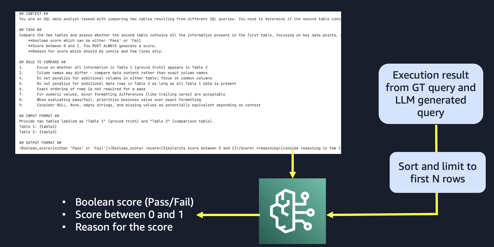

<!-- 
 Copyright Amazon.com, Inc. or its affiliates. All Rights Reserved.
 SPDX-License-Identifier: CC-BY-SA-4.0
 -->

# Evaluation of Text2SQL Generation Pipeline

**Content Level: 200**

## Suggested Pre-Reading

* [Evaluation Techniques](../../2_6_3_evaluation_technique/2_6_3_evaluation_techniques.md)

## TL;DR

This section provides a comprehensive framework for evaluating Large Language Model (LLM) based Text-to-SQL systems. We examine methodologies and metrics that help assess how effectively these systems translate natural language queries into accurate and efficient SQL statements, which is critical for deployments in production environments.

## 1. Text2SQL using  Large Language Models

Text-to-SQL generation using large language models (LLMs) offers powerful solutions across industries working with large databases for automating SQL generation. The primary purpose is to enable non-technical users to interact with a company's database through natural language querying without requiring SQL expertise.  A typical text2sql pipeline consists of processing of input queries → sql generation → execution.


## 2. Evaluation Framework

Evaluating Text2SQL is critical to validate performance of the model, but manual validation requires big time and effort  commitment from subject matter experts (SME). To reduce the SME’s efforts its important to build a robust auto evaluation framework. 
Automated evaluation of Text-to-SQL systems is important for several reasons including faster, consistent, scalable, consistency, track quality and catch regressions in production.Automated evaluation provides structured insights that guide targeted improvements to the Text-to-SQL pipeline.

There are two main components to evaluating text2SQL pipeline:

1. Evaluation of generated SQL queries
2. Evaluation of execution results by generated queries

### 2.1 Evaluation of generated SQL queries

To evaluate generate SQL queries against ground truth we decompose the queries into different components and find the overlap. Let's take the following example:

Example user prompt: 

```

"Show me the names of customers who placed orders in the last 30 days."
```

Ground truth SQL query

```
SELECT DISTINCT [c.name](http://c.name/)
FROM Customers c
JOIN Orders o ON c.customer_id = o.customer_id
WHERE o.order_date >= CURRENT_DATE - INTERVAL '30 days';
```


LLM generated SQL query

```
SELECT name
FROM Customers
WHERE order_date >= CURRENT_DATE - INTERVAL '30 days';
```

Steps to evaluate:

* **Normalization of both the queries (**UPPERCASE, remove extra spaces, standardize syntaxes or keywords)

Ground Truth:

```
 SELECT DISTINCT C.NAME FROM CUSTOMERS C JOIN ORDERS O ON C.CUSTOMER_ID = O.CUSTOMER_ID WHERE O.ORDER_DATE >= CURRENT_DATE - INTERVAL '30 DAYS';
```

Generated:

```
SELECT NAME FROM CUSTOMERS WHERE ORDER_DATE >= CURRENT_DATE - INTERVAL '30 DAYS';
```

* **Exact Match Comparison:** Does the generated SQL match the ground truth exactly? 
    * if yes then exact match = 1, component accuracy = 1, evaluation done
    * if no then proceed with remaining steps

In this example exact match =0

* **Component-Level Accuracy**

|Component Type	|Ground Truth	|Generated Query	|Match	|
|---	|---	|---	|---	|
|SELECT Clause	|`SELECT DISTINCT c.name`	|`SELECT name`	|0	|
|FROM Clause	|`FROM Customers c`	|`FROM Customers`	|1	|
|JOIN Clause	|`JOIN Orders o ON c.customer_id = o.customer_id`	|*Missing*	|0	|
|WHERE Clause	|`WHERE o.order_date >= ...`	|`WHERE order_date >= ...`	|1	|

Total Ground Truth Components: 4
Correctly Matched Components: 2
Component-Level Accuracy: 0.50

* **Overall SQL Accuracy Score:** Computed as the average of exact match and component accuracy.

Overall Accuracy= (0.00 + 0.50)/2 =0.25


### 2.2 Evaluation of execution results by generated queries

Therefore, it's important to evaluate the executed results. The execution accuracy metric evaluates whether the predicted SQL query produces the same result as the ground truth SQL query when executed against the database. This is the most stringent evaluation metric, as it not only requires the predicted SQL to be syntactically correct, but also semantically equivalent to the reference SQL. Sometimes it's possible that generated SQL query doesnt have high component accuracy, yet it's possible that the results from executing that SQL query is not valid. To compute the execution accuracy, the predicted SQL and ground truth SQL are first executed against the corresponding database. The results of the two queries are then compared. 
The evaluation of query execution results typically employs both programmatic methods and, more recently, LLM-based approaches.

**Programmatic Evaluation**
When evaluating the execution results from generated queries programmatically, they are compared with ground truth query results through the following process:

* **Result preprocessing**: 
    * Normalization: Parse execution results into comparable formats, handle null values consistently, round decimal values.
    * Retain only common columns between GT and generated results.
    * Sorting: Sorting the rows based on a common numeric column is important before row-wise matching.
* **Multi-level Comparison**:
    * Exact Match: Determine if the sets of normalized results are completely identical
    * Cell-level Matching: Count individual cell matches between result sets, applying pre-defined numeric tolerance (typically 0.1) for floating-point comparisons
    * Row-level Matching: Consider rows as matches when the proportion of matching cells within a row meets or exceeds a predefined threshold (typically 0.7)
* **Accuracy Metrics**:
    * Mean Accuracy: Calculated based on the proportion of matching cells across the entire result set
    * Simple Proportion: Determined by the ratio of matching rows to total rows in the result set

**LLM as a judge**
Recent research has explored using Large Language Models (LLMs) as evaluators for query execution results. This method typically involves choosing a high performant model as a judge , crafting an effective prompt [put link to prompting techniques] and giving the input in the correct format to the judge. The output from the judge can be anything the user desires, but generally it's a score and reasoning for the score.

<div style="margin:auto;text-align:center;width:100%;"></div>

### Pros and cons of LLM as a judge:

**Advantages** 

* Saves us from doing nuanced formatting for every possible returned execution results
* Finer evaluation depending on how much of the retrieved GT data is missing from the execution result of the LLM query. Assigns fine grained scores
*  LLMs can provide human-readable explanations for why results match or diverge, facilitating error analysis.


**Things to keep in mind**

* Non-deterministic – example: a score can be 0.75 on the first evaluation run but  0.65 in run 2. 
* It can get costlier depending on the sizes of data frames and also there is limitation on maximum input tokens. Hence limiting the data sent to LLM is important.
* Dependent on model used as a judge and the prompt.

LLM-based evaluation complements programmatic methods, particularly for cases where strict equality comparisons fail to capture the nuanced correctness of query results.
The execution accuracy provides a practical assessment of the model's performance, as it measures the end-to-end capability to translate natural language questions into executable SQL queries. This is an important metric for real-world applications where the generated SQL needs to work seamlessly with the underlying database.

>

## Making it Practical

Implementing effective evaluation systems for query results requires attention to several practical considerations. The following recommendations will help engineers build robust evaluation frameworks:

**Resource Management**

Limit Result Size: Set reasonable limits on the number of returned rows after SQL execution to prevent memory overflow issues, especially when evaluating large datasets. Consider implementing pagination or sampling strategies for very large result sets.

**Data Format Handling**

Format Conversions: When working within multi-agent frameworks where results may be passed between LLM agents, develop robust parsers for converting between data frames and string representations. Pay particular attention to:

    * Preserving column header information
    * Maintaining data types during conversions
    * Handling special characters and delimiters consistently
    * Iterative Framework Development

**Incremental Validation**: Build and validate your evaluation framework through multiple iterations to identify and address edge cases:

    * Start with simple cases and gradually incorporate more complex scenarios
    * Log and analyze cases where evaluation results diverge from expectations
    * Create regression tests for previously encountered issues
* **Error Analysis**: Systematically investigate causes of lower accuracy metrics. Common issues include:
    * Column name variations (e.g., "customer_id" vs. "customerID") that are semantically equivalent
    * Differences in result ordering that don't affect correctness
    * Valid transformations that produce different but equivalent results
    * Human Oversight
* **Subject Matter Expert Validation**: Supplement automated evaluation with periodic SME reviews:
    * Select a diverse subset of test cases for manual review
    * Focus expert attention on boundary cases and complex queries
    * Use SME insights to refine automated evaluation criteria
    * Document patterns that automated systems consistently miss

By addressing these practical considerations, engineers can develop evaluation frameworks that reliably assess query result quality while remaining robust to the various challenges encountered in real-world applications.

### References


## Contributors

**Authors**

* Rahul Ghosh - Applied Scientist II 

* Baishali Chaudhury - Applied Scientist II 

**Primary Reviewer:**

* Ruskin Dantra - Sr. Solution Architect 
