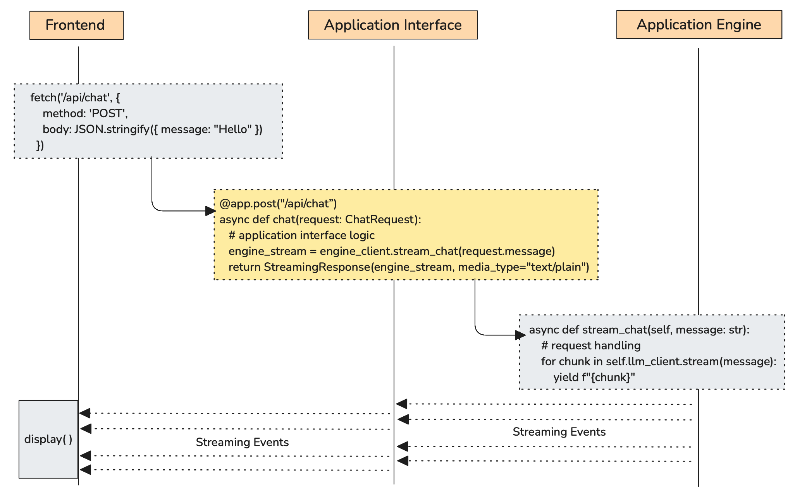
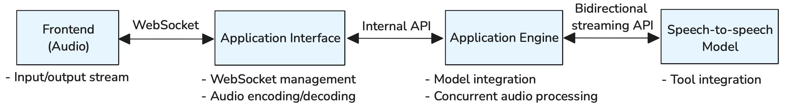

<!-- 
 Copyright Amazon.com, Inc. or its affiliates. All Rights Reserved.
 SPDX-License-Identifier: CC-BY-SA-4.0
 -->

# Application Interface for GenAI Systems

**Content Level: 200**

## Suggested Pre-Reading

- [Foundation Architecture Components](../index.md)

## TL;DR

The application interface serves as the backend application's entry point, acting as the critical bridge between external clients and GenAI systems. It handles user authentication, formats interactions for the application engine, and optimizes user experience across different interaction patterns. Designing effective application interfaces requires considering interface modalities, user authentication mechanisms, interaction flow control, and response presentation strategies that accommodate the unique characteristics of AI-powered applications.

## Application Interface Design Considerations

The application interface represents the primary touchpoint between users and GenAI systems, fundamentally shaping user experience and system accessibility. Unlike traditional web applications with predictable request-response cycles, GenAI interfaces must accommodate variable response times, streaming outputs, long-running background processes, and diverse interaction patterns ranging from simple queries to complex multi-turn conversations.

Successful application interface implementation requires addressing several key design areas. The interface architecture determines how users interact with the system and how authentication integrates with user workflows. Flow control mechanisms manage the complexity of single-turn versus multi-turn interactions, synchronous versus asynchronous processing, and real-time streaming capabilities. Response processing ensures that AI outputs are presented effectively while maintaining user engagement during potentially long processing times.

## Core Implementation Areas

### Input and Output Processing

GenAI applications can accept and generate content across multiple modalities. Users may submit requests as text queries, voice commands, uploaded images/videos, or document files, while expecting responses in formats that match their workflow needs—whether that's streaming text, generated images, synthesized speech, or formatted documents.

Common input modalities include:

- **Text**: Direct queries, instructions, or prompts
- **Voice**: Spoken commands requiring speech-to-text processing
- **Images/Video**: Visual content for analysis, processing, or understanding
- **Documents**: Files requiring parsing, extraction, or transformation

Output expectations vary similarly:

- **Text responses**: Streaming or complete text generation
- **Voice synthesis**: Text-to-speech for accessibility or hands-free scenarios
- **Visual generation**: Charts, diagrams, images, or video content
- **Document creation**: Formatted reports, processed files, or structured outputs

Modern GenAI interfaces increasingly support multimodal interactions within a single session. Based on the application interface's input/output modality requirements, the application engine in the backend may process these through multiple models, which raises considerations around seamless context management and latency optimization across different processing pipelines.

### Communication Protocol

Selecting appropriate communication patterns depends on the modalities and interaction characteristics involved in GenAI applications. Different scenarios require different architectural approaches to optimize both user experience and system efficiency.

Figure 1: REST + SSE Streaming Pattern for GenAI Applications

For **text-based interactions**, the most common and effective pattern combines **REST APIs** for request handling with **Server-Sent Events (SSE)** for streaming responses. As illustrated in Figure 1, the frontend initiates a POST request to the application interface, which authenticates and forwards the request to the application engine. The application engine processes the request through LLM calls and generates streaming responses, which flow back through the application interface to the frontend as SSE events. This approach provides HTTP simplicity for requests while enabling real-time streaming without WebSocket resource overhead, allowing users to see AI responses as they are generated rather than waiting for complete processing.

Real-time bidirectional communication scenarios, such as **speech-to-speech** or **collaborative editing**, benefit from WebSocket connections that support full-duplex communication. **WebSockets** excel when both client and server need to send data simultaneously, such as speech-to-speech applications where audio flows continuously in both directions, or when immediate user interruption capabilities are required during processing. WebSockets provide the low-latency, persistent connections necessary for real-time audio streaming and enable features like barge-in (interrupting the AI while it's speaking) that are essential for natural conversational experiences.

Figure 2: WebSocket + Bidirectional Streaming Pattern for Speech-to-Speech Applications

**Large file operations**, such as **video generation** or **extensive document processing**, typically implement asynchronous patterns using storage-backed results. Rather than streaming large files directly through network connections, these systems store results in object storage such as Amazon S3 and return access links to clients. This approach prevents connection timeouts, enables resume capabilities, and reduces bandwidth costs while providing better user experience through progress notifications and background processing.

### Authentication and Access Control

**User authentication** must balance security requirements with user experience expectations across different interface types. Integration with enterprise identity providers like SAML, OAuth enables seamless single sign-on while maintaining corporate security policies. Session management becomes particularly important in conversational AI applications where context must persist across multiple interactions while ensuring appropriate timeout and security boundaries.

**RBAC (Role-based access control)** systems need to account for granular permissions such as model access levels, data sensitivity classifications, and tool usage rights. Different user roles may require access to different AI capabilities, processing limits, or data sources, requiring fine-grained permission systems that can adapt to evolving organizational needs.

### User Experience Optimization

Optimizing GenAI interfaces for user satisfaction requires attention to perceived performance, cognitive load management, and accessibility considerations. Response time optimization involves not just technical performance but also user perception—providing immediate acknowledgment, progress indicators, and partial results can make longer processing times feel more acceptable. Caching strategies for common queries and precomputing frequently requested information can significantly improve perceived responsiveness.

Cognitive load management becomes crucial when presenting complex AI outputs or managing multi-step workflows. Effective interfaces use progressive disclosure, contextual help, and intuitive navigation to prevent user overwhelm while maintaining access to advanced capabilities. Personalization features allow users to customize information density, interaction patterns, and notification preferences based on their expertise level and usage patterns.

## Making it Practical

When implementing application interface architecture, prioritize user experience research and iterative design processes. GenAI interfaces benefit from early user testing to understand how people naturally interact with AI systems and what expectations they bring from other applications. Start with simple, well-executed core interactions and gradually add sophisticated features based on user feedback and usage patterns.

Implement comprehensive analytics and user behavior tracking to understand how people actually use the interface versus initial design assumptions. GenAI applications often reveal unexpected usage patterns as users discover new ways to leverage AI capabilities. Design systems that can adapt and evolve based on real user behavior while maintaining consistency and reliability.

## Further Reading

- [Application Engine](../3_1_1_2_application_engine/index.md) - Core processing component that handles AI model integration, business logic, and orchestrates GenAI workflows
- [AG-UI Protocol Architecture](https://docs.ag-ui.com/concepts/architecture){:target="_blank" rel="noopener noreferrer"} - Event-driven architecture patterns and standardized communication protocols for agent-frontend interactions

## Contributors

**Author**:

* Kihyeon Myung - Senior Applied AI Architect 

**Primary Reviewer**:

* Felix Huthmacher - Senior Applied AI Architect 
* Don Simpson - Principal Technologist 