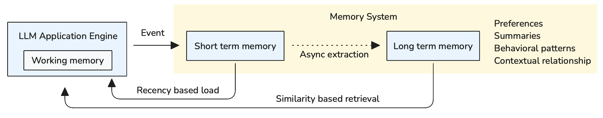

<!-- 
 Copyright Amazon.com, Inc. or its affiliates. All Rights Reserved.
 SPDX-License-Identifier: CC-BY-SA-4.0
 -->

# Memory System for GenAI Applications

**Content Level: 200**

## Suggested Pre-Reading

- [Foundation Architecture Components](../index.md)

## TL;DR

Memory maintains context of past interactions with an LLM-augmented workflow which is otherwise stateless. Memory implementations are generally broken up by short and long term memory implementations where short term maintains the current session's context and long term contains different types of "memories" generated over the course of many sessions.

## Memory System Architecture Overview

GenAI memory systems transform stateless applications into stateful, context-aware systems by implementing two fundamental memory types:

### Short-term Memory
Short-term memory maintains immediate context within a single session or conversation thread. It preserves recent exchanges, active variables, and current task state, operating with limited capacity constrained by model context windows. Common implementation patterns include conversation buffers with sliding windows, token-aware truncation mechanisms, and recency-biased retention strategies that preserve the most valuable recent exchanges.

### Long-term Memory
Long-term memory stores extracted insights that persist across sessions, maintaining structured information like user preferences, semantic facts, and conversation summaries rather than raw conversation data. It provides permanent storage with semantic search capabilities. Common implementation approaches include:

* **Vector-based semantic indexing**: Stores facts and concepts as embeddings for semantic similarity search, enabling retrieval of contextually relevant information
* **Entity-attribute databases**: Extracts and maps user preferences and attributes in simple key-value structures, or uses graph databases for more complex entity modeling with rich relationships between users, entities, and concepts
* **Summary-based compression**: Employs LLMs to recursively generate compressed summaries of conversation history for more efficient long-term memory management and context retrieval, with preprocessing during storage enabling simpler retrieval operations

These approaches can be combined effectively—for example, using summary-based compression to create condensed representations that are then stored as vectors for semantic search, or integrating entity-attribute structures with vector embeddings for hybrid retrieval strategies.

## Long-term Memory Categories

Long-term memory implementations typically focus on three distinct information types:

### Factual Knowledge Storage
This approach stores structured facts, user preferences, and domain-specific information extracted from conversations. Common patterns include maintaining user profile databases, preference mappings, and knowledge graphs that capture relationships between entities and concepts discussed across sessions.

### Contextual Experience Tracking
Some systems preserve specific interaction contexts and conversation flows to understand patterns in how users approach problems or make decisions. This enables applications to recognize similar situations and apply previously successful interaction strategies or recall relevant past exchanges.

### Behavioral Pattern Learning
Advanced implementations capture communication styles, workflow preferences, and interaction patterns to personalize future responses. This might involve adjusting response formats, conversation pacing, or decision-making approaches based on what has proven effective for specific users or contexts.

## Implementation Architecture

Figure 1: Memory System Architecture with Short-term and Long-term Memory Processing

As illustrated in Figure 1, the memory architecture shows how both memory types integrate with the Application Engine. Short-term memory maintains immediate session context, while long-term memory processes and stores persistent insights across sessions. The LLM Application Engine generates events during user interactions, which flow into the memory system for both immediate context management and long-term knowledge extraction.

### Memory Processing Pipeline

Memory systems typically implement a processing pipeline that handles information extraction, consolidation, and retrieval:

As illustrated in Figure 1, the LLM Application Engine generates events during user interactions, which flow into the memory system. The Application Engine contains working memory for immediate processing needs, while the memory system handles both short-term and long-term persistence.

**Extraction** involves analyzing interactions to identify important information including user preferences expressed during conversations, behavioral patterns, contextual relationships, and semantic facts mentioned throughout sessions. The extraction process captures not just explicit statements but also implicit patterns in communication style, domain preferences, and decision-making approaches.

**Consolidation** focuses on merging new information with existing knowledge by resolving conflicts between new and stored information, updating user preference models based on recent evidence, and compressing redundant information to optimize storage efficiency. This process maintains temporal relationships between facts while ensuring consistency across the knowledge base.

**Retrieval** enables finding relevant stored information for current interactions through semantic search across stored knowledge, temporal filtering to prioritize recent or historically relevant information, and user-specific filtering to surface personalized insights. Advanced retrieval implementations include query expansion techniques to find related concepts and contextually relevant information.

### Memory Integration Patterns

Memory systems integrate with GenAI applications through several architectural patterns:

**Session-based Integration**: Memory components maintain session state and provide context to the Application Engine during active interactions. Short-term memory feeds directly into prompt construction while long-term memory enriches responses with historical context.

**Asynchronous Processing**: Long-term memory extraction and consolidation occur in background processes to avoid impacting response latency. This enables real-time interactions while building persistent knowledge over time.

**Layered Retrieval**: Applications query memory systems in tiers - checking short-term memory first for immediate context, then accessing long-term memory for deeper personalization and historical insights.

## Making it Practical

### Short-term Memory Optimization

Memory systems extend context length, making effective short-term memory management crucial for performance. The key challenge involves selecting the appropriate number of recent interactions to include in the context window. More history isn't always better—excessive context can dilute relevant information and increase processing costs. Focus on choosing the right number of recent exchanges that provide meaningful context without overwhelming the model.

### Long-term Memory Strategy

Long-term memory extraction strategies should align with your application's purpose. Define what information to extract based on your goals—customer service applications focus on user preferences and issue patterns, while tutoring applications track learning progress and knowledge gaps.

Consider when to retrieve long-term memory. Not every interaction needs historical context. Determine appropriate retrieval triggers based on when past insights would genuinely improve the current response, such as when users reference previous conversations or when personalization would add value.

### Memory Usage Guidelines

Consider memory systems as context enhancement tools rather than automatic improvements. Monitor the impact of memory integration on response quality and processing time. Sometimes minimal context produces better results than comprehensive historical information, especially for straightforward queries that don't benefit from personalization.

**Data Filtering and Privacy Protection**: Since long-term memory consolidation typically relies on LLM-based preprocessing, implement robust data filtering mechanisms during this process. Use regex patterns and traditional AI models for data masking to identify and redact sensitive information like PII, financial data, or confidential details before storage. Avoid storing transactional data, temporary session variables, or information that becomes outdated quickly.

**Memory Isolation and Access Control**: Implement strict memory separation by session and user to prevent data leakage. Each user's memory should be isolated with proper access controls, and shared memories (if needed) should have explicit permission models. Consider namespace-based isolation for multi-tenant applications.

**Context Window Optimization**: For short-term memory, start with 3-5 recent conversation turns as a baseline, then adjust based on your specific use case. Monitor token usage and response quality to find the optimal balance between context richness and computational efficiency.

Balance memory depth with computational efficiency by implementing tiered approaches: use short-term memory for immediate context, selectively retrieve long-term insights when contextually relevant, and avoid over-engineering memory systems for applications that don't require sophisticated personalization.

## Further Reading

- [LangGraph Memory](https://langchain-ai.github.io/langgraph/concepts/memory/){:target="_blank" rel="noopener noreferrer"} - Framework-native memory implementation with thread-scoped and cross-session memory management using state persistence and stores
- [Mem0 Documentation](https://docs.mem0.ai/introduction){:target="_blank" rel="noopener noreferrer"} - Comprehensive memory layer framework for AI agents with LLM-based extraction, multi-modal support, and production-ready implementation
- [Modeling Agent Memory with Neo4j](https://neo4j.com/blog/developer/modeling-agent-memory/){:target="_blank" rel="noopener noreferrer"} - Graph database approach for modeling complex entity relationships, semantic, episodic, and temporal memory patterns
- [Amazon Bedrock AgentCore Memory](https://aws.amazon.com/blogs/machine-learning/amazon-bedrock-agentcore-memory-building-context-aware-agents/){:target="_blank" rel="noopener noreferrer"} - Managed memory service for building context-aware agents with persistent memory capabilities and seamless AWS integration

## Contributors

**Author**:

* Kihyeon Myung - Senior Applied AI Architect 

**Primary Reviewer**:

* Tanner McRae - Senior Applied AI Architect 
* Felix Huthmacher - Senior Applied AI Architect 
* Don Simpson - Principal Technologist 