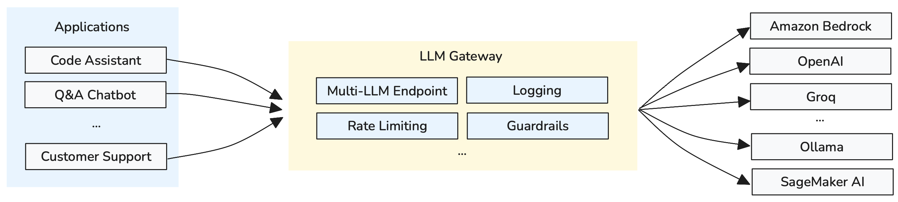

<!-- 
 Copyright Amazon.com, Inc. or its affiliates. All Rights Reserved.
 SPDX-License-Identifier: CC-BY-SA-4.0
 -->

# LLM Gateway for GenAI Systems

**Content Level: 200**

## Suggested Pre-Reading

- [Foundation Architecture Components](../index.md)

## TL;DR

LLM Gateway provides centralized access to multiple models for cost tracking, rate limiting, centralized governance, and operational considerations like fallbacks and normalization of API definitions across multiple providers. It serves as a standardized shim layer that organizations put in place of direct LLM calls to enable enterprise-grade management and monitoring.

## LLM Gateway Architecture Overview

LLM Gateway serves as a standardized abstraction layer that organizations place between their applications and multiple AI model providers. The gateway provides a unified access point that standardizes interactions across different provider interfaces while enabling centralized management and monitoring.

The architecture addresses four core enterprise requirements organized into key value propositions:

**Rate Limiting and Cost Attribution**: Centralized control over API usage limits and detailed cost tracking across teams, projects, and applications, enabling budget management and preventing unexpected spending.

**API Normalization**: Standardized interfaces across different model providers, abstracting away provider-specific API differences while enabling seamless switching between models and vendors.

**Routing Strategies and Fallbacks**: Configurable routing decisions based on criteria like token usage and prompt complexity, with automatic fallback mechanisms to maintain service availability during outages.

**Centralized Governance**: Unified implementation of security controls, compliance requirements, content filtering, and audit trails across all AI model interactions within the organization.

Figure 1: LLM Gateway Architecture with Multi-LLM Routing and Governance Controls

## Core Implementation Areas

### Model Routing & Selection Strategy

In an LLM Gateway configuration, you can specify fallback and routing configurations based on criteria like token usage, prompt complexity, and model availability. Defining these at the LLM Gateway level allows routing decisions to be made with a holistic view of AI usage across all workloads, providers, and deployments. This centralized approach enables consistent routing policies and provides visibility into usage patterns across the entire organization.

### Enterprise Governance & Security

LLM Gateways provide centralized implementation of security controls, compliance requirements, and content filtering across all AI model interactions. The gateway enables organization-wide policy enforcement through a single management point. This includes role-based access controls, audit trails, guardrails for content filtering, and automated compliance reporting that scales across multiple teams and use cases.

### Gateway Deployment Patterns

Organizations typically choose from three deployment approaches based on their operational requirements and constraints. Cloud-managed gateways provide turnkey solutions with built-in governance and monitoring. Universal API gateways offer provider-agnostic flexibility for multi-cloud environments. On-premises solutions address strict data sovereignty requirements while requiring more operational overhead.

## Making it Practical

### Gateway Selection Criteria

Gateway selection should align with organizational AI maturity and operational requirements. Early-stage organizations typically benefit from managed cloud solutions that reduce operational complexity while providing enterprise-grade capabilities. As AI usage grows and requirements become more sophisticated, organizations often transition to universal API gateways for increased flexibility and multi-provider support.

Data governance and compliance requirements significantly influence deployment patterns. Organizations with strict data sovereignty needs or regulatory constraints may require on-premises implementations despite higher operational costs. Organizations with flexible data policies can leverage cloud-managed services for improved scalability and reduced infrastructure management overhead.

### Routing Strategy Design

Effective routing strategies balance cost optimization with performance requirements. Start with complexity-based routing that matches query difficulty to appropriate model capabilities—directing simple queries to efficient models while reserving sophisticated models for complex reasoning tasks. Use actual performance data and cost metrics to continuously refine routing decisions rather than relying on theoretical assumptions.

Build robust fallback mechanisms to maintain service availability during model outages or performance issues. Circuit breaker patterns detect failing models and automatically redirect requests to healthy alternatives. Consider implementing geographic routing for latency optimization and regulatory compliance, especially when operating across multiple regions with different data residency requirements.

### Governance Implementation

Build governance frameworks that mature alongside organizational AI adoption. Start with fundamental controls like budget limits, basic content filtering, and usage tracking. Expand to advanced capabilities including sophisticated guardrails, comprehensive audit trails, and automated compliance reporting as operational sophistication increases.

Design monitoring systems that deliver actionable insights without overwhelming operational teams. Focus on business-critical metrics including cost per interaction, response quality, and security events. Implement automated responses for routine issues while ensuring human oversight for complex scenarios that require judgment and context.

## Further Reading

- [LiteLLM](https://docs.litellm.ai/docs/){:target="_blank" rel="noopener noreferrer"} - Open-source LLM proxy server that standardizes API calls across different providers
- [Kong AI Gateway](https://developer.konghq.com/ai-gateway/){:target="_blank" rel="noopener noreferrer"} - API gateway solution with LLM-specific functionality
- [Multi-Provider Generative AI Gateway on AWS](https://aws.amazon.com/solutions/guidance/multi-provider-generative-ai-gateway-on-aws/){:target="_blank" rel="noopener noreferrer"} - AWS reference architecture for building scalable, multi-provider AI gateways with comprehensive governance and monitoring

## Contributors

**Author**:

* Kihyeon Myung - Senior Applied AI Architect 

**Primary Reviewer**:

* Tanner McRae - Senior Applied AI Architect 
* Don Simpson - Principal Technologist 