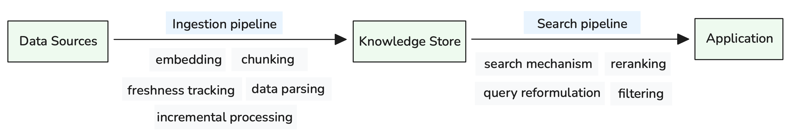
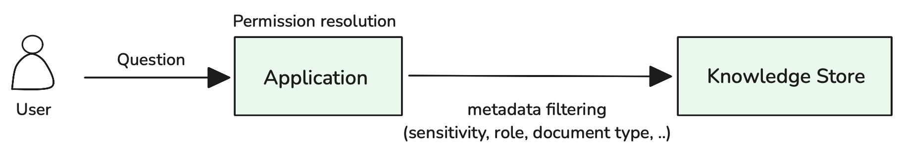

<!-- 
 Copyright Amazon.com, Inc. or its affiliates. All Rights Reserved.
 SPDX-License-Identifier: CC-BY-SA-4.0
 -->

# Knowledge Base for GenAI Systems

**Content Level: 200**

## Suggested Pre-Reading

- [Foundation Architecture Components](../index.md)

## TL;DR

The Knowledge Base serves as a dynamic knowledge management layer that enables GenAI applications to access real-time, domain-specific organizational knowledge beyond static training data. It manages the complete knowledge lifecycle from ingestion to retrieval, providing seamless integration with Application Engine through intelligent search capabilities while maintaining granular access controls for enterprise security requirements.

## Retrieval-Augmented Generation (RAG) Overview

Foundation models are trained on static datasets with fixed knowledge cutoffs, creating a fundamental limitation for enterprise applications that require current, domain-specific information. Retrieval-Augmented Generation (RAG) addresses this limitation by combining the reasoning capabilities of large language models with real-time information retrieval from organizational knowledge sources.

RAG operates similarly to providing students with access to reference materials during an examination. Instead of relying solely on memorized information, the model can consult external knowledge sources to provide accurate, up-to-date responses. This approach enables AI systems to access current organizational policies, recent project updates, and domain-specific expertise that extends beyond their training data.

The knowledge base component of RAG systems manages the complete information lifecycle—from ingesting diverse data sources to enabling contextually relevant retrieval. Effective RAG implementations must address three core requirements: maintaining synchronized knowledge from multiple organizational sources, ensuring retrieved information is contextually relevant for AI reasoning, and implementing appropriate access controls for sensitive information.

## Core Implementation Areas

### Knowledge Base Selection Strategy

Effective RAG implementations require selecting appropriate storage solutions based on information characteristics and query patterns. **Vector-based approaches** handle unstructured content optimally through semantic similarity search—documents, emails, and knowledge articles benefit from embedding-based retrieval that understands conceptual relationships beyond keyword matching.

**Relational approaches** excel for structured information requiring precise filtering and aggregation. Financial data, product catalogs, and operational metrics often need exact queries with complex joins and mathematical operations that vector search cannot provide effectively.

**Graph-based approaches** address scenarios where entity relationships and ontological structures are primary concerns. When answering questions about organizational hierarchies, project dependencies, or regulatory compliance chains, graph traversal provides more accurate results than either vector or relational approaches.

Most enterprise RAG systems implement hybrid architectures that route queries to appropriate storage solutions based on question analysis, then combine results for comprehensive responses. This multi-approach strategy leverages each technology's strengths while avoiding the limitations of single-solution implementations.

The following sections focus primarily on vector-based knowledge base implementations, which represent the most common approach for handling unstructured organizational content like documents, policies, and knowledge articles.

The Knowledge Base operates through two primary pipelines that transform raw organizational data into contextually accessible knowledge for GenAI applications:

<div style="margin:auto;text-align:center;width:100%;">

<p style="font-style: italic; margin-top: 5px;">Figure 1: Knowledge Base Ingestion and Search Pipeline Architecture</p>
</div>

The **ingestion pipeline** handles diverse data sources through specialized processing—embedding generation for semantic search, chunking for optimal retrieval granularity, freshness tracking for content currency, data parsing for multi-modal content, and incremental processing for efficient updates. The **search pipeline** serves AI applications through intelligent retrieval mechanisms—search algorithms that balance semantic and lexical matching, reranking for relevance optimization, query reformulation for better results, and filtering for access control and performance.

### Ingestion Pipeline Setup

Knowledge Base architecture must handle diverse data sources with different characteristics and update frequencies. Data-type optimized pipelines are essential because there is no one-size-fits-all solution for knowledge processing.

**Unstructured documents** (PDFs, wikis, emails) require sophisticated processing strategies to preserve semantic relationships. Embedding model selection depends on domain requirements—general-purpose models work for broad organizational content, while domain-specific models excel for technical or legal documents. Chunking strategies balance context preservation with retrieval precision: smaller chunks (100-200 words) provide focused results but may lose broader context, while larger chunks (500+ words) maintain context but reduce retrieval specificity.

**Multi-modal parsing** handles complex document elements beyond plain text. Documents often contain images with embedded text, diagrams explaining processes, and tables with structured data. Modern parsing approaches extract text from images using OCR, convert diagrams to structured descriptions, and preserve table relationships through specialized extraction methods. This ensures that visual information contributes to knowledge retrieval rather than being lost during processing.

**Tabular data** (spreadsheets, financial reports) requires different treatment through structured storage with queryable schemas, enabling precise filtering and aggregation. For example, when answering "What were Q3 sales figures for the Northeast region?", structured queries against tabular data provide more accurate results than vector search of embedded spreadsheet content.

Event-driven processing ensures timely updates without resource waste. When documents are uploaded to designated storage locations, object write events automatically trigger preprocessing and ingestion workflows. This approach eliminates periodic polling while ensuring immediate processing when new knowledge becomes available.

The system implements incremental processing to avoid expensive full re-indexing operations, identifying only modified content while maintaining knowledge base consistency. Processing priorities balance freshness against operational cost—critical updates trigger immediate workflows while routine changes batch-process during off-peak hours.

### Retrieval Pipeline Setup

Raw document storage is insufficient for AI applications—knowledge must be semantically accessible and contextually relevant. The architecture implements multiple search paradigms that complement each other to address different information retrieval needs.

**Semantic search** using dense vector embeddings captures conceptual relationships and synonyms. When a user searches for "employee satisfaction," semantic search can find documents mentioning "worker happiness," "job fulfillment," or "team morale" even if the exact phrase doesn't appear. However, semantic search may miss precise factual queries requiring exact matches.

**Lexical search** using sparse vectors ensures precise keyword matching for exact terms, dates, identifiers, and technical terminology. This approach excels at finding specific product codes, policy numbers, or regulatory citations where precision matters more than conceptual similarity.

**Hybrid search** combines both approaches through a multi-stage process: both semantic and lexical searches execute in parallel, results are merged and deduplicated, then reranker models score the combined results based on unified relevance criteria. For example, a query about "Q4 revenue growth factors" retrieves documents through semantic understanding of "growth" and "revenue" concepts while ensuring lexical precision for "Q4" temporal constraints. The reranker then evaluates which results best address the complete query intent.

Metadata-driven filtering operates as a pre-filter that significantly narrows the search space before vector operations. Rather than searching the entire knowledge base, metadata filters can restrict searches to specific document types (policies vs. reports), departments (engineering vs. sales), sensitivity levels (public vs. confidential), or time ranges (last quarter vs. historical). This filtering happens at query time, ensuring users only access authorized information while dramatically improving search performance by reducing the vector space to search.

The combination of multiple search strategies with metadata filtering creates a powerful retrieval system that balances recall (finding all relevant information) with precision (avoiding irrelevant results) while maintaining appropriate access controls and performance characteristics.

### Retrieval Architecture Patterns

Knowledge Base integration with Application Engine involves architectural decisions that affect performance, accuracy, and operational complexity. **Direct retrieval** provides simple, fast responses where applications query the Knowledge Base and return ranked results without additional processing. This approach minimizes latency and cost but limits capability to exact-match scenarios without reasoning or synthesis.

**Agentic retrieval** enables sophisticated knowledge exploration through AI-driven query planning and execution. Agents can reformulate queries based on initial results, perform follow-up searches when information appears incomplete, and dynamically classify metadata filters based on query context. For example, when asked "What approval process applies to this budget request?", an agent might first classify the request type and amount, then use those classifications as metadata filters to find the specific approval workflow.

The agentic approach provides superior accuracy and contextual understanding but introduces additional latency and cost considerations. Each query reformulation requires LLM inference, metadata classification adds processing overhead, and iterative searches multiply retrieval operations. Organizations must balance enhanced capabilities against performance requirements and operational costs.

### Access Control Architecture

Enterprise Knowledge Bases require granular access controls that operate efficiently at query time. **Metadata-based filtering** provides the foundation for implementing Role-Based Access Control (RBAC) by tagging content with department, sensitivity level, project association, and other access-relevant attributes during ingestion.

<div style="margin:auto;text-align:center;width:100%;">

<p style="font-style: italic; margin-top: 5px;">Figure 2: Permission Resolution and Metadata Filtering Architecture</p>
</div>

Query-time authorization applies user permissions as metadata filters, ensuring users only see authorized content without maintaining separate indexes. As shown in Figure 2, the Application performs permission resolution that translates user identity and context into specific metadata filters before querying the Knowledge Base. For example, a marketing manager's query automatically includes filters for sensitivity levels, role-based access, and document types appropriate to their permissions.

Individual-level permissions require more sophisticated approaches beyond simple role-based filtering. **Attribute-Based Access Control (ABAC)** enables dynamic authorization by evaluating user attributes, resource characteristics, and contextual information. A user might access project documentation only if they are assigned to that specific project, regardless of their departmental role.

Implementation typically involves permission resolution layers that translate user identity and context into appropriate metadata filters before query execution. This approach maintains performance by leveraging existing search infrastructure while providing fine-grained security controls.

## Making it Practical

### Data Quality and Source Management

Knowledge Base effectiveness depends fundamentally on **source data quality**. Poor quality inputs—outdated documents, inconsistent formatting, incomplete metadata—directly degrade retrieval accuracy and user trust. Implement data quality gates during ingestion that validate document completeness, check metadata consistency, and flag content that requires human review before indexing.

Source system hygiene requires ongoing attention. Establish clear content governance policies that define document lifecycle management, version control, and archival processes. Teams should understand their role in maintaining knowledge quality—marketing teams keeping product information current, legal teams updating policy documents, and engineering teams maintaining technical documentation.

Content freshness monitoring helps identify stale information before it impacts users. Implement automated alerts when documents haven't been updated within expected timeframes, and provide easy mechanisms for content owners to refresh or archive outdated information.

### Continuous Evaluation and Optimization

**Retrieval accuracy evaluation** should be systematic and ongoing rather than one-time validation. Start by building an evaluation dataset with real user queries paired with known-correct answers. Generate ground truth by having domain experts identify which documents should be retrieved for each query, then store these query-document pairs in a structured format (JSON or CSV) that your evaluation pipeline can process automatically.

Create evaluation sets incrementally rather than attempting comprehensive coverage initially. Begin with 50-100 representative query-answer pairs covering your most common use cases, then expand based on actual user patterns. Store evaluation data in version control alongside your code to track changes and enable reproducible testing.

**LLM Judge evaluation** provides a practical approach for measuring retrieval accuracy using **context relevance** and **context coverage** metrics. This method uses a combination of question + ground-truth answer + retrieved context to assess retrieval quality, eliminating the need to prepare ground-truth relevant document sets for each query.

The LLM Judge approach makes evaluation dataset preparation relatively straightforward since it only requires question-answer pairs rather than exhaustive document relevance labeling. However, because evaluation depends on prompt design and LLM judgment quality, human-in-the-loop validation is essential to verify both evaluation results and prompt accuracy.

These can be measured using LLM-based evaluation prompts:

For **context coverage**, evaluate how much information in the ground-truth answer is supported by retrieved passages:

```
You are given a question, a ground-truth answer, and some passages. Evaluate how much information in the ground-truth answer is covered by the passages.

Rate the context coverage quality:
- Not at all: None of the information is supported
- Not generally: Some information is supported
- Neutral/Mixed: About half is supported
- Generally yes: Most information is supported
- Yes: All information is supported

Question: {{prompt}}
Ground-truth Answer: {{ground_truth}}
Passages: {{context}}
```

For **context relevance**, assess whether each passage contributes to answering the question:

```
You are given a question and a passage. Evaluate whether the passage contains information necessary to answer the question.

Rate the relevance quality:
- No: Clearly irrelevant to the question
- Maybe: Neither clearly irrelevant nor relevant
- Yes: Clearly relevant to the question

Question: {{prompt}}
Passage: {{context}}
```

These LLM-based metrics provide scalable evaluation without requiring expensive human annotation of relevant document sets.

Run evaluation automatically with each system change, comparing results against your baseline to catch regressions early. This enables confidence in chunking strategy changes, embedding model upgrades, or search algorithm improvements.

## Further Reading

- [Evaluate RAG - PromptFoo](https://www.promptfoo.dev/docs/guides/evaluate-rag/){:target="_blank" rel="noopener noreferrer"} - Comprehensive guide for evaluating RAG systems with practical evaluation frameworks and metrics
- [RAG Evaluation - Pinecone](https://www.pinecone.io/learn/series/vector-databases-in-production-for-busy-engineers/rag-evaluation/){:target="_blank" rel="noopener noreferrer"} - Production-focused RAG evaluation strategies for vector databases and retrieval systems

## Contributors

**Author**:

* Kihyeon Myung - Senior Applied AI Architect 

**Primary Reviewer**:

* Tanner McRae - Senior Applied AI Architect 
* Don Simpson - Principal Technologist 