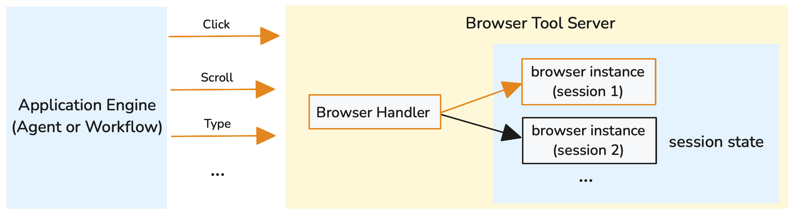
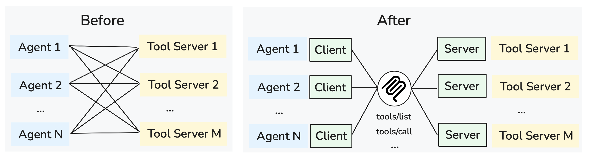

<!-- 
 Copyright Amazon.com, Inc. or its affiliates. All Rights Reserved.
 SPDX-License-Identifier: CC-BY-SA-4.0
 -->

# Tool Gateway for GenAI Systems

**Content Level: 200**

## Suggested Pre-Reading

- [Foundation Architecture Components](../index.md)

## TL;DR

Tool Gateway enables GenAI applications to extend model capabilities through external tool integration. By providing standardized interfaces and execution environments for tools, it allows models to interact with APIs, databases, and services while addressing scalability, security, and management challenges that emerge in enterprise environments. Understanding tool execution patterns, design considerations, and scalability challenges is essential for building robust agentic applications.

## Tool Architecture Overview

Tools represent the primary mechanism through which GenAI models extend their capabilities beyond text generation to interact with external systems and data sources. To understand how tools work, consider this example tool definition:

```json
{
  "tools": [{
    "toolSpec": {
      "name": "weather_api",
      "description": "Get current weather conditions for a specific location.",
      "inputSchema": {
        "json": {
          "type": "object",
          "properties": {
            "location": {
              "type": "string",
              "description": "City name or location identifier."
            }
          },
          "required": ["location"]
        }
      }
    }
  }]
}
```

When provided with this tool definition, the LLM receives it as part of its prompt context and can decide when this tool would be useful for addressing user queries. If a user asks "What's the weather like in Seattle?", the model recognizes that it needs external data and decides to invoke the weather_api tool, generating input that matches the required schema:

```json
{
  "location": "Seattle"
}
```

In agentic applications, models analyze context and decide which tools to invoke at specific points in their reasoning process, enabling dynamic problem-solving that adapts to user needs and available resources.

The fundamental tool pattern involves models examining their current context, identifying gaps in information or required actions, and selecting appropriate tools to bridge those gaps. This might involve calling APIs to retrieve real-time data, executing database queries, performing calculations, or interacting with external services. Each tool interaction enriches the model's context, enabling more informed decision-making for subsequent steps.

LLM tool selection relies heavily on the tool description and specification provided in the tool definition. Models use these descriptions to understand when and how to use each tool, making clear, accurate tool descriptions critical for effective tool usage. Well-written descriptions help models make appropriate tool choices and provide the correct input parameters.

## Tool Environment Challenges

Enterprise tool environments face three fundamental challenges that limit effectiveness and scalability:

**Discoverability**: Tools created by different teams often remain siloed within individual applications, making reuse difficult. Without central discovery mechanisms, developers frequently recreate existing functionality rather than leveraging available tools, leading to duplicated effort and inconsistent implementations.

**Access**: Each tool may require different authentication mechanisms, connection patterns, and retrieval methods for tool specifications. Applications must manage diverse credential types, connection protocols, and API patterns, creating integration complexity that scales poorly with tool catalog size.

**Interoperability**: Different tool implementations use varying interfaces, parameter formats, and response structures. This diversity requires specialized integration code for each tool, making it difficult to build flexible applications that can leverage diverse tool environments. Standardized protocols like Model Context Protocol (MCP) address this challenge by providing consistent interfaces across different tool implementations.

## The Gateway Approach

Tool Gateway architectures address these core problems by centralizing access to remote tools and providing unified management capabilities:

**Centralized Discovery**: Tool Gateways maintain comprehensive catalogs of available tools with metadata, descriptions, and usage patterns. This central registry enables developers to discover and reuse existing tools across organizational boundaries, reducing duplication and improving consistency. The gateway serves as a single source of truth for tool availability and capabilities.

**Unified Access Management**: Instead of managing diverse authentication and connection patterns for each tool, applications authenticate with a single gateway endpoint. The gateway handles user identity propagation, credential management, and secure access to downstream tools. This approach simplifies application development while providing centralized control over tool access policies.

**Protocol Standardization**: Tool Gateways translate between standardized client protocols (like MCP) and diverse tool implementations. Applications interact with all tools through consistent interfaces, while the gateway handles protocol translation, parameter mapping, and response formatting for underlying tool services. This abstraction enables flexible tool environment without requiring specialized integration code for each tool.

### Access Controls and Security

Tool Gateway architectures enable fine-grained access controls by setting permissions on individual tools rather than managing access across multiple integration points. Each tool can specify required permissions, user roles, or organizational policies that govern access, making it easier to enforce agent identity and authorization consistently.

Centralized access control provides audit trails for tool usage, enabling organizations to monitor which tools are accessed by which users and applications. The gateway can also implement rate limiting, usage quotas, and other protective measures to prevent abuse or resource exhaustion.

### Connection Management: Stateful vs Stateless

Tool implementations can be designed as either stateless or stateful, with significant implications for both functionality and operational complexity:

**Stateless tools** operate independently with each request, requiring complete context to be provided every time. For example, a weather API tool receives a location parameter and returns current conditions without maintaining any memory of previous requests. Each call is self-contained and doesn't depend on prior interactions.

**Stateful tools** maintain context across multiple invocations, enabling complex workflows that build upon previous results. A browser automation tool exemplifies this pattern by preserving navigation state, cookies, and page context between calls.

<div style="margin:auto;text-align:center;width:100%;">

<p style="font-style: italic; margin-top: 5px;">Figure 1: Stateful Browser Tool Managing Multiple User Sessions</p>
</div>

As shown in Figure 1, the Tool Gateway maintains session identifiers and routes requests to the appropriate browser instance for each user. This enables continuity across multiple tool calls—users can navigate from a homepage in one call, then interact with search results in subsequent calls, all within the same browsing context.

Tool Gateways must support both patterns by managing session connection contexts with tool servers when stateful behavior is required, while providing straightforward request forwarding for stateless tools. Stateless tool design is generally preferred for operational simplicity, as it enables horizontal scaling, simplified deployment, and eliminates concerns about session persistence or resource cleanup in distributed environments.

### Protocol Standardization with MCP

**Model Context Protocol (MCP)** eliminates custom integration code for each tool and reduces integration bugs. Without standardization, each application requires specialized connection logic, parameter mapping, and error handling for every tool, creating exponential complexity as tool catalogs expand.

<div style="margin:auto;text-align:center;width:100%;">

<p style="font-style: italic; margin-top: 5px;">Figure 2: Before and After MCP - Reducing Integration Complexity</p>
</div>

As illustrated in Figure 2, MCP standardization introduces a unified protocol layer where each agent implements a single MCP client interface, while tool servers expose standardized MCP server interfaces. This approach enables tool developers to create once and integrate anywhere, while application developers can access diverse tool catalogs without custom integration work for each tool.

## Making it Practical

### Tool Search and Ranking

Agents can become confused and perform poorly when provided with large tool catalogs. As tool collections grow beyond 10-20 tools, LLMs struggle to select appropriate tools effectively, leading to suboptimal tool choices or analysis paralysis. Implementing tool search and ranking mechanisms helps filter the available tool set based on query context and user intent.

Tool search strategies analyze user queries to identify relevant tool categories, then rank tools within those categories based on relevance scores, usage patterns, and success rates. For example, a query about "checking account balance" would filter to financial tools and rank account lookup tools higher than general calculation tools. This contextual filtering reduces the tool space presented to the LLM, improving selection accuracy.

Beyond accuracy improvements, tool filtering provides significant operational benefits. Each tool definition consumes tokens in the LLM prompt context, directly impacting both processing costs and response latency. By presenting only relevant tools (5-10 instead of 50+), organizations can reduce token consumption by 80-90%, leading to faster responses and lower per-request costs while maintaining or improving tool selection quality.

Here's a conceptual implementation of tool search and filtering:

```python
def filter_tools_by_query(user_query, available_tools):
    # Analyze query to identify relevant categories
    query_keywords = extract_keywords(user_query)
    query_intent = classify_intent(user_query)  # e.g., 'financial', 'data_analysis'

    filtered_tools = []
    for tool in available_tools:
        # Score tool relevance based on description matching
        relevance_score = calculate_relevance(
            query_keywords,
            tool.description,
            tool.categories
        )

        # Filter by intent category
        if tool.category == query_intent and relevance_score > 0.3:
            tool.relevance_score = relevance_score
            filtered_tools.append(tool)

    # Rank by relevance and usage patterns
    ranked_tools = sorted(
        filtered_tools,
        key=lambda t: (t.relevance_score, t.usage_frequency),
        reverse=True
    )

    # Return top 5-10 most relevant tools
    return ranked_tools[:10]

def execute_agent(user_query, model, all_available_tools):
    # Filter tools based on query context
    relevant_tools = filter_tools_by_query(user_query, all_available_tools)

    # Create agent with only relevant tools (reduces token usage)
    agent = create_agent(model, tools=relevant_tools)

    return agent.invoke({"messages": [user_query]})
```

Dynamic tool ranking can also consider user permissions, tool performance characteristics, and organizational policies to personalize tool recommendations. This approach ensures agents see the most relevant and accessible tools for their specific context and requirements.

### Tool Grouping & Reusability

Strategic tool grouping significantly enhances reusability across different applications and use cases. Rather than building application-specific tools, organizations benefit from creating generalized tools that serve multiple purposes through proper parameterization and configuration. This approach reduces development overhead while creating a shared tool environment that improves with collective usage and feedback.

Functional grouping organizes tools by capability areas—data access, communication, calculation, or external service integration. This organization helps developers quickly identify existing tools that meet their requirements, preventing duplicate development efforts. Domain-specific grouping creates tool collections for particular business areas like customer service, financial analysis, or content management, enabling specialized tool catalogs while maintaining focused, manageable tool sets.

Effective tool implementations require ongoing maintenance and improvement, similar to any software component. Tools should be designed with extensibility in mind, allowing for feature enhancements, performance optimizations, and security updates without breaking existing integrations. Version management strategies, including semantic versioning and deprecation policies, ensure that tool evolution supports innovation while maintaining stability for dependent applications.

Well-designed tools emphasize parameterization over hardcoded behavior, accepting configuration parameters that adapt functionality to different contexts and requirements. This flexibility enables a single tool implementation to serve diverse use cases, maximizing the return on development investment while reducing the total number of tools that need maintenance and support.


## Further Reading

- [Amazon Bedrock AgentCore Gateway](https://aws.amazon.com/blogs/machine-learning/introducing-amazon-bedrock-agentcore-gateway-transforming-enterprise-ai-agent-tool-development/){:target="_blank" rel="noopener noreferrer"} - AWS implementation of Tool Gateway patterns with MCP support and enterprise-grade tool management

## Contributors

**Author**:

* Kihyeon Myung - Senior Applied AI Architect 

**Primary Reviewer**:

* Tanner McRae - Senior Applied AI Architect 
* Don Simpson - Principal Technologist 