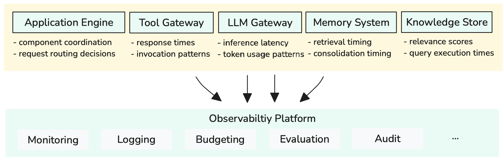

<!-- 
 Copyright Amazon.com, Inc. or its affiliates. All Rights Reserved.
 SPDX-License-Identifier: CC-BY-SA-4.0
 -->

# Application Observability for GenAI Systems

**Content Level: 200**

## Suggested Pre-Reading

- [Foundation Architecture Components](../index.md)

## TL;DR

application observability enables GenAI systems to maintain operational visibility, performance optimization, and reliability through standardized telemetry collection and analysis. By leveraging OpenTelemetry standards and GenAI-specific semantic conventions, organizations can monitor the unique characteristics of AI applications—including token usage, model performance, and multi-step reasoning workflows—across diverse observability platforms and tooling ecosystems.

## GenAI Observability Architecture Overview

GenAI applications present unique observability challenges that extend beyond traditional application monitoring. Unlike conventional software with predictable execution paths, GenAI systems involve probabilistic outputs, variable computational costs, and complex multi-component workflows spanning model inference, retrieval systems, and external tool integrations.

To achieve full operational visibility, the observability architecture captures three interconnected levels:

* **Sessions**: Represent a complete user interaction, including conversation history and state across multiple exchanges.
* **Traces**: Contained within a session, each trace tracks a single request-response cycle. It includes specific operations like model calls and data retrievals.
* **Spans**: The most granular level, a span captures a discrete operation within a trace. It provides detailed insight into a single processing step and its performance.

This hierarchical relationship enables comprehensive analysis from high-level user engagement patterns down to individual operation performance, supporting both real-time operational management and long-term optimization efforts. The architecture leverages OpenTelemetry standards to ensure compatibility across different monitoring platforms while incorporating GenAI-specific semantic conventions that capture AI-relevant metrics and metadata.

### Session Tracking Example

Here's how session tracking works in practice with OpenTelemetry baggage for session correlation:

```python
from opentelemetry import baggage, context
from strands import Agent

# Set session context for trace correlation
ctx = baggage.set_baggage("session.id", "session-1234")
context.attach(ctx)

# Create agent with tools
customer_service_agent = Agent(
    model=bedrock_model, 
    tools=[database_lookup, email_sender]
)

# Agent execution creates hierarchical spans
customer_service_agent("Help me find my order status for #12345")
```

The execution creates a trace hierarchy showing the complete processing flow:

```
Session: session-1234
└── Trace: "Help me find my order status"
    ├── InternalOperation (2104ms)
    │   └── invoke_agent_strands (2104ms)
    │       ├── execute_event_loop (1245ms)          # event loop-1
    │       │   ├── chat (892ms)                     # 1st LLM call (reasoning)
    │       │   └── execute_tool_database_lookup (353ms)  # tool execution
    │       └── execute_event_loop (859ms)           # event loop-2
    │           └── chat (743ms)                     # 2nd LLM call (answer generation)
```

This structure shows how a single user query generates multiple spans representing reasoning steps, tool usage, and response generation, all correlated under the same session context for comprehensive workflow visibility.

## Core Observability Components

### Sessions: User Interaction Context

Sessions encapsulate complete interaction flows between users and GenAI applications, maintaining persistent context across multiple exchanges within a conversation or task completion workflow. Each session preserves conversation history, user preferences, and accumulated context that influences subsequent interactions, enabling analysis of user engagement patterns and conversation effectiveness.

Session-level observability provides insights into user behavior patterns, conversation success rates, and context utilization effectiveness. This high-level view helps organizations understand how users interact with their AI systems over time, identify common usage patterns, and optimize for user satisfaction and task completion rates.

### Traces: Request-Response Cycles

Traces represent individual interactions within sessions, capturing the complete execution path from user input to final response. Each trace encompasses all processing steps including input validation, context retrieval, model inference, tool invocations, and response generation, providing end-to-end visibility into request processing.

GenAI traces typically include multiple model calls, external API interactions, and data retrieval operations that must be correlated to understand the complete request flow. Trace data reveals processing bottlenecks, identifies failed operations, and enables optimization of multi-step reasoning workflows that characterize modern GenAI applications.

### Spans: Discrete Operations

Spans capture individual operations within traces, providing detailed timing and metadata for specific processing steps. In GenAI applications, spans typically represent model inference calls, database queries, tool executions, or document retrieval operations, each with distinct performance characteristics and resource requirements.

Span data includes operation timing, input parameters, output metadata, and resource utilization metrics. This granular visibility enables precise performance optimization, cost analysis, and troubleshooting of specific operations within complex GenAI workflows.

## System-Wide Telemetry Collection

GenAI observability extends beyond individual application monitoring to encompass all foundation architecture components working together. Rather than monitoring components in isolation, effective observability correlates telemetry across the entire system—from application interface through application engine, LLM Gateway, Tool Gateway, Memory System, and Knowledge Store—providing unified visibility into end-to-end request processing.

<div style="margin:auto;text-align:center;width:100%;">

<p style="font-style: italic; margin-top: 5px;">Figure 1: System-Wide Telemetry Collection Across All Foundation Components</p>
</div>

As illustrated in Figure 1, each foundation component contributes specific telemetry data to a centralized observability platform. The Application Engine provides component coordination and request routing metrics, while the Tool Gateway captures response times and invocation patterns. LLM Gateway contributes inference latency and token usage data, Memory System provides retrieval and consolidation timing, and Knowledge Store delivers relevance scores and query performance metrics.

This unified telemetry collection enables comprehensive analysis across multiple dimensions including real-time monitoring, operational logging, cost budgeting, performance evaluation, and compliance auditing. Each component contributes telemetry to shared traces, enabling analysis of how user requests flow through the complete system architecture. This holistic approach reveals cross-component dependencies, identifies system-wide bottlenecks, and enables optimization strategies that consider the entire GenAI application stack rather than individual component performance alone.

## Implementation Approaches

GenAI observability implementation involves two complementary approaches: structured telemetry collection for performance and operational metrics, and application logging for detailed operational records and debugging information.

### OpenTelemetry for Traces and Metrics

OpenTelemetry excels at collecting structured telemetry data including traces, spans, and metrics that provide quantitative insights into GenAI system performance. This standardized approach captures timing information, resource utilization, and operational metrics across all system components.

Modern GenAI frameworks increasingly provide built-in OpenTelemetry integration that automatically instruments common operations. Frameworks like LangChain, LlamaIndex, Strands, and CrewAI include instrumentation libraries that capture model calls, workflow execution, and tool interactions following GenAI semantic conventions for consistent attribute naming and span structures.

```python
# OpenTelemetry captures structured performance data
from opentelemetry import trace

tracer = trace.get_tracer(__name__)

with tracer.start_as_current_span("llm_call") as span:
    span.set_attribute("gen_ai.request.model", "anthropic.claude-sonnet-4-20250514-v1:0")
    span.set_attribute("gen_ai.request.temperature", 0.7)
    
    response = model.call(prompt)
    
    span.set_attribute("gen_ai.usage.input_tokens", response.usage.prompt_tokens)
    span.set_attribute("gen_ai.usage.output_tokens", response.usage.completion_tokens)
```

OpenTelemetry data exports to diverse observability platforms including cloud-native solutions like Amazon CloudWatch, open-source platforms like Jaeger and Prometheus, and specialized GenAI monitoring tools, providing flexibility and preventing vendor lock-in.

### Application Logging for Operational Records

Application logging captures detailed operational information, error conditions, and business logic events that complement structured telemetry data. GenAI applications benefit from structured logging that captures conversation context, user interactions, and system state changes.

```python
import logging
import json

# Structured logging for GenAI applications
logger = logging.getLogger(__name__)

def log_user_interaction(session_id, query, response, tokens_used):
    logger.info("User interaction completed", extra={
        "session_id": session_id,
        "query_length": len(query),
        "response_length": len(response), 
        "tokens_used": tokens_used,
        "timestamp": datetime.utcnow().isoformat()
    })

def log_error_with_context(error, session_id, current_step):
    logger.error("Processing error occurred", extra={
        "error": str(error),
        "error_type": type(error).__name__,
        "session_id": session_id,
        "processing_step": current_step,
        "stack_trace": traceback.format_exc()
    })
```

Application logs are automatically captured by the runtime environment and stored in appropriate log destinations. In AWS environment, logs are collected and stored in CloudWatch Log Groups based on the deployment configuration. Container orchestration platforms like ECS and EKS automatically route application logs to designated log streams, while serverless environments handle log collection transparently without additional configuration.

## Making it Practical

### Start with Framework Defaults

Begin observability implementation by leveraging built-in instrumentation provided by GenAI frameworks. Most modern frameworks include OpenTelemetry integration that captures essential metrics without requiring custom development. This approach provides immediate visibility into model performance, token usage, and basic workflow execution patterns.

Framework-provided instrumentation typically covers the most common monitoring needs including model inference timing, token consumption, and error tracking. Organizations can build upon these defaults with custom instrumentation as specific monitoring requirements emerge.

### Establish Alerting and Automation

Design alerting strategies that balance operational awareness with alert fatigue management. Focus alerts on metrics that require immediate attention such as error rate spikes, cost threshold breaches, or performance degradation that affects user experience.

Implement automated responses for common operational issues such as scaling adjustments based on usage patterns, cost controls when spending exceeds thresholds, or failover mechanisms when primary services experience degradation. This automation reduces operational overhead while maintaining system reliability.

### Enable Continuous Improvement

Use observability data to drive systematic improvements in GenAI application performance and efficiency. Regular analysis of usage patterns, cost trends, and performance metrics reveals optimization opportunities and guides development priorities.

Establish review cycles that examine observability data for improvement insights, document findings and action items, and track the effectiveness of optimization efforts. This systematic approach transforms passive monitoring into active performance management that delivers continuous value.

## Further Reading

- [AIOps Deployment](../../../3_9_AIOps/aiops_deployment.md)

## Contributors

**Author**:

* Kihyeon Myung - Senior Applied AI Architect 

**Primary Reviewer**:

* Felix Huthmacher - Senior Applied AI Architect 
* Don Simpson - Principal Technologist 