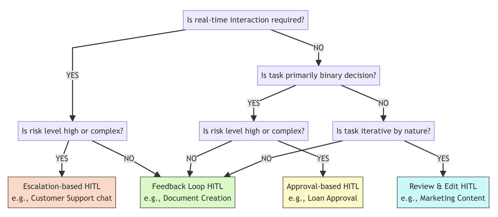

<!-- 
 Copyright Amazon.com, Inc. or its affiliates. All Rights Reserved.
 SPDX-License-Identifier: CC-BY-SA-4.0
 -->

# Human-in-the-Loop for GenAI Systems

**Content Level: 200**

## Suggested Pre-Reading

- [Foundation Architecture Components](../../index.md)

## TL;DR

Human-in-the-Loop (HITL) architectures integrate human judgment into GenAI systems to address limitations like hallucinations, responsible AI dimensions, and complex edge cases. Four core HITL patterns serve different scenarios: Approval-Based for binary decisions, Review and Edit for content modification, Escalation-Based for dynamic handover, and Feedback Loop for iterative improvement. Successful implementations balance human resources with user expectations while creating learning systems that continuously improve AI performance.

## Human-in-the-Loop Architecture Overview

GenAI systems deliver remarkable capabilities but come with notable limitations including hallucinations, responsible AI blind spots, and difficulty handling complex edge cases. Human-in-the-Loop architecture addresses these challenges by strategically incorporating human judgment into automated systems, creating hybrid approaches that leverage both AI efficiency and human expertise.

HITL represents more than a technical safeguard—it's a design philosophy that treats automation and human involvement as complementary forces. This approach serves several critical functions: detecting and preventing hallucinations before they reach users, enabling compliance with responsible AI dimensions and regulatory requirements, providing decisive judgment for edge cases where automated systems lack guidance, and creating feedback loops that drive continuous model improvement.

The architecture enables different patterns of human involvement based on risk levels, real-time requirements, and decision complexity. Rather than viewing human oversight as a failure of automation, effective HITL systems create virtuous cycles where human expertise gradually transfers to automated systems while maintaining quality standards.

## Core HITL Patterns

### Approval-Based Pattern

**Approval-based systems** focus on binary decision-making where reviewers either approve or reject AI-generated outputs without modification. This pattern works well for high-stakes scenarios requiring definitive judgments, such as loan approvals or compliance reviews, where the decision framework is clear and binary outcomes are sufficient.

The system evaluates AI responses against confidence thresholds and business rules, routing uncertain outputs to human reviewers. Approved responses proceed directly to users, while rejected responses trigger predefined fallback mechanisms such as routing to different models with more conservative parameters or delivering standardized rejection responses.

### Review and Edit Pattern

**The review and edit pattern** enables reviewers to actively modify AI-generated content before it reaches users, going beyond simple approval to enhance quality through human creativity and judgment. This approach excels in content creation workflows like marketing materials, where nuanced quality matters and human expertise adds significant value through targeted modifications.

Reviewers receive AI outputs along with relevant context and source materials, using rich editing interfaces tailored to the content type. The system tracks modifications to identify improvement patterns, feeding insights back into model training and prompt engineering efforts. This pattern requires subject matter experts but delivers higher quality outcomes through collaborative human-AI content creation.

### Escalation-Based Pattern

**Escalation-based systems** provide dynamic handover from AI to human experts during active interactions, triggered by specific conditions or user signals. This pattern maintains AI efficiency for routine interactions while ensuring human expertise is available exactly when needed, particularly valuable in customer support and conversational applications.

AI systems initially handle user interactions independently but escalate to human experts when users explicitly request human assistance, negative sentiment is detected, conversations enter complex topics outside the AI's confidence zone, or multiple clarification attempts fail to resolve user needs. The handover provides human experts with full conversation context, enabling seamless continuity and informed decision-making.

### Feedback Loop Pattern

**The feedback loop pattern** creates iterative improvement cycles where users interact with AI, review outputs, and provide feedback that refines results in real-time. This approach works particularly well in collaborative scenarios like code generation or document creation, where users and AI work together through multiple iterations.

Feedback mechanisms range from simple binary responses like thumbs up/down to rich interactions including inline editing, dimensional ratings, and categorical issue tagging. The system incorporates both explicit feedback and implicit signals like usage patterns and engagement metrics to continuously improve AI performance while delivering immediate value to users.

## Implementation Considerations

### Pattern Selection Strategy

Effective HITL implementation requires matching patterns to specific use case requirements based on real-time interaction needs, decision complexity, and risk levels. The following decision framework helps identify the most appropriate pattern for different scenarios:

Figure 1: HITL Pattern Selection Decision Tree

As illustrated in Figure 1, the decision process begins by determining whether real-time interaction is required. Customer-facing applications often need immediate responses, leading toward escalation-based patterns, while backend processes can utilize asynchronous review approaches. For non-real-time scenarios, the framework considers whether the task involves binary decisions or more nuanced judgments, followed by risk assessment and iterative requirements.

This systematic approach leads to four distinct outcomes: escalation-based HITL for high-risk real-time scenarios like customer support, feedback loop HITL for low-risk real-time interactions like document creation, approval-based HITL for high-risk binary decisions like loan approvals, and review & edit HITL for complex iterative tasks like marketing content creation.

### Resource and Expectation Management

Successful HITL implementation requires balancing human resource constraints against user expectations for response time and quality. High-frequency, low-risk interactions benefit from minimal human oversight to preserve speed, while high-stakes decisions justify longer response times when users understand the quality benefits.

The availability and expertise level of human reviewers significantly impacts pattern choice and system design. Review and edit patterns require subject matter experts, while approval-based patterns can sometimes utilize more general reviewers with clear guidelines. Design HITL systems around realistic human resource availability rather than idealized scenarios.

### Learning System Design

Every HITL implementation should function as a learning system that extracts insights from human interventions to improve underlying AI performance. Approval rates, editing patterns, escalation triggers, and user interactions provide rich data about model strengths and weaknesses that can drive systematic improvements.

Organizations should track which content types consistently require human modification, identify patterns in edits to refine prompts or models, and monitor improvement rates to quantify return on HITL investment. The ultimate goal is creating systems that learn from human expertise to reduce intervention needs while maintaining quality standards, establishing virtuous cycles of continuous improvement.

## Making it Practical

### Start with Clear Risk Assessment

Begin HITL implementation by identifying scenarios where human oversight delivers the most value. Focus initial efforts on high-risk interactions where AI mistakes have significant consequences, complex edge cases that challenge current AI capabilities, and regulated environments where compliance requires human verification.

Map different interaction types to appropriate HITL patterns based on risk levels and resource constraints. This targeted approach delivers immediate value while building operational expertise and user confidence in the hybrid system approach.

### Design for User Experience

Implement HITL patterns that align with user expectations and workflow requirements. Real-time applications need seamless escalation mechanisms that preserve conversation context, while asynchronous processes can benefit from more thorough review cycles that prioritize quality over speed.

Communicate the value proposition clearly to users, helping them understand why human oversight improves outcomes and how it contributes to system reliability. Transparent communication about review processes builds user confidence and acceptance of any associated delays.

### Build Measurement and Improvement Capabilities

Establish metrics that capture both operational efficiency and quality outcomes from HITL implementations. Track intervention rates, approval patterns, user satisfaction, and system improvement trends to optimize the balance between automation and human involvement.

Use HITL data to drive continuous improvement in AI systems, identifying opportunities to reduce human intervention needs while maintaining quality standards. This systematic approach transforms HITL from a static safeguard into a dynamic capability that evolves with organizational needs and AI advancement.

## Further Reading

- [Application Interface](../../3_1_1_1_application_interface/index.md)
- [Application Engine](../../3_1_1_2_application_engine/index.md)
- [Application Observability](../../3_1_1_7_application_observability/index.md)

## Contributors

**Author**:

* Kihyeon Myung - Senior Applied AI Architect 

**Primary Reviewer**:

* Don Simpson - Principal Technologist 