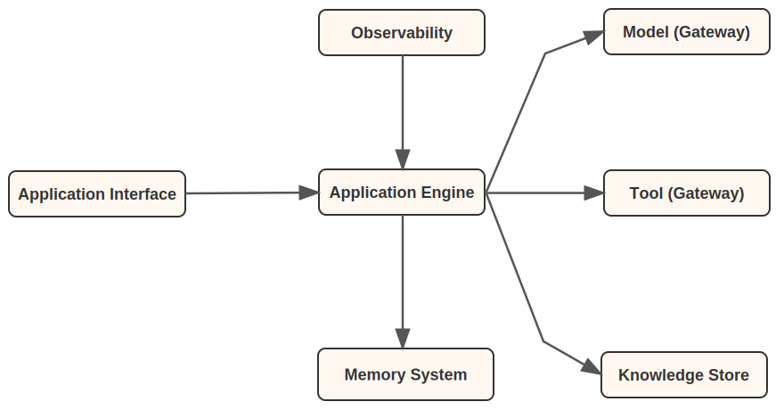

<!-- 
 Copyright Amazon.com, Inc. or its affiliates. All Rights Reserved.
 SPDX-License-Identifier: CC-BY-SA-4.0
 -->

# Architecture Components for Gen AI Systems

**Content Level: 200**

## Suggested Pre-Reading

- [Core Concepts and Terminology](../../../1_0_generative_ai_fundamentals/1_1_core_concepts_and_terminology/core_concepts_and_terminology.md)
- [Key Primitives](../../../2_0_technical_foundations_and_patterns/2_1_key_primitives/index.md)
- [Types of Generative AI Models and Capabilities](../../../2_0_technical_foundations_and_patterns/2_2_types_of_generative_ai_models_and_capabilities/2_2_types_of_generative_ai_models_and_capabilities.md)
- [What is an Agentic System](../../../2_0_technical_foundations_and_patterns/2_3_core_archtectural_concepts/2_3_7_agents_and_autonomous_systems/2_3_7-1_getting_started/what_is_an_agentic_system.md)

## TL;DR

Successful GenAI proof-of-concepts often fail in production not because the AI lacks intelligence, but because the surrounding architecture cannot handle enterprise requirements. PoC systems typically focus on demonstrating AI capabilities while overlooking critical production concerns like scalability, reliability, security, and maintainability. Production GenAI systems require thoughtful architecture built around core components—each addressing specific enterprise challenges that simple API integrations cannot solve. Understanding these components and their roles enables organizations to bridge the gap between impressive demos and reliable production systems.

## From PoC to Production: The Architecture Gap

The journey from GenAI proof-of-concept to production reveals a critical gap between demonstrating AI intelligence and building reliable enterprise systems. PoC environments typically focus on showcasing the AI model's capabilities—impressive language understanding, creative generation, or problem-solving abilities. These demonstrations often work within controlled conditions: clean data, simple use cases, and minimal concurrent users.

Production environments introduce complexities that PoCs rarely address. Real users generate unexpected queries, systems must handle concurrent sessions, data quality varies significantly, and enterprise policies require comprehensive audit trails. The AI model that performed brilliantly in demos may struggle when users deviate from expected patterns or when the system must integrate with existing enterprise workflows.

Consider a chatbot PoC that demonstrates excellent customer service responses in controlled scenarios. Moving to production requires handling authentication across multiple user types, maintaining conversation context across extended interactions, integrating with existing CRM systems, ensuring responses comply with regulatory requirements, and providing operational visibility for continuous improvement. The underlying AI intelligence remains the same, but the surrounding architecture determines production success.

This architectural gap explains why many organizations struggle to scale their GenAI initiatives beyond initial experiments. The missing elements aren't related to AI capabilities but to the systematic approach needed for enterprise deployment: how to manage user sessions reliably, how to monitor system performance effectively, how to integrate with existing data sources securely, and how to maintain consistent quality at scale.

## Core Components for Production GenAI Systems

Production GenAI systems require a structured approach that addresses enterprise concerns through specialized components. Each component handles specific aspects of the production challenge, from user interaction management to operational monitoring. By organizing functionality into distinct components with clear responsibilities, organizations can address the complexity gap between PoC and production systematically.

Figure 1: Core GenAI Component Architecture

As illustrated in Figure 1, these core components work together through a coordinated request flow that transforms simple AI demonstrations into robust enterprise systems. When a user submits a query, it first enters through the **Application Interface**, which handles enterprise authentication, validates user permissions, and ensures consistent user experience formatting. The authenticated request then moves to the Application Engine, which serves as the central coordinator—analyzing the request context, determining the optimal processing strategy, and orchestrating the involvement of other components.

Based on the request analysis, the **Application Engine** retrieves relevant conversation history and user-specific context from the **Memory System** to maintain continuity across interactions. For requests requiring external knowledge, it accesses the **Knowledge Base** to augment the AI's capabilities with domain-specific information. When the request needs real-world actions—such as API calls, database queries, or system integrations—the Tool Gateway provides secure, monitored access to external services.

Throughout this process, the **LLM Gateway** serves as the crucial bridge to AI capabilities, providing unified access to multiple foundation models while monitoring performance metrics, token consumption, and costs. Finally, the **Application Observability** component captures detailed telemetry across the entire request lifecycle, enabling continuous optimization and troubleshooting. This coordinated flow enables teams to tackle production complexity incrementally, with each component addressing specific enterprise challenges that simple API integrations cannot solve.

Well-defined interfaces enable this collaboration without coupling. Each component can evolve its internal implementation while honoring its interface contracts, allowing the system to grow more capable through focused improvements rather than comprehensive replacements.

## Making it Practical

### Starting Small and Scaling Incrementally

Not all components are essential from day one, and even necessary components don't need to be sophisticated initially. Organizations should start with the simplest implementation that meets their requirements and add complexity only when justified by actual needs. 

A simple Q&A system may only need basic versions of the Application Interface, Application Engine. Complex agent-based workflows might require all components, but can begin with minimal implementations—only short term memory for the Memory System, basic inbound authentication for the Application Interface. If your current setup handles the load, provides adequate security, and meets user expectations, additional sophistication may be premature. 

### Leveraging Managed Services and Open Source

Modern GenAI development benefits from strategic use of existing frameworks and managed services rather than building everything
from scratch. Beyond checking feature compatibility, consider the developer experience—how quickly can your team become productive? Sometimes a simpler framework with excellent documentation and community support delivers better results than a comprehensive but complex alternative that requires significant onboarding time. 

For underlying infrastructure components like databases, compute environments, and networking, managed services often provide
better long-term value than self-hosted solutions. These services reduce operational overhead while providing enterprise-grade
reliability, automatic scaling, and built-in monitoring.

### Component Integration Strategy

Design each component with well-defined interfaces that enable independent evolution while maintaining system cohesion. Components
should communicate through standard protocols and maintain clear separation of concerns, allowing teams to upgrade individual
elements without disrupting the entire system.

Establish clear contracts between components early in development to prevent tight coupling and enable different teams to work on
different components simultaneously.

## Further Reading

- [Application Interface](3_1_1_1_application_interface/index.md)
- [Application Engine](3_1_1_2_application_engine/index.md)
- [Memory System](3_1_1_3_memory_system/index.md)
- [Knowledge Base](3_1_1_5_knowledge_base/index.md)
- [Tool Gateway](3_1_1_6_tool_gateway/index.md)
- [Application Observability](3_1_1_7_application_observability/index.md)
- [Human-in-the-Loop](3_1_1_8_additional_components/3_1_1_8_1_human_in_the_loop/3_1_1_8_1_human_in_the_loop.md)

## Contributors

**Author**:

* Kihyeon Myung - Senior Applied AI Architect 

**Primary Reviewer**:

* Don Simpson - Principal Technologist 
