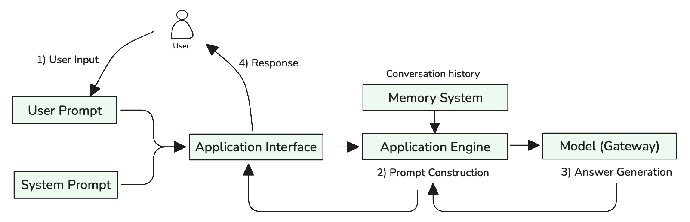
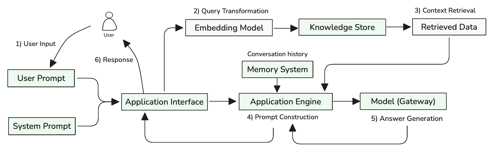
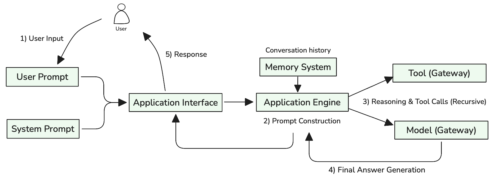

<!-- 
 Copyright Amazon.com, Inc. or its affiliates. All Rights Reserved.
 SPDX-License-Identifier: CC-BY-SA-4.0
 -->

# Chatbot Architecture Patterns for GenAI Systems

**Content Level: 300**

## Suggested Pre-Reading

- [Foundation Architecture Components](../../3_1_1_foundation_architecture_components/index.md)
- [Application Engine](../../3_1_1_foundation_architecture_components/3_1_1_2_application_engine/index.md)
- [Tool Gateway](../../3_1_1_foundation_architecture_components/3_1_1_6_tool_gateway/index.md)

## TL;DR

GenAI chatbots represent a fundamental shift from rule-based systems to flexible, model-driven architectures. Three core patterns address different operational requirements: Basic Chatbot patterns handle conversational interactions through direct model inference, RAG-enhanced patterns ground responses in external knowledge to reduce hallucinations, and Agentic patterns enable tool usage for complex task execution. Understanding these architectural patterns and their implementation considerations enables organizations to select appropriate approaches based on accuracy requirements, operational complexity, and user experience goals.

## Chatbot Architecture Overview

GenAI chatbots fundamentally differ from traditional rule-based systems by leveraging large language models to understand and respond to user queries dynamically. Rather than following predefined conversation flows, these systems generate responses based on context and learned patterns, enabling more natural and flexible interactions. This paradigm shift introduces new architectural challenges around hallucination management, tool integration, and production scalability that require specialized design patterns.

Modern GenAI chatbot architectures typically involve several core components working together: an **Application Interface** that manages user interactions and session state, an **Application Engine** that orchestrates request processing and response generation, **Model integration** for LLM access, and optional **Knowledge Store** and **Tool** components for enhanced capabilities. The complexity of these architectures depends on functional scope, and operational constraints.

## Core Architecture Patterns

### Basic Chatbot Pattern

The basic chatbot pattern provides direct model access for conversational interactions without external knowledge integration. This pattern requires four essential foundation components working in coordination.

**Component Integration:**

- **Application Interface** handles user authentication, session management, and request formatting, supporting REST+SSE for streaming responses or WebSocket for bidirectional communication
- **Application Engine** serves as the central orchestrator, constructing prompts from user input and conversation history, then coordinating with downstream components
- **LLM Gateway** provides unified access to foundation models, handling model selection, token management, and response streaming with integrated guardrails for safety
- **Memory System** maintains conversation history and user context across multi-turn interactions

Figure 1: Basic Chatbot Request Flow with Prompt Construction

As illustrated in Figure 1, the process involves five key steps: (1) User Input combining both user prompts and system prompts through the Application Interface, (2) Prompt Construction where the Application Engine combines user input with conversation history from the Memory System, (3) Answer Generation handled by the Model with integrated guardrails, (4) Response Processing to format and validate outputs, and (5) Response delivery back to users. This coordinated flow demonstrates how foundation components work together to transform simple user queries into contextually-aware, safe responses.

This pattern works well for general conversation, creative tasks, and scenarios where occasional hallucinations are acceptable. The architecture remains simple with minimal operational overhead, making it suitable for prototypes and applications that don't require factual accuracy. However, the pattern inherits standard LLM limitations including knowledge cutoffs, hallucination risks, and inability to access real-time information.

### RAG-Enhanced Pattern

The RAG-enhanced pattern addresses hallucination challenges by grounding model responses in external knowledge sources. This pattern extends the basic pattern with knowledge retrieval capabilities through the Knowledge Store component.

**Component Integration:**

- **Application Interface** and **LLM Gateway** function identically to the basic pattern
- **Application Engine** expands its orchestration role to include knowledge retrieval coordination and context assembly
- **Memory System** maintains both conversation history and retrieval context for improved follow-up queries
- **Knowledge Store** provides vector search capabilities, document storage, and semantic retrieval functionality

**Request Flow:**
The RAG pattern introduces additional processing steps for knowledge retrieval and context integration. User queries follow the same initial path through the Application Interface to the Application Engine, which determines whether external knowledge is needed and coordinates the enhanced workflow.

Figure 2: RAG-Enhanced Chatbot Request Flow with Knowledge Retrieval

As illustrated in Figure 2, the RAG process extends the basic flow with knowledge retrieval steps: (1) User Input enters through the Application Interface, (2) Query Transformation uses embedding models to convert user queries into semantic representations, (3) Context Retrieval searches the Knowledge Store for relevant information, (4) Prompt Construction combines user input, conversation history, and retrieved data into an enhanced prompt, (5) Answer Generation processes the grounded prompt through the Model, (6) Response Processing to format and validate outputs, and (7) Response delivery back to users. This grounded approach significantly improves factual accuracy and enables access to information beyond the model's training data.

The pattern involves additional complexity in knowledge ingestion, vector search implementation, and prompt construction that combines user queries with retrieved context. Organizations must invest in content preparation, embedding generation, and search optimization to achieve effective results. However, the pattern enables accurate responses to domain-specific questions and reduces liability around incorrect information while maintaining the conversational capabilities of the basic pattern.

### Agentic Pattern

The agentic pattern extends chatbot capabilities by enabling LLMs to use tools for complex task execution. This pattern builds upon the RAG-enhanced pattern while adding tool execution capabilities through the Tool component.

**Component Integration:**

- **Application Interface**, **Memory System**, **Knowledge Store**, and **LLM Gateway** function as in the RAG-enhanced pattern
- **Application Engine** becomes significantly more complex, managing tool selection, execution coordination, and iterative reasoning workflows
- **Tool** provides secure access to external APIs, databases, calculation engines, and other services that extend AI capabilities
- **Application Observability** becomes critical for tracking multi-step agent workflows and tool usage patterns

**Request Flow:**
The agentic pattern introduces iterative reasoning and tool execution cycles. User requests follow the established path through Application Interface to Application Engine, which coordinates between prompt construction, reasoning cycles, and tool execution.

Figure 3: Agentic Chatbot Request Flow with Tool Integration

As illustrated in Figure 3, the agentic process involves iterative cycles: (1) User Input enters through the Application Interface, (2) Prompt Construction combines user input with conversation history from the Memory System, (3) Reasoning & Tool Calls where the Model analyzes context and recursively invokes tools through the Tool component as needed, (4) Answer Generation produces the final response after completing all necessary tool interactions, and (5) Response delivery to users. This iterative approach enables sophisticated task automation including data analysis, transaction processing, and multi-step workflow execution that would be impossible with text generation alone.

The pattern introduces complexity around tool integration, execution management, and error handling. Tools must be designed with appropriate security boundaries, clear interfaces, and robust error handling. Agent coordination becomes challenging as the number of available tools increases, often requiring tool categorization, selection strategies, or multi-agent architectures for complex scenarios.

## Pattern Selection Considerations

Choosing appropriate chatbot architecture patterns depends on several key factors that balance functional requirements against operational complexity. **Accuracy requirements** represent the primary decision point—applications requiring high factual accuracy benefit from RAG enhancement, while general conversation or creative applications may accept basic GenAI patterns. **Functional scope** determines whether tool integration is necessary—applications that need to perform actions beyond conversation require agentic capabilities.

**User experience expectations** influence architectural choices around response time, conversation quality, and task completion capabilities. Basic patterns provide fast responses but limited functionality, while agentic patterns offer comprehensive capabilities but potentially longer execution times. **Operational constraints** including development resources, maintenance capabilities, and cost considerations affect pattern viability.

**Data availability and quality** significantly impact RAG effectiveness—organizations with well-structured, high-quality knowledge sources can leverage RAG patterns effectively, while those with limited or inconsistent content may not see proportional benefits. **Integration requirements** with existing systems determine whether agentic capabilities are necessary and influence tool selection and security considerations.

Pattern combinations often provide optimal results for complex applications. Basic GenAI patterns can handle general conversation while RAG enhancement addresses specific knowledge domains, and selective tool integration enables critical task automation without full agentic complexity.

## Making it Practical

### Evaluation and Confidence Building

Building confidence in chatbot performance requires evaluation aligned with business objectives and architectural patterns. Define metrics that match your chatbot's primary purpose—customer satisfaction for support bots, task completion rates for transactional agents, or factual accuracy for knowledge-intensive applications. Each pattern requires different approaches: Basic Chatbot patterns focus on conversation quality using **LLM-as-a-judge evaluation**, RAG-enhanced patterns emphasize factual accuracy with **retrieval precision@k** and **source attribution** scores, while Agentic patterns require both **trajectory evaluation** (comparing actual tool usage steps against expected sequences) and **final response quality**, measuring tool selection accuracy, reasoning efficiency, and task completion success.

Prepare ground truth datasets representing real user interactions across single-turn queries, multi-turn conversations, and failure scenarios. Implement automated testing frameworks that assess component effectiveness (retrieval quality, tool success rates), conversation-level metrics (coherence, helpfulness via LLM judges), and business outcomes (user satisfaction, goal completion). Establish continuous monitoring by including evaluations as part of the CI/CD pipeline to identify failure modes and measure the impact of system changes. This automated approach enables data-driven optimization of prompts, knowledge bases, and architectural decisions while preventing performance regressions through systematic testing of model outputs, accuracy metrics, and user experience indicators before deployment.

### Deployment Architecture and Scalability

Production chatbot deployment requires matching deployment strategies to usage patterns and expected concurrent load. Plan for session capacity when selecting between serverless architectures for bursty traffic versus dedicated container orchestration for consistent high-volume applications. For complex agentic workflows, consider microservices architecture that separates Application Engine orchestration, Tool execution, and Knowledge retrieval into independently scalable services.

Implement comprehensive monitoring tracking GenAI-specific metrics: **time-to-first-token**, **output tokens per second**, **total response time** accounting for output length, **token costs per interaction**, error rates by component and pattern type, and concurrent session utilization. Design for graceful degradation where Basic Chatbot patterns continue operating even when Knowledge Store or Tool components are unavailable. Optimize costs through caching frequently accessed knowledge, using smaller models for simple queries, and intelligent request routing based on complexity, urgency, and expected output length.

### Human-in-the-Loop Integration

Design escalation paths that seamlessly transfer conversations to human agents when chatbots encounter uncertainty, complex requests, or user frustration. Implement confidence scoring mechanisms with specific thresholds that trigger human review. For Agentic patterns executing transactions or system changes, establish approval workflows allowing human verification before critical actions, with escalation triggers based on transaction value, risk assessment, or user request complexity.

Create feedback collection mechanisms through feedback APIs and human review dashboards enabling agents to refine responses, correct errors, and provide additional context without disrupting user experience. Use this feedback for continuous system improvement through active learning approaches—identify conversation patterns requiring consistent human intervention and develop strategies to automate these interactions over time through expanded knowledge bases, refined tool definitions, and improved prompt engineering based on successful human resolutions.

## Further Reading

- [RAG (Retrieval Augmented Generation)](../../../../2_0_technical_foundations_and_patterns/2_3_core_archtectural_concepts/2_3_3_RAG%28retrieval%20Augmented%20Generation%29/index.md) - Deep dive into retrieval-augmented generation patterns and implementation strategies for knowledge-enhanced chatbots
- [Agents and Autonomous Systems](../../../../2_0_technical_foundations_and_patterns/2_3_core_archtectural_concepts/2_3_7_agents_and_autonomous_systems/index.md) - Comprehensive guide to agentic architectures, tool integration, and autonomous decision-making systems
- [Model Evaluation and Selection Criteria](../../../../2_0_technical_foundations_and_patterns/2_6_model_evaluation_and_selection_criteria/index.md) - Framework for evaluating chatbot performance, selecting appropriate models, and establishing quality metrics

## Contributors

**Author**:

* Kihyeon Myung - Senior Applied AI Architect 

**Primary Reviewer**:

* Manoj Ramani - Senior Applied AI Architect 
* Don Simpson - Principal Technologist 
