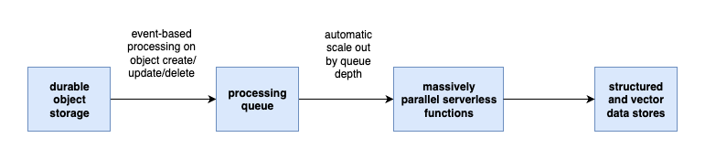

<!-- 
 Copyright Amazon.com, Inc. or its affiliates. All Rights Reserved.
 SPDX-License-Identifier: CC-BY-SA-4.0
 -->

# Intelligent Document Processing: Document Ingestion

**Content Level: 200**

## Suggested Pre-Reading

[Intelligent Document Processing Concepts](../index.md)

## TL;DR:

The first step in intelligent document processing (IDP) is to identify the documents you need to ingest and ingest them. This page will present a conceptual overview of IDP ingestion pipelines and practical advice for implementing them.

## Document Ingestion in IDP pipelines

The diagram below provides a high-level overview from which we can discuss IDP document ingestion pipelines. This page will focus on the top half: the document ingestion pipeline, and the following page will focus on the information extraction and enrichment concepts.

_Figure 1: High-level IDP pipeline_

### Step 1: Identify the right data for the right use case.
The first step is identifying the documents you need for your use case. See elsewhere in Atlas for ROI discussions ([here](../../../../../1_0_generative_ai_fundamentals/1_2_business_value_and_use_cases/1_2_business_value_and_use_cases.md), [here](../../../../../5_0_organization_adoption_framework/5_1_vision_and_strategy/5_1_3_roi_framework.md), and [here](../../../../../8_0_isv_focus/8_3_cogs_and_roi/cogs_and_roi.md))

### Step 2: Loading and optional preprocessing.

Once you identify your required data, you need to determine if it's in a format supported by the services you intend to use, or whether it will require preprocessing to be made ready for ingestion.

If you don't need preprocessing then you may be able to use the source system holding the files (an S3 bucket, for example) as the ingestion point for the pipeline and skip straight to the step 3 in the diagram above, having steps 1 and 3 be the same location.

#### Reasons to preprocess

* **You only need the text from a document.** The easiest and fastest way to get the text at scale is to use programmatic libraries instead of LLM-based OCR, if you can find such libraries for your document type. To find one that's right for you, search the web for your preferred programming language, the document type extension, and optionally the open source licenses you'd prefer. For example, _python pdf parsers with either mit, apache, or bsd licenses_. Then view the repository file statuses to see whether the project has been updated recently. This is an important step to make sure you're not taking a dependency on a project that's deprecated or abandoned.

* **You have a file that's not supported by your ingestion provider.** For example, many providers support common modern XML-based office file formats (like DOCX), don't support the older generation of binary office file formats (like DOC). In this case you could either:

    * find a library that turns each page of the document into a supported image type and then use LLM-based OCR.

    * or use a library to extract the text and possibly images from the document, if you can find one for your document type.

* **You want to transform the data first.** For example, if you have file with a large JSON array in it that represents thousands of records (or more), you should transform it to JSON lines.

  * In JSON lines, each line is a valid JSON object, so it can be read in and processed in one line at a time or in reasonably-sized batches of lines for maximum efficiency.

  * A large JSON array must be read in its entirety to be valid, requiring more memory than might otherwise be needed and eliminating the possibility to stream the file into the processor.

  * Always prefer to write data as JSON lines (or other streamable format like Apache Parquet, Protobuf, or other) instead of dumping large JSON arrays when processing data sets at scale.

#### Reasons not to preprocess

 * **Your files are already supported by your ingestion provider.** Amazon Bedrock Knowledge Bases [supports many file types out of the box](https://docs.aws.amazon.com/bedrock/latest/userguide/knowledge-base-ds.html){:target="_blank" rel="noopener noreferrer"}.

 * **You don't need to do any extra data reformatting** to get the records separated the way you want them before ingestion.

 * **You prefer to use off-the-shelf solutions** and minimize the need for custom preprocessing code until it's absolutely necessary. If building something isn't core to your business model, using something as off-the-shelf as possible is a good idea. For a managed ingestion experience on AWS, use Amazon Bedrock Data Automation, Bedrock Knowledge Bases, or Q Business.

### Step 3: Ingesting your documents.

Once the data is ready for ingestion and dropped into the entrypoint for the IDP pipeline, the rest of your pipeline commences.

Since Atlas is about generative AI, this document processing workflow will focus on AI-based approaches for IDP ingestion rather than programmatic extraction of text. For information about the programmatic approaches to extract text and possibly images from your documents, search the internet for your programming language and the extension of the document type you want to parse. If a programmatic extraction library meets your needs, that will be faster and more cost-effective than LLM-based OCR, but less flexible, so weigh the pros and cons for your use case.

If you would prefer to avoid the "undifferentiated heavy lifting" of creating your own document ingestion pipelines, AWS offers managed services like Amazon Bedrock Knowledge Bases and Bedrock Data Automation. Using managed services allows you to focus on delivering business value code rather than managing infrastructure.

If the managed service offerings don't meet your needs, you can build your own LLM-based OCR system for complete flexibility of implementation.

#### Choosing the right LLM for OCR

The best way to choose an LLM is to use a test-driven approach to prompt engineering. Create a list of test documents that are representative of both expected good documents and expected problem documents in the pipeline. Include expected edge cases that your code is expected to handle.

Those become inputs for your unit tests. Using a few to start your prompt engineering, **_start simple_** when creating your prompt. If you expect the model to do too many things in one pass against many document pages, that's not going to work as well as simplifying and breaking the job down into smaller chunks via prompt and/or data set decomposition. Make sure to test with the whole test set when you think your prompt is working, and before any changes thereafter get committed to your repository.

Using your favorite prompt testing tool follow these tips as you build your prompts:

1. **Just because you can, doesn't mean you should** put 200,000+ tokens of context into a single model invocation. Quality of responses drops with larger context windows, across all models. It's only a matter of by how much and where the threshold is. Avoid possible output quality degradation by chunking jobs into 10K-20K tokens max prompt size (context and all) whenever possible.

2. **Start by using the smallest high quality model that gets you quality results, not the largest.** This automatically puts you on the path to cost and performance optimization. Try the newest, smallest model before the newest, largest model.

3. **Ask the LLM to do one thing for the input documents, not many things in one pass**. Add a second thing after the first one is working. Stop adding to this prompt when performance starts to suffer with this small, performant model, and leave additional tasks to other prompt steps.

4. **Loop through the documents one page at a time when sending the prompt to the server**. Don't send a large number of pages through in separate messages in a single invocation, because on the server side they're concatenating all into one model invocation with the system prompt, not looping through them. Ultimately the number of tokens is directly proportional to the time to handle the query, sometimes exponentially depending on the model architecture. Reducing the number of tokens (document pages in this case) per invocation is the most impactful thing you can do for performance and quality of results in IDP workloads. Experiment with more pages per batch with your test harness to optimize if needed, after getting the highest baseline score using one page at a time.

5. **Follow the right prompt template structure** for optimal success. For a human example, consider the hypothetical situation where you're asked to read a large document and are not told which questions you'll be asked in advance. You'd do a lot better if you were told in advance what you were looking for while reading. The LLMs work the same way. Put your user prompt before the giant block of context, if there is one. Here's a structure that works well for multi-modal IDP ingestion jobs:

    * System prompt: tell the model in one or two sentences what its role is and what it's supposed to do, as **concisely as possible.** Do not assume it needs extra info until you see it making mistakes that the extra info will help. Start with something this simple as the first text-based message in a list of multi-modal messages to send to the model. 

      * "You're a document processing bot. Extract the text of the following document image and output it as plain text. If you find an image, insert a caption of the image found in the output text. Handle tables by surrounding them with &lt;table&gt;&lt;/table&gt; tags and convert the table data inside the tags to JSON lines."
  
    * As the second message to the model, attach the image of a document page, or the document itself if that file format is supported and the document is not too large. If it is too large, split it. Try handling one page of the document at a time for maximum effectiveness, even with smaller models, then in testing you can try with multiple batch sizes to optimize latency and quality.

    * Being careful not to add too many instructions or too much context to the prompt at once should help avoid exceeding the capabilities of the small fast model.

By following this process you can select small, fast models for your LLM OCR needs, to maximize performance and quality and minimize cost and latency.

See the previous section entitled [Evaluating Intelligent Document Processing Solutions](../../../../../2_0_technical_foundations_and_patterns/2_6_model_evaluation_and_selection_criteria/2_6_4_domain_specific_evaluations/2_6_4_2_evaluating_intelligent_document_processing/2_6_4_2_evaluating_intelligent_document_processing.md) for more specifics on evaluations for IDP.

#### Processing the docs via OCR

If you use a managed vector index service, ingesting documents for IDP use cases doesn't require doing your own OCR. These services have many options for configuring ingestion and some offer LLM-based OCR out of the box.

However, if you want more control over the ingestion process, then creating a highly parallelizable pipeline is important for efficient processing. A reliable, performant, well-known pattern is to use event-based ingestion from durable object storage to a processing queue that's consumed by auto-horizontally-scaling serverless functions. This enables quick consumption of deep queues with the benefit of only billing for the milliseconds the compute is running.

_Figure 2: Event-based, parallel processing architecture for IDP_

In the next section we'll focus on information extraction and enrichment. Since vectorization is enrichment to enable semantic search, it will be covered in the next section on extraction and enrichment, along with concepts like summarization, entity extraction, image inspection and classification, and more.

## Making it Practical

There are many sample stacks on the Internet to accelerate your intelligent document processing use cases. Search for intelligent document processing and your preferred cloud provider. Check the Further Reading section below to find a link to another AWS sample stack.

Starting with a sample stack is the best way to accelerate your journey. If they do what you want out of the box, great! If not, they're open source and they'll give your developers working examples of how to implement the key concepts, allowing them to start with a known good baseline to build from and saving them time reinventing thousands of lines of code.

## Further Reading

* [Intelligent Document Processing with Generative AI](https://github.com/aws-samples/intelligent-document-processing-with-amazon-bedrock){:target="_blank" rel="noopener noreferrer"}: Extract information from unstructured documents at scale with Amazon Bedrock.

## Contributors

### Authors

* Dave Thibault - Sr. Applied AI Architect 

* Felix Huthmacher - Sr. Applied AI Architect 

### Reviewers

* Don Simpson - Principal Technologist 

* Felix Huthmacher - Sr. Applied AI Architect 
