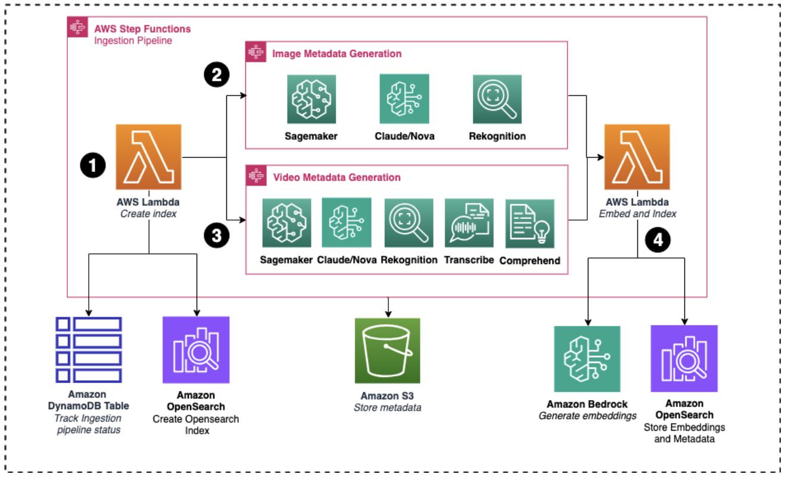

<!-- 
 Copyright Amazon.com, Inc. or its affiliates. All Rights Reserved.
 SPDX-License-Identifier: CC-BY-SA-4.0
 -->

# Multimodal Understanding

**Content Level:** 300

## Suggested Pre-Reading

- [Foundation Architecture Components](../../../3_1_1_foundation_architecture_components/index.md)
- [Embeddings - Semantic Representation](../../../../../2_0_technical_foundations_and_patterns/2_1_key_primitives/2_1_5_embeddings/2_1_5_embeddings.md)

## TL;DR
Multimodal Systems AI integrates various data types—such as text, images, audio, and sensor data—to build more context-aware and robust applications. It involves distinct processes for data acquisition, feature extraction, and fusion of information from different modalities, followed by decision-making through neural architectures or ensemble methods. The architecture of such systems emphasizes modularity, efficient data handling, and resource management. Developers can leverage popular frameworks like TensorFlow, PyTorch, and specialized libraries to implement these systems while enabling scalability and compliance with security standards. Ultimately, multimodal AI not only enhances performance in diverse fields but also opens up innovative application opportunities across industries.

## Introduction
Each modality is initially processed to form internal representations (or embeddings) that capture important features of the input data. These embeddings allow the system to compare and combine different data types on a common basis. In a multimodal system, cross-modal interactions are key. For instance, in an image-captioning system, the visual features extracted from an image interact with the language model to produce a coherent description. This interaction is typically managed by attention mechanisms that weigh the importance of each modality.

## Toolkits and Frameworks

Several modern frameworks can help build multimodal systems:

- TensorFlow and PyTorch: Offer robust support for deep learning and integration of multiple data types
- Hugging Face Transformers: Useful for combining language models with other modalities
- OpenCV and Librosa: Libraries for processing image and audio data, respectively

## Practical Considerations

- Data Storage: Use databases that support heterogeneous data types
- Scalability: Design your system with scalability in mind, as the integration of multiple modalities often leads to large data volumes
- Security and Privacy: Ensure that your data collection and processing comply with relevant regulations (e.g., GDPR)

## Interpretability and Debugging

Understanding the inner workings of a multimodal model is important for improvement and troubleshooting:

- Visualization Tools: Use tools that map the attention layers to see how the model correlates features from different modalities
- Ablation Studies: Remove one modality at a time to assess its impact on overall performance
- Explainable AI (XAI): Implement frameworks that offer insights into the decision-making process, such as SHAP or LIME

## Core Components of a Multimodal System
### Data Acquisition and Preprocessing

Before a multimodal system can analyze data, it must first acquire and preprocess inputs from various modalities:

- Data Collection: Aggregating data from different sources (APIs, databases, sensors)
- Normalization: Standardizing data formats and scales
- Noise Reduction: Filtering out irrelevant or distorted signals
- Annotation and Labeling: Ensuring each data type is properly tagged for supervised learning

### Feature Extraction

Feature extraction transforms raw data into structured information:

- Text: Techniques such as tokenization, embedding (e.g., Word2Vec, BERT), and sentiment analysis
- Images: Convolutional Neural Networks (CNNs) to extract spatial features
- Audio: Signal processing and spectrogram analysis
- Sensors: Time-series analysis and statistical feature extraction

### Fusion Techniques

At the heart of multimodal systems is the integration—or fusion—of disparate data sources. There are several strategies:

- Early Fusion: Combining raw data or low-level features before further processing
- Late Fusion: Merging high-level representations or predictions from each modality
- Hybrid Fusion: A combination of both, designed to optimize the advantages of each approach

### Decision-Making and Inference

Once data is fused, the system uses a decision-making module to perform tasks such as classification, regression, or anomaly detection. This stage often involves:

- Neural Architectures: Models like transformers that can process mixed modalities
- Ensemble Methods: Combining predictions from different models to improve reliability
- Interpretability Tools: Mechanisms to understand how different modalities contribute to the final decision

### Technologies Powering Multimodal AI

Several key technologies underpin the functionality of multimodal AI systems:

- Deep Learning and Neural Networks: These are fundamental to processing complex data patterns across modalities. Architectures like transformers have been particularly effective in handling sequences and capturing long-range dependencies in data.
- Natural Language Processing (NLP): NLP techniques enable the system to understand and generate human-like text, facilitating tasks such as text summarization and language translation.
- Computer Vision: This technology allows the system to interpret and generate visual information, important for applications involving image and video data.
- Audio Processing: Techniques in this domain enable the analysis and generation of sound, supporting functionalities like speech recognition and music synthesis.

### Multimodal Embeddings

Embeddings enhance a model's ability to interpret data by converting words, numbers, or images into a vector form.

Multimodal embedding models go beyond the capabilities of unimodal embedding models like text only embedding and image only embedding models by projecting multiple data types in a unified vector space. This more encompassing vector space better represents the way humans process information, and can unlock new use cases for AI applications.

There are several use cases where multimodal embeddings can enhance performance. These include:

- Multimodal Semantic Search: Mapping images and text in a shared vector space allows for direct comparison between visual content and natural language queries
- Visual Question Answering: Understanding both image and text queries makes it simpler to ask direct image related questions
- Image Captioning: Understanding visual and contextual components in an image results in more accurate text descriptions

### Multimodal Prompting

Many new large language models are now coming out with the capabilities to process multimodal inputs. These inputs can include text, images, videos, and speech.

When working with multimodal prompts, ensure that the model you are using supports the modalities you're working with. Some models can process multiple images simultaneously, and they support varying formats (like PNG, JPEG, and sometimes PDFs). Prompts need to be engineered properly to guide the model effectively; clear, structured instructions that reference the accompanying media will produce the best results.

Each of these modalities have varying use cases. For instance:

- An image prompt may ask for object recognition, description, or stylistic analysis
- A speech prompt typically involves transcription or emotion recognition
- A video prompt might involve frame-by-frame analysis or summarizing visual content over time

As multimodal tools evolve, combining these elements creatively opens up powerful new workflows for interaction, creation, and understanding.

## Making it Practical

### Architectural Considerations

When designing a multimodal AI system, keep these architectural principles in mind:

- Modularity: Structure your system so that each modality is processed in a modular fashion. This allows for easier debugging, maintenance, and scalability
- Latency and Throughput: Different data types may require distinct processing times. Optimizing data pipelines for real-time applications is key
- Resource Management: Multimodal systems often demand more computational resources. Consider cloud solutions, GPUs, or specialized hardware to manage these requirements
- Data Alignment: Ensuring that inputs from different modalities are synchronized (temporally or contextually) is vital for accurate fusion and analysis

Multimodal data needs to be processed and features extracted in order to unlock analytical value from downstream systems. By extracting features in standardized representations, organizations can leverage powerful machine learning models across previously incompatible data sources. For example, features from audio, image, and video data can be extracted as text and then embedded using a text embedding model for information retrieval use cases. There are also multimodal models available for embedding images and frames from videos.

AWS offers a suite of services for processing data across modalities:

- Amazon Transcribe converts speech to text
- Amazon Rekognition extracts objects, text from images and videos, and detects segments in videos
- Amazon Textract processes text from documents and images
- Amazon Comprehend analyzes text for sentiment and key entities (names of people, places, items, and locations)
- Amazon Bedrock provides access to multimodal models for generating metadata and creating embeddings
- Amazon SageMaker provides model deployment options including SageMaker Endpoints and SageMaker jumpstart for one-click deployments of pre-trained models

These services can be orchestrated to create a feature generation pipeline that transforms raw multimodal inputs into ML-ready features.

### Reference Feature Generation Architecture

*Figure 1: Feature Generation Architecture using AWS Step Functions*

This above architecture demonstrates a feature extraction pipeline orchestrated with AWS Step Functions. The ingestion pipeline generates and embeds metadata for images and videos, then indexes and metadata into an OpenSearch vector database. The architecture has the following main components:

Main Ingestion Pipeline:

- Generates metadata for images and videos
- Embeds metadata using Amazon Bedrock models
- Indexes vectors and metadata into OpenSearch

Image Metadata Generation:

- Processes images via custom or pre-trained models deployed as SageMaker endpoints
- Leverages multimodal models on Amazon Bedrock (Claude Sonnet, Amazon Nova)
- Uses Amazon Rekognition to extract features (text, objects, celebrities)

Video Metadata Generation:

- Applies similar visual feature extraction methods as the image pipeline, but first converts the videos in static frames
- Processes audio using Amazon Transcribe and Amazon Comprehend

## Conclusion

Multimodal Systems represent a paradigm shift in how we process and interpret data. For software developers, the key takeaway is that by integrating multiple forms of data, you can build applications that are not only more robust but also more context-aware. By following a modular architecture and leveraging modern toolkits, you can overcome many of the challenges associated with multimodal integration.

Embracing multimodal AI can open doors to innovative applications and improved performance across industries. As you build and iterate on your systems, keep exploring new fusion techniques and interpretability tools to refine the synergy between different data modalities.

## Further Reading

- [How Veritone uses Amazon Bedrock, Amazon Rekognition, Amazon Transcribe, and information retrieval to update their video search pipeline](https://aws.amazon.com/blogs/machine-learning/how-veritone-uses-amazon-bedrock-amazon-rekognition-amazon-transcribe-and-information-retrieval-to-update-their-video-search-pipeline/){:target="_blank" rel="noopener noreferrer"}
- [Accelerate video Q&A workflows using Amazon Bedrock Knowledge Bases, Amazon Transcribe, and thoughtful UX design](https://aws.amazon.com/blogs/machine-learning/accelerate-video-qa-workflows-using-amazon-bedrock-knowledge-bases-amazon-transcribe-and-thoughtful-ux-design/){:target="_blank" rel="noopener noreferrer"}

## Contributors

### Authors

* Meghana Ashok - Machine Learning Engineer 
* Grace Lang - Deep Learning Architect 
* Ayushi Haria - Deep Learning Architect 

### Reviewers

* Hari Prasanna Das - Applied Scientist 