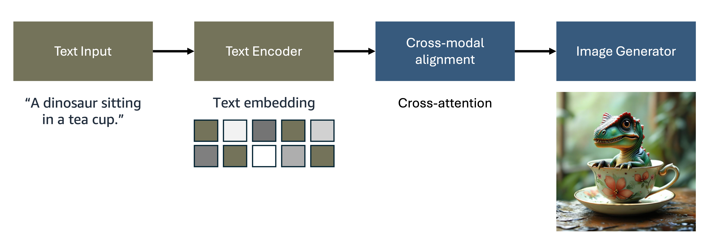
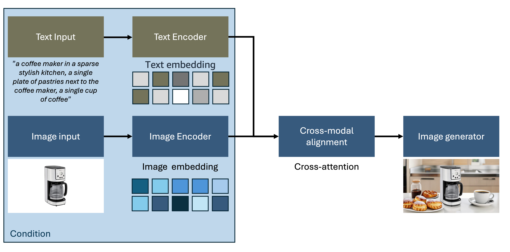

# Image Generation Architecture Patterns

## Suggested Pre-Reading

- [Architecture Design Pattern](../../index.md)

## TL;DR

Image generation represents one of the most transformative applications of multimodal AI, enabling systems to create visual content from diverse input modalities including text descriptions, sketches, or reference images. This document explores three fundamental architectural patterns: (1) Text-to-Image generation that converts natural language descriptions into visual content; (2) Image-to-Image transformation that modifies existing visuals based on conditional inputs; and (3) 3D Image Generation that creates three-dimensional visual content with spatial understanding. We conclude with practical implementation considerations and realistic guidance for building production-ready image generation systems.

## 1. Introduction to Image Generation Architecture

The emergence of sophisticated image generation models like DALL-E, Midjourney, and Stable Diffusion has fundamentally transformed how we approach visual content creation. Unlike traditional computer graphics pipelines that require explicit modeling and rendering, modern image generation systems leverage deep learning architectures to synthesize photorealistic images from high-level descriptions or manipulate existing visual content through learned representations.

### Key Architectural Challenges in Image Generation

Modern image generation systems face several unique challenges that distinguish them from traditional AI applications:

**Computational Intensity and Scale**
Image generation requires substantial computational resources, particularly during training and high-resolution inference. Architectures must balance quality with practical resource constraints, often employing techniques like progressive generation, efficient attention mechanisms, and model compression to achieve production viability.

**Multimodal Input Integration**
Effective image generation systems must seamlessly integrate diverse input modalities—text descriptions, reference images, style specifications, and geometric constraints. This requires sophisticated encoding strategies that preserve semantic relationships across modalities while enabling fine-grained control over generation parameters.

**Quality and Consistency Management**
Unlike text generation where quality can be measured through coherence and factual accuracy, image quality involves subjective aesthetic judgments, photorealism, and semantic consistency. Architectures must incorporate multiple evaluation metrics and quality control mechanisms to ensure reliable output standards.

## 2. Text-to-Image Generation

Text-to-image generation represents the most transformative image generation paradigm, enabling users to create visual content through natural language descriptions. The journey from text to pixels involves solving one of AI's most fundamental challenges: bridging the semantic gap between linguistic descriptions and visual representations.

### The Evolution from Challenge to Solution

The path to effective text-to-image generation began with a core architectural challenge—how to meaningfully connect the discrete, symbolic nature of language with the continuous, high-dimensional space of visual content. Early approaches struggled with semantic alignment, often producing images that bore little resemblance to their textual descriptions or lacked visual coherence.

Figure 1: Text-to-Image Generation Architecture

The breakthrough came through the development of sophisticated cross-modal architectures that process information through four interconnected stages:

1. **Text Input Processing** captures user descriptions while handling the complexities of natural language ambiguity and context
2. **Text Encoding** transforms linguistic content into rich semantic embeddings using advanced language models like CLIP and T5
3. **Cross-Modal Alignment** bridges the semantic gap through attention mechanisms and contrastive learning
4. **Image Generation** synthesizes visual content conditioned on the aligned text representations

### The Rise of Modern Generation Paradigms

As text-to-image systems matured, several generation methodologies emerged, each addressing specific limitations of earlier approaches:

**Diffusion Models: The Quality Revolution**
The introduction of denoising diffusion probabilistic models fundamentally transformed generation quality. By learning to reverse a noise process, these models achieved unprecedented photorealism and text alignment. The iterative denoising approach allows for careful, controlled image synthesis that maintains both quality and diversity.

**Flow Matching: The Efficiency Innovation**
Building on diffusion success, flow matching models emerged to address computational efficiency. These systems learn continuous normalizing flows between noise and data distributions, offering faster sampling and improved training stability—critical advances for production deployment where generation speed directly impacts user experience.

**Autoregressive Generation: The Control Paradigm**
Sequential, token-based generation introduced fine-grained controllability, enabling precise editing and modification workflows. While computationally intensive, this approach provides exceptional control over generation processes, making it valuable for professional creative applications.

**Hybrid Architectures: The Integration Solution**
Modern production systems recognize that no single paradigm solves all challenges. Hybrid architectures strategically combine approaches—using diffusion for initial high-quality generation, autoregressive refinement for editing, and flow matching for efficient sampling—creating systems that balance quality, speed, and controllability.

### Production Optimization and Refinement

As text-to-image generation moved from research to production, architectural optimization became critical for real-world deployment. Modern systems employ sophisticated techniques across each component to achieve the performance and reliability required for commercial applications:

The **text encoding layer** evolved beyond simple word embeddings to capture hierarchical semantic structures through multi-level encoding, while cross-attention mechanisms enable precise alignment between textual concepts and visual features. Prompt engineering techniques help users structure inputs for optimal generation quality.

**Cross-modal alignment** systems now leverage large-scale contrastive learning on text-image pairs to ensure semantic consistency. Advanced feature fusion architectures and conditional encoding strategies integrate textual information at multiple stages of the generation process, creating more robust text-image relationships.

The **image generation core** has been optimized through multiple approaches: diffusion models provide high-quality synthesis, flow matching enables efficient sampling, and hybrid GAN architectures contribute photorealistic output. Quality enhancement layers add super-resolution, style transfer capabilities, and artifact removal to ensure production-ready results.

### Emerging Innovations and Future Directions

The field continues to evolve rapidly, with recent architectural innovations addressing scalability and sophistication requirements:

**Latent Space Operations** have revolutionized computational efficiency by moving generation from pixel space to compressed latent representations. This approach maintains quality while dramatically reducing computational requirements, enabling higher resolution outputs and faster inference—essential for user-facing applications.

**Classifier-Free Guidance** eliminated the need for separate classifier networks while improving text-image alignment. This architectural simplification reduces computational overhead while enhancing controllability, demonstrating how sophisticated results can emerge from cleaner designs.

**Multi-Scale Generation Strategies** address the quality-efficiency balance by producing images at progressively higher resolutions. This approach maintains semantic consistency across scales while managing computational resources effectively.

**Compositional Understanding** represents the latest frontier, where models develop sophisticated reasoning about complex scenes, multiple objects, and spatial relationships. These capabilities emerge from improved attention mechanisms and architectural designs that support detailed compositional specifications through natural language.

## 3. Image-to-Image Generation

While text-to-image generation creates visual content from scratch, image-to-image transformation architectures modify existing visual inputs based on conditional specifications. 

Figure 2: Image-to-Image Generation Architecture (Outpainting example)

This paradigm enables sophisticated editing, style transfer, and content manipulation workflows that preserve structural elements while modifying specific attributes according to user requirements.

### Image-to-Image Architecture and Workflow

Image-to-image transformation systems implement specialized architectures designed for conditional modification and content preservation:

The image-to-image workflow encompasses these key stages:

1. **Source Image Input**: User provides reference images through the interface with support for various formats and resolutions
2. **Condition Specification**: Additional inputs define desired modifications including text descriptions, style references, semantic masks, or control parameters
3. **Joint Encoding**: Advanced encoders process both source images and conditioning information to create unified representations
4. **Conditional Generation**: Sophisticated generators modify source content based on conditioning signals while preserving important structural elements

### Capabilities Enabled by Image-to-Image Architecture

Image-to-image transformation systems enable a comprehensive range of sophisticated visual manipulation capabilities:

**Style Transfer and Artistic Rendering**: Transform photographic content into artistic styles while preserving semantic content and compositional structure through neural style transfer techniques

**Semantic Editing**: Modify specific objects or attributes within images based on textual descriptions or categorical specifications while maintaining scene coherence

**Super-Resolution and Enhancement**: Increase image resolution and quality while maintaining perceptual fidelity and detail consistency through learned upsampling techniques

**Domain Translation**: Convert images between different visual domains (sketches to photos, day to night, summer to winter) using domain-specific learned mappings

**Inpainting and Outpainting**: Fill missing regions or extend image boundaries with contextually appropriate content using sophisticated context understanding

**Pose and Expression Manipulation**: Modify human poses, facial expressions, or object orientations while maintaining identity and realism through anatomical understanding

### Advanced Conditioning Strategies

Modern image-to-image architectures employ sophisticated conditioning mechanisms for precise control:

**Multi-Modal Conditioning**
Systems integrate multiple conditioning signals simultaneously—combining textual descriptions, reference images, semantic masks, and control vectors for comprehensive modification control through unified conditioning frameworks.

**Hierarchical Conditioning**
Advanced architectures apply conditioning at multiple network levels, enabling both global style changes and fine-grained local modifications within a unified framework through multi-scale conditioning mechanisms.

**Learned Conditioning Representations**
Contemporary systems learn optimal conditioning representations through end-to-end training, automatically discovering effective ways to encode modification specifications and improving conditioning efficiency.

## 4. 3D Image Generation

As image generation technology matures, the frontier has expanded to include three-dimensional content creation. 3D image generation represents a sophisticated evolution that combines traditional computer graphics principles with modern generative AI, enabling the creation of volumetric content, multi-view consistent imagery, and spatially-aware visual content.

### 3D Generation Architecture Patterns

3D image generation systems employ several architectural approaches to handle the complexities of three-dimensional representation:

**Neural Radiance Fields (NeRF) Integration**
Modern 3D generation systems leverage NeRF architectures to represent scenes as continuous volumetric functions, enabling photorealistic novel view synthesis and consistent 3D object generation from textual descriptions or reference images.

**Multi-View Consistent Generation**
Advanced architectures ensure consistency across multiple viewpoints by employing shared latent representations and geometric constraints, critical for applications requiring coherent 3D content such as game development and virtual reality.

**3D-Aware Diffusion Models**
Cutting-edge systems integrate 3D understanding directly into diffusion architectures, enabling generation of content that maintains geometric consistency and realistic lighting across different viewpoints and camera positions.

### Key Components in 3D Generation Systems

| Component | Function | Implementation |
|-----------|----------|----------------|
| 3D Representation | Volumetric Encoding | Neural implicit functions, voxel grids, or point clouds for spatial representation |
| Geometry Understanding | Depth and Normal Estimation | Networks trained to understand 3D structure from 2D observations |
| Multi-View Synthesis | Consistent View Generation | Architectures that maintain coherence across different camera viewpoints |
| Lighting and Shading | Realistic Rendering | Physics-based rendering integration for photorealistic 3D content |
| Texture Generation | Surface Detail Synthesis | Specialized networks for generating realistic surface textures and materials |

### Applications and Use Cases

3D image generation enables numerous practical applications:

**Virtual and Augmented Reality Content**: Generate immersive 3D environments and objects for VR/AR applications with spatial consistency

**Game Development**: Create 3D assets, characters, and environments from textual descriptions or concept art with reduced manual modeling effort

**Product Visualization**: Generate photorealistic 3D product renderings for e-commerce and marketing applications with consistent lighting and materials

**Architectural Visualization**: Create 3D building and interior designs from floor plans or textual specifications with realistic materials and lighting

## Making it Practical

Building production-ready image generation systems requires careful consideration of both technical and operational factors. This section provides realistic guidance for implementing robust, scalable image generation architectures in enterprise environments.

### Implementation Strategy

**Prompt Engineering and Content Safety**
Well-designed prompts dramatically improve output quality without architectural changes. Invest in systematic prompt engineering and user guidance as this often yields better results than complex model modifications. Implement comprehensive content moderation with input filtering and output screening from day one, especially for customer-facing applications.

**Quality Focus**
Monitor semantic alignment (does the generated image match the text prompt?) and generation success rates as key business metrics rather than just visual aesthetics.

### Infrastructure and Deployment

**Performance Optimization** 
Batch processing and model quantization (FP16/INT8) are essential for cost-effective deployment. Generated images accumulate quickly - implement lifecycle policies and CDN integration for global delivery.

**AWS Options**
Use Amazon Bedrock (e.g., Nova Canvas) for rapid managed deployment, or Amazon SageMaker for custom models requiring specific auto-scaling and A/B testing capabilities.

## Further Reading

- [Video Generation Architecture Patterns](../3_1_2_3_3_video_generation/video_generation_doc.md)
- [Amazon Bedrock User Guide - Image Generation Models](https://docs.aws.amazon.com/bedrock/){:target="_blank" rel="noopener noreferrer"}
- [Amazon SageMaker Developer Guide - Computer Vision](https://docs.aws.amazon.com/sagemaker/){:target="_blank" rel="noopener noreferrer"}

## Contributors

**Author**: 

* Hasun Yu - AWS AIML Specialist Solutions Architect 

**Primary Reviewer**:

* Kihyeon Myung - Senior Applied AI Architect 