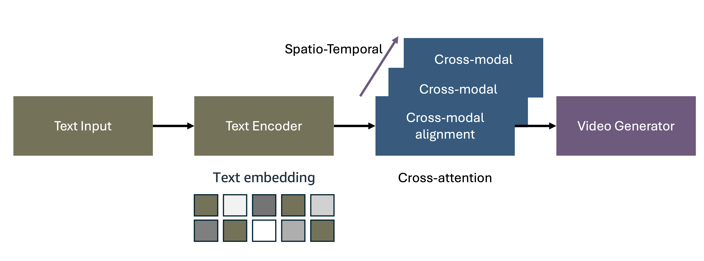
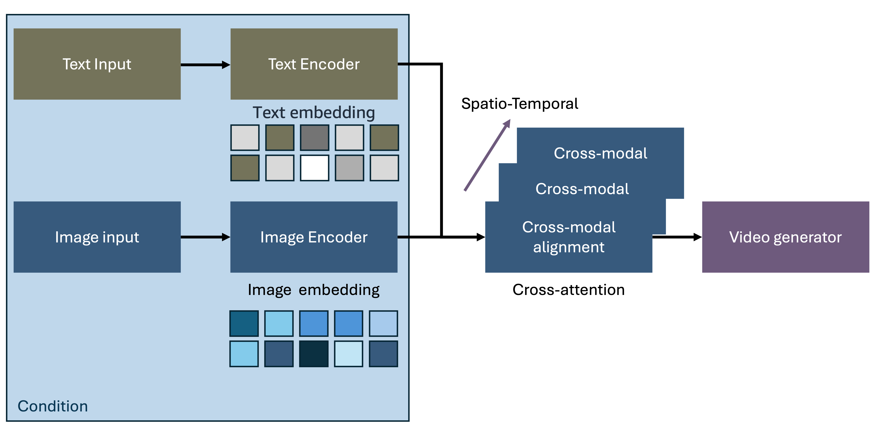

# Video Generation Architecture Patterns

## Suggested Pre-Reading

- [Architecture Design Pattern](../../index.md)
- [Image Generation](../3_1_2_3_2_image_generation/image_generation_doc.md)

## TL;DR

Video generation represents the next frontier in multimodal AI, enabling systems to create dynamic visual content with temporal consistency from diverse input modalities including text descriptions, reference images, or existing video clips. This document explores two fundamental architectural patterns: (1) Text-to-Video generation that converts natural language descriptions into dynamic video content; (2) Image-to-Video transformation that animates static images based on conditional inputs. We conclude with practical implementation considerations and realistic guidance for building production-ready video generation systems.

## 1. Introduction to Video Generation Architecture

The emergence of sophisticated video generation models has fundamentally transformed how we approach dynamic visual content creation. Unlike traditional video production pipelines that require extensive manual editing and rendering, modern video generation systems leverage advanced deep learning architectures to synthesize photorealistic video sequences from high-level descriptions or manipulate existing video content through learned spatiotemporal representations.

### Key Architectural Challenges in Video Generation

Modern video generation systems face several unique challenges that distinguish them from both static image generation and traditional video processing:

**Temporal Consistency and Coherence**
Video generation requires maintaining visual consistency across multiple frames while ensuring smooth temporal transitions. Architectures must balance frame-to-frame coherence with dynamic content evolution, often employing sophisticated attention mechanisms, temporal modeling, and motion prediction to achieve natural-looking video sequences.

**Computational Complexity and Memory Requirements**
Video generation is significantly more computationally intensive than image generation, requiring processing of high-dimensional spatiotemporal data. Systems must efficiently handle memory constraints while maintaining quality, often through techniques like sliding window attention, compressed representations, and progressive generation strategies.

**Asynchronous Architecture Design**
Given the extended generation times (minutes to hours), video generation systems must be architected with asynchronous processing patterns. Implement job queuing, progress tracking, webhook notifications, and status polling mechanisms to provide responsive user experiences while managing long-running generation tasks efficiently.

**Motion Understanding and Physics Modeling**
Effective video generation requires understanding of object motion, physical interactions, and realistic dynamics. Architectures must incorporate motion priors, physics constraints, and temporal reasoning to generate believable movement patterns and object interactions within generated sequences.

**Multi-Modal Temporal Alignment**
Video generation systems must synchronize diverse input modalities—text descriptions, audio cues, reference frames, and motion specifications—across time. This requires sophisticated encoding strategies that preserve semantic relationships while enabling precise temporal control over generation parameters.

## 2. Text-to-Video Generation

Text-to-video generation represents the most transformative video generation paradigm, enabling users to create dynamic visual content through natural language descriptions. The journey from text to moving imagery presents unique challenges that extend far beyond static image generation—requiring systems to understand not just what should appear, but how it should move, interact, and evolve over time.

### The Challenge of Temporal Understanding

The evolution toward effective text-to-video generation began with recognizing that video represents fundamentally different information than static images. Early approaches that simply extended image generation techniques struggled with temporal inconsistencies, unnatural motion patterns, and the computational complexity of processing high-dimensional spatiotemporal data.

The breakthrough required developing architectures that could simultaneously understand linguistic descriptions, spatial relationships, and temporal dynamics. This led to sophisticated cross-modal systems capable of bridging the semantic gap between textual narrative and moving visual content.

*Figure 1: Text-to-Video Generation Architecture*

Modern text-to-video architectures process information through four interconnected stages that address these temporal challenges:

1. **Text Input Processing** extracts not just objects and scenes, but temporal cues, action sequences, and narrative flow from natural language descriptions
2. **Temporal Text Encoding** creates rich semantic embeddings that capture both spatial content and the temporal dynamics described in user prompts
3. **Cross-Modal Spatiotemporal Alignment** maps text embeddings to video feature spaces through 3D attention mechanisms that understand motion and temporal relationships
4. **Video Generation** synthesizes coherent video sequences that maintain both semantic alignment with text and temporal consistency across frames

### The Evolution of Video Generation Paradigms

As the field matured, several generation methodologies emerged to address the unique demands of video synthesis:

**Diffusion-Based Video Models: The Temporal Extension**
Building on the success of image diffusion models, video diffusion extended denoising processes into the temporal dimension. These systems generate video sequences through iterative refinement processes that transform spatiotemporal noise into coherent moving content. The key innovation lies in 3D U-Net architectures and temporal attention mechanisms that maintain consistency across frames while enabling dynamic content evolution.

**Autoregressive Video Generation: The Sequential Approach**
Frame-by-frame generation emerged as a solution for fine-grained temporal control. While computationally intensive, autoregressive approaches provide exceptional control over motion dynamics and support sophisticated editing workflows. Each frame is predicted based on previous frames and text conditioning, enabling precise temporal manipulation and editability.

**Latent Video Diffusion Models: The Efficiency Revolution**
Recognizing the computational demands of video generation, latent space approaches moved processing from pixel space to compressed spatiotemporal representations. This architectural shift dramatically reduced computational requirements while maintaining generation quality, enabling longer video sequences and faster inference times through efficient 3D representation learning.

**Transformer-Based Video Synthesis: The Attention Solution**
Video transformers treat video generation as spatiotemporal sequence modeling, leveraging self-attention mechanisms to capture long-range dependencies across both spatial and temporal dimensions. This approach enables coherent video synthesis by understanding relationships between distant frames and maintaining narrative consistency.

### Production Optimization for Temporal Media

As text-to-video generation transitioned from research to production applications, specialized optimization techniques became essential for managing the computational and quality demands of temporal media:

**Temporal Text Processing** evolved to handle the complexity of describing motion and narrative. Multi-scale temporal encoding captures both immediate actions and long-term story structure, while action-object parsing identifies specific temporal relationships for precise motion generation. Temporal prompt engineering techniques help users structure inputs to maximize motion clarity and generation quality.

**Spatiotemporal Alignment Systems** leverage large-scale video-text datasets through contrastive learning to ensure semantic and temporal consistency. Advanced feature fusion architectures combine textual and visual information through sophisticated 3D processing, while motion-conditioned encoding integrates movement specifications at multiple generation stages.

**Video Generation Systems** have evolved to handle the unique demands of temporal media through specialized architectures that maintain both quality and temporal consistency while managing the substantial computational requirements inherent in video processing.

### Current Architectural Approaches

Modern video generation systems focus on practical solutions that balance quality with computational efficiency. Key developments include multi-stage generation pipelines that process video at different resolutions, improved attention mechanisms for temporal consistency, and better integration of motion understanding to create more natural-looking video sequences.

## 3. Image-to-Video Generation

Image-to-video generation transforms static images into dynamic video content, enabling animation of photographs, artwork, or generated images based on motion specifications or contextual cues. This paradigm bridges the gap between static visual content and dynamic storytelling.

### Image-to-Video Architecture and Workflow

Image-to-video transformation systems implement specialized architectures designed for motion synthesis and temporal extrapolation:

*Figure 2: Image-to-Video Generation Architecture*

The image-to-video workflow encompasses these key stages:

1. **Source Image Input**: User provides reference images through the interface with support for various formats and resolutions
2. **Motion Specification**: Additional inputs define desired motion including text descriptions, motion vectors, camera movements, or reference motion clips
3. **Spatiotemporal Encoding**: Advanced encoders process both source images and motion specifications to create unified spatiotemporal representations
4. **Temporal Generation**: Sophisticated generators synthesize video sequences that animate source content based on motion specifications while preserving visual identity

### Key Applications and Capabilities

Image-to-video systems enable practical applications including character animation from portraits, object motion synthesis within scenes, camera movement simulation for cinematic effects, and environmental animation like flowing water or moving clouds. These systems focus on maintaining visual consistency with the source image while adding believable temporal dynamics.

## 4. 3D Video Generation

3D video generation extends traditional video synthesis into three-dimensional space, enabling creation of immersive content for VR/AR applications, cinematic production, and interactive experiences. While still emerging, these systems show promise for applications requiring spatial consistency across multiple viewpoints, such as product demonstrations and virtual environments.

## Making it Practical

Building production-ready video generation systems requires careful consideration of computational constraints, quality requirements, and operational complexity. This section provides realistic guidance for implementing robust, scalable video generation architectures.

### Implementation Strategy

**Scale and Architecture Requirements**
Video generation demands 10-100x more computational resources and storage than images, with processing times of minutes to hours. Implement asynchronous job queuing, progress tracking, and webhook notifications rather than synchronous patterns. Focus on temporal consistency monitoring with automated detection of flickering and motion artifacts.

### Infrastructure and Deployment

**Video-Specific Optimizations**
Key techniques include keyframe-based generation (generate key frames first, interpolate others), temporal compression with efficient codecs, and multi-GPU distribution for longer sequences. Plan for substantial bandwidth requirements for streaming delivery.

**AWS Options**
Use Amazon Bedrock (e.g., Nova Reels) for managed deployment, or Amazon SageMaker's GPU-optimized instances for custom models with multi-model endpoints.

### Key Considerations

**Emerging Technologies**
Stay informed about interactive video editing capabilities, audio-visual synchronization, and longer-form content generation as these technologies mature.

**Responsible AI**
Implement policies that adhere to the core dimensions of responsible AI: Fairness, Explainability, Privacy and Security, Safety, Controllability, and Veracity and Robustness.

## Further Reading

- [Amazon Bedrock User Guide](https://docs.aws.amazon.com/bedrock/){:target="_blank" rel="noopener noreferrer"}
- [Amazon SageMaker Developer Guide](https://docs.aws.amazon.com/sagemaker/){:target="_blank" rel="noopener noreferrer"}

## Contributors

**Author**: 

* Hasun Yu - AWS AIML Specialist Solutions Architect 

**Primary Reviewer**:

* Kihyeon Myung - Senior Applied AI Architect 