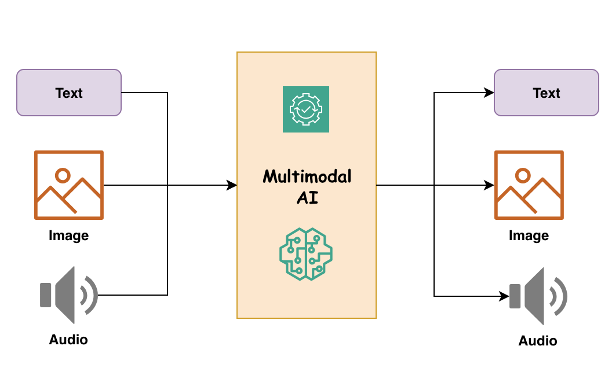

<!-- 
 Copyright Amazon.com, Inc. or its affiliates. All Rights Reserved.
 SPDX-License-Identifier: CC-BY-SA-4.0
 -->

# Multimodal Systems

**Content Level:** 200

### Overview

The advent of multimodal systems AI marks a significant shift from traditional, single-input models to more holistic approaches that mimic human perception. Instead of relying solely on text or images, multimodal AI systems integrate diverse sources of data—such as text, audio, images, and sensor signals—to offer richer context and deeper insights. For the software developer, this means harnessing more comprehensive datasets to build smarter, more responsive applications. This chapter aims to demystify multimodal AI without overwhelming you with heavy scientific jargon, instead focusing on its core concepts, components, and practical implementation strategies.

#### What Is Multimodal AI?

Unlike the Large Language Model that takes text as input, Multimodal AI involves the fusion of different data types to improve machine learning outcomes. The term "multimodal" refers to the multiple "modes" of data such as:

- Text: Natural language data from documents, social media, or transcripts
- Images and Videos: Visual data from cameras, medical imaging, or satellites
- Audio: Speech, music, and environmental sounds
- Sensor Data: Inputs from IoT devices, wearables, or robotics

By combining these sources, multimodal AI can capture a more nuanced understanding of the context, leading to improved predictions and decisions.

#### Multimodal AI System Flow:
The diagram below provides a high-level overview of multimodal systems.

*Figure 1: Multimodal Systems Illustration*

1. Input Layer:
    - Text Input: User-provided textual data
    - Image Input: Visual data such as photos or videos
    - Audio Input: Spoken language or sound recordings
    - Sensor Data: Information from IoT devices or other sensors

2. Processing Layer:
    - Data Preprocessing: Cleansing and normalizing data from each modality
    - Feature Extraction: Identifying relevant features from each data type
    - Data Fusion: Combining features from multiple modalities into a unified representation

3. Decision-Making Layer:
    - Analysis Module: Interprets the fused data to derive insights
    - Prediction Module: Generates predictions or classifications based on the analysis

4. Output Layer:
    - Text Output: Generated text responses or summaries
    - Visual Output: Graphs, images, or video content
    - Audio Output: Spoken responses or alerts
    - Actionable Insights: Recommendations or actions suggested by the system

## Contributors

### Authors

* Meghana Ashok - Machine Learning Engineer 
* Hari Prasanna Das - Applied Scientist 
* Grace Lang - Deep Learning Architect 
* Ayushi Haria - Deep Learning Architect 