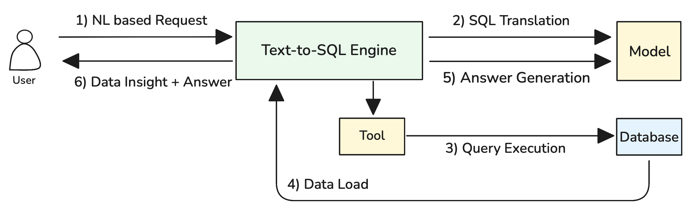
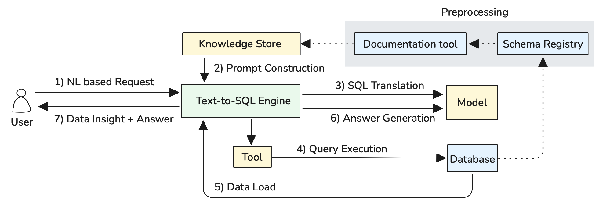
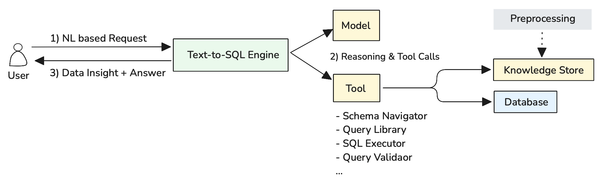

<!-- 
 Copyright Amazon.com, Inc. or its affiliates. All Rights Reserved.
 SPDX-License-Identifier: CC-BY-SA-4.0
 -->

# Text-to-SQL Application

**Content Level: 300**

## Suggested Pre-Reading
- [Data Insight Architecture](../index.md)
- [Foundation Architecture Components](../../../3_1_1_foundation_architecture_components/index.md)
- [Application Engine](../../../3_1_1_foundation_architecture_components/3_1_1_2_application_engine/index.md)
- [Tool Gateway](../../../3_1_1_foundation_architecture_components/3_1_1_6_tool_gateway/index.md)

## TL;DR
Text-to-SQL applications enable users to query databases using natural language by combining schema information, sample queries, and user questions into prompts that generate SQL code. Basic implementations work well for simple schemas and straightforward questions, while complex enterprise environments require specialized approaches including query libraries, schema enrichment, and adaptive workflows. Success depends on starting with focused use cases, building comprehensive example libraries, and establishing feedback loops to improve accuracy over time.

## Basic Text-to-SQL Operation

Text-to-SQL systems work by combining database schema information with user questions to generate SQL queries. The process follows a straightforward workflow:

<div style="margin:auto;text-align:center;width:100%;">

<p style="font-style: italic; margin-top: 5px;">Figure 1: Basic Text-to-SQL Operation Flow</p>
</div>

As illustrated in Figure 1, the system operates through six key steps: (1) **NL based Request** where users submit natural language questions, (2) **SQL Translation** where the Text-to-SQL Engine processes the request using schema information and sample queries through the Model component, (3) **Query Execution** where the generated SQL is executed against the database via the Tool component, (4) **Data Load** where results are retrieved from the database, (5) **Answer Generation** where the Model formats the results into user-friendly responses, and (6) **Data Insight + Answer** where the complete response is delivered back to the user.

Here's how the complete prompt looks:

```jinja2
You are a SQL expert. Generate a {{ dialect }} query based on the schema and examples below.

DATABASE SCHEMA:
{{ schema_information }}

SAMPLE QUERIES:
{{ sample_query_library }}

USER QUESTION: {{ user_natural_language_question }}

Generate only the SQL query without explanations. Ensure proper syntax for {{ dialect }}.
```

This approach works well for simple databases with straightforward schemas and predictable question patterns. For complex enterprise environments with large schemas, hundreds of tables, and sophisticated business logic, more advanced techniques are required.

## Handling Complex Database Environments

Enterprise databases often contain hundreds of tables with thousands of columns, creating a fundamental problem: complete schema information exceeds LLM context window limits. When a database schema is too large to fit entirely within the prompt, the basic approach fails because the model cannot see all available tables and relationships.

Consider a typical e-commerce database with over 200 tables including customers, orders, products, inventory, payments, shipping, reviews, analytics, and audit tables. The complete schema definition might require 50,000+ tokens, far exceeding most model context limits when combined with sample queries and user questions.

### Approach 1: Schema Simplification with Views

When the scope of questions is predictable and limited to specific business domains, create simplified database views that expose only the relevant tables and columns for Text-to-SQL operations.

```sql
-- Create a simplified view for sales analysis
CREATE VIEW sales_analytics AS
SELECT 
    o.id as order_id,
    o.order_date,
    o.total_amount,
    c.name as customer_name,
    c.email as customer_email,
    c.signup_date,
    p.name as product_name,
    p.category,
    oi.quantity,
    oi.unit_price
FROM orders o
JOIN customers c ON o.customer_id = c.id
JOIN order_items oi ON o.id = oi.order_id
JOIN products p ON oi.product_id = p.id
WHERE o.status = 'completed';
```

This approach reduces schema complexity by pre-joining related tables and exposing only business-relevant columns. The Text-to-SQL system now works with a simplified schema that fits comfortably within context limits while still enabling meaningful business queries.

**Pros**: Dramatically reduces token usage, improves query accuracy, and enables domain-specific optimizations.

**Cons**: Works only when question scope is predictable and limited to specific business areas.

### Approach 2: RAG-Enhanced Schema and Query Retrieval

When questions span multiple business domains or when schema scope cannot be predetermined, use RAG to dynamically retrieve relevant schema information and sample queries based on user questions. The RAG approach requires preprocessing all schema elements and sample queries into searchable embeddings:

<div style="margin:auto;text-align:center;width:100%;">

<p style="font-style: italic; margin-top: 5px;">Figure 2: Schema and Query Preprocessing for RAG</p>
</div>

**Automated Schema Documentation**: Use LLMs to automatically generate business-friendly descriptions from database schema metadata. The system analyzes table structures, foreign key relationships, and column names to create comprehensive documentation:

**Query Pattern Analysis**: Analyze query execution logs to identify frequently used patterns and automatically generate sample queries with natural language descriptions. This creates a comprehensive query library based on actual usage patterns rather than manually crafted examples.

**Knowledge Store Integration**: All generated documentation and query patterns are stored in the Knowledge Store using vector embeddings, enabling semantic search capabilities. The system maintains separate indexes for schema elements and query patterns, allowing precise retrieval during query generation.

```python
def retrieve_relevant_context(user_question, schema_store, query_library):
    # Embed user question
    question_embedding = embed(user_question)
    
    # Retrieve relevant schema elements
    relevant_tables = schema_store.similarity_search(
        question_embedding, 
        filter="type:table", 
        top_k=5
    )
    
    relevant_columns = schema_store.similarity_search(
        question_embedding, 
        filter="type:column", 
        top_k=15
    )
    
    # Retrieve similar sample queries
    similar_queries = query_library.similarity_search(
        question_embedding,
        top_k=3
    )
    
    return build_context(relevant_tables, relevant_columns, similar_queries)
```

This approach maintains embeddings for all schema elements (tables, columns, relationships) and sample queries. When a user asks a question, the system retrieves only the most relevant schema information and examples, ensuring the prompt stays within context limits while providing necessary context for accurate SQL generation.

**Pros**: Handles arbitrary question scope, scales to very large schemas, and improves over time as the query library grows.

**Cons**: Requires building preprocessing pipelines for schema documentation and query analysis, and retrieval quality depends on embedding effectiveness.

## When Agents Become Necessary

While the approaches above handle most Text-to-SQL scenarios, certain types of questions require more sophisticated orchestration that only agentic systems can provide effectively. Consider business questions like "Show me customers whose purchasing behavior changed significantly this quarter compared to last quarter" - this cannot be answered with a single SQL query but requires breaking down into sequential steps: calculating baselines, identifying changes, and determining significance thresholds.

Similarly, when users ask exploratory questions like "What's unusual about our sales data?" or "Find anything interesting in customer behavior," the system needs to clarify intent, explore multiple analytical angles, and iterate based on findings. This requires dynamic conversation management and multi-step reasoning rather than direct translation.

These complex scenarios benefit from an agentic approach where the Text-to-SQL Engine orchestrates multiple reasoning steps and tool calls to handle sophisticated analytical workflows:

<div style="margin:auto;text-align:center;width:100%;">

<p style="font-style: italic; margin-top: 5px;">Figure 3: Agentic Text-to-SQL Architecture with Reasoning and Tool Integration</p>
</div>

As illustrated in Figure 3, the agentic approach follows a three-step process: (1) **NL based Request** where users submit complex natural language questions, (2) **Reasoning & Tool Calls** where the Text-to-SQL Engine uses the Model for multi-step reasoning and coordinates various tools as needed, and (3) **Data Insight + Answer** where comprehensive responses are delivered back to users. The preprocessing pipeline ensures that relevant schema and query information is available in the Knowledge Store for tool access.

**Schema Navigator**: Explores database structures and identifies relevant tables, columns, and relationships based on user questions. Performs semantic search across preprocessed schema documentation to find the most relevant data sources for complex analytical queries.

**Query Library**: Accesses a repository of proven query patterns and examples from the Knowledge Store. Helps find similar historical queries that can serve as templates or inspiration for new SQL generation, particularly valuable for multi-step analytical workflows.

**SQL Executor**: Enables safe query execution against the database with appropriate security controls, timeouts, and result validation. Critical for iterative analysis where intermediate results inform subsequent query generation.

**Query Validator**: Validates SQL syntax, checks table/column references, and ensures queries are safe for execution. Prevents errors and security issues before queries reach the database, essential for autonomous multi-step workflows.

The Text-to-SQL Engine coordinates this entire process, using the Model for reasoning about question complexity and determining which tools to invoke in what sequence to deliver comprehensive analytical insights.

**When to Use Agentic Approaches**: Reserve for scenarios requiring multi-step analysis, ambiguous question handling, or when user interaction and iteration are essential parts of the analytical process.

## Making it Practical

### Safe Database Environment Setup

Prepare your database environment for Text-to-SQL operations with safety as the primary consideration. Create read-only database users with restricted permissions that cannot modify data or schema structures. Implement query timeouts, result set limits, and resource usage controls to prevent runaway queries from impacting system performance. Consider creating dedicated analytical views or a separate reporting database to isolate Text-to-SQL operations from production systems.

Use database abstraction layers like SQLAlchemy to provide unified interfaces across different database systems, enabling your Text-to-SQL application to work with PostgreSQL, MySQL, or other databases without modification. These tools offer essential capabilities including connection pooling for handling multiple concurrent queries, robust error handling for AI-generated SQL validation, and schema introspection features that allow GenAI models to understand database structure and relationships automatically.

### Design for SQL Failure and Recovery

SQL generation will fail regularly - embrace this reality in your system design. Build retry mechanisms into your agentic workflows where agents can analyze error messages, adjust their approach, and generate alternative queries. When syntax errors occur, agents should use the Query Validator feedback to understand what went wrong and iterate toward correct SQL. For semantic errors or unexpected results, agents should be able to examine intermediate outputs and refine their analytical approach rather than simply presenting failed queries to users.

### Continuous Learning from User Feedback

Establish systematic feedback collection to improve system accuracy over time. When users correct generated queries or provide additional context, capture these interactions to expand your sample query library. Track which types of questions consistently cause problems and invest in additional schema documentation or sample queries for those areas. Create feedback loops where successful user-corrected queries become new training examples, and failed interaction patterns inform system improvements.

### Dynamic Knowledge Store Updates

Treat your Knowledge Store as a living system that evolves with your data and users. As database schemas change, automatically regenerate schema documentation and update embeddings to maintain search accuracy. Regularly analyze query execution logs to identify new patterns worth adding to your query library. Monitor user question trends to understand which business domains need better schema documentation or additional sample queries, then prioritize knowledge base improvements accordingly.

## Further Reading

- <a href="https://www.linkedin.com/blog/engineering/ai/practical-text-to-sql-for-data-analytics" target="_blank" rel="noopener noreferrer">Practical Text-to-SQL for Data Analytics - LinkedIn Engineering</a>

## Contributors

**Author**:

* Kihyeon Myung - Senior Applied AI Architect 

**Primary Reviewer**:

* Manoj Ramani - Senior Applied AI Architect 
* Don Simpson - Principal Technologist 
