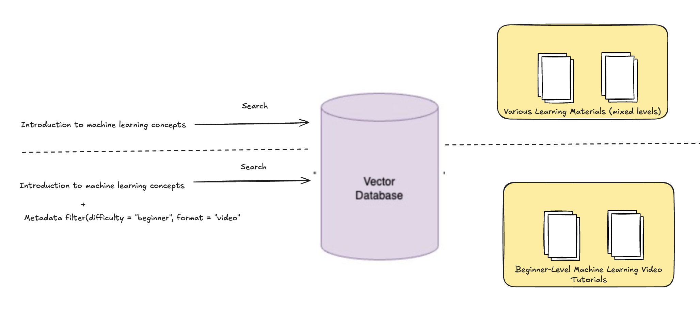

<!-- 
 Copyright Amazon.com, Inc. or its affiliates. All Rights Reserved.
 SPDX-License-Identifier: CC-BY-SA-4.0
 -->

# Pre-retrieval techniques

**Content Level: 300**

## Suggested Pre-Reading
- [RAG](../../../2_0_technical_foundations_and_patterns/2_1_key_primitives/2_1_7_rag/2_1_7_rag.md)

## TL;DR

Pre-retrieval techniques are foundational in optimizing Retrieval-Augmented Generation (RAG) systems. By refining how queries are formulated and how corpora are structured before retrieval, these methods enhance the relevance and efficiency of the information retrieved, leading to more accurate and contextually appropriate responses from generative models. Key strategies include:


* Query Normalization: Standardizing queries to ensure consistency and reduce ambiguity.
* Query Expansion/Rewriting: Enriching queries with additional terms to capture a broader context.
* Embedding Optimization: Enhancing vector representations for more precise retrieval.
* Indexing Strategies: Implementing efficient indexing methods to speed up retrieval.
* Metadata Enrichment: Adding contextual information to corpus entries to aid in retrieval.


These techniques collectively improve the quality of information retrieved, thereby enhancing the performance of RAG systems.

### Introduction

In the context of **Retrieval-Augmented Generation (RAG)**, **pre-retrieval techniques** refer to methods that are applied **before** the actual retrieval of documents or data in order to improve the efficiency, relevance, and accuracy of the documents being retrieved. These techniques focus on enhancing the data preparation and the retrieval process itself, ensuring that the retriever finds the most relevant information based on the given query.

Some of the techniques that are used are:

* Query Enrichment -  Metadata
* Query Normalization
* Query Expansion/Rewriting
* Embedding Optimization
* Indexing Strategies

### Query Enrichment -  metadata

* **What it is**: Metadata refers to additional information about the data that provides context, categorization, or structure. This might include document categories, timestamps, authorship information, or specific tags related to the content.
* **Why it helps in RAG**: Metadata can be used to narrow down search queries, filter irrelevant documents, and prioritize relevant content. For instance, metadata like "category" (e.g., medical, legal, technology) can help ensure that the retrieval process focuses only on the most relevant subsets of documents based on the user's query.
* **Example**: In an FAQ retrieval system, metadata such as "topic" (e.g., shipping, product warranty) helps the retriever to filter out irrelevant documents before performing the retrieval.

<div style="margin:auto;text-align:center;width:100%;">

<p style="font-style: italic; margin-top: 5px;">Figure 1: Context Management System Architecture</p>
</div>
As shown in the figure above, a user searching for "Introduction to machine learning concepts" would typically receive a wide range of content, covering various difficulty levels and formats. However, by adding metadata filtering that combines semantic search with structured attribute constraints, we can significantly improve retrieval accuracy. When the query is enhanced with metadata parameters (difficulty="beginner", format="video"), the system provides exactly what modern learners seek: beginner-friendly video tutorials tailored to their learning needs.


### Query Normalization

**What it is**: Standardize queries to minimize variability and ensure consistent retrieval results.

**Approaches:**

* Lowercasing: Converting all characters to lowercase to avoid case-sensitive mismatches.
* Stopword Removal: Eliminating common words (e.g., “the”, “is”) that may not contribute significant meaning.
* Punctuation Stripping: Removing punctuation marks to prevent retrieval errors.
* Spelling Correction: Identifying and correcting typographical errors to match indexed terms.


**Why it helps in RAG**: By normalizing queries, RAG systems can reduce the likelihood of retrieving irrelevant information due to superficial differences in query phrasing. For vector-based RAG systems, normalized queries produce more consistent embedding vectors, leading to more reliable similarity matching.

Example:

```
def normalize_query(query):
    # Convert to lowercase
    query = query.lower()
    # Remove special characters
    query = re.sub(r'[^\w\s]', '', query)
    # Handle stemming
    stemmer = PorterStemmer()
    tokens = query.split()
    stemmed_tokens = [stemmer.stem(token) for token in tokens]
    return ' '.join(stemmed_tokens)

original_query = "Debugging Memory Leaks in C++"
normalized = normalize_query(original_query)  # "debug memory leak in c"

```


### Query Expansion/Rewriting

**What it is:** Query Expansion/Rewriting involves modifying or reformulating a user’s original query to improve its relevance and precision, ensuring that the retrieval system pulls the most useful and contextually appropriate documents. 

**Approaches**:

* Synonym Expansion: Incorporating synonyms to account for different expressions of the same concept. This can be done through Entity Recognition or Conceptual Expansion that can help refine the query to better match the information needs.
* Related Term Inclusion: Adding semantically related terms to encompass various facets of a topic.
* Keyword Expansion: Generating additional keywords that can align with the underlying data. 


**Why it helps in RAG: **By addressing ambiguities, improving specificity, and aligning the query with the retrieval system’s capabilities, query expansion/rewriting helps to optimize the quality of the documents retrieved, ultimately leading to more accurate and coherent generated responses.

**Example**: A RAG chatbot that’s built for a user to search for restaurants in a city Consider the following example query:


```
`query = """"  best italian restaurants in nyc. """`
```

The rewritten query would be as follows, which will yield better search results.

`top rated italian restaurants in new york city near me`

In this case, the query is rewritten to:

1. Expand the phrase “nyc” to “new york city” for better matching with search indices.
2. Add "top rated" to focus on higher-quality restaurants.
3. Include "near me" to potentially personalize the search based on the user's location.

By rewriting the query in this way, the search engine may better understand the user's intent and return more relevant, targeted results.


### Embedding Optimization

**What it is:** Enhance vector representations of queries and documents to improve retrieval effectiveness.

**Approaches**:

* Fine-Tuning Embedding Models: Training models on domain-specific data to capture relevant semantic nuances.
* Dual Encoder Architectures: Using separate encoders for queries and documents to optimize retrieval performance.
* Embedding Normalization: Standardizing embeddings to ensure consistent similarity measurements.

**Why it helps in RAG: **Optimized embeddings facilitate more accurate matching between queries and relevant documents, leading to improved retrieval outcomes.

Please refer to Section 2.3.3.1 for more information [4. Store: Store Embeddings in a Vector Database: Ingestion, chunking and embedding](../../../2_0_technical_foundations_and_patterns/2_3_core_archtectural_concepts/2_3_3_RAG(retrieval%20Augmented%20Generation)/2_3_3-1-ingestion_pipelines/2_3_3-1-ingestion_pipelines.md)

### Indexing Strategies

**What it is**: Implement efficient indexing methods to speed up the retrieval process.

**Approaches**:

* Inverted Indexing: Creating a mapping from terms to their locations in the corpus to enable fast lookups.
* Vector Indexing: Utilizing data structures like FAISS to index embeddings for rapid similarity searches.
* Hybrid Indexing: Combining inverted and vector indexing to leverage the strengths of both methods.


**Why it helps in RAG: **Effective indexing reduces retrieval latency and enhances the responsiveness of RAG systems.


## Making it Practical

To effectively implement pre-retrieval techniques in Retrieval-Augmented Generation (RAG) systems, Software Development Engineers (SDEs) can follow these practical steps. Each technique includes code snippets and tool recommendations to facilitate integration into your RAG pipeline.

### Query Enrichment -  Metadata generation using Bedrock

In Financial Domain we create additional metadata that elaborates the scope of the user question:

1. Generate technical/financial keywords
2. Generate company names mentioned in the question

These metadata are used in final answer generation as well in narrowing down the scope of retrieved chunks.

#### 1. Metadata Generation: Technical keywords

This prompt is used to generate semantically relevant keywords for a user’s question.

For example: When the question `“Who are Microsoft’s competitors?”` and the retrieval is done through exact match, the retrieval might miss out chunks that have reference words like “rivals”, “challengers” etc that are semantically relevant. This prompt aims at bridging that gap.

```
Human: imagine you are a financial analyst looking to answer the question {query} 
in 10k/10q documents.

What are some of the keywords you would use for searching the documents based on 
the question?
<instruction>
1. Do not include company names, document names and timelines
2. Generate 5-6 important list of comma separated keywords within a single 
<keywords></keywords> tag.
3. Focus more on what sections of the document you would look at and add that 
to the keyword
4. Do not add keywords that are not part of the question
</instruction>


Assistant:
```

#### 2. Metadata Generation: Company keywords and Rephrasing

This prompt generates list of companies and technical keywords based on the query. This prompt also expands any abbreviations mentioned in the user’s question.

```
\n\nHuman:
You a financial editer that looks at a user questions and rephrases it accurately 
for better search and retrieval tasks.

Financial question related to yearly and Quarterly financial Reports: {query} \n
<task>
Given a user question, identify the following metadata
   - 'technical_keywords': a list of relevant keywords from question
   - 'company_keywords': a list of company names
   - 'rephrased_question': the full rephrased question string
</task>

<time_keywords>
{time_kwds}
</time_keywords>

<technical_keywords>
1. Generate a comprehensive list of all possible keywordsthat are relevant 
based on sections you would typically find in a financial document.
2. Include different alternatives to the keywords, be imaginative.
3. Remove the company name and document name from keyword list.
</technical_keywords>

<company_keywords>
Generate a list of company names that are mentioned in the question.
</company_keywords>

Return a JSON object with the following fields:
   - 'technical_keywords': a list of relevant keywords from question
   - 'company_keywords': a list of company names


\n\nAssistant:The metadata for the user question {query}:
```

### Query Expansion/Rewriting using Bedrock

This prompt generates rephrased query that can help provide additional context during answer generation. 


```
\n\nHuman:
You a financial editer that looks at a user questions and rephrases it accurately 
for better search and retrieval tasks.

Financial question related to yearly and Quarterly financial Reports: {query} \n
<task>
Given a user question, identify the following metadata
   - 'rephrased_question': the full rephrased question string
</task>

<time_keywords>
{time_kwds}
</time_keywords>

<rephrased_question>
1. Generate the keywords and rephrase the question to make it very clear
2. Expand any acronyms and abbreviations in the original question by providing 
the full term. Include both the original abbreviated version and the expanded 
version in the rephrased question.
</rephrased_question>

Return a JSON object with the following fields:
- 'rephrased_question': the full rephrased question string
```


### Further Reading

- [Bedrock Knowledge Bases Metadata Filtering](https://aws.amazon.com/blogs/machine-learning/amazon-bedrock-knowledge-bases-now-supports-metadata-filtering-to-improve-retrieval-accuracy/){:target="_blank" rel="noopener noreferrer"}
- [Query Rewriting in E-commerce](https://www.amazon.science/publications/advancing-query-rewriting-in-e-commerce-via-shopping-intent-learning){:target="_blank" rel="noopener noreferrer"}
- [Bedrock Chunking Documentation](https://docs.aws.amazon.com/bedrock/latest/userguide/kb-chunking.html){:target="_blank" rel="noopener noreferrer"}
- [Improve search results for AI using Amazon OpenSearch Service as a vector database with Amazon Bedrock](https://aws.amazon.com/blogs/big-data/improve-search-results-for-ai-using-amazon-opensearch-service-as-a-vector-database-with-amazon-bedrock/){:target="_blank" rel="noopener noreferrer"}
- [Amazon OpenSearch Service’s vector database capabilities explained](https://aws.amazon.com/blogs/big-data/amazon-opensearch-services-vector-database-capabilities-explained/){:target="_blank" rel="noopener noreferrer"}

## Contributors

**Authors:**
- Meghana Ashok, Machine Learning Engineer 

 - Ramprasath S - Sr Applied AI Architect 

**Primary Reviewer:**

 - Tonny Ouma - Sr Applied AI Architect 
