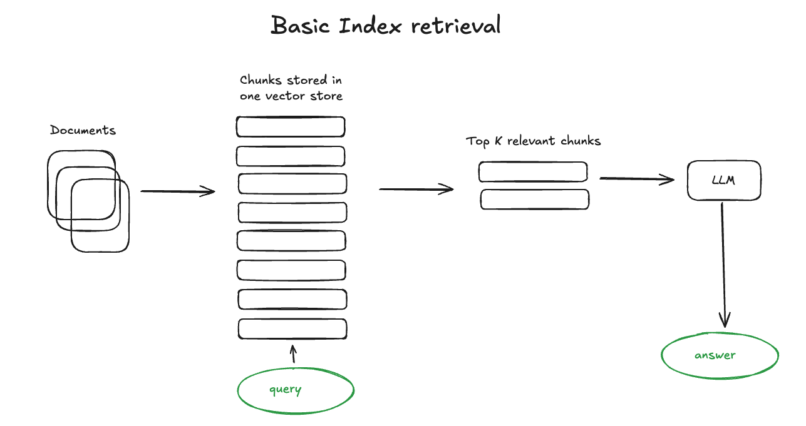
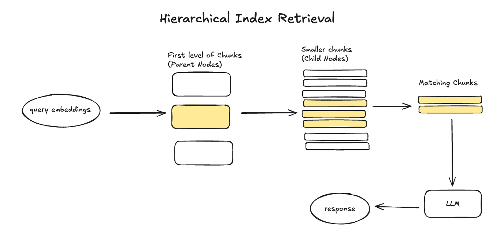
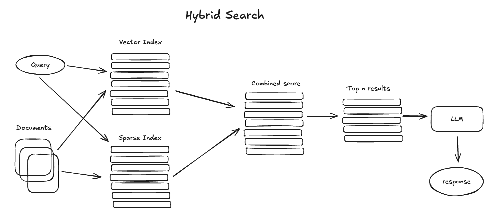
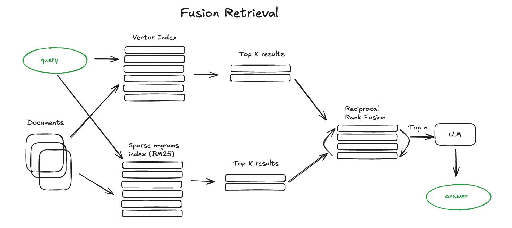
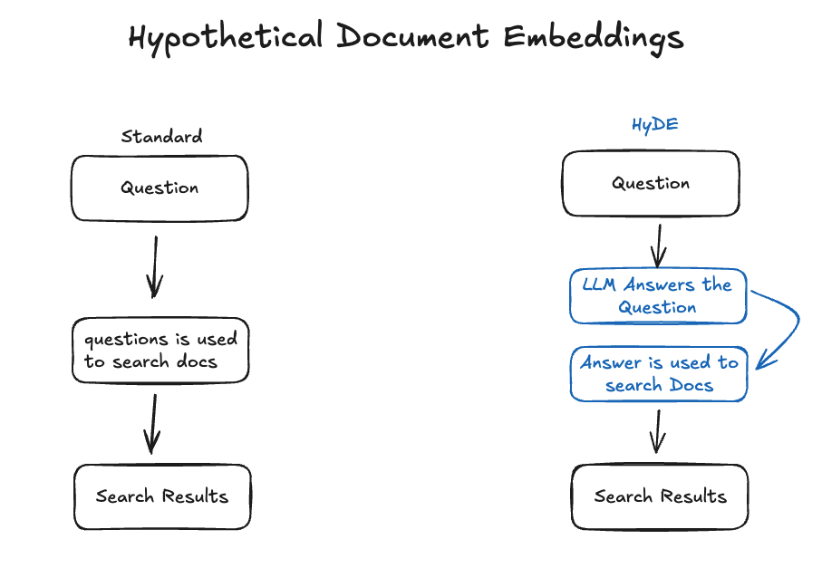

<!-- 
 Copyright Amazon.com, Inc. or its affiliates. All Rights Reserved.
 SPDX-License-Identifier: CC-BY-SA-4.0
 -->

# Retrieval optimization

**Content Level: 300**

## Suggested Pre-Reading
- [RAG](../../../2_0_technical_foundations_and_patterns/2_1_key_primitives/2_1_7_rag/2_1_7_rag.md)
- [Architecture Components](../3_3_1_pre-retrieval_techniques/3_3_1_pre-retrieval_techniques.md)

## TL;DR

### Introduction

Retrieval techniques aim to improve the process of extracting relevant information from a vector store. This includes using indexing strategies to organize and structure data for faster access.
Ranking algorithms are also employed to prioritize results, so that the most relevant information is presented first. Filtering mechanisms help refine search results by removing irrelevant data, enhancing accuracy.
Together, these approaches enable efficient and effective information retrieval. We will explore a few of these techniques below.


#### Basic Vector Store Index Retrieval

Search index is one of the most important parts of the RAG pipeline. It’s used to store the vectorized content in the previous step.
The simplest implementation uses a flat index — a brute force distance calculation between the query vector and all the chunks’ vectors. A proper search index, optimized for efficient retrieval on 10000+ elements scales is a vector index like faiss, nmslib or annoy, using some Approximate Nearest Neighbors implementation like clustering, trees or HNSW algorithm.

There are also managed solutions like OpenSearch or ElasticSearch and vector databases, taking care of the data ingestion pipeline. Depending on your index choice, data and search needs you can also store metadata along with vectors and then use metadata filters to search for information within some dates or sources for example.


<div style="margin:auto;text-align:center;width:100%;">

<p style="font-style: italic; margin-top: 5px;">Figure 1: Context Management System Architecture</p>
</div>
Here is one [example code](https://docs.llamaindex.ai/en/stable/community/integrations/vector_stores/){:target="_blank" rel="noopener noreferrer"} of using the default vector store from llamaindex.

```
from llama_index.core import VectorStoreIndex, SimpleDirectoryReader

# Load documents and build index
documents = SimpleDirectoryReader("../paul_graham_essay/data").load_data()
index = VectorStoreIndex.from_documents(documents)

# Query index
query_engine = index.as_query_engine()
response = query_engine.query("What did the author do growing up?")
```


#### Hierarchical Index Retrieval

One of the most effective ways to improve the precision of information retrieval is through hierarchical indexing. This approach organizes data in a layered structure, where information is grouped into categories and sub-categories based on relevance and relationships. Instead of conducting a broad search across the entire dataset, hierarchical indexing narrows the scope of the search by starting at the higher, broader parent nodes and then drilling down into more focused, smaller child nodes.
By using this structured approach, irrelevant data is more easily avoided, as the retrieval process first filters out unnecessary broad information before delving into more specific sub-categories.
The objective of hierarchical indexing is to ensure that only the most relevant chunks of data are considered during the search, which ultimately increases the efficiency of the retrieval process. In the context of retrieval-augmented generation (RAG) applications, this method minimizes the inclusion of irrelevant information, leading to more accurate and focused outputs, thus improving both speed and relevance of the final results.


<div style="margin:auto;text-align:center;width:100%;">

<p style="font-style: italic; margin-top: 5px;">Figure 1: Context Management System Architecture</p>
</div>


#### Recursive Retrieval

To understand why recursive retrieval is such a powerful concept, let's look at it in detail. During normal retrieval, we use the user query to find potentially relevant documents - required for our LLM model to answer the mentioned user query. This is mostly done by comparing the semantic meaning of the user query with the semantic meaning of the documents in our index. When looking at how we create these documents, we can see that we divide the full texts of our source documents into smaller chunks, which we then index.
This is done so that we can retrieve relevant information from our documents, even if the full document is too long to be processed by our LLM model.

However, this approach has a downside: If the relevant information is spread across multiple chunks, we might not be able to retrieve all relevant information with a single retrieval. If we look at tables, for example, oftentimes the 'semantic meaning' of a table is not captured by the table itself, but by the text surrounding it.

Recursive retrieval solves this problem by recursively looking at not only the semantically most similar documents, but also document chunks which might be related to these documents. This way, we can capture all relevant information, even if it is spread across multiple chunks. This means, recursive retrieval consists of two main components:

* A way to identify relationships between document chunks
* A way to recursively retrieve related document chunks

Packages such as llamaindex provide a proven implementation of recursive retrieval (and is great for RAG in general).

Here is one [example code](https://www.pondhouse-data.com/blog/advanced-rag-recursive-retrieval-with-llamaindex){:target="_blank" rel="noopener noreferrer"} of using llamaindex to create mapping between IndexNote(here are the table summaries) and object node (here are the table objects integrated with PandasQueryEngine), and conduct following recursive retrieval. The recursive retrieval will start retrieval from the IndexNote (here are the table summaries) and recursively retrieval object nodes map to the IndexNote.

```
# Define query engines over these tables
df_query_engines = [
    PandasQueryEngine(table_df, llm=Settings.llm) for table_df in tables
]

# Define index nodes for the tables
summaries = [
    (
        "This node provides information about the world's richest billionaires"
        " in 2023"
    ),
    (
        "This node provides information on the number of billionaires and"
        " their combined net worth from 2000 to 2023."
    ),
]

df_nodes = [
    IndexNode(text=summary, index_id=f"pandas{idx}")
    for idx, summary in enumerate(summaries)
]

df_id_query_engine_mapping = {
    f"pandas{idx}": df_query_engine
    for idx, df_query_engine in enumerate(df_query_engines)
}

# Construct top-level vector index + query engine
doc_nodes = Settings.node_parser.get_nodes_from_documents(docs)
vector_index = VectorStoreIndex(doc_nodes + df_nodes)
vector_retriever = vector_index.as_retriever(similarity_top_k=1)

# Create RecursiveRetriever
recursive_retriever = RecursiveRetriever(
    "vector",
    retriever_dict={"vector": vector_retriever},
    query_engine_dict=df_id_query_engine_mapping,  # type: ignore
    verbose=True,
)

response_synthesizer = \
  get_response_synthesizer(response_mode="compact")  # type: ignore

query_engine = RetrieverQueryEngine.from_args(
    recursive_retriever, response_synthesizer=response_synthesizer
)

# Generate response
response = query_engine.query(
    "What's the net worth of the second richest billionaire in 2023?"
)

print(str(response))
```


#### Hybrid Search

Traditional search methods rely on keyword matching, while modern methods leverage vector-based approaches to capture the semantic meaning of text. Keyword-based retrieval excels at precise matching but struggles with synonyms and semantic understanding. Vector-based retrieval captures the meaning of queries but can introduce irrelevant results. However, neither method alone is perfect. Hybrid search in RAG refers to the combination of dense and sparse retrieval methods to fetch relevant information from a knowledge base. This dual approach harnesses the strengths of both techniques to achieve more comprehensive and accurate retrieval, ultimately leading to better-informed generative outputs.

Key Components of Hybrid Search:

* Dense Retrieval:
    * Representation Learning: Dense retrieval involves encoding both the query and the documents in a high-dimensional vector space. This is typically achieved using transformer-based models that capture semantic meanings.
    * Similarity Measurement: The relevance of documents is determined by measuring the cosine similarity or another metric between the query vector and the document vectors. This approach excels in capturing semantic similarity but may struggle with exact matches.
* Sparse Retrieval:
    * Keyword Matching: Sparse retrieval relies on traditional information retrieval techniques, such as TF-IDF (Term Frequency-Inverse Document Frequency) and BM25 (Best Matching 25), which focus on keyword matching.
    * Exact Matches: This method is effective for finding documents with exact keyword matches, making it robust for scenarios where precise term matching is crucial.
* Combining Dense and Sparse Retrieval:
    * Weighted Scores: In hybrid search, the scores from dense and sparse retrieval are combined, often through a weighted sum, to produce a final relevance score for each document.
    * Dynamic Adjustment: The weights can be dynamically adjusted based on the query type or the specific requirements of the task, allowing for flexible and context-aware retrieval.


Hybrid search provides the following benefits: 

* Comprehensive Retrieval: By combining dense and sparse methods, hybrid search captures both semantic similarity and exact keyword matches, leading to more comprehensive retrieval results.
* Improved Relevance: The integration of both approaches ensures that the retrieved documents are not only semantically relevant but also contain the precise information needed.
* Robustness: Hybrid search is more resilient to variations in query formulation, making it effective across a wide range of NLP tasks.

<div style="margin:auto;text-align:center;width:100%;">

<p style="font-style: italic; margin-top: 5px;">Figure 1: Context Management System Architecture</p>
</div>

Here is an [example code](https://docs.llamaindex.ai/en/stable/examples/retrievers/bedrock_retriever/){:target="_blank" rel="noopener noreferrer"} of using default hybrid search with Bedrock Knowledge Base via llamaindex. For advanced usage, please check these Amazon OpenSearch [doc](https://docs.opensearch.org/docs/latest/vector-search/ai-search/hybrid-search/index/){:target="_blank" rel="noopener noreferrer"} or llamaindex ([doc](https://docs.llamaindex.ai/en/stable/examples/retrievers/multi_doc_together_hybrid/){:target="_blank" rel="noopener noreferrer"}) documents.

```
from llama_index.retrievers.bedrock import AmazonKnowledgeBasesRetriever

retriever = AmazonKnowledgeBasesRetriever(
    knowledge_base_id="",
    retrieval_config={
        "vectorSearchConfiguration": {
            "numberOfResults": 4,
            "overrideSearchType": "HYBRID",
            "filter": {"equals": {"key": "tag", "value": "space"}},
        }
    },
)

query = "How big is Milky Way as compared to the entire universe?"
retrieved_results = retriever.retrieve(query)

# Prints the first retrieved result
print(retrieved_results[0].get_content())
```


#### Fusion Retrieval

Another way to combine the dense and sparse retrieval methods is Fusion Retrieval. In contrast to Hybrid Search which combines the scores from these two components at first place for retrieval, Fusion Retrieval typically refers to a shallow fusion method that only combines the search results after individual retrieval from the two components. 

Thus, separated search is conducted to get the retrieved results from different retrieval methods. Then, the only trick here is to properly combine the retrieved results with different similarity scores — this problem is usually solved with the help of the Reciprocal Rank Fusion algorithm, reranking the retrieved results for the final output. Thus, only the ranking from individual search method instead of the scores are used to generate the final ranked output. 

Similar to hybrid search, fusion retrieval usually provides better retrieval results as two complementary search algorithms are combined, taking into account both semantic similarity and keyword matching between the query and the stored documents.


<div style="margin:auto;text-align:center;width:100%;">

<p style="font-style: italic; margin-top: 5px;">Figure 1: Context Management System Architecture</p>
</div>

Here is an [example code](https://docs.llamaindex.ai/en/stable/examples/retrievers/reciprocal_rerank_fusion/){:target="_blank" rel="noopener noreferrer"} of using fusion retrieval via llamaindex.

```
from llama_index.retrievers.bm25 import BM25Retriever

vector_retriever = index.as_retriever(similarity_top_k=2)

bm25_retriever = BM25Retriever.from_defaults(
    docstore=index.docstore, similarity_top_k=2
)

from llama_index.core.retrievers import QueryFusionRetriever

retriever = QueryFusionRetriever(
    [vector_retriever, bm25_retriever],
    similarity_top_k=2,
    num_queries=4,  # set this to 1 to disable query generation
    mode="reciprocal_rerank",
    use_async=True,
    verbose=True,
    # query_gen_prompt="...",  # we could override the query generation prompt here
)

import nest_asyncio

nest_asyncio.apply()

nodes_with_scores = retriever.retrieve(
    "What happened at Interleafe and Viaweb?"
)

for node in nodes_with_scores:
    print(f"Score: {node.score:.2f} - {node.text}...\n-----\n")
```


#### Hypothetical Questions and HyDE

Another approach is to ask an LLM to generate a question for each chunk and embed these questions in vectors, at runtime performing query search against this index of question vectors (replacing chunks vectors with questions vectors in our index) and then after retrieval route to original text chunks and send them as the context for the LLM to get an answer. This approach improves search quality due to a higher semantic similarity between query and hypothetical question compared to what we’d have for an actual chunk.

There is also the reversed logic approach called HyDE — you ask an LLM to generate a hypothetical response given the query and then use its vector along with the query vector to enhance search quality.

<div style="margin:auto;text-align:center;width:100%;">

<p style="font-style: italic; margin-top: 5px;">Figure 1: Context Management System Architecture</p>
</div>


Here is an [example code](https://docs.llamaindex.ai/en/stable/optimizing/advanced_retrieval/query_transformations/){:target="_blank" rel="noopener noreferrer"} of using HyDE via llamaindex. 

```
from llama_index.core import VectorStoreIndex, SimpleDirectoryReader
from llama_index.core.indices.query.query_transform.base import (
    HyDEQueryTransform,
)
from llama_index.core.query_engine import TransformQueryEngine

# load documents, build index
documents = SimpleDirectoryReader("../paul_graham_essay/data").load_data()
index = VectorStoreIndex(documents)

# run query with HyDE query transform
query_str = "what did paul graham do after going to RISD"
hyde = HyDEQueryTransform(include_original=True)
query_engine = index.as_query_engine()
query_engine = TransformQueryEngine(query_engine, query_transform=hyde)
response = query_engine.query(query_str)
print(response)
```


#### Self-Query Retrieval

Another innovative technique for improving retrieval accuracy is self-query retrieval. This approach leverages the language model’s ability to generate follow-up queries based on the initial user input. Instead of simply retrieving data based on the first query, self-query retrieval allows the system to generate secondary, more refined queries that help extract additional, often overlooked, information.
To implement self-query retrieval, a system must first define metadata fields for the documents stored in the vector store or knowledge graph. These fields may include categories such as document type, author, publication date, or specific topic tags. Once these fields are established, a self-query retriever is initialized to link the language model with the underlying data store. As the user submits a query, the system generates follow-up queries based on metadata, allowing for more targeted searches that can improve the relevance and accuracy of the results.
For example, if a user queries about a specific event, the language model might first search for documents related to the event. Then, through self-query retrieval, it could generate follow-up questions to find more detailed metadata such as the event's location, key participants, or time frame.
This process aims to focus the search on specific, contextually important data, providing the model with higher-quality input that leads to more accurate and meaningful responses.
In practice, the system combines both semantic and metadata-based retrieval during this process.
Semantic retrieval helps to ensure that the underlying meaning of the query is captured, while metadata-based retrieval narrows down the results by focusing on key attributes associated with the documents. This combination enhances the model’s ability to provide not just relevant but also highly specific information.

Self-Query Retrieval is an effective technique that can enhance a range of use cases.
**Example use case:** A Retrieval-Augmented Generation (RAG) chatbot developed for a food manufacturer enables customers to inquire about products, such as ingredients, shelf life, and allergens. For instance, consider the following example query:


```
`query = """" Can you list all the ingredients in the nuts and seeds granola?
\ Put the allergens in all caps. """`
```

The rewritten query would be as follows, which will yield better search results.

`{`
`"rewritten_query"``:``"ingredients nuts and seeds granola allergens"``,`
`"keywords"``:`` ``[``"ingredients"``,`` ``"allergens"``]``,`
`"product_name"``:`` ``"nuts and seeds granola"`
`}`


## Making it Practical

### Optimization Strategy Comparison

|Technique	|Key Benefits	|Best Use Cases	|Implementation Complexity	|
|---	|---	|---	|---	|
|Hierarchical Index	|Better organization, Faster retrieval	|Large document sets	|Medium	|
|Recursive Retrieval	|Better organization, Faster retrieval	|Large document sets, Document with tables	|Medium	|
|Hybrid Search/Fusion Retrieval	|Improved accuracy, Combine both semantic and lexical information for retrival	|Query requires both keyword-based search and semantic search	|Medium	|
|Hypothetical Questions/HyDE	|Improved accuracy, improved the alignment between query and the target chunk	|Low sematic similarity between query and target chunk	|Medium	|
|Self-Query	|Improved accuracy, Context awareness	|Complex queries	|High	|
|Combined Approach	|Comprehensive results, Balanced performance	|Enterprise applications	|High	|

### Implementation Considerations

**Data Structure**

    * Choose appropriate indexing strategy
    * Define clear metadata schema
    * Plan for scalability

**Query Processing**

    * Implement query preprocessing
    * Define follow-up query generation rules
    * Balance precision vs. recall

**Performance Monitoring**

    * Track retrieval accuracy
    * Measure response times
    * Monitor resource usage

### Get Hands-On

Try implementing these optimization techniques using Amazon Bedrock:

* [Sample Implementation Repository](https://github.com/aws-samples/amazon-bedrock-samples){:target="_blank" rel="noopener noreferrer"}

### Further Reading

* [Contextual Retrieval Deep Dive](https://www.anthropic.com/news/contextual-retrieval){:target="_blank" rel="noopener noreferrer"}


## Contributors

**Authors:**
- Long Chen, Senior Applied Scientist 

 - Ramprasath S - Sr Applied AI Architect 

**Primary Reviewer:**

 - Ramprasath S - Sr Applied AI Architect 